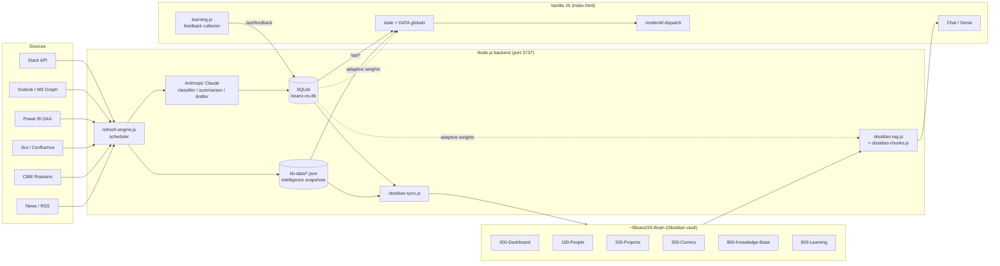

# Beanz OS Command Center — Information Flow

> How data enters the system, how it reaches Obsidian, how it is stored, surfaced, and how the engine learns and adjusts over time.

---

## 1. Overview

The Command Center is a three-layer pipeline:

1. **Ingress layer** — pulls from Slack, Outlook (Microsoft Graph), Jira, Confluence, Power BI, CIBE (coffee intel), and news feeds.
2. **Processing + storage layer** — Node.js backend normalises, classifies with Claude, persists to SQLite and JSON snapshots, then projects a mirror into the Obsidian vault.
3. **Surfacing layer** — vanilla-JS frontend renders 9 tabs via `renderAll()`, and a chat engine does retrieval-augmented generation (RAG) back over the Obsidian vault.

A self-learning engine watches every user click, pin, dismiss, thumbs-up/down and feeds **adaptive** weights back into ranking — so the system continuously adjusts what it surfaces first.

---

## 2. System Flow Diagram



---

## 3. Ingress Layer — How Data Enters

### 3.1 Refresh engine (the heartbeat)

[server/lib/refresh-engine.js](server/lib/refresh-engine.js) registers a **scheduler** that polls external systems on fixed intervals:

| Source | Interval | Writer | Output file |
|---|---|---|---|
| Slack | 60 s | `refreshSlack()` | `kb-data/intelligence/comms-live.json` |
| Outlook (Graph) | 120 s | `refreshOutlook()` | `kb-data/intelligence/email-live.json` |
| Power BI (DAX) | 4 h | `refreshPowerBI()` via `pbi-refresh-scheduler.js` | `kb-data/intelligence/pbi-live.json` |
| Jira | 15 min | `jira-refresh.js` | `kb-data/intelligence/jira-live.json` |
| CIBE (roasters) | daily + weekly | `cibe/scrape-orchestrator.js` | `kb-data/cibe/*.json` |
| News / RSS | daily | `news-engine.js` | `news-store.json` + SQLite |

Each refresher:
1. Skips if previous run is still in flight (`_refreshState.X.refreshing`).
2. Fetches incremental data (windowed — e.g. 14 days of email, 90-day prune for Slack).
3. **Merges** with existing cache so older threads aren't lost between refreshes.
4. Writes a single JSON file atomically.
5. Logs the action via `logAction()` into SQLite `actions` table (audit trail).

### 3.2 Authentication handshakes

- **Slack**: Dual-token — `SLACK_USER_TOKEN` (xoxp-) for reads, `SLACK_BOT_TOKEN` (xoxb-) for writes.
- **Outlook / MS Graph**: OAuth2 delegated flow. Start at `/auth/outlook` → callback `/auth/callback` → tokens cached in `.ms-tokens.json` with refresh rotation.
- **Power BI**: SSO bearer token captured by external `beanz-digest` Playwright tool (50-min lifespan).
- **Anthropic (Claude)**: server-side only, `ANTHROPIC_API_KEY` env var, never exposed to frontend.
- **Jira / Confluence**: Basic auth with API token.

All secrets live in `.env` and are parsed at boot. No secrets ever reach the browser.

---

## 4. Processing — Claude, Matching, Enrichment

Once raw data lands, three AI pipelines run server-side using the Anthropic Claude API:

1. **Classification** — [ai-classifier.js](server/lib/ai-classifier.js) batches up to 40 new/changed threads per cycle, labels priority + category, caches result in SQLite keyed by `threadId + messageCount` (so reruns are free unless the thread grew).
2. **Summarisation** — [ai-summariser.js](server/lib/ai-summariser.js) generates thread summaries + suggested quick replies on demand at `/api/comms/summary/:id`.
3. **Drafting** — [ai-drafter.js](server/lib/ai-drafter.js) produces reply drafts tuned to the sender and prior history at `/api/comms/draft/:id`.

Cross-platform thread matching ([thread-matcher.js](server/lib/thread-matcher.js)) links a Slack conversation to its email counterpart by participants + subject similarity + timing, so a single conversation shows up once in the unified inbox.

---

## 5. Storage — Where Data Lives

### 5.1 SQLite (authoritative state)

`beanz-os.db` (WAL mode, via `better-sqlite3`). Schema in [server/lib/db.js](server/lib/db.js). Key tables:

| Table | Purpose |
|---|---|
| `thread_status` | Read / unread / acted-on flags per thread |
| `completed_threads` | User-dismissed / completed threads |
| `dismissed_items`, `pinned_items` | Feedback on insights and brain pages |
| `feedback` | All thumbs-up / down / pin / dismiss actions |
| `insights` | Derived correlations with weights |
| `actions` | Append-only audit log of every refresh + user action |
| `learning_store`, `learning_notes` | Free-text notes on people / projects |
| `obsidian_chunks` | Chunked vault content + embeddings for RAG |
| `news_ai_cache`, `news_notes` | AI enrichment of news items |

### 5.2 JSON snapshots (fast-read intelligence)

`kb-data/intelligence/` holds the latest window of live data:
`comms-live.json`, `email-live.json`, `pbi-live.json`, `jira-live.json`, `metrics-live.json`, `email-perf-live.json`, `roasters-insights-live.json`.

These are the fastest path to the frontend — served directly via the `/api/*` routes without further transformation.

### 5.3 Static knowledge base (`kb-data/`)

24 domain directories with curated JSON + markdown (team directory, project updates, strategy docs, references, Power BI context). These ground every AI prompt.

---

## 6. Obsidian Bridge — Brain Projection

The vault at `~/BeanzOS-Brain` (overridable via `OBSIDIAN_VAULT_PATH`) is a **read-only projection** of everything the backend knows, generated by [obsidian-sync.js](server/lib/obsidian-sync.js).

### 6.1 Sync flow

```
SQLite + kb-data/ + news-store + learning store
           │
           ▼
   obsidian-sync.js::syncVault(ctx)
           │
           ▼
   Writes ~450 .md pages under 10 top-level folders
           │
           ▼
   Each page gets 9-field YAML frontmatter:
     title, description, type, status, owner,
     market, tags, aliases, related
           │
           ▼
   Cross-links as [[wikilinks]] between people,
   projects, threads, meetings, insights
```

Folder layout:

| Folder | Contents |
|---|---|
| `000-Dashboard/` | Home page with links into every section |
| `100-People/` | One page per team member + learning notes |
| `200-Projects/` | Project pages with linked people + threads |
| `300-Comms/` | Slack + email threads mirrored as notes |
| `400-Coffee-Intelligence/` | CIBE scrapes, roaster briefings |
| `500-AI-Tech-Intelligence/` | News digests by topic |
| `600-Strategy/` | The 8 data correlations + strategic context |
| `700-Meetings/` | Meeting notes from Outlook calendar |
| `800-Knowledge-Base/` | Domain references (FTBP, platinum, economics) |
| `900-Learning/` | Pinned insights, feedback history, patterns |

### 6.2 Reading it back — RAG

When a user chats, [obsidian-rag.js](server/lib/obsidian-rag.js) does keyword + phrase scoring across a 5-minute-refreshed in-memory index of every vault page. Section boosts (Knowledge Base 1.3×, Strategy 1.25×, Projects 1.2×, People 1.15×) bias retrieval toward actionable knowledge. [obsidian-chunks.js](server/lib/obsidian-chunks.js) provides 700-char overlapping windows with optional embeddings (gracefully degrades to keyword-only if no embedding key).

Brain-page feedback (pins, dismisses, thumbs) is multiplicatively blended into retrieval scores — a pinned page gets up to `1.5^3` boost, a dismissed one `0.4^3` penalty.

---

## 7. Surfacing Layer — Frontend

### 7.1 State + render dispatch

- `DATA` global holds all app data (threads, calendar, projects, people, metrics).
- `state` global holds UI state (selected module, filters, panel state).
- `setState(key, val)` mutates state and triggers **`renderAll()`**, the central dispatch.
- `renderAll()` reads `state.module` and calls the matching `render{Module}Sidebar()` + `render{Module}Main()` pair.

### 7.2 The 9 tabs

Keyboard shortcuts `1`–`9`: Daily Summary, Comms, Calendar, Projects, People, Metrics, Strategy, News, Intel.

### 7.3 How the frontend gets data

On boot, `actions.js` calls `loadCommsLive()` which hits `GET /api/comms` → the backend merges live Slack + email JSONs, applies thread matching + AI classification metadata, returns a unified thread list. The client then runs `enrichThreadsClient()` to link threads to projects and people locally before calling `renderAll()`.

---

## 8. API Surface

All endpoints live under `/api/` and are dispatched by `handleAPI()` in [server/server.js](server/server.js).

| Endpoint | Method | Purpose |
|---|---|---|
| `/api/comms` | GET | Unified Slack + email inbox |
| `/api/comms/summary/:id` | GET | AI thread summary + quick replies |
| `/api/comms/draft/:id` | POST | AI reply draft |
| `/api/comms/send` | POST | Send email via Graph |
| `/api/slack/send` | POST | Send Slack message |
| `/api/slack/react` | POST | Add Slack emoji reaction |
| `/api/strategy` | GET | 8 correlations with adaptive weights |
| `/api/metrics` | GET | Power BI live metrics |
| `/api/correlations` | GET | Derived insights |
| `/api/refresh/now` | POST | Manual refresh trigger |
| `/api/refresh/status` | GET | Refresh engine status + last-run timestamps |
| `/api/feedback` | POST | Submit feedback (pin / dismiss / 👍 / 👎) |
| `/api/cibe/*` | GET | Coffee intelligence |
| `/api/chat` | POST | RAG chat over the Obsidian vault |
| `/api/intelligence` | GET | Composite intelligence briefing |

---

## 9. Self-Learning Engine — How It Adjusts and Improves

The system gets smarter every session without manual tuning.

### 9.1 Signal capture

`learning.js` on the frontend collects three signal types:

- **Explicit feedback** — thumbs up / down, pin, dismiss → `POST /api/feedback`.
- **Interactions** — `module_view`, `person_view`, `project_view` events.
- **Free-text notes** — on people and projects, typed into the panel.

### 9.2 Persistence

All signals land in SQLite (`feedback`, `dismissed_items`, `pinned_items`, `learning_notes`) and mirror into `learning-store.json` for inspection.

### 9.3 Adaptive weights

[server/lib/learning.js](server/lib/learning.js) `computeInsightWeights()`:

- Pinned insight: `weight += 0.5`
- Dismissed insight: `weight -= 0.3` (floored at 0)
- Thumbs-up feedback: `weight += 0.2`
- Thumbs-down feedback: `weight -= 0.2`

These weights rank:
- Strategic correlations on the Strategy tab (`/api/strategy`).
- Metric surfacing order on the Metrics tab.
- Brain-page retrieval scoring in RAG (multiplicative blend in `obsidian-rag.js`).

### 9.4 Pattern derivation

`derivePatterns()` scans the last N interactions and infers:
- **Module attention** — "Most visited module: comms" once a module is viewed >5 times.
- **Person attention** — Flags people viewed >3 times as "frequently viewed".
- Confidence scales with sample size, capped at 1.0.

### 9.5 Feedback-driven retrieval (brain page feedback)

When RAG retrieves vault pages for chat, it looks up `brain_page_feedback` per path:
- Each pin: score multiplied by up to `1.5^3` (compounding up to 3 pins).
- Each dismiss: multiplied by `0.4^3`.
- Thumbs-up: `1.2^5`; thumbs-down: `0.8^5`.

Result: pages the user has personally validated float to the top next time, while noisy pages sink.

### 9.6 The improve loop

```
User acts ──► feedback ──► SQLite ──► weights ──► ranking
     ▲                                                │
     └──── better surfacing ◄─── renderAll ◄──────────┘
```

Every kept change improves ranking the next render cycle — no restart, no retraining. The engine **adapts** continuously because the weights are read live on every `/api/*` call.

---

## 10. End-to-End Walkthrough (a single email)

1. **T+0s** — An email arrives in Outlook.
2. **T+~120s** — Refresh scheduler fires `refreshOutlook()` → fetches via Graph → writes to `email-live.json`.
3. **T+~125s** — `classifyNewThreads()` notices a new thread, sends it to Claude with a classification prompt, caches result in SQLite.
4. **T+~126s** — `matchCrossPlatformThreads()` checks if the sender has a parallel Slack conversation; if yes, links them.
5. **T+~130s** — User opens the Comms tab → `loadCommsLive()` → `GET /api/comms` → merged response with the new thread.
6. **T+~131s** — Frontend: `enrichThreadsClient()` links the thread to a project + people; `renderAll()` paints it in the inbox.
7. **User opens the thread** — `GET /api/comms/summary/:id` → Claude summariser runs (or returns cache) → reading pane shows summary + quick replies.
8. **User pins the insight** — `POST /api/feedback {type:'pin', target:'insight-123'}` → SQLite `pinned_items` updated → `computeInsightWeights()` bumps that insight's weight by 0.5 on the next render.
9. **Overnight** — `obsidian-sync.js` rebuilds the vault; the new thread now exists as a `300-Comms/*.md` page with YAML frontmatter, wiki-linked to the project and people.
10. **Next day, user asks Chat "what did the supplier say last week?"** — RAG searches the vault, blended with adaptive weights, returns the relevant page; Claude answers with a citation.

That is the full loop: **ingress → process → store → project → surface → learn → adjust**.

---

## 11. Freshness & Deduplication Rules

The system has two layered safeguards: **freshness rules** (TTLs + staleness thresholds) that answer "is this data still good?" and **deduplication rules** (idempotent merges + ID sets) that answer "have we already seen this?". The `/api/status` endpoint exposes freshness to the UI so the user can see when a source is stale.

### 11.1 Per-source staleness thresholds

`GET /api/status` reads the mtime of each live JSON file and labels it `fresh` or `stale` against a per-source threshold.

| Source | File | Stale after | Source |
|---|---|---|---|
| Slack comms | `comms-live.json` | 10 min | [server/routes/status.js:16](server/routes/status.js) |
| Outlook email | `email-live.json` | 15 min | status.js:17 |
| Calendar | `calendar-live.json` | 2 h | status.js:18 |
| Power BI | `pbi-live.json` | 6 h | status.js:19 |
| Metrics | `metrics-live.json` | 48 h | status.js:20 |
| Roasters Insights | `roasters-insights-live.json` | 24 h | status.js:21 |
| Jira | `jira-live.json` | 1 h | status.js:22 |

The UI shows a staleness badge per tab driven by this endpoint. `POST /api/refresh/now` forces an immediate scheduler pass.

### 11.2 Cache TTLs (in-process and SQLite)

| Cache | TTL | Key | Source |
|---|---|---|---|
| Obsidian RAG index | 5 min | in-memory vault index | [obsidian-rag.js:20](server/lib/obsidian-rag.js) |
| Confluence API | 10 min | URL-keyed Map | [confluence-api.js:4](server/lib/confluence-api.js) |
| Genie KPI | 15 min | SQLite `genie_cache` | [genie.js:20](server/routes/genie.js) |
| Genie query | 60 min | SQLite `genie_cache` | genie.js:21 |
| Databricks SQL | 60 min default (override per call) | SHA-256 of SQL text | [databricks-engine.js:108](server/lib/databricks-engine.js) |
| AI classification | Until thread grows | `(threadId, messageCount)` | [ai-classifier.js:361](server/lib/ai-classifier.js) |
| AI thread summary | Until thread grows | `(threadId, messageCount)` | ai-summariser.js |

A janitor query (`genie-cache.js:149`) deletes SQLite cache rows where `age > ttl_minutes` so the DB doesn't grow forever.

### 11.3 Ingress windows (how far back each puller looks)

Each refresher pulls a **bounded window**, not the full history — the cache accumulates older data across runs.

| Puller | Window | Source |
|---|---|---|
| Outlook | 14 days / max 200 messages | [refresh-engine.js:91](server/lib/refresh-engine.js) |
| CIBE EDM scraper | 30 days | [cibe/scrapers/edm-scraper.js:117](server/lib/cibe/scrapers/edm-scraper.js) |
| News daily report | 24 h, falls back to 3 days if <20 articles | [news.js:1026](server/routes/news.js) |
| News weekly report | 7 days | news.js:1026 |
| Video articles | 7 days daily / 14 days weekly | news.js:1035 |
| Jira issues | 14 days default | [db.js:1627](server/lib/db.js) |

### 11.4 Retention & pruning

| What | Kept | Rule | Source |
|---|---|---|---|
| Slack threads | 90 days rolling | Pruned if `lastActivity < now − 90 days` on every refresh | [refresh-engine.js:54](server/lib/refresh-engine.js) |
| Brain snapshots | 7 daily + 4 weekly + 3 monthly | Grandfather-father-son retention | [brain-snapshots.js:93](server/lib/brain-snapshots.js) |
| Competitor alerts | Last 14 days considered "known" for dedup | [ai-news.js:613](server/lib/ai-news.js) |

### 11.5 Scheduler intervals (the heartbeat)

| Timer | Interval | Source |
|---|---|---|
| Slack refresh | 60 s | [server.js:519](server/server.js) |
| Outlook refresh | 120 s | server.js:520 |
| Jira refresh | 15 min | [jira-refresh.js:131](server/lib/jira-refresh.js) |
| Power BI refresh | 4 h | pbi-refresh-scheduler.js |
| CIBE homepages + EDMs | 24 h | [cibe/scrape-orchestrator.js:33](server/lib/cibe/scrape-orchestrator.js) |
| CIBE catalogues / social / trends | 7 d | scrape-orchestrator.js:34-36 |
| News refresh | 24 h | server.js:572 |
| Daily scheduled jobs | 24 h wake-up + minute-level cron check | server.js:658 |

### 11.6 Deduplication rules

| Layer | Mechanism | Key | Source |
|---|---|---|---|
| **Server instance** | PID-file lock refuses to boot if another process holds it and is alive | `.server.pid` | [server.js:9-34](server/server.js) |
| **AI classification** | Re-classifies only if message count changed — no duplicate Claude calls for unchanged threads | `(threadId, messageCount)` | [ai-classifier.js:361](server/lib/ai-classifier.js) |
| **Slack conversations** | `Set()` on conversation ID across public, private, mpim, im | `conversation.id` | [slack-api.js:322](server/lib/slack-api.js) |
| **News articles** | Existing-ID set consulted before inserting | `article.id` | [news-engine.js:776](server/lib/news-engine.js) |
| **Competitor alerts** | "Persist new alerts (deduplicate by article_id)" checks last 14 days | `article_id` | [ai-news.js:612](server/lib/ai-news.js) |
| **Cross-platform threads** | Slack↔email matcher: one conversation appears once in unified inbox | participants + subject similarity + timing | thread-matcher.js |
| **Thread merge on refresh** | `{ ...existing, ...freshThreads }` — fresh always wins, older entries preserved until pruned | thread id | [refresh-engine.js:51](server/lib/refresh-engine.js) |
| **CIBE products** | `INSERT OR REPLACE` — same URL updates `last_seen` and appends `price_history` instead of creating a new row | `(roaster_id, url)` | [catalogue-scraper.js:76](server/lib/cibe/scrapers/catalogue-scraper.js) |
| **Obsidian chunks** | `seen` Set on relative path during chunk rebuild | `rel_path` | [obsidian-chunks.js:71](server/lib/obsidian-chunks.js) |
| **Obsidian entities** | Lowercase phrase Set to avoid duplicate entity cards | `phrase.toLowerCase()` | [obsidian-entities.js:71](server/lib/obsidian-entities.js) |
| **Jira sprints** | Dedup Set across multiple boards | `sprint.id` | [jira-api.js:470](server/lib/jira-api.js) |
| **Thread participants** | `[...new Set(msgs.map(m => m.sender))]` | sender | [comms.js:72](server/routes/comms.js) |
| **Completed threads** | Completed/dismissed threads filtered out on every `/api/comms` read | `getCompletedThreadIds()` | [comms.js:808](server/routes/comms.js) |
| **Outlook self-addresses** | User's own aliases excluded from sender lists | `selfAddresses` Set | [outlook-api.js:386](server/lib/outlook-api.js) |
| **Morning sweep debounce** | Prevents duplicate batch on restart between 7:30–7:31 (historical bug fixed) | timestamp gate | [server.js:611](server/server.js) |
| **Comms analytics snapshot trigger** | 1-hour cooldown between manual triggers | `_lastSnapshotTrigger` | [comms-analytics.js:39](server/routes/comms-analytics.js) |

### 11.7 Principles at a glance

1. **Windowed pulls + merged cache** — pullers see only a recent horizon; older data survives in the merged JSON until it's older than the prune cutoff.
2. **Fresh wins on merge** — when the same ID shows up in both the current snapshot and a new fetch, the new one replaces it (`{ ...existing, ...fresh }`).
3. **Cache on growth, not on time** — AI classification re-runs only when a thread has new messages, so token cost stays flat for unchanged threads.
4. **Idempotent writes** — CIBE products, competitor alerts, and news items all use ID-keyed upserts; re-running a scraper never doubles rows.
5. **Single heartbeat** — the PID lock + the shared `refresh-engine` scheduler ensures one process owns all timers, preventing duplicate sends.
6. **Visible staleness** — `GET /api/status` lets the UI show "stale" badges instead of silently serving old data.

---

## 12. Files Index (quick jump)

- Refresh engine — [server/lib/refresh-engine.js](server/lib/refresh-engine.js)
- Obsidian sync — [server/lib/obsidian-sync.js](server/lib/obsidian-sync.js)
- Obsidian RAG — [server/lib/obsidian-rag.js](server/lib/obsidian-rag.js)
- Obsidian chunks / embeddings — [server/lib/obsidian-chunks.js](server/lib/obsidian-chunks.js)
- AI classifier — [server/lib/ai-classifier.js](server/lib/ai-classifier.js)
- AI summariser — [server/lib/ai-summariser.js](server/lib/ai-summariser.js)
- AI drafter — [server/lib/ai-drafter.js](server/lib/ai-drafter.js)
- Learning engine — [server/lib/learning.js](server/lib/learning.js)
- Thread matcher — [server/lib/thread-matcher.js](server/lib/thread-matcher.js)
- DB schema — [server/lib/db.js](server/lib/db.js)
- Server entry — [server/server.js](server/server.js)
