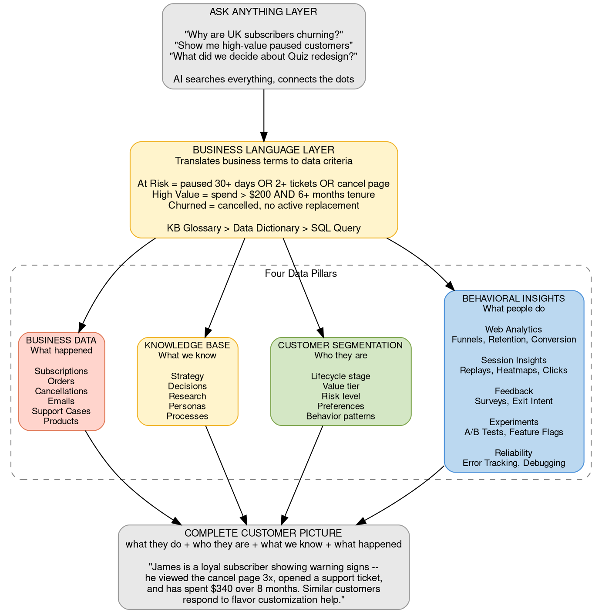

# Beanz Intelligence Platform

## Quick Reference

- AI platform translating natural language business questions into answers across four data pillars
- Business Language Layer bridges KB terminology to analytics data dictionary
- North star strategy with phased delivery roadmap

## Intelligence Platform Framework

### Key Concepts

- **Ask Anything Layer** = Natural language interface for business questions
- **Business Language Layer (BLL)** = Translation engine mapping business terms to data fields
- **Four Pillars** = Behavioral Insights, Customer Segmentation, Knowledge Base, Business Data
- **Complete Customer Picture** = Unified answer combining data from all four pillars
- **Concept resolution** = Mapping business terms to data dictionary fields via semantic search
- **Enrichment** = LLM process that writes field descriptions using KB vocabulary

## Platform Architecture

**Legend:**

| Color | Layer | Meaning |
|-------|-------|---------|
| Grey | Entry + Exit | Question in, answer out |
| Yellow | Business Language Layer + KB | Translation engine and knowledge pillar |
| Blue | Behavioral Insights | Web analytics, sessions, feedback, experiments |
| Green | Customer Segmentation | Lifecycle, value, risk dimensions |
| Orange | Business Data | Transaction and operational records |

### Data Flow Architecture

The diagram below shows every platform, data source, pipeline, and LLM touchpoint involved in the Intelligence Platform — with build-time flows (data import, enrichment, BLL sync) and runtime flows (query resolution via MCP).

```dot
digraph intelligence_platform_dataflow {
    rankdir=TB;
    fontname="Helvetica,Arial,sans-serif";
    node [shape=box style="rounded,filled" fontname="Helvetica,Arial,sans-serif" fontsize=10];
    edge [fontname="Helvetica,Arial,sans-serif" fontsize=9];
    newrank=true;

    // ── EXTERNAL DATA SOURCES ──
    subgraph cluster_sources {
        label="External Data Sources";
        style="rounded,dashed"; color="#E07856";
        fontname="Helvetica,Arial,sans-serif"; fontsize=11;

        salesforce [label="Salesforce API\nOrders 1.23M\nSurveys 61K | Cases 41K" fillcolor="#FFD4CC" color="#E07856"];
        dynamodb [label="AWS DynamoDB\nSubscriptions 101K\nAudit Log 901K" fillcolor="#FFD4CC" color="#E07856"];
        powerbi [label="Power BI (Cordial)\nEmail Events 19.5M\nMetadata 12.6K" fillcolor="#FFD4CC" color="#E07856"];
        algolia [label="Algolia\nSKU Metadata 1.7K" fillcolor="#FFD4CC" color="#E07856"];
    }

    // Future sources (Pillar 1: Behavioral)
    mixpanel [label="Mixpanel\nProduct Analytics\n(API + MCP available)" fillcolor="#FFD4CC" color="#E07856" style="rounded,filled,dashed"];
    posthog [label="PostHog\nSession Replays, A/B\n(under evaluation)" fillcolor="#FFD4CC" color="#E07856" style="rounded,filled,dashed"];

    // ── DATA PIPELINE ──
    subgraph cluster_pipeline {
        label="Data Pipeline (beanz-analytics)";
        style="rounded,dashed"; color="#E67E22";
        fontname="Helvetica,Arial,sans-serif"; fontsize=11;

        import_pipeline [label="refresh_all.py\n9 imports | ~40-50 min" fillcolor="#FFF0E0" color="#E67E22"];
        enrichment_pipeline [label="run_all_maintenance.py\n21-step enrichment\n(Steps 16-19: Email Template Analysis)" fillcolor="#FFF0E0" color="#E67E22"];
        validation_system [label="validate_enrichment\n10 safety checks\n(fail-loud on stale data)" fillcolor="#FFF0E0" color="#E67E22"];
    }

    // ── SQLITE DATA LAKE ──
    subgraph cluster_datalake {
        label="Datasette SQLite (~14GB)";
        style="rounded,dashed"; color="#4A90D9";
        fontname="Helvetica,Arial,sans-serif"; fontsize=11;

        source_tables [label="Source Tables (8)\n21.8M rows" fillcolor="#BBD8F0" color="#4A90D9"];
        enriched_tables [label="Enriched Tables (6)\ncustomer_master | churn_analysis\ncustomer_events | exit_survey_enriched\nedit_metrics | last_shipped_sku" fillcolor="#BBD8F0" color="#4A90D9"];
        email_tables [label="Email Template Tables (6)\nregistry | content | ctas\nimages | products | performance\n(GPT-5.2 tone classification)" fillcolor="#BBD8F0" color="#4A90D9"];
        report_tables [label="FTBP Reports (~20)\nInsight Tables (4) | 15 Views" fillcolor="#BBD8F0" color="#4A90D9"];
        data_dictionary [label="Data Dictionary\n_data_dictionary\n_table_dictionary | FTS5" fillcolor="#BBD8F0" color="#4A90D9"];
    }

    // ── LLM ENRICHMENT TOUCHPOINTS ──
    subgraph cluster_llm {
        label="LLM Enrichment";
        style="rounded,dashed"; color="#CC0000";
        fontname="Helvetica,Arial,sans-serif"; fontsize=11;

        sioo [label="SIOO Churn Analysis\nGPT-5.2 | 17.7K churns (29%)\nSituation-Intent-Obstacles-Outcome" fillcolor="#F4CCCC" color="#CC0000"];
        meta_enrich [label="Smart Metadata Enrichment\nGPT-5.2 (complex) + GPT-4o (trivial)\n50-70% cost savings" fillcolor="#F4CCCC" color="#CC0000"];
        email_tone [label="Email Tone Classification\nGPT-5.2 | Marketing templates\n4 categories + confidence + reasoning" fillcolor="#F4CCCC" color="#CC0000"];
    }

    // ── KNOWLEDGE BASE (Pillar 3) ──
    subgraph cluster_kb {
        label="Pillar 3: Knowledge Base (this repo)";
        style="rounded,dashed"; color="#4A90D9";
        fontname="Helvetica,Arial,sans-serif"; fontsize=11;

        kb_glossary [label="KB Glossary\n108 terms\n(source of truth)" fillcolor="#BBD8F0" color="#4A90D9"];
        kb_docs [label="KB Documents\n24 domains | 4 content docs" fillcolor="#BBD8F0" color="#4A90D9"];
        gen_script [label="generate-business-\ncontext.py" fillcolor="#BBD8F0" color="#4A90D9"];
        biz_context [label="BUSINESS_CONTEXT.md\n175 lines | 108 terms\n(generated artifact)" fillcolor="#FFF4CC" color="#F0B429"];
    }

    // ── AI INTELLIGENCE LAYER ──
    subgraph cluster_ai {
        label="AI Intelligence Layer";
        style="rounded,dashed"; color="#9B59B6";
        fontname="Helvetica,Arial,sans-serif"; fontsize=11;

        dd_plugin [label="Data Dictionary Plugin\n7 modules | FTS5 search\nprofiles | insights" fillcolor="#E8D4F0" color="#9B59B6"];
        mcp_server [label="datasette-dd-mcp\n8 MCP tools\n(progressive disclosure)" fillcolor="#E8D4F0" color="#9B59B6"];
    }

    // ── ASK ANYTHING LAYER ──
    user_q [label="Business Question\n(natural language)" shape=doublecircle fillcolor="#E8E8E8" color="#999999" fontsize=11];
    claude [label="Claude Agent\n(beanz-query skill)" fillcolor="#FFF4CC" color="#F0B429" fontsize=11];

    // ── CONSUMERS ──
    subgraph cluster_consumers {
        label="Consumer Interfaces";
        style="rounded,dashed"; color="#F0B429";
        fontname="Helvetica,Arial,sans-serif"; fontsize=11;

        datasette_ui [label="Datasette UI\nSelf-service" fillcolor="#FFF4CC" color="#F0B429"];
        claude_desktop [label="Claude Desktop\nMCP client" fillcolor="#FFF4CC" color="#F0B429"];
        claude_code [label="Claude Code\nMCP client" fillcolor="#FFF4CC" color="#F0B429"];
        rest_apis [label="REST APIs" fillcolor="#FFF4CC" color="#F0B429"];
        pdf_reports [label="PDF Reports\nFTBP suite" fillcolor="#FFF4CC" color="#F0B429"];
    }

    // ── COMPLETE CUSTOMER PICTURE ──
    answer [label="Complete Customer\nPicture\n(KB + DD citations)" shape=doublecircle fillcolor="#D4E7C5" color="#7FA650" fontsize=11];

    // Parallel + future
    databricks [label="Databricks\n(Production data lake)" fillcolor="#E8E8E8" color="#999999"];
    seg_engine [label="Segment Assignment\nEngine (Planned)\n16 lifecycle segments\n(Pillar 2)" fillcolor="#D4E7C5" color="#7FA650" style="rounded,filled,dashed"];

    // ═══════════════════════════
    //  DATA IMPORT (build-time)
    // ═══════════════════════════

    salesforce -> import_pipeline;
    dynamodb -> import_pipeline;
    powerbi -> import_pipeline [label="optional"];
    algolia -> import_pipeline;

    mixpanel -> import_pipeline [style=dashed color="#888888" label="planned"];
    posthog -> import_pipeline [style=dashed color="#888888" label="TBD"];

    import_pipeline -> source_tables;
    source_tables -> enrichment_pipeline;
    enrichment_pipeline -> enriched_tables;
    enrichment_pipeline -> email_tables [label="Steps 16-19"];
    enrichment_pipeline -> validation_system;
    enriched_tables -> report_tables;
    email_tables -> report_tables [style=dotted label="CTA metrics"];

    // ═══════════════════════════
    //  LLM ENRICHMENT (build-time)
    // ═══════════════════════════

    enriched_tables -> sioo [label="exit surveys +\nsupport cases"];
    sioo -> enriched_tables [style=dashed label="churn_enrichment_v2"];

    email_tables -> email_tone [label="template body_copy"];
    email_tone -> email_tables [style=dashed label="tone + confidence\n+ reasoning"];

    biz_context -> meta_enrich [label="injected as\nenrichment context"];
    meta_enrich -> data_dictionary [label="writes enriched\nbusiness_meaning"];

    // ═══════════════════════════
    //  BLL SYNC (build-time)
    // ═══════════════════════════

    kb_glossary -> gen_script;
    gen_script -> biz_context;

    // ═══════════════════════════
    //  AI LAYER CONNECTIONS
    // ═══════════════════════════

    data_dictionary -> dd_plugin;
    enriched_tables -> dd_plugin [style=dotted label="table data"];
    dd_plugin -> mcp_server;

    // ═══════════════════════════
    //  RUNTIME QUERY FLOW
    // ═══════════════════════════

    user_q -> claude;
    claude -> kb_glossary [label="1. resolve\nconcepts" color="#4A90D9"];
    claude -> kb_docs [label="1b. check\nKB context" color="#4A90D9"];
    claude -> mcp_server [label="2. search, schema,\nexecute" color="#9B59B6"];
    mcp_server -> claude [label="results" color="#9B59B6"];
    claude -> answer;

    // ═══════════════════════════
    //  CONSUMER CONNECTIONS
    // ═══════════════════════════

    mcp_server -> claude_desktop;
    mcp_server -> claude_code;
    dd_plugin -> datasette_ui;
    dd_plugin -> rest_apis;
    report_tables -> pdf_reports;

    // ═══════════════════════════
    //  PARALLEL / FUTURE
    // ═══════════════════════════

    source_tables -> databricks [label="validate" dir=both style=dashed color="#888888"];
    enriched_tables -> seg_engine [style=dashed color="#888888" label="planned"];
    seg_engine -> source_tables [style=dashed color="#888888"];
}
```

**Legend:**

| Color | Layer | Description |
|-------|-------|-------------|
| Orange | Sources | External data systems (4 live, 2 planned) |
| Peach | Pipeline | Import (8 scripts) + enrichment (12 steps) + validation (10 checks) |
| Blue | Data Lake | SQLite database — source, enriched, email template, report, and metadata tables |
| Red | LLM | AI enrichment touchpoints (SIOO churn, smart metadata routing, email tone classification) |
| Purple | AI Layer | Data dictionary plugin (7 modules) + MCP server (8 tools) |
| Yellow | Consumers | Interfaces: Datasette UI, Claude Desktop/Code, REST APIs, PDF reports |
| Grey | Parallel | Databricks production data lake (bidirectional validation) |
| Green dashed | Future | Automated segment assignment engine (Pillar 2) |

**Note:** This diagram has 31 nodes (exceeds the typical 20-node guideline). This is a pragmatic exception — the Intelligence Platform spans two repositories, four data source systems, two LLM enrichment pipelines, and five consumer interfaces. Splitting into multiple diagrams would lose the end-to-end visibility that is the diagram's purpose. See the [conceptual diagram](#platform-architecture) above for the simplified four-pillar view.

## Four Data Pillars

| Pillar | What It Knows | Key Systems | Maturity |
|--------|---------------|-------------|----------|
| **Behavioral Insights** | What people do on the website | Mixpanel (collecting), PostHog (evaluating) | Partial |
| **Customer Segmentation** | Where each customer sits in their journey | Datasette (churn_analysis, customer_master) | Partial |
| **Knowledge Base** | Why we made past decisions and what we learned | This repository (Obsidian vault) | Active |
| **Business Data** | What actually happened in the business | Datasette (124 objects, ~14GB), Databricks | Production |

### Behavioral Insights

**Available today:** Email engagement (19.5M events via Cordial/Power BI), subscription operations (901K audit records via DynamoDB), and support cases (41K via Salesforce). These behavioral signals are queryable in Datasette.

**Not connected:** Mixpanel is collecting product analytics data (funnels, retention, conversion paths) but no integration exists between Mixpanel and the analytics platform. PostHog is being evaluated as a complementary tool for session replays, heatmaps, A/B testing, and feature flags. Prior Mixpanel integration research (~6 months old) exists for review when ready.

**What's needed:**

- Evaluate PostHog for product analytics capabilities
- Design Mixpanel API integration (API + MCP available)
- Import behavioral event data into Datasette enrichment pipeline

### Customer Segmentation

**Available today:** Ad-hoc churn segments (early_paused, mid_paused, late_paused, active_cancel) in churn_analysis (62K records), FTBP program cohorts, appliance ownership tracking, and customer_master (89K unique customers, 26.8% active).

**Framework defined but not automated:** The 16-segment lifecycle framework (SEG-1.1 through SEG-1.8 x Novice/Experienced) and 4 cohort categories (COH-1.x Market Entry, COH-2.x Program, COH-3.x Appliance, COH-4.x Channel) are defined in the [[glossary|Glossary]] and [[id-conventions|ID Conventions]]. Formal segment definitions (entry/exit criteria, transition rules) will be authored as KB pages in `docs/users/`.

**What's needed:**

- Author segment definition pages in KB
- Build automated lifecycle segment assignment in Datasette enrichment
- Replace ad-hoc churn segments with formal SEG-X.Y.Z framework

### Knowledge Base

**Available today:** This repository — 4 content documents, 24 domain indexes, 108 glossary terms. The KB is the source of truth for business terminology that feeds the BLL.

**Content docs:** [[glossary|Glossary]] (108 terms), [[id-conventions|ID Conventions]] (hierarchical IDs), [[emails-and-notifications|Emails and Notifications]] (28 communications), [[beanz-hub|Beanz Hub]] (B2B platform architecture).

**What's needed:**

- Populate 20 empty domains with content from source documents
- Priority domains informed by Intelligence Platform roadmap
- Every new KB doc strengthens BLL concept resolution

### Business Data

**Available today:** Production ready. 9 data sources imported into Datasette (~14GB SQLite database, 103 database objects after cleanup).

*Last verified: 2026-02-13 against live database (post-production hardening)*

| Source | Records | System |
|--------|---------|--------|
| Salesforce Orders | 1.23M | Salesforce API |
| Salesforce Contacts | 88K (Contact ID→email) | Salesforce API |
| Standing Orders | 101K | AWS DynamoDB |
| Subscription Audit | 901K | AWS DynamoDB |
| Exit Surveys | 61K | Salesforce API |
| Support Cases | 41K | Salesforce API |
| Email Events | 19.5M | Power BI (Cordial) |
| Email Metadata | 12.6K campaigns | Power BI |
| Email Templates | Marketing emails (6 tables) | HTML parsing |
| SKU Metadata | 1.7K | Algolia |

Core enriched tables (from 21-step pipeline): customer_master (with primary_acquisition_program), churn_analysis, customer_events (with email linkage), exit_survey_enriched, subscription_edit_metrics, subscription_order_metrics, last_shipped_sku_by_subscription, _customer_support_summary. Plus 6 email template tables (registry, content, ctas, images, products, cta_performance), churn helper tables, insight tables, FTBP report tables, and database views. See `email-template-analysis.md` for complete email system documentation.

**Validation:** 10 automated safety checks (validate_enrichment_current.py) run after every enrichment. Checks include table existence, timestamp freshness, coverage thresholds (SKU ≥90%, churn ≥80%, customer master ≥85%), and minimum event volume. Fail-loud — non-zero exit code blocks use of stale data.

**LLM enrichment touchpoints:**

- **SIOO churn analysis** (GPT-5.2) — Situation-Intent-Obstacles-Outcome extraction from exit surveys + support cases. 17.7K churns enriched (29% of total). Reveals compound churn drivers that single survey answers miss.
- **Smart metadata enrichment** (GPT-5.2 for complex fields, GPT-4o for trivial) — writes business_meaning descriptions in data dictionary using BUSINESS_CONTEXT.md. Smart model routing saves 50-70% cost. Verified-only contract ensures only human-approved metadata is surfaced.
- **Email tone classification** (GPT-5.2) — classifies marketing email templates into 4 tone categories (enthusiastic, empathetic, apologetic, educational) with confidence scores and reasoning. Enables content performance correlation with engagement metrics. See `email-template-analysis.md` for complete system documentation.

**Databricks:** Active data lake used by the business. Datasette serves as the AI-accessible exploration and validation layer alongside it. Future architecture may use both in parallel (e.g., Datasette to validate Databricks data and vice versa).

**What's needed:**

- Complete field annotations (80 fields verified as of 2026-02-13 — 76 on salesforce_orders, 3 on exit_survey_responses, 1 on support_cases — but most tables still at 0%)
- Run LLM enrichment with updated BUSINESS_CONTEXT.md
- Email template analysis ready for cross-pillar queries (tone correlation with engagement, CTA effectiveness, market copy patterns)
- Evaluate additional data sources (Commercetools, Adyen, Dynamics 365) only if needed

## Business Language Layer

The BLL is the translation engine powering the Intelligence Platform. It spans two repositories:

| Component | Location | Purpose |
|-----------|----------|---------|
| KB Glossary | `docs/reference/glossary.md` | Source of truth (108 business terms) |
| Generator Script | `scripts/generate-business-context.py` | Reads glossaries, outputs BUSINESS_CONTEXT.md |
| Sync Check | `scripts/check-glossary-sync.py` | Verifies KB terms present in skill reference |
| beanz-query Skill | `.claude/skills/beanz-query/` | Runtime resolution protocol |
| BUSINESS_CONTEXT.md | beanz-analytics `docs/architecture/` | LLM enrichment input (175 lines) |
| Datasette Plugin | beanz-analytics `plugins/datasette_data_dictionary/` | Loads context, enriches field descriptions |
| MCP Server | beanz-analytics `datasette-dd-mcp/` | 8 progressive disclosure tools for Claude |

### Build-Time Pipeline

**Flow:** KB glossary → `generate-business-context.py` → BUSINESS_CONTEXT.md → Datasette plugin → LLM enrichment → enriched field descriptions.

The generator reads `docs/reference/glossary.md` (KB source of truth) and `.claude/skills/kb-author/references/beanz-brg-glossary.md` (operational superset), producing a categorized context file with 108 terms across 9 sections.

**Sync direction:** One-way (KB → skill reference → BUSINESS_CONTEXT.md). Re-run after any KB glossary change.

### Runtime Resolution

The beanz-query skill provides the agent workflow: parse question → resolve concepts via KB glossary → search data dictionary → verify schema → build SQL → execute → cite both KB document and data dictionary table.column.

See the full E2E system diagram and resolution steps in `.claude/skills/beanz-query/skill.md`.

### Expanding the BLL

As the platform grows, the BLL expands by:

1. **Adding terms to KB glossary** → re-run generator → re-run enrichment
2. **Adding data sources to Datasette** → enrich new fields with existing context
3. **No separate MCP servers needed** — import data into Datasette, expand the existing data dictionary

This keeps the architecture simple: one MCP server, one enrichment pipeline, one concept resolution workflow.

## Platform & Tooling

| Tool | Role | Status |
|------|------|--------|
| **Datasette** | AI-accessible analytics platform (SQLite + data dictionary plugin) | Production |
| **datasette-dd-mcp** | MCP server bridging Claude to data dictionary (8 tools) | Production |
| **Databricks** | Production data lake used by business teams | Active |
| **Mixpanel** | Product analytics (funnels, retention, conversion) | Collecting data, not integrated |
| **PostHog** | Session replays, heatmaps, A/B testing, feature flags | Under evaluation |
| **GPT-5.2 / GPT-4o** | LLM enrichment — SIOO churn + metadata routing + email tone classification | Production |
| **Claude Desktop / Code** | MCP client interfaces for natural language analytics | Production |
| **Obsidian** | KB authoring and navigation (Graphviz plugin for diagrams) | Active |
| **FTBP Reporting** | 17-script suite generating conversion, churn, and email analysis PDFs | Production |

**Architecture principle:** Expand Datasette as the primary AI-accessible layer. Import data from other tools into SQLite, enrich via the existing pipeline. Keep Databricks for production workloads. Add new MCP servers only if a data source cannot practically be imported. Every pipeline run enforces 10 safety checks — stale data cannot be used for decisions.

## User Interfaces & Skills

Users interact with the Intelligence Platform through multiple interfaces, each optimized for different use cases:

### Operational Skills (Claude Code/Desktop)

**beanz-data-refresh** - Data pipeline execution
- Trigger: "refresh the data", "update the database", "import new orders"
- Runs: `refresh_all.py --api` + `run_all_maintenance.py` (21 steps)
- Duration: ~90-120 min (first full run with email correlation), ~40-50 min (incremental after)
- Use when: New data available in source systems, new email templates added
- Note: First run of email_campaign_performance takes 60-90 min (one-time correlation build), subsequent runs <2 min

**email-template-expert** - Email template queries
- Trigger: "Show me email template metrics", "Which tone performs best?", "What CTAs drive clicks?"
- Provides: SQL query patterns, cross-table joins, performance analysis
- Use when: Analyzing email content, tone performance, CTA effectiveness

**beanz-query** - General platform queries (via MCP)
- Trigger: Business questions across all pillars
- Provides: KB concept resolution → data dictionary search → SQL execution
- Use when: Cross-pillar questions requiring KB context

### Direct Interfaces

**Datasette UI** - Self-service data exploration
- Access: `datasette databases/beanz_analytics.db`
- Use when: Ad-hoc SQL queries, table browsing, faceted search

**Claude Desktop/Code with MCP** - Natural language queries
- Access: Via datasette-dd-mcp server (8 tools)
- Use when: Progressive data discovery, schema exploration

**REST APIs** - Programmatic access
- Access: Datasette JSON API (`/database/table.json`)
- Use when: Integrations, dashboards, automated reporting

**PDF Reports** - Scheduled business intelligence
- Access: FTBP reporting suite (17 scripts)
- Use when: Executive summaries, stakeholder updates

### Workflow Summary

| Task | Recommended Interface | Alternative |
|------|----------------------|-------------|
| Add new templates | **beanz-data-refresh skill** | Manual: `run_all_maintenance.py` |
| Query template data | **email-template-expert skill** | Direct SQL, Datasette UI |
| Cross-pillar analysis | **beanz-query skill** | Manual SQL with joins |
| Verification/proof | **Showboat demos** | SQL queries with screenshots |
| Executive reporting | **PDF Reports** | Datasette UI exports |

## Delivery Roadmap

Living roadmap — updated as requirements are delivered or added. Agents checking this doc should verify current status and flag blockers.

### Phase 1: Foundation (Current)

| Item | Status | Owner | Notes |
|------|--------|-------|-------|
| Field annotations for critical tables | In progress | Analytics | 80 fields verified (76 on salesforce_orders). Most tables at 0%. |
| Segment definitions in KB | Planned | Product | SEG-1.1 through SEG-1.8 pages in `docs/users/` |
| LLM enrichment with BUSINESS_CONTEXT.md | Planned | Analytics | Run after field annotations complete |
| Glossary sync governance | Done | Product | One-way sync documented, check-glossary-sync.py runs monthly |

### Phase 2: Segmentation & Behavioral (Next)

| Item | Status | Owner | Notes |
|------|--------|-------|-------|
| Automated lifecycle segment assignment | Planned | Analytics | Build in Datasette enrichment pipeline |
| Formal cohort definitions (COH-X.Y) | Planned | Product | Define in KB, implement in analytics |
| PostHog evaluation | Planned | Platform | Assess for session replays, heatmaps, A/B testing |
| Mixpanel integration design | Planned | Platform | API + MCP available. Review prior research. |

### Phase 3: Cross-Pillar Integration (Future)

| Item | Status | Owner | Notes |
|------|--------|-------|-------|
| Behavioral data in Datasette | Planned | Analytics | Import Mixpanel/PostHog events into enrichment pipeline |
| Cross-pillar query capability | Planned | Platform | Agent queries spanning all four pillars |
| KB domain population (priority areas) | Planned | Product | 20 empty domains, priority informed by platform needs |
| Additional data source evaluation | Planned | Analytics | Commercetools, Adyen, Dynamics 365 — only if needed |

## Governance

### Glossary Ownership

**Source of truth:** `docs/reference/glossary.md` — business terms added here first, updated during KB document creation.

**Sync chain:** KB glossary → skill reference glossary → BUSINESS_CONTEXT.md → LLM enrichment → enriched field descriptions.

### Maintenance Cadence

| Check | Frequency | Script | Last Run |
|-------|-----------|--------|----------|
| Glossary sync | Monthly (via kb-review) | `check-glossary-sync.py` | *Update during kb-review* |
| BUSINESS_CONTEXT drift | Monthly (via kb-review) | `generate-business-context.py --check` | *Update during kb-review* |
| Roadmap status | Per session | Agent reads this doc, verifies items | — |
| Data dictionary enrichment | After glossary changes | Manual trigger in beanz-analytics | — |

### Agent Maintenance Protocol

When checking roadmap status, agents should:

1. Read the Delivery Roadmap tables above
2. For each item marked "Planned" or "In progress," verify current state
3. If status has changed, propose an update to this doc
4. If blocked, identify the blocker and who needs to resolve it

## Related Files

- [[glossary|Glossary]] — Source of truth for business terminology (108 terms feeding BLL)
- [[beanz-hub|Beanz Hub]] — B2B platform architecture referenced in glossary terms
- **Technical deep dive:** `beanz-analytics/docs/architecture/PLATFORM_ARCHITECTURE_FEB_2026.md` — Complete E2E technical architecture with all pipeline flows, validation systems, and database inventory
- **Email Template Analysis:** `beanz-analytics/docs/architecture/email-template-analysis.md` — Complete documentation of the 6-table email template system, Steps 9-12 pipeline details, LLM tone classification, query patterns, and current metrics

## Open Questions

| Question | Owner | Priority | Target |
|----------|-------|----------|--------|
| After LLM enrichment runs with updated BUSINESS_CONTEXT.md, what is the actual improvement in search_metadata hit rates? | Analytics | Medium | After Phase 1 field annotations |
| Should PostHog replace Mixpanel or complement it? Assessment needed before integration design. | Platform | High | Q1 2026 |
| Should metric formulas (MRR, LTV, AOV calculations) be added to KB glossary to enable formula-based queries? | Product | Low | Phase 3 |
| What is the optimal KB domain population order to maximize Intelligence Platform capability? | Product | Medium | Phase 2 |
