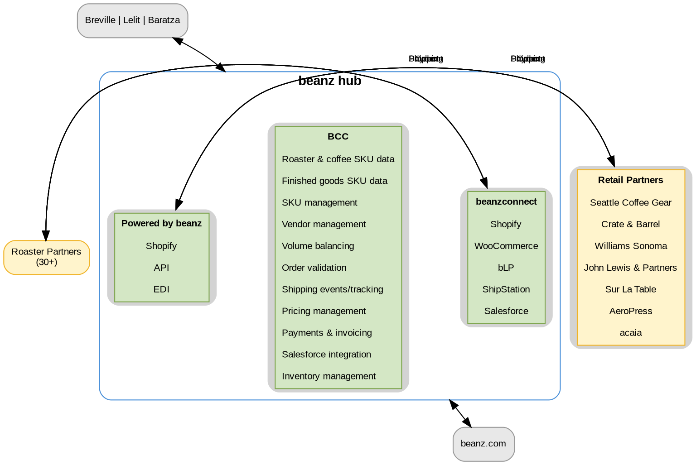

# Beanz Hub

## Quick Reference

- Umbrella B2B platform with three product streams: BCC, Beanz Connect, PBB
- Connects 30+ roaster partners and 7+ retail partners through a central control center

## Hub Framework

### Key Concepts

- **Beanz Hub** = Umbrella term for the B2B stream, unified scalable service platform
- **BCC** = Beanz Control Center, self-service portal replacing RCC (Salesforce)
- **Beanz Connect** = Roaster fulfillment integrations (BLP, machine sales)
- **PBB** = Powered by Beanz, retail partner and manufacturer integration layer
- **RCC** = Roaster Control Centre, legacy Salesforce portal being replaced by BCC

## Hub Architecture

**Legend:** Green = product streams (inside hub cluster), Yellow = external partners, Grey = parent brands/consumer platform. All arrows are bidirectional: 4 data flow channels (Products, Order, Shipping, Payment) symmetric on both sides; BRG and beanz.com connect to the hub as a whole.

## Product Streams

| Stream | Purpose | Key Systems | Partner Type |
|--------|---------|-------------|--------------|
| **BCC** | Self-service portal for roasters, PBB partners, and Beanz managers | Replaces RCC (Salesforce) | All |
| **Beanz Connect** | Seamless roaster fulfillment connections | Shopify, WooCommerce, ShipStation | Roasters |
| **PBB** | Retail partner and manufacturer integration | Shopify, API, EDI | Retail partners |

## Beanz Control Center (BCC)

**Purpose:** One-stop shop for roasters, PBB partners, and Beanz managers to interact and manage required actions.

**Key Principle:** Self-service is core — giving users control with minimal friction.

**Note:** BCC is the rebuilt version of the current RCC (Roaster Control Centre) Salesforce portal.

**BCC Capabilities:**

- Roaster & coffee SKU data
- Finished goods SKU data
- SKU management
- Vendor management
- Volume balancing
- Order validation
- Shipping events/tracking
- Pricing management
- Payments & invoicing
- Salesforce integration (customer data, CRM sync)
- Inventory management (stock availability from D365/ERP)

## Beanz Connect

**Purpose:** Enabling seamless connections with roasters for any fulfillment requirement.

**Key Initiatives:**

- **BLP (Beanz Label Printing):** Streamlining and automating label production for partners
- **Roaster Machine Sales:** Direct integration for machine orders and fulfillment

**Integration Stack:** Shopify, WooCommerce (e-commerce); ShipStation (shipping); Salesforce (customer data sync)

## Powered by Beanz (PBB)

**Purpose:** Integration layer with retail partners and manufacturers.

**Capabilities:**

- Ingesting manufacturers' products to sell on beanz.com
- Supporting retail and distribution partnerships at scale

**Integration Stack:** Shopify, API, EDI

**Current Retail Partners:** Seattle Coffee Gear, Crate&Barrel, Williams Sonoma, John Lewis & Partners, Sur La Table, AeroPress, acaia

## Related Files

- [[platinum-roaster-program|Platinum Roaster Program]] - Roaster partner operations managed through Hub
- [[beanz-label-printing|Beanz Label Printing]] - BLP shipping flows managed through Beanz Connect

## Open Questions

- [ ] What is the timeline for BCC fully replacing the legacy RCC Salesforce portal?
- [ ] Which markets is Beanz Hub currently operational in?
