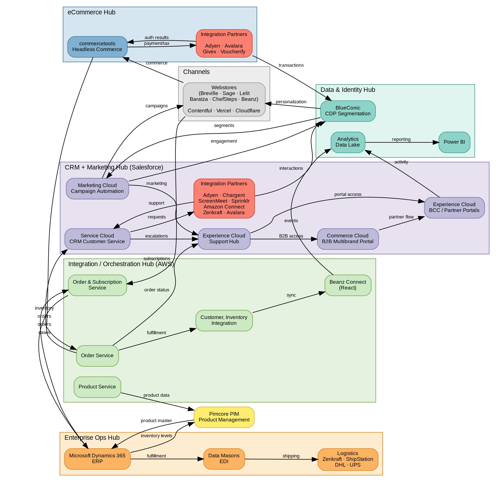

# BRG Tech Landscape

## Quick Reference

- Multi-hub composable architecture across 6 BRG brands (Breville, Sage, Lelit, Baratza, ChefSteps, Beanz)
- Six hubs: Channels, eCommerce (commercetools), CRM + Marketing (Salesforce), Orchestration (AWS), Enterprise Ops (Dynamics 365), Data & Identity (BlueConic, Power BI)
- Three primary data flows through the architecture:

| Flow | Path | Purpose |
|---|---|---|
| **Commerce** | Webstores → commercetools → Order Service → CRM/Support Hub | Order intake, case creation, portal routing |
| **Fulfillment** | Order Service → Customer/Inventory Integration → Beanz Connect → Analytics Data Lake → Power BI | Order processing, data sync, analytics |
| **Subscription/ERP** | Webstores → Order & Subscription Service ↔ Dynamics 365 → Data Masons EDI → Logistics | Subscription lifecycle, fulfillment, shipping |

- Supporting flows: CDP ↔ Marketing Cloud (segmentation), Product Service → PIM ↔ ERP (product data), Partners → CDP (transaction/interaction data)

## Architecture Framework

### Key Concepts

- **Multi-hub composable** = Best-of-breed architecture with specialized platforms per domain
- **Lambda Middleware** = Central AWS integration layer; all inter-hub communication routes through Lambda functions that implement the named services (Order Service, Product Service, etc.)
- **D2C** = Direct to Consumer (beanz.com storefront via commercetools)
- **CDP** = Customer Data Platform (segmentation)
- **PIM** = Product Information Management (centralized product data)
- **EDI** = Electronic Data Interchange (machine-to-machine business documents)
- **DMEDI** = Data Masons EDI integration platform

## Hub Architecture

**Legend:** Hub clusters group systems by architectural domain. Edge labels show the specific data flowing in each direction (no generic "bidirectional" labels — each direction is shown separately). Salmon nodes within hub clusters represent integration partner groups.

| Cluster | Color | Systems |
|---|---|---|
| Data & Identity Hub | Teal | BlueConic CDP, Analytics Data Lake, Power BI |
| CRM + Marketing Hub | Purple | Marketing Cloud, Service Cloud, Support Hub, Commerce Cloud, BCC / Partner Portals, CRM Partners |
| Channels | Grey | Multi-brand webstores (Contentful, Vercel, Cloudflare) |
| eCommerce Hub | Blue | commercetools, eCommerce Partners |
| Orchestration Hub | Green | Order Service, Order & Subscription, Product Service, Customer/Inventory, Beanz Connect |
| Enterprise Ops Hub | Orange | Dynamics 365 ERP, Data Masons EDI, Logistics |
| PIM (standalone) | Yellow | Pimcore |

## Technology Inventory

### Core Platform (shown in hub diagram)

| Functional Area | Platform / Vendor | Hub | Purpose |
|---|---|---|---|
| **Webstores** | Vercel, Cloudflare | Channels | Multi-brand web hosting and CDN |
| **CMS** | Contentful (headless); replacing AEM, migration underway | Channels | Content management for web properties |
| **eCommerce** | commercetools | eCommerce | Headless commerce engine |
| **CRM / Case Management** | Salesforce Service Cloud | CRM + Marketing | Customer service and case management |
| **Support Hub** | Salesforce Experience Cloud | CRM + Marketing | Central routing between CRM and portals |
| **Marketing Automation** | Salesforce Marketing Cloud | CRM + Marketing | Campaign orchestration and automation |
| **B2B Commerce** | Salesforce Commerce Cloud | CRM + Marketing | Multibrand B2B portal |
| **BCC / Partner Portals** | Salesforce Experience Cloud | CRM + Marketing | B2B self-service portal (replacing legacy RCC) |
| **Order Service** | AWS | Orchestration | Order intake, routing, and fulfillment coordination |
| **Order & Subscription Service** | AWS | Orchestration | Subscription lifecycle management |
| **Product Service** | AWS | Orchestration | Product data management |
| **Customer / Inventory Integration** | AWS | Orchestration | Data synchronization |
| **Beanz Connect** | AWS + React | Orchestration | Platform connector (internal service + external bridge) |
| **ERP** | Microsoft Dynamics 365 | Enterprise Ops | Financials and business operations |
| **EDI** | Data Masons (DMEDI) | Enterprise Ops | Electronic data interchange |
| **CDP / Segmentation** | BlueConic | Data & Identity | Customer data platform |
| **Product Analytics** | Mixpanel | Data & Identity | User behavior and product analytics |
| **Analytics Data Lake** | Databricks (Bronze/Silver/Gold medallion) | Data & Identity | Centralized data processing and analytics hub |
| **Data Warehouse** | Snowflake | Data & Identity | Analytics data warehouse; feeds Power BI |
| **Analytics** | Power BI | Data & Identity | Reporting and business intelligence |
| **PIM** | Pimcore | Standalone | Product information management |

### Additional Vendors (via Lambda Middleware)

| Vendor | Function |
|---|---|
| Algolia | Search and discovery |
| Auth0 | Authentication and identity |
| Chargebee | Subscription billing |
| Shipengine | Shipping API |
| Onetrust | Privacy and consent management |
| Brand Folder | Digital asset management |
| Newrelic | Application performance monitoring |
| Bazaarvoice | User-generated content and reviews |
| Heroku | Cloud application platform |
| OpenAI | AI and LLM services |

## eCommerce Hub

**Platform:** commercetools (headless)

**Role:** Core commerce engine for all direct-to-consumer transactions across BRG brand webstores.

**Key Characteristics:**

- Headless architecture decouples frontend (Vercel/Contentful) from commerce backend
- Supports multi-brand webstores (as listed in diagram) and Beanz Connect
- Connects to AWS microservices for order orchestration and fulfillment

**Integration Points:**

| Direction | System | Data |
|---|---|---|
| Upstream | Webstores (Contentful, Vercel, Cloudflare) | Commerce requests (browse, purchase) |
| Downstream | AWS Order Service | Order submission for routing to CRM and fulfillment |
| Outbound to partners | Adyen, Avalara, Givex, Voucherify | Payment/tax requests, gift card/voucher validation |
| Inbound from partners | Adyen, Avalara, Givex, Voucherify | Authorization results, tax calculations |
| Partners → CDP | BlueConic | Transaction data for customer segmentation |

## B2B + CRM + Marketing Hub

**Platform:** Salesforce (Service Cloud, Marketing Cloud, Commerce Cloud, Experience Cloud)

**Role:** All customer-facing operations, B2B commerce, partner portals, and marketing automation.

### Service Cloud (CRM / Case Management)

Handles customer service operations and case management. Integrates with support tooling partners (Amazon Connect, ScreenMeet, Sprinklr, Chargent, Zenkraft).

### Marketing Cloud

Campaign orchestration and marketing automation. Bidirectional integration with BlueConic CDP for customer segmentation and audience management.

### Commerce Cloud (B2B Multibrand Portal)

Powers the B2B multibrand portal for partner commerce.

### Experience Cloud (Support Hub)

**Support Hub:** Central routing hub positioned between CRM and downstream systems. Receives:
- Cases from Service Cloud
- Campaign data from Marketing Cloud
- Order data from AWS Order Service (intake)

Routes to B2B Commerce and the partner/service/return portals.

**BCC / Partner Portals:** Hosted on Experience Cloud. BCC (Beanz Control Center) is the self-service B2B portal replacing the legacy RCC (Roaster Control Centre). Receives access from both the Support Hub and B2B Commerce. Sends portal activity data to the Analytics Data Lake. See [[beanz-hub|Beanz Hub]] for full B2B platform detail.

## Integration / Orchestration Hub

**Platform:** AWS custom microservices

**Role:** Central integration backbone connecting commerce, enterprise ops, and data layers. These named services are logical components — at the physical level, they are implemented as Lambda functions routed through the AWS Lambda Middleware layer (see Physical Architecture section below).

**AWS Services:**

| Service | Receives From | Sends To | Purpose |
|---|---|---|---|
| Order Service | commercetools (orders) | CRM (cases), Support Hub (status), Customer/Inventory (fulfillment) | Order intake, routing, and fulfillment coordination |
| Order & Subscription Service | Webstores (subscriptions) | ERP (orders); receives inventory back from ERP | Subscription lifecycle management |
| Product Service | — | PIM (product data) | Product data management |
| Customer / Inventory Integration | Order Service (fulfillment) | Beanz Connect (sync) | Data synchronization |

**Beanz Connect** (AWS + React): Subscription platform connector with dual roles:
- **Internal:** AWS-hosted service with React frontend that synchronizes customer and inventory data and feeds events to the Analytics Data Lake
- **External:** Integration bridge for roaster SKU onboarding — external roasters submit SKU requests through Beanz Connect, which routes to Salesforce for SKU creation in PIM

## Enterprise Ops Hub

**Platform:** Microsoft Dynamics 365 (ERP) + Data Masons (EDI)

**Role:** Core business operations, financials, and electronic data interchange with logistics and fulfillment partners.

**Integration Flows:**

| Flow | Data |
|---|---|
| AWS Order & Subscription → D365 | Order and subscription data for financial processing |
| D365 → AWS Order & Subscription | Inventory levels and financial confirmations |
| PIM → D365 | Product master data |
| D365 → PIM | Inventory levels for catalog accuracy |
| D365 → Data Masons (EDI) | Fulfillment orders for shipping |
| Data Masons → Logistics | Shipping requests to Zenkraft, ShipStation, DHL, UPS |

## Data & Identity Hub

**Platform:** BlueConic (CDP), Mixpanel (product analytics), Analytics Data Lake (Databricks medallion architecture), Snowflake (data warehouse), Power BI

**Role:** Customer identity resolution, segmentation, data aggregation, and business intelligence.

**CDP Integration Flows:**

| Flow | Data |
|---|---|
| CDP → Marketing Cloud | Audience segments for campaign targeting |
| Marketing Cloud → CDP | Campaign engagement data (opens, clicks, conversions) |
| eCommerce Partners → CDP | Transaction data (payment events from Adyen, tax data from Avalara) |
| CRM Partners → CDP | Customer interaction data (service requests, support interactions) |
| CDP → Webstores | Personalization data for storefront customization |

**Analytics Data Lake Sources:**
- Beanz Connect (platform events — customer/inventory sync activity)
- RCC\Service\Return Portal via Salesforce Experience Cloud (portal activity)

**Analytics Pipeline:** All services → Analytics Data Lake → Databricks (Bronze/Silver/Gold medallion architecture) → Snowflake (data warehouse) → Power BI (reporting)

**Output:** Power BI dashboards and reports for business stakeholders.

## Product Information Management

**Platform:** Pimcore

**Role:** Centralized product information management.

**Integration Flows:**

| Flow | Data |
|---|---|
| AWS Product Service → PIM | Product data updates |
| PIM → D365 | Product master data for inventory management |
| D365 → PIM | Inventory levels for catalog accuracy |

**Note:** The downstream path from PIM to webstores (how product catalog data reaches commercetools and brand storefronts) is not shown in the source diagram. PIM feeds into the AWS Lambda Middleware layer, which routes product data to commercetools and other consumers.

## Integration Partners

Two distinct groups of integration partners serve different hubs:

### eCommerce Partners

| Partner | Function |
|---|---|
| Adyen | Payment processing |
| Avalara | Tax calculation and compliance |
| Givex | Gift card management |
| Voucherify | Voucher and promotion engine |

### CRM / Marketing Partners

| Partner | Function |
|---|---|
| Adyen | Payment processing |
| Chargent | Salesforce-native billing |
| ScreenMeet | Remote support screen sharing |
| Sprinklr | Social media and messaging |
| Amazon Connect | Cloud contact center telephony |
| Zenkraft | Shipping management within Salesforce |
| Avalara | Tax calculation and compliance |

**Note:** These CRM partners send customer interaction and service data to BlueConic CDP for enhanced segmentation.

## Shipping & Logistics

**Shipping Tools:** Zenkraft (Salesforce-native), ShipStation (standalone)

**Carriers:** DHL, UPS

**Data Flow:** Orders flow from Dynamics 365 through Data Masons (EDI) to shipping tools, which route to carrier networks for fulfillment and delivery.

## Beanz Hub (B2B Platform)

Three components in this landscape together form the **[[beanz-hub|Beanz Hub]]** — the unified B2B service platform for roaster and retail partners:

| Stream | Tech Landscape Location | Platform | Role |
|---|---|---|---|
| **BCC** (Beanz Control Center) | CRM + Marketing Hub → BCC / Partner Portals | Salesforce Experience Cloud (current, being replatformed to React + AWS) | Self-service portal for roasters, PBB partners, and Beanz managers (replacing legacy RCC). Replatform in progress: target architecture is React frontend + AWS microservices, following the Beanz Connect pattern — not Salesforce UI. See [[beanz-hub\|Beanz Hub]] for replatform detail. |
| **Beanz Connect** | Orchestration Hub → Beanz Connect | AWS + React | Roaster fulfillment integrations (BLP, machine sales, SKU onboarding) |
| **PBB** (Powered by Beanz) | External Ecosystem → Roaster & Partner Platforms | Shopify, API, EDI via AWS | Retail partner and manufacturer integration (Seattle Coffee Gear, Williams Sonoma, etc.) |

See [[beanz-hub|Beanz Hub]] for product-level detail on streams, partner lists, and capabilities.

## Physical Architecture

The hub-level diagram above shows logical services and data flows. At the physical level, the platform runs on three infrastructure layers:

### AWS Infrastructure

All inter-hub routing passes through **Lambda Middleware** — a central serverless integration layer that handles request routing between all platform zones.

| Service | Purpose |
|---|---|
| Lambda Middleware | Central request routing between all zones |
| S3 | Object storage |
| DynamoDB | NoSQL application data |
| DocumentDB | Document database |
| IOT | Connected device management (Lelit Lia, future coffee machines) |
| Pinecone | Vector database for AI/LLM use cases |

### Microsoft Azure / Business Platform

D365 ERP connects to a broader Azure infrastructure:

| Service | Purpose |
|---|---|
| Azure Function | Serverless compute for business logic |
| Logic Apps | Workflow automation |
| SFTP | Secure file transfer between systems |
| Storage Account | Azure blob storage |
| D365 DataLake | ERP-specific analytics data lake |
| DataLake | General analytics data lake |

### DMEDI (Data Masons EDI)

The EDI subsystem runs on dedicated Azure infrastructure:

| Component | Purpose |
|---|---|
| SFTP Push Endpoint | Inbound EDI document receipt |
| Data Masons | EDI translation and processing |
| DMEDI Disk / Application | EDI application runtime |
| EDI Azure VMs | Processing virtual machines |
| Azure Database MySQL Server | EDI relational data store |
| Backups | EDI backup infrastructure |

## Client Channels

Consumer-facing channels that connect through the AWS layer:

| Channel | Platform | Purpose |
|---|---|---|
| Web Storefront | Browser-based | Multi-brand web storefronts |
| Mobile Client | Native app | Mobile shopping experience |
| Vercel | Hosting | Frontend hosting and deployment |
| Connected Devices | IoT | Coffee machines integrating through AWS IOT |

## External Ecosystem

Systems outside BRG's ownership that feed data into the platform:

### Product Lifecycle Management

| System | Purpose |
|---|---|
| Windchill PLM | Breville product lifecycle management → PIM |
| Lelit PLM System | Lelit product lifecycle management → PIM |
| SmartCat | Translation management → PIM |
| Manual Process | Manual data entry → CORE backend |

### Roaster & Partner Platforms

| System | Purpose |
|---|---|
| Beanz Connect | SKU onboarding requests → Salesforce → PIM |
| Shopify | Roaster fulfilment platform |
| Woocommerce | Roaster fulfilment platform |
| Powered by Beanz | Retail partner fulfilment (routes through AWS) |

### Marketplace & Distribution

| System | Purpose |
|---|---|
| Marketplace Aggregator | Channel management for external marketplaces |
| Marketplaces | External marketplace channels (routes through AWS) |
| Breville US Partners | US partner network (routes through AWS) |
| Fulfilment Platform | Order fulfilment coordination (routes through AWS) |
| ShipStation | Shipping management (routes through AWS) |

## Additional Vendor Services

Beyond the integration partners shown in the hub diagram, the following SaaS services connect through the AWS Lambda Middleware layer:

| Vendor | Function |
|---|---|
| Auth0 | Authentication and identity management |
| Algolia | Search and discovery |
| Chargebee | Subscription billing |
| Shipengine | Shipping API |
| Onetrust | Privacy and consent management |
| Brand Folder | Digital asset management |
| Newrelic | Application performance monitoring |
| Bazaarvoice | User-generated content and reviews |
| Heroku | Cloud application platform |
| OpenAI | AI and LLM services |
| Mixpanel | Product analytics |

**Notable integration:** Chargent has a direct two-way integration with Salesforce, bypassing the standard AWS Lambda routing path.

## Related Files

- [[beanz-hub|Beanz Hub]] — BCC and partner portals run on Salesforce Experience Cloud as shown in this landscape
- [[web-orchestration-services|Web Orchestration Services]] — API abstraction layer wrapping the backend platforms shown in this landscape

## Open Questions

- [ ] What is the exact role split between Zenkraft (Salesforce-side shipping) and ShipStation (standalone shipping)?
- [ ] What is the scope of the AEM-to-Contentful migration — which brand properties have migrated and which remain on AEM?
- [ ] What data flows through the Customer / Inventory Integration service specifically?
- [ ] Two unidentified vendor logos appear in the eCommerce integration partners group in the source diagram — need vendor identification
- [ ] How does product catalog data flow from PIM to commercetools/webstores? (PIM feeds Lambda Middleware, but exact downstream routing is unclear)
- [ ] Does Chargebee integrate through the Order & Subscription Service, or directly via Lambda Middleware?
- [ ] What specific data flows through the SFTP connection between Business Platform and external systems?
- [ ] What is the exact integration path for Chargent's direct Salesforce integration (bypassing AWS routing)?
- [ ] What role does Eventbrite play in the platform — customer-facing events or internal?
- [ ] What specific data does Pinecone store and what AI/LLM use cases does it serve?
