# KB Platform Architecture

## Quick Reference

Three-layer knowledge base platform: kb-author creates content with progressive reference loading, validate-all.py enforces quality gates, kb-review monitors vault health.

## Platform Overview

The Beanz Knowledge Base is a context-engineered documentation platform built for AI-native navigation. The architecture comprises nine integrated subsystems working in concert to transform unstructured input into validated, interconnected knowledge base files, with cross-platform integration to the beanz-analytics Business Language Layer.

**Content Authoring** — The kb-author skill (815 lines) orchestrates document creation through three workflows: Analyze (20-step extraction and rule application), Create (57-node file generation with discovery protocol, Decision Tree 8 diagram format selection, and 5-phase validation), and Validate (17-step quality enforcement). Progressive reference loading minimizes context: W3 uses only 637 lines (89% reduction), while W1 and W2 load comprehensive references when deep analysis or creation is needed.

**Quality Assurance** — Four quality gates enforce defense-in-depth: (1) AI Self-Validation Checklist runs before presenting any output, (2) validate-all.py orchestrates 8 scripts with error boundary (scripts 1-4 block on fail), (3) GitHub Actions blocks PR merges if validation fails, (4) kb-review runs monthly audits with 16 vault metrics and 10 content-quality heuristics detecting systemic issues.

**Validation Pipeline** — 13 scripts organized in 5 tiers: Error Boundary (YAML, aliases, wikilinks, indexes exit code 1), Warning Layer (tags, orphans, length, freshness exit code 0), Consistency Lint (rule-consistency, glossary-sync, business-context drift), CI Gate (PR merge blocker), and Audit Trail (3 hooks capturing session activity).

**Reference Library** — 15 kb-author files (5,853 lines) provide standards, rules, and domain knowledge. Progressive loading uses essential-rules.md (102 lines) as the always-loaded anchor, with workflow-specific references added in Stage 2.

**Data Artifacts** — Three generated files serve different consumers: _catalog.md (human-readable inventory), _catalog.json (machine-readable metadata with schema v1), BUSINESS_CONTEXT.md (125 business terms across 9 categories for beanz-query skill).

**Data Consumption** — The beanz-query skill (147 lines) bridges business language to analytics. Uses BUSINESS_CONTEXT.md for concept resolution, then queries MCP Datasette data dictionary with verified field names. Never guesses — always verifies schema before executing SQL.

**Audit Trail** — Three Claude Code hooks (356 lines total) capture every kb-author session: PostToolUse logs file reads/writes, PostToolUseFailure captures validation failures, Stop generates a markdown summary in docs/_audit/. Only KB-relevant sessions produce logs. Intermediate .session-*.jsonl files are gitignored; final summaries are committed with KB changes for PR review.

**Templates** — Three template files enforce structural consistency: note-template.md (YAML + UDS structure), index-template.md (folder MOC boilerplate), meeting-report-template.md (meeting intelligence format). Used by kb-author and meeting-analyzer to ensure every document follows the same schema.

**Configuration** — Platform configuration layer spans three files: .claude/settings.json defines the 3-hook audit trail system with async/sync modes and timeouts, CLAUDE.md provides project instructions loaded by all Claude Code sessions (9 required YAML fields, GitHub workflow, domain structure), README.md documents public-facing platform overview.

**Cross-Platform Integration** — The Business Language Layer (BLL) bridges KB terminology to beanz-analytics data dictionary through one-way sync: KB glossary (108 terms, source of truth) → generate-business-context.py (531 lines) → BUSINESS_CONTEXT.md (beanz-analytics, 125 terms, 9 categories) → Datasette Data Dictionary Plugin (LLM enrichment context) → datasette-dd-mcp (8 MCP tools). Runtime queries flow through beanz-query skill which resolves business concepts via KB glossary, then queries the enriched data dictionary. Never guesses field names — always verifies schema before executing SQL.

---

## Layer 1: System Overview

The system overview (~52 nodes, 85+ edges) shows the nine major subsystems and their interconnections, including cross-platform integration with beanz-analytics. Nested clusters have been flattened to reduce horizontal width for better Obsidian display.

**Skills Layer (9 nodes)** — Four KB skills (kb-author, kb-review, beanz-query, meeting-analyzer), three diagram skills (creating-graphviz-diagrams, creating-excalidraw-diagrams, creating-mermaid-diagrams), two utilities (obsidian-markdown, project-dashboard). Displayed as flat list within single cluster.

**Validation Pipeline (13 nodes)** — validate-all.py orchestrator coordinates 8 content validation scripts (scripts 1-4 error boundary in red, scripts 5-8 warning layer in yellow) plus 4 standalone tools (generate-catalog, check-rule-consistency, check-glossary-sync, generate-business-context).

**Reference Library (8 nodes)** — Progressive loading hub: essential-rules.md (102 lines, always loaded) plus 5 workflow-specific references (DOCUMENTATION-PRINCIPLES, analysis-guidelines, validation-workflows, common-mistakes, obsidian-standards), 1 W2 support node (file-discovery + graphviz-guide, 344 lines), and 1 consolidated domain refs node (7 files, 2,202 lines).

**Data Artifacts (3 nodes)** — Bidirectional flows: generate-catalog.py writes _catalog.md and _catalog.json, which kb-author reads for file discovery. generate-business-context.py writes BUSINESS_CONTEXT.md, which beanz-query reads for concept resolution.

**Quality Gates (4 nodes)** — Defense-in-depth enforcement: AI Self-Validation (kb-author before presenting), validate-all.py error boundary (scripts 1-4 block), GitHub Actions merge gate (PR validation), kb-review monthly audit (11 checks + 19 metrics).

**Audit Trail (3 nodes)** — Claude Code hooks capture kb-author sessions passively: PostToolUse logs Read/Write/Edit/Bash actions async, PostToolUseFailure captures validation failures, Stop generates markdown summary in docs/_audit/. Only KB-relevant sessions produce logs (references, validation scripts, doc writes).

**External Systems (4 nodes)** — User provides input documents. GitHub Actions runs CI validation. MCP Datasette provides data dictionary for beanz-query. Obsidian renders DOT and Mermaid diagrams.

**Templates (3 nodes)** — Structural templates read by skills: note-template.md (9-field YAML + UDS structure for kb-author), index-template.md (folder MOC boilerplate for domain indexes), meeting-report-template.md (meeting intelligence sections for meeting-analyzer).

**Configuration (3 nodes)** — Platform configuration: settings.json defines hook system (PostToolUse/Failure async, Stop sync), CLAUDE.md provides project instructions (9 YAML fields, GitHub workflow, 25 domains), README.md documents AI-first navigation strategy.

**Cross-Platform Integration (5 nodes)** — Business Language Layer sync to beanz-analytics: KB glossary (source of truth) → generate-business-context.py → BUSINESS_CONTEXT.md (analytics repo, 125 terms) → Datasette Data Dictionary Plugin (LLM enrichment) → datasette-dd-mcp (8 MCP tools for Claude). One-way sync ensures KB terminology governs analytics field descriptions.

### System Architecture Diagram

```dot
digraph kb_platform_overview {
    rankdir=TB;
    ranksep=1.5;
    nodesep=0.3;
    fontname="Helvetica,Arial,sans-serif";
    node [fontname="Helvetica,Arial,sans-serif", shape=box, style="rounded,filled", colorscheme=set312, fillcolor=5, color="#4A7FA0"];
    edge [fontname="Helvetica,Arial,sans-serif", fontsize=9];
    compound=true;

    // ── External Systems ──
    subgraph cluster_external {
        label="External Systems";
        style="rounded,filled";
        fillcolor="#ECECEC";
        color="#999999";

        user_input [label="User Input\n(PDF, spreadsheet,\nConfluence, diagram)", shape=folder, fillcolor=9, color="#999999"];
        gh_actions [label="GitHub Actions\nPR Validation", shape=component, fillcolor=9, color="#999999"];
        mcp_datasette [label="MCP Datasette\nData Dictionary", shape=component, fillcolor=9, color="#999999"];
        obsidian [label="Obsidian\nRendering", shape=component, fillcolor=9, color="#999999"];
    }

    // ── Skills Layer ──
    subgraph cluster_skills {
        label="Skills Layer (9 skills)";
        style="rounded,filled";
        fillcolor="#D9EEF5";
        color="#4A7FA0";

        // KB Quad
        kb_author [label="kb-author\n815 lines | 3 workflows", fillcolor=5
                   comment=".claude/skills/kb-author/skill.md"
                   tooltip="Workflows: W1 Analyze, W2 Create, W3 Validate | 15 references (5,853 lines) | Progressive loading"
                   class="skill kb-authoring content-creation"];
        kb_review [label="kb-review\n242 lines | vault health", fillcolor=5
                   comment=".claude/skills/kb-review/skill.md"
                   tooltip="Runs: 11 checks (8 via validate-all + 3 standalone) | 19 vault metrics | 10 heuristics"
                   class="skill kb-operations quality-assurance"];
        beanz_query [label="beanz-query\n147 lines | KB→data bridge", fillcolor=5
                     comment=".claude/skills/beanz-query/skill.md"
                     tooltip="Runtime: KB concept resolution → MCP search → schema verification → SQL execution"
                     class="skill cross-platform query-resolution"];
        meeting_analyzer [label="meeting-analyzer\n549 lines | transcript→intelligence", fillcolor=5
                          comment=".claude/skills/meeting-analyzer/SKILL.md"
                          tooltip="Extracts: Action items, decisions, argument maps, sentiment, social dynamics"
                          class="skill content-creation meeting-intelligence"];

        // Diagram Triad
        graphviz_skill [label="creating-graphviz-\ndiagrams | 581 lines", fillcolor=5
                        comment=".claude/skills/creating-graphviz-diagrams/skill.md"
                        tooltip="7 references | AgentViz v1 schema | Enterprise-scale (no node limit)"
                        class="skill diagram-generation dot-graphviz"];
        excalidraw_skill [label="creating-excalidraw-\ndiagrams | 296 lines", fillcolor=5
                          comment=".claude/skills/creating-excalidraw-diagrams/skill.md"
                          tooltip="4 references | Wireframes, spatial layouts | Grid-based positioning"
                          class="skill diagram-generation excalidraw"];
        mermaid_skill [label="creating-mermaid-\ndiagrams | 258 lines", fillcolor=5
                       comment=".claude/skills/creating-mermaid-diagrams/skill.md"
                       tooltip="4 references | Sequence, timeline, Gantt, journey maps | GitHub-native"
                       class="skill diagram-generation mermaid"];

        // Utilities
        obsidian_util [label="obsidian-markdown\n620 lines", fillcolor=5
                       comment=".claude/skills/obsidian-markdown/SKILL.md"
                       tooltip="Obsidian syntax: wikilinks, embeds, callouts, properties, tags"
                       class="skill utility markdown-formatting"];
        project_dash [label="project-dashboard\naction tracking", fillcolor=5
                      comment=".claude/skills/project-dashboard/skill.md"
                      tooltip="Canvas dashboards | Meeting report ingestion | Status tracking"
                      class="skill utility project-management"];
    }

    // ── Validation Pipeline ──
    subgraph cluster_validation {
        label="Validation Pipeline (13 scripts)";
        style="rounded,filled";
        fillcolor="#FEF0D8";
        color="#D4C640";

        validate_all [label="validate-all.py\nOrchestrator (8 scripts)", shape=hexagon, fillcolor=2, color="#D4C640"
                      comment="scripts/validate-all.py"
                      tooltip="Runs 8 validation scripts sequentially | Exit: 0=pass, 1=errors in scripts 1-4"
                      class="orchestrator validation error-boundary"];

        // Error Boundary (1-4)
        s1 [label="1. YAML\nCompleteness", fillcolor=4, color="#D44535"
            comment="scripts/check-yaml-completeness.py"
            tooltip="Validates: 9 required fields, status enum, market list"
            class="validation error-boundary tier-1"];
        s2 [label="2. Alias\nUniqueness", fillcolor=4, color="#D44535"
            comment="scripts/check-alias-uniqueness.py"
            tooltip="Validates: Case-insensitive cross-file duplicate detection"
            class="validation error-boundary tier-1"];
        s3 [label="3. Wikilink\nResolution", fillcolor=4, color="#D44535"
            comment="scripts/check-wikilink-resolution.py"
            tooltip="Validates: All wikilinks resolve to existing files"
            class="validation error-boundary tier-1"];
        s4 [label="4. Index\nCompleteness", fillcolor=4, color="#D44535"
            comment="scripts/check-index-completeness.py"
            tooltip="Validates: Folder _index.md files, MOC linkage, required sections"
            class="validation error-boundary tier-1"];

        // Warning Layer (5-8)
        s5 [label="5. Tag\nTaxonomy", fillcolor=2, color="#D4C640"
            comment="scripts/check-tag-taxonomy.py"
            tooltip="Warns: Tags not in 95-tag approved vocabulary"
            class="validation warning tier-2"];
        s6 [label="6. Orphan\nFiles", fillcolor=2, color="#D4C640"
            comment="scripts/check-orphan-files.py"
            tooltip="Warns: Content files with zero incoming wikilinks"
            class="validation warning tier-2"];
        s7 [label="7. Doc\nLength", fillcolor=2, color="#D4C640"
            comment="scripts/check-doc-length.py"
            tooltip="Warns: >500 lines oversized, <10 lines stubs"
            class="validation warning tier-2"];
        s8 [label="8. Data\nFreshness", fillcolor=2, color="#D4C640"
            comment="scripts/check-data-freshness.py"
            tooltip="Warns: HDX 4-state model (fresh/due/overdue/delinquent) for dynamic docs"
            class="validation warning tier-2"];

        // Standalone Tools
        gen_catalog [label="generate-catalog.py\nMD + JSON output", fillcolor=9, color="#999999"
                     comment="scripts/generate-catalog.py"
                     tooltip="Creates: _catalog.md + _catalog.json | Argparse: --md-only, --json-only"
                     class="generator data-artifact"];
        rule_check [label="check-rule-\nconsistency.py\n9 rules, 26 checks", fillcolor=9, color="#999999"
                    comment="scripts/check-rule-consistency.py"
                    tooltip="Validates: Consistency across 5 config files (CLAUDE.md, skill.md, obsidian-standards, common-mistakes, essential-rules)"
                    class="validation consistency-lint"];
        glossary_sync [label="check-glossary-\nsync.py", fillcolor=9, color="#999999"
                       comment="scripts/check-glossary-sync.py"
                       tooltip="Validates: KB glossary terms present in skill reference | KB ⊆ skill property"
                       class="validation consistency-lint glossary"];
        gen_context [label="generate-business-\ncontext.py", fillcolor=9, color="#999999"
                     comment="scripts/generate-business-context.py"
                     tooltip="Creates: BUSINESS_CONTEXT.md (125 terms, 9 categories) | Reads: KB + skill glossaries | Output: beanz-analytics"
                     class="generator cross-platform bll-sync"];
    }

    // ── Reference Library ──
    subgraph cluster_references {
        label="Reference Library (15 kb-author files)";
        style="rounded,filled";
        fillcolor="#E8F5E3";
        color="#7FA650";

        essential [label="essential-rules.md\n102 lines (ALWAYS)", fillcolor=11, color="#7FA650"];
        principles [label="DOCUMENTATION-\nPRINCIPLES.md\n917 lines (W2)", fillcolor=11, color="#7FA650"];
        analysis_guide [label="document-analysis-\nguidelines.md\n640 lines (W1)", fillcolor=11, color="#7FA650"];
        validation_guide [label="validation-\nworkflows.md\n535 lines (W3)", fillcolor=11, color="#7FA650"];
        mistakes [label="common-mistakes.md\n607 lines", fillcolor=11, color="#7FA650"];
        obsidian_std [label="obsidian-standards.md\n506 lines", fillcolor=11, color="#7FA650"];
        domain_refs [label="7 domain refs\n(segments, IDs, glossary,\ntags, temporal, indexes,\ndomain-mgmt)\n2,202 lines", fillcolor=11, color="#7FA650"];
        w2_support [label="file-discovery +\ngraphviz-quick-guide\n344 lines (W2)", fillcolor=11, color="#7FA650"];
    }

    // ── Data Artifacts ──
    subgraph cluster_data {
        label="Data Artifacts";
        style="rounded,filled";
        fillcolor="#ECECEC";
        color="#999999";

        catalog_md [label="_catalog.md\nHuman-readable\nfile inventory", shape=note, fillcolor=9, color="#999999"
                    comment="docs/_catalog.md"
                    tooltip="Auto-generated | Lists all KB files with metadata | Used by: kb-author for file discovery"
                    class="artifact generated catalog"];
        catalog_json [label="_catalog.json\nMachine-readable\nschema v1", shape=note, fillcolor=9, color="#999999"
                      comment="docs/_catalog.json"
                      tooltip="Auto-generated | JSON schema v1 | YAML→snake_case mapping | Used by: kb-author, meeting-analyzer"
                      class="artifact generated catalog structured"];
        business_ctx [label="BUSINESS_CONTEXT.md\n125 terms, 9 categories", shape=note, fillcolor=9, color="#999999"
                      comment="docs/BUSINESS_CONTEXT.md (generated in KB, synced to analytics)"
                      tooltip="Generated from KB + skill glossaries | 9 sections | Consumed by: beanz-query, Datasette Data Dictionary Plugin"
                      class="artifact generated cross-platform bll"];
    }

    // ── Quality Gates ──
    subgraph cluster_gates {
        label="Quality Gates (4 checkpoints)";
        style="rounded,filled";
        fillcolor="#FDD9D5";
        color="#D44535";

        gate_ai [label="AI Self-Validation\nChecklist\n(kb-author W1/W2)", shape=octagon, fillcolor=4, color="#D44535"];
        gate_scripts [label="validate-all.py\nError Boundary\n(scripts 1-4 block)", shape=octagon, fillcolor=4, color="#D44535"];
        gate_ci [label="GitHub Actions\nMerge Gate\n(PR to main)", shape=octagon, fillcolor=4, color="#D44535"];
        gate_monthly [label="kb-review\nMonthly Audit\n(11 checks + 19 metrics)", shape=octagon, fillcolor=4, color="#D44535"];
    }

    // ── Audit Trail ──
    subgraph cluster_audit {
        label="Audit Trail (3 hooks)";
        style="rounded,filled";
        fillcolor="#E5E4F0";
        color="#7D78A8";

        hook_post [label="PostToolUse Hook\naudit-logger.py\n(async)", fillcolor=3, color="#7D78A8"
                   comment=".claude/hooks/audit-logger.py"
                   tooltip="Captures: Read/Write/Edit/Bash tool calls | Writes: .session-*.jsonl | Timeout: 10s | 83 lines"
                   class="audit-hook async tool-capture"];
        hook_fail [label="PostToolUseFailure Hook\naudit-logger-failure.py\n(async)", fillcolor=3, color="#7D78A8"
                   comment=".claude/hooks/audit-logger-failure.py"
                   tooltip="Captures: Failed Bash commands | Writes: .session-*.jsonl | Timeout: 10s | 41 lines"
                   class="audit-hook async failure-capture"];
        hook_stop [label="Stop Hook\naudit-summary.py\n(sync)", fillcolor=3, color="#7D78A8"
                   comment=".claude/hooks/audit-summary.py"
                   tooltip="Reads: .session-*.jsonl | Generates: markdown summary in docs/_audit/ | Timeout: 30s | 246 lines"
                   class="audit-hook sync session-summary"];
        audit_logs [label="docs/_audit/\n{date}-{file}-{user}-{session}.md", shape=note, fillcolor=3, color="#7D78A8"
                    comment="docs/_audit/"
                    tooltip="Audit trail committed with PR | Shows: references loaded, validation run, files created/modified"
                    class="artifact audit-trail kb-session"];
    }

    // ── Templates ──
    subgraph cluster_templates {
        label="Templates (3 files)";
        style="rounded,filled";
        fillcolor="#FEF0D8";
        color="#D4C640";

        note_template [label="note-template.md\nYAML + UDS", shape=note, fillcolor=2, color="#D4C640"];
        index_template [label="index-template.md\nFolder MOC", shape=note, fillcolor=2, color="#D4C640"];
        meeting_template [label="meeting-report-\ntemplate.md\nMeeting structure", shape=note, fillcolor=2, color="#D4C640"];
    }

    // ── Configuration ──
    subgraph cluster_config {
        label="Configuration";
        style="rounded,filled";
        fillcolor="#ECECEC";
        color="#999999";

        settings_json [label=".claude/settings.json\nHook config", shape=note, fillcolor=9, color="#999999"];
        claude_md [label="CLAUDE.md\nProject instructions", shape=note, fillcolor=9, color="#999999"];
        readme_md [label="README.md\nPublic docs", shape=note, fillcolor=9, color="#999999"];
    }

    // ── Cross-Platform Integration ──
    subgraph cluster_integration {
        label="Cross-Platform Integration (KB → Analytics)";
        style="rounded,dashed";
        fillcolor="#D1EDE7";
        color="#4A9E92";

        kb_glossary_src [label="KB Glossary\n(docs/reference/\nglossary.md)\n108 terms", fillcolor=11, color="#7FA650"
                         comment="docs/reference/glossary.md"
                         tooltip="Source of truth | Business terminology | Fed to generate-business-context.py"
                         class="kb-content glossary source-of-truth"];
        biz_ctx_analytics [label="BUSINESS_CONTEXT.md\n(beanz-analytics)\n125 terms, 9 categories", shape=folder, fillcolor=7, color="#7AAA30"
                           comment="../beanz-analytics/docs/architecture/BUSINESS_CONTEXT.md"
                           tooltip="Generated artifact | One-way sync from KB | Loaded by Datasette Data Dictionary Plugin for LLM enrichment"
                           class="artifact generated cross-platform analytics-repo"];
        dd_plugin_analytics [label="Datasette Data\nDictionary Plugin\n(beanz-analytics)\nLLM enrichment", fillcolor=7, color="#7AAA30"
                             comment="../beanz-analytics/plugins/datasette_data_dictionary/plugin.py"
                             tooltip="Loads BUSINESS_CONTEXT.md | Injects into XML prompts | GPT-5.2 + GPT-4o routing"
                             class="analytics-component plugin llm-enrichment"];
        mcp_analytics [label="datasette-dd-mcp\n(beanz-analytics)\n8 MCP tools", fillcolor=7, color="#7AAA30"
                       comment="../beanz-analytics/datasette-dd-mcp/"
                       tooltip="8 tools: catalog, schema, details, samples, search, lineage, execute, insights | Progressive disclosure"
                       class="analytics-component mcp-server runtime"];
    }

    // ═══ Cross-tier Data Flows ═══

    // User → Skills
    user_input -> kb_author [label="document", style=bold];
    user_input -> meeting_analyzer [label="transcript", style=bold];

    // Skills → References (progressive loading)
    kb_author -> essential [label="read always", style=bold];
    kb_author -> principles [label="W2", style=dashed];
    kb_author -> mistakes [label="all workflows", style=dashed];
    kb_author -> analysis_guide [label="W1", style=dashed];
    kb_author -> validation_guide [label="W3", style=dashed];
    kb_author -> obsidian_std [label="W1, W2", style=dashed];
    kb_author -> w2_support [label="W2", style=dashed];
    kb_author -> domain_refs [label="conditional", style=dotted];

    // Skills → Validation
    kb_author -> validate_all [label="W3: run\nafter create", style=bold];
    kb_review -> validate_all [label="run all\n11 checks", style=bold];
    kb_review -> rule_check;
    kb_review -> glossary_sync;
    kb_review -> gen_context [label="--check"];

    // kb-review reads references for pattern detection
    kb_review -> mistakes [label="pattern\ndetection", style=dotted];

    // Validation orchestration (8 scripts)
    validate_all -> s1;
    validate_all -> s2;
    validate_all -> s3;
    validate_all -> s4;
    validate_all -> s5;
    validate_all -> s6;
    validate_all -> s7;
    validate_all -> s8;

    // Standalone tools → Data Artifacts
    gen_catalog -> catalog_md [label="write"];
    gen_catalog -> catalog_json [label="write"];
    gen_context -> business_ctx [label="write"];

    // Data Artifacts → Skills
    catalog_md -> kb_author [label="file discovery", style=dashed];
    catalog_json -> kb_author [label="structured\nlookup", style=dashed];
    catalog_json -> meeting_analyzer [label="wikilink\ninference", style=dashed];
    business_ctx -> beanz_query [label="concept\nresolution", style=bold];

    // External ↔ Internal
    gh_actions -> validate_all [label="PR gate", style=bold];
    gh_actions -> glossary_sync [label="info only", style=dashed];
    gh_actions -> gen_catalog [label="freshness\ncheck", style=dashed];
    beanz_query -> mcp_datasette [label="SQL queries", style=bold];

    // Rule consistency → config files
    rule_check -> essential [label="monitors\n5 config files", style=dotted];

    // Quality gate flow
    kb_author -> gate_ai [label="before\npresenting", style=dashed];
    validate_all -> gate_scripts [label="error\nboundary", style=dashed];
    gate_scripts -> gen_catalog [label="passed\n→ catalog", style=dashed, constraint=false];
    gh_actions -> gate_ci;
    kb_review -> gate_monthly [style=dashed];

    // Diagram delegation
    kb_author -> graphviz_skill [label="complex DOT\ndiagrams", style=dashed];
    kb_author -> excalidraw_skill [label="wireframes", style=dashed];
    kb_author -> mermaid_skill [label="sequences,\ntimelines, Gantt", style=dashed];

    // Skills → output
    meeting_analyzer -> obsidian [label="meeting\nreports", style=dashed];
    meeting_analyzer -> project_dash [label="ingest to\ndashboard", style=dashed];
    kb_author -> obsidian_util [label="markdown\nformatting", style=dashed];

    // Rendering
    kb_author -> obsidian [label="DOT + Mermaid\nblocks render", style=dashed];

    // ═══ Templates Flow ═══

    kb_author -> note_template [label="reads", style=dashed];
    kb_author -> index_template [label="reads", style=dashed];
    meeting_analyzer -> meeting_template [label="reads", style=dashed];

    // ═══ Configuration Flow ═══

    settings_json -> hook_post [label="defines", style=dotted];
    settings_json -> hook_fail [label="defines", style=dotted];
    settings_json -> hook_stop [label="defines", style=dotted];
    claude_md -> kb_author [label="project\ninstructions", style=dashed];

    // ═══ Cross-Platform Integration Flow ═══

    kb_glossary_src -> gen_context [label="reads", style=bold];
    gen_context -> biz_ctx_analytics [label="generates\n(one-way sync)", style=bold, color="#4A9E92"];
    biz_ctx_analytics -> dd_plugin_analytics [label="LLM enrichment\ncontext", style=dashed];
    dd_plugin_analytics -> mcp_analytics [label="enriched\nmetadata", style=dashed];
    mcp_analytics -> beanz_query [label="runtime\nqueries", style=dotted, constraint=false];

    // ═══ Audit Trail Flows ═══

    // Hook triggers (passive capture)
    kb_author -> hook_post [label="Read/Write/Edit/Bash\nevents", style=dotted, color="#7D78A8"];
    validate_all -> hook_post [label="script\ninvocations", style=dotted, color="#7D78A8"];
    validate_all -> hook_fail [label="script\nfailures", style=dotted, color="#7D78A8"];

    // Hooks write .jsonl → Stop hook reads them
    hook_post -> hook_stop [label=".jsonl\nfiles", style=dashed, color="#7D78A8"];
    hook_fail -> hook_stop [label=".jsonl\nfiles", style=dashed, color="#7D78A8"];

    // Session end
    hook_stop -> audit_logs [label="generate\nsummary", style=bold, color="#7D78A8"];

    // Audit log committed with KB changes
    audit_logs -> gh_actions [label="committed\nin PR", style=dashed, color="#7D78A8"];
}
```

**Legend:**

| Element | Meaning |
|---------|---------|
| **Colors** | |
| Grey (#D9D9D9) | External systems, inputs |
| Blue (#80B1D3) | KB skills, core components |
| Orange tint (#FEF0D8) | Validation pipeline |
| Salmon (#FB8072), Yellow (#FFFFB3) | Error boundary scripts (salmon), warning scripts (yellow) |
| Green (#CCEBC5) | Reference files, success states |
| Lavender (#BEBADA) | Audit trail components |
| Lime (#B3DE69) | Cross-platform analytics |
| **Edge Styles** | |
| Solid | Required dependency or data flow |
| Dashed | Conditional flow, optional reads |
| Dotted | Monitoring/passive capture, runtime access |
| **Shapes** | |
| Box (rounded) | Process, skill, script, or table |
| Hexagon | Orchestrator |
| Octagon | Quality gate checkpoint |
| Folder | File system input |
| Note | Output artifact, log file |
| Component | External system (GitHub, MCP, Obsidian) |

**Key Subsystems:**

| Subsystem | Components | Role |
|-----------|------------|------|
| Skills Layer | 9 specialized skills (4 KB + 3 diagram + 2 utilities) | Content creation, validation, consumption, meeting analysis, diagramming, project tracking |
| Validation Pipeline | 8 suite scripts + 5 standalone tools | Structural integrity enforcement |
| Reference Library | 15 kb-author files (5,853 lines total) | Standards, rules, domain knowledge |
| Data Artifacts | _catalog.md, _catalog.json, BUSINESS_CONTEXT.md | Discovery and vocabulary |
| Quality Gates | AI Self-Validation, validate-all.py error boundary, GitHub Actions merge gate, kb-review monthly audit (11 checks + 19 metrics) | Defense-in-depth quality (4 checkpoints) |
| Audit Trail | 3 Claude Code hooks (356 lines), docs/_audit/ logs | Process accountability and post-hoc debugging |
| Templates | 3 template files (note, index, meeting-report) | Structure enforcement for KB documents and meeting reports |
| Configuration | settings.json (hooks), CLAUDE.md (instructions), README.md | Platform configuration and documentation |
| Cross-Platform | BUSINESS_CONTEXT.md sync (KB → Analytics), beanz-query bridge | Business Language Layer integration |

---

## Layer 2: KB Authoring Pipeline

Content enters the system as user-provided documents (PDFs, spreadsheets, Confluence pages) and exits as validated, wikilinked KB files in the `docs/` directory. The pipeline (79 nodes, 90+ edges) has three workflows, each loading different reference files through a two-stage progressive loading mechanism:

- **W1 Analyze (20 nodes):** Document extraction → 8 Anti-Redundancy Rules → 3-phase validation → structured analysis
- **W2 Create (57 nodes):** File Discovery Protocol (4 steps) → market/temporal classification → UDS-01 structure → diagram (DOT or Mermaid per Decision Tree 8) → YAML assembly → 5-phase validation → file operations (create, update MOC, update folder index)
- **W3 Validate (17 nodes):** 8 sequential script checks → error boundary (re-run if scripts 1-4 fail) → dual-format catalog generation → atomic commit

Workflows connect: W1 can route to W2 (create file) or Done (analysis only). W2 always routes to W3 (validation). W3 completes the cycle.

### Pipeline Flow Diagram

```dot
digraph kb_authoring_pipeline {
    rankdir=TB;
    ranksep=1.5;
    nodesep=0.3;
    fontname="Helvetica,Arial,sans-serif";
    node [fontname="Helvetica,Arial,sans-serif", shape=box, style="rounded,filled", colorscheme=set312, fillcolor=5, color="#4A7FA0"];
    edge [fontname="Helvetica,Arial,sans-serif", fontsize=9];

    // ═══════════════════════════════════════════════════════════
    // NODE INDEX (Agent Navigation Guide)
    // ═══════════════════════════════════════════════════════════
    // Entry: start
    // Stage 1 - Progressive Loading: essential_load, route
    // W1 Analyze (16 nodes): w1_load, w1_conditional, w1_domain_refs, w1_extract, w1_ar_rules, w1_source_fidelity, w1_label_fidelity, w1_format, w1_check_structure, w1_check_content, w1_check_obsidian, w1_pass, w1_present, w1_approve
    // W2 Create (47 nodes): w2_load, w2_load_obsidian, w2_load_graphviz, w2_disc_1, w2_disc_2, w2_disc_found, w2_disc_3, w2_disc_4, w2_disc_proceed, w2_disc_duplicate, w2_market, w2_market_canonical, w2_market_delta, w2_temporal, w2_temporal_classify, w2_temporal_fields, w2_uds_qr, w2_uds_framework, w2_uds_summary, w2_uds_details, w2_diagram_type, w2_dot_inline, w2_mermaid_inline, w2_diagram_delegate, w2_yaml_required, w2_yaml_temporal, w2_yaml_aliases, w2_yaml_related, w2_check_structure, w2_check_content, w2_check_table, w2_check_obsidian, w2_check_antipattern, w2_pass, w2_present, w2_approve, w2_create_file, w2_update_moc, w2_update_index
    // W3 Validate (17 nodes): w3_load, w3_run_1, w3_run_2, w3_run_3, w3_run_4, w3_gate_critical, w3_fix, w3_run_5, w3_run_6, w3_run_7, w3_run_8, w3_warnings, w3_note_warnings, w3_catalog_md, w3_catalog_json, w3_commit
    // Audit Capture: audit_capture, audit_summary
    // Exit: done
    // ═══════════════════════════════════════════════════════════

    // ── Entry ──
    start [shape=doublecircle, label="User\nrequest", fillcolor=9, color="#999999"];

    // ── Stage 1: Progressive Loading ──
    essential_load [label="Stage 1: ALWAYS\nRead essential-rules.md\n(102 lines)\n[51-60% savings]", fillcolor=11, color="#7FA650"];

    // ── Routing ──
    route [label="Which\nworkflow?", shape=diamond, fillcolor=2, color="#D4C640"];

    // ── W1: Analyze Document ──
    subgraph cluster_w1 {
        label="W1: Analyze Document (742 total lines)";
        style="rounded,filled";
        fillcolor="#D9EEF5";
        color="#4A7FA0";

        w1_load [label="Stage 2:\n+ doc-analysis-guidelines\n(+640 lines)\n= 742 total", fillcolor=11, color="#7FA650"];

        w1_conditional [label="Conditional refs\nneeded?", shape=diamond, fillcolor=2, color="#D4C640"];
        w1_domain_refs [label="Load as needed:\ncommon-mistakes,\nobsidian-standards,\nsegments, IDs,\ntemporal, glossary", fillcolor=9, color="#999999"];

        w1_extract [label="Extract\nkey findings"];
        w1_ar_rules [label="Apply 8\nAnti-Redundancy\nRules"];
        w1_source_fidelity [label="Check:\nSource Fidelity"];
        w1_label_fidelity [label="Check:\nLabel Fidelity"];
        w1_format [label="Generate\nstructured\nanalysis"];

        w1_check_structure [label="Checklist 1:\nStructure", fillcolor=4, color="#D44535"];
        w1_check_content [label="Checklist 2:\nContent Quality", fillcolor=4, color="#D44535"];
        w1_check_obsidian [label="Checklist 3:\nObsidian", fillcolor=4, color="#D44535"];

        w1_pass [label="All checks\npassed?", shape=diamond, fillcolor=2, color="#D4C640"];
        w1_present [label="Present\nanalysis\nto user"];
        w1_approve [label="User\napproves?", shape=diamond, fillcolor=2, color="#D4C640"];
    }

    // ── W2: Create New KB File ──
    subgraph cluster_w2 {
        label="W2: Create New KB File (1,797 total lines)";
        style="rounded,filled";
        fillcolor="#E8F5E3";
        color="#7FA650";

        w2_load [label="Stage 2:\n+ DOC-PRINCIPLES\n(+917 lines)", fillcolor=11, color="#7FA650"];
        w2_load_obsidian [label="+ obsidian-standards\n(+506 lines)", fillcolor=11, color="#7FA650"];
        w2_load_graphviz [label="+ graphviz-quick-guide\n(+272 lines)", fillcolor=11, color="#7FA650"];

        // File Discovery Protocol (4 steps expanded)
        w2_disc_1 [label="Discovery 1:\nRead _catalog.md", fillcolor=9, color="#999999"];
        w2_disc_2 [label="Discovery 2:\nRead domain\n_index.md", fillcolor=9, color="#999999"];
        w2_disc_found [label="File\nfound?", shape=diamond, fillcolor=2, color="#D4C640"];
        w2_disc_3 [label="Discovery 3:\nGrep for\nconcepts", fillcolor=9, color="#999999"];
        w2_disc_4 [label="Discovery 4:\nRead similar\ndocuments", fillcolor=9, color="#999999"];
        w2_disc_proceed [label="Proceed\nwith creation"];
        w2_disc_duplicate [label="Duplicate exists\n→ update existing\nor abort", shape=octagon, fillcolor=4, color="#D44535"];

        w2_market [label="Market-specific\ncontent?", shape=diamond, fillcolor=2, color="#D4C640"];
        w2_market_canonical [label="Use canonical\napproach\n(global)", fillcolor=9, color="#999999"];
        w2_market_delta [label="Use delta\napproach\n(per-market)", fillcolor=9, color="#999999"];

        w2_temporal [label="Time-bound\ncontent?", shape=diamond, fillcolor=2, color="#D4C640"];
        w2_temporal_classify [label="Classify:\natemporal/static/\ndynamic", fillcolor=9, color="#999999"];
        w2_temporal_fields [label="Add temporal\nfields\n(type, period, cycle)", fillcolor=9, color="#999999"];

        w2_uds_qr [label="Write:\nQuick Reference\n(≤50 words)"];
        w2_uds_framework [label="Write:\nFramework\n(if applicable)"];
        w2_uds_summary [label="Write:\nSummary"];
        w2_uds_details [label="Write:\nDetails"];

        w2_diagram_type [label="Diagram type?", shape=diamond, fillcolor=2, color="#D4C640"];
        w2_dot_inline [label="Create DOT\ndiagram inline"];
        w2_mermaid_inline [label="Create Mermaid\ndiagram inline"];
        w2_diagram_delegate [label="Use diagram skill\n(graphviz or mermaid)"];

        w2_yaml_required [label="Add 9 required\nYAML fields"];
        w2_yaml_temporal [label="Add temporal\nfields\n(if classified)"];
        w2_yaml_aliases [label="Generate\n2-4 aliases"];
        w2_yaml_related [label="Infer related\nlinks\n(evidence-based)"];

        w2_check_structure [label="Checklist 1:\nStructure & Format", fillcolor=4, color="#D44535"];
        w2_check_content [label="Checklist 2:\nContent Quality", fillcolor=4, color="#D44535"];
        w2_check_table [label="Checklist 3:\nTable-as-Source", fillcolor=4, color="#D44535"];
        w2_check_obsidian [label="Checklist 4:\nObsidian", fillcolor=4, color="#D44535"];
        w2_check_antipattern [label="Checklist 5:\nAnti-Pattern Scan", fillcolor=4, color="#D44535"];

        w2_pass [label="All checks\npassed?", shape=diamond, fillcolor=2, color="#D4C640"];
        w2_present [label="Present\ndraft to user"];
        w2_approve [label="User\napproves?", shape=diamond, fillcolor=2, color="#D4C640"];

        w2_create_file [label="Write file\nto docs/"];
        w2_update_moc [label="Update\nmain MOC"];
        w2_update_index [label="Update\nfolder _index.md"];
    }

    // ── W3: Run Validation ──
    subgraph cluster_w3 {
        label="W3: Run Validation (637 total lines)";
        style="rounded,filled";
        fillcolor="#FEF0D8";
        color="#D4C640";

        w3_load [label="Stage 2:\n+ validation-workflows\n(+535 lines)", fillcolor=11, color="#7FA650"];

        w3_run_1 [label="Script 1:\nYAML\nCompleteness", fillcolor=4, color="#D44535"];
        w3_run_2 [label="Script 2:\nAlias\nUniqueness", fillcolor=4, color="#D44535"];
        w3_run_3 [label="Script 3:\nWikilink\nResolution", fillcolor=4, color="#D44535"];
        w3_run_4 [label="Script 4:\nIndex\nCompleteness", fillcolor=4, color="#D44535"];

        w3_gate_critical [label="Scripts 1-4\npassed?", shape=diamond, fillcolor=2, color="#D4C640"];
        w3_fix [label="Fix errors\n(BLOCKING)", fillcolor=4, color="#D44535"];

        w3_run_5 [label="Script 5:\nTag Taxonomy", fillcolor=2, color="#D4C640"];
        w3_run_6 [label="Script 6:\nOrphan Files", fillcolor=2, color="#D4C640"];
        w3_run_7 [label="Script 7:\nDoc Length", fillcolor=2, color="#D4C640"];
        w3_run_8 [label="Script 8:\nData Freshness", fillcolor=2, color="#D4C640"];

        w3_warnings [label="Warnings\nfound?", shape=diamond, fillcolor=2, color="#D4C640"];
        w3_note_warnings [label="Note warnings\nfor follow-up"];

        w3_catalog_md [label="Generate\n_catalog.md"];
        w3_catalog_json [label="Generate\n_catalog.json"];

        w3_commit [label="Create\natomic commit", fillcolor=11, color="#7FA650"];
    }

    // ── Audit Capture (transparent, passive) ──
    audit_capture [label="Audit Hooks\n(PostToolUse,\nPostToolUseFailure,\nStop)", shape=ellipse, fillcolor=3, color="#7D78A8"];
    audit_summary [label="docs/_audit/\n{date}-{file}-\n{user}-{session}.md", shape=note, fillcolor=3, color="#7D78A8"];

    done [shape=doublecircle, label="Done", fillcolor=11, color="#7FA650"];

    // ═══ Connections ═══

    // Entry → Progressive Loading → Routing
    start -> essential_load;
    essential_load -> route;

    // Routing → Workflows
    route -> w1_load [label="analyze"];
    route -> w2_load [label="create"];
    route -> w3_load [label="validate"];

    // ── W1 Flow ──
    w1_load -> w1_conditional;
    w1_conditional -> w1_domain_refs [label="yes"];
    w1_domain_refs -> w1_extract;
    w1_conditional -> w1_extract [label="no"];

    w1_extract -> w1_ar_rules;
    w1_ar_rules -> w1_source_fidelity;
    w1_source_fidelity -> w1_label_fidelity;
    w1_label_fidelity -> w1_format;

    w1_format -> w1_check_structure;
    w1_check_structure -> w1_check_content;
    w1_check_content -> w1_check_obsidian;
    w1_check_obsidian -> w1_pass;

    w1_pass -> w1_extract [label="fail"];
    w1_pass -> w1_present [label="pass"];
    w1_present -> w1_approve;
    w1_approve -> w1_format [label="revise"];
    w1_approve -> done [label="done"];
    w1_approve -> w2_load [label="create\nfile", style=bold, color="#7FA650"];

    // ── W2 Flow (45 nodes) ──
    w2_load -> w2_load_obsidian;
    w2_load_obsidian -> w2_load_graphviz;
    w2_load_graphviz -> w2_disc_1;

    // File Discovery Protocol
    w2_disc_1 -> w2_disc_2;
    w2_disc_2 -> w2_disc_found;
    w2_disc_found -> w2_disc_3 [label="not found"];
    w2_disc_3 -> w2_disc_4;
    w2_disc_4 -> w2_disc_proceed;
    w2_disc_found -> w2_disc_proceed [label="not duplicate"];
    w2_disc_found -> w2_disc_duplicate [label="duplicate\nexists", color="#D44535"];
    w2_disc_duplicate -> done [label="abort", style=dashed];

    // Classification
    w2_disc_proceed -> w2_market;
    w2_market -> w2_market_canonical [label="no"];
    w2_market -> w2_market_delta [label="yes"];
    w2_market_canonical -> w2_temporal;
    w2_market_delta -> w2_temporal;

    w2_temporal -> w2_temporal_classify [label="yes"];
    w2_temporal_classify -> w2_temporal_fields;
    w2_temporal_fields -> w2_uds_qr;
    w2_temporal -> w2_uds_qr [label="no"];

    // UDS Structure
    w2_uds_qr -> w2_uds_framework;
    w2_uds_framework -> w2_uds_summary;
    w2_uds_summary -> w2_uds_details;

    // DOT Diagram
    w2_uds_details -> w2_diagram_type;
    w2_diagram_type -> w2_dot_inline [label="architecture/\nstate/ERD"];
    w2_diagram_type -> w2_mermaid_inline [label="sequence/\ntimeline/Gantt"];
    w2_diagram_type -> w2_diagram_delegate [label="complex\n(>20 nodes)"];
    w2_dot_inline -> w2_yaml_required;
    w2_mermaid_inline -> w2_yaml_required;
    w2_diagram_delegate -> w2_yaml_required;

    // YAML
    w2_yaml_required -> w2_yaml_temporal;
    w2_yaml_temporal -> w2_yaml_aliases;
    w2_yaml_aliases -> w2_yaml_related;

    // Validation
    w2_yaml_related -> w2_check_structure;
    w2_check_structure -> w2_check_content;
    w2_check_content -> w2_check_table;
    w2_check_table -> w2_check_obsidian;
    w2_check_obsidian -> w2_check_antipattern;
    w2_check_antipattern -> w2_pass;

    w2_pass -> w2_uds_qr [label="fail"];
    w2_pass -> w2_present [label="pass"];
    w2_present -> w2_approve;
    w2_approve -> w2_present [label="revise"];
    w2_approve -> w2_create_file [label="approved"];

    // File operations
    w2_create_file -> w2_update_moc;
    w2_update_moc -> w2_update_index;
    w2_update_index -> w3_load [label="validate", style=bold, color="#D4C640"];

    // ── W3 Flow (17 nodes) ──
    w3_load -> w3_run_1;
    w3_run_1 -> w3_run_2;
    w3_run_2 -> w3_run_3;
    w3_run_3 -> w3_run_4;
    w3_run_4 -> w3_gate_critical;

    w3_gate_critical -> w3_fix [label="fail"];
    w3_fix -> w3_run_1 [label="re-run"];
    w3_gate_critical -> w3_run_5 [label="pass"];

    w3_run_5 -> w3_run_6;
    w3_run_6 -> w3_run_7;
    w3_run_7 -> w3_run_8;
    w3_run_8 -> w3_warnings;

    w3_warnings -> w3_note_warnings [label="yes"];
    w3_note_warnings -> w3_catalog_md;
    w3_warnings -> w3_catalog_md [label="no"];

    w3_catalog_md -> w3_catalog_json;
    w3_catalog_json -> w3_commit;
    w3_commit -> done;

    // ═══ Audit Trail (Passive Capture) ═══

    // Hooks fire transparently during all workflows (constraint=false to avoid layout distortion)
    essential_load -> audit_capture [style=dotted, color="#7D78A8", label="session\nstart", constraint=false];
    w1_extract -> audit_capture [style=dotted, color="#7D78A8", label="Read\nevents", constraint=false];
    w2_disc_1 -> audit_capture [style=dotted, color="#7D78A8", label="Read\nevents", constraint=false];
    w3_run_1 -> audit_capture [style=dotted, color="#7D78A8", label="Bash\nevents", constraint=false];
    w2_create_file -> audit_capture [style=dotted, color="#7D78A8", label="Write\nevents", constraint=false];
    w2_update_moc -> audit_capture [style=dotted, color="#7D78A8", label="Edit\nevents", constraint=false];

    // Stop hook generates summary
    done -> audit_capture [style=bold, color="#7D78A8", label="Stop\nevent", constraint=false];
    audit_capture -> audit_summary [style=bold, color="#7D78A8", label="generate"];
}
```



**Legend:**

| Element | Meaning |
|---------|---------|
| **Colors** | |
| Grey (#D9D9D9) | Entry point, external triggers |
| Blue (#80B1D3, #D9EEF5) | Workflow nodes, process steps |
| Green (#CCEBC5, #E8F5E3) | Reference loading, success states, W2 cluster |
| Yellow (#FFFFB3, #FEF0D8) | Decisions, W3 cluster |
| Salmon (#FB8072) | Validation checks, error handling |
| Lavender (#BEBADA) | Audit trail (passive monitoring) |
| **Edge Styles** | |
| Solid | Required flow, sequential steps |
| Bold | Cross-workflow routing (W1→W2→W3) |
| Dashed | Conditional/optional reads |
| Dotted | Passive monitoring (audit hooks) |
| Colored (green/yellow/purple) | Workflow-specific routing |
| **Shapes** | |
| Doublecircle | Entry (start) and exit (done) points |
| Diamond | Decision/routing points |
| Ellipse | Passive state (audit capture) |
| Note | Output artifacts |
| Octagon | Error/abort states |

### Progressive Reference Loading

The platform uses a two-stage loading mechanism to minimize context consumption:

**Stage 1 (all workflows):** Load `essential-rules.md` (102 lines) — condensed rules covering all workflows.

**Stage 2 (workflow-specific):** Load only the references needed for the current workflow.

| Workflow | Stage 2 References (Mandatory) | Total Lines | Savings vs Baseline (1,557) |
|----------|--------------------------------|-------------|----------------------------|
| **W1 Analyze** | + document-analysis-guidelines.md | 742 | 52% reduction |
| **W2 Create** | + DOCUMENTATION-PRINCIPLES.md<br>+ obsidian-standards.md<br>+ graphviz-quick-guide.md | 1,797 | 15% increase (full detail needed) |
| **W3 Validate** | + validation-workflows.md | 637 | 59% reduction |

**Conditional references** (loaded when content requires): common-mistakes.md, file-discovery-protocol.md, tag-taxonomy.md, segment-cohort-framework.md, id-prefix-conventions.md, beanz-brg-glossary.md, temporal-data-guide.md, index-file-guide.md, domain-management-guide.md.

### Three Workflows

**W1 Analyze:**

User shares a source document. The skill loads document-analysis-guidelines.md (+640 lines, 742 total). Conditionally loads additional references as needed: common-mistakes.md, obsidian-standards.md, or domain-specific files if the content mentions segments, IDs, fiscal periods, or unfamiliar terms.

Extracts key findings → applies 8 Anti-Redundancy Rules with specific focus on Source Fidelity (AR-03) and Label Fidelity (AR-07) → generates structured analysis in UDA format → runs 3-phase AI Self-Validation (Structure, Content Quality, Obsidian).

Fails loop back to extraction. Pass routes to user presentation. User can approve (done or route to W2), or request revisions.

**W2 Create:**

Loads creation-specific references: DOCUMENTATION-PRINCIPLES.md (+917), obsidian-standards.md (+506), graphviz-quick-guide.md (+272) for 1,797 total lines. Conditionally loads file-discovery-protocol.md, tag-taxonomy.md, and common-mistakes.md as needed.

Runs 4-step File Discovery Protocol: (1) check _catalog.md, (2) check domain _index.md, (3) grep for concepts, (4) read similar documents. Prevents duplicates.

Classification phase: Market-specific content decision routes to canonical (global) vs delta (per-market) approach. Time-bound content decision triggers temporal classification (atemporal/static/dynamic) and adds temporal fields.

Content creation: Writes UDS-01 sections (Quick Reference ≤50 words, Framework if applicable, Summary, Details). Diagram format selection follows Decision Tree 8: Mermaid-exclusive types (sequence/timeline/Gantt/journey/pie/quadrant) route to Mermaid; complexity thresholds apply for shared types (state ≤15, ERD ≤5, class ≤8); architecture and agent workflows prefer DOT. Complex diagrams (>20 nodes) delegate to the appropriate diagram skill.

YAML assembly: 9 required fields → temporal fields (if classified) → 2-4 aliases → related links (evidence-based).

5-phase AI Self-Validation: Structure & Format, Content Quality, Table-as-Source, Obsidian, Anti-Pattern Scan. Fails loop to UDS. Pass presents to user.

User approval triggers 3-step file operations: (1) write file to docs/, (2) update main MOC, (3) update folder _index.md. Then routes to W3.

**W3 Validate (17 nodes):**

Loads validation-workflows.md (+535 lines = 637 total). Runs 8 scripts sequentially. Scripts 1-4 (YAML, Alias, Wikilink, Index) are error boundary — any failure blocks progression and loops back to re-run after fixes. Scripts 5-8 (Tag, Orphan, Length, Freshness) produce warnings only — collected as actionable items but don't block.

After scripts pass, generates dual-format catalog: _catalog.md (human-readable) and _catalog.json (machine-readable, schema v1). Creates atomic commit. Done.

---

## Layer 3: Quality Assurance Network

Quality enforcement follows a defense-in-depth strategy with five tiers. The kb-review skill orchestrates monthly health checks that go beyond per-file validation — detecting systemic issues like orphaned files, tag drift, rule inconsistencies, and temporal staleness.

### QA Network Diagram

```dot
digraph qa_network {
    rankdir=TB;
    ranksep=1.5;
    nodesep=0.3;
    fontname="Helvetica,Arial,sans-serif";
    node [fontname="Helvetica,Arial,sans-serif", shape=box, style="rounded,filled", colorscheme=set312, fillcolor=5, color="#4A7FA0"];
    edge [fontname="Helvetica,Arial,sans-serif", fontsize=9];

    // ═══════════════════════════════════════════════════════════
    // NODE INDEX (Agent Navigation Guide)
    // ═══════════════════════════════════════════════════════════
    // Entry Points: kb_review_invoke, pr_trigger, kb_author_w3
    // Orchestrators: run_11, gh_actions
    // Tier 1 - Error Boundary: s1, s2, s3, s4, errors_found, fix_errors
    // Tier 2 - Warning Layer: s5, s6, s7, s8
    // Tier 3 - Consistency Lint: rule_consistency, glossary_check, context_check
    // Tier 4 - CI Gate: ci_validate, ci_glossary, ci_catalog, ci_audit
    // Post-Validation: compute_metrics, pattern_detect, has_candidates, record_candidates, generate_report, determine_status
    // Status Determination: status_critical, status_warn, status_healthy, triage
    // Feedback Loop Notes: essential_ref, glossary_ref, context_ref, catalog_ref, candidates_ref, audit_ref
    // Artifacts: audit_log_file
    // Exit: done
    // ═══════════════════════════════════════════════════════════

    // ── Entry Points ──
    kb_review_invoke [label="kb-review\ninvoked\n(monthly / post-migration)", shape=ellipse, fillcolor=9, color="#999999"];
    pr_trigger [label="PR to main\ncreated", shape=ellipse, fillcolor=9, color="#999999"];
    kb_author_w3 [label="kb-author\nWorkflow 3", shape=ellipse, fillcolor=9, color="#999999"];

    // ── Orchestrators ──
    run_11 [label="Run 11 scripts\n(8 suite + 3 standalone)", shape=hexagon, fillcolor=5, color="#4A7FA0"];
    gh_actions [label="GitHub Actions\nvalidate-pr.yml", shape=hexagon, fillcolor=5, color="#4A7FA0"];

    // ── Error Boundary (scripts 1-4) ──
    subgraph cluster_errors {
        label="Tier 1: Error Boundary (blocks progression)";
        style="rounded,filled";
        fillcolor="#FDD9D5";
        color="#D44535";

        s1 [label="1. YAML\nCompleteness\n(9 fields, status enum)", fillcolor=4, color="#D44535"];
        s2 [label="2. Alias\nUniqueness\n(cross-file)", fillcolor=4, color="#D44535"];
        s3 [label="3. Wikilink\nResolution\n(targets exist)", fillcolor=4, color="#D44535"];
        s4 [label="4. Index\nCompleteness\n(folders, MOC)", fillcolor=4, color="#D44535"];
    }

    // ── Warning Layer (scripts 5-8) ──
    subgraph cluster_warnings {
        label="Tier 2: Warning Layer (informational)";
        style="rounded,filled";
        fillcolor="#FFFDE0";
        color="#D4C640";

        s5 [label="5. Tag\nTaxonomy\n(95 approved)", fillcolor=2, color="#D4C640"];
        s6 [label="6. Orphan\nFiles\n(graph connectivity)", fillcolor=2, color="#D4C640"];
        s7 [label="7. Doc\nLength\n(<10 stub, >500 split)", fillcolor=2, color="#D4C640"];
        s8 [label="8. Data\nFreshness\n(HDX 4-state)", fillcolor=2, color="#D4C640"];
    }

    // ── Consistency Lint ──
    subgraph cluster_consistency {
        label="Tier 3: Consistency Lint";
        style="rounded,filled";
        fillcolor="#D9EEF5";
        color="#4A7FA0";

        rule_consistency [label="check-rule-\nconsistency.py\n9 rules, 26 checks\nacross 5 config files"];
        glossary_check [label="check-glossary-\nsync.py\nKB terms in skill ref"];
        context_check [label="generate-business-\ncontext.py --check\nBUSINESS_CONTEXT drift"];
    }

    // ── CI Gate ──
    subgraph cluster_ci {
        label="Tier 4: CI Gate";
        style="rounded,filled";
        fillcolor="#ECECEC";
        color="#999999";

        ci_validate [label="validate-all.py\n(merge blocker)", fillcolor=4, color="#D44535"];
        ci_glossary [label="check-glossary-sync\n(informational)", fillcolor=9, color="#999999"];
        ci_catalog [label="Catalog freshness\n(git diff check)", fillcolor=9, color="#999999"];
        ci_audit [label="Audit log\npresent?\n(PR review)", fillcolor=3, color="#7D78A8"];
    }

    // ── Audit Trail ──
    audit_log_file [label="docs/_audit/\n{date}-{file}-{user}.md", shape=note, fillcolor=3, color="#7D78A8"];

    // ── Decision Points ──
    errors_found [label="Scripts 1-4\nerrors?", shape=diamond, fillcolor=2, color="#D4C640"];
    fix_errors [label="FIX ERRORS\n(blocking)", fillcolor=4, color="#D44535", shape=octagon];

    // ── kb-review Post-Validation ──
    compute_metrics [label="Compute 16\nvault metrics"];
    pattern_detect [label="Pattern Detection\n(10 content-quality\nheuristics)"];
    has_candidates [label="Undocumented\npatterns?", shape=diamond, fillcolor=2, color="#D4C640"];
    record_candidates [label="Record as\nCandidate Rules"];
    generate_report [label="Generate\nhealth report"];

    // ── Status Determination ──
    determine_status [label="Overall\nstatus?", shape=diamond, fillcolor=2, color="#D4C640"];
    status_critical [label="CRITICAL\n(script 1-4 errors)", fillcolor=4, color="#D44535"];
    status_warn [label="NEEDS ATTENTION\n(warnings or candidates)", fillcolor=2, color="#D4C640"];
    status_healthy [label="HEALTHY\n(0 errors, 0 warnings)", fillcolor=11, color="#7FA650"];

    triage [label="Triage\nactionable items"];
    done [shape=doublecircle, label="Done", fillcolor=11, color="#7FA650"];

    // ═══ Entry Flows ═══
    kb_review_invoke -> run_11;
    pr_trigger -> gh_actions;
    kb_author_w3 -> ci_validate [label="validate-all.py", style=dashed];

    // ── kb-review orchestration ──
    run_11 -> s1;
    run_11 -> s2;
    run_11 -> s3;
    run_11 -> s4;
    run_11 -> s5;
    run_11 -> s6;
    run_11 -> s7;
    run_11 -> s8;
    run_11 -> rule_consistency;
    run_11 -> glossary_check;
    run_11 -> context_check;

    // ── Error boundary check ──
    s1 -> errors_found;
    s2 -> errors_found;
    s3 -> errors_found;
    s4 -> errors_found;
    errors_found -> fix_errors [label="yes", color="#D44535", style=bold];
    fix_errors -> run_11 [label="re-run", color="#D44535", style=bold];
    errors_found -> compute_metrics [label="no"];

    // ── Post-validation flow ──
    s5 -> compute_metrics [style=dashed];
    s6 -> compute_metrics [style=dashed];
    s7 -> compute_metrics [style=dashed];
    s8 -> compute_metrics [style=dashed];
    rule_consistency -> compute_metrics [style=dashed];
    glossary_check -> compute_metrics [style=dashed];
    context_check -> compute_metrics [style=dashed];

    compute_metrics -> pattern_detect;
    pattern_detect -> has_candidates;
    has_candidates -> record_candidates [label="yes"];
    has_candidates -> generate_report [label="no"];
    record_candidates -> generate_report;
    generate_report -> determine_status;

    determine_status -> status_critical [label="errors"];
    determine_status -> status_warn [label="warnings"];
    determine_status -> status_healthy [label="all clear"];

    status_critical -> triage;
    status_warn -> triage;
    status_healthy -> done;
    triage -> done;

    // ── GitHub Actions flow ──
    gh_actions -> ci_validate;
    gh_actions -> ci_glossary;
    gh_actions -> ci_catalog;
    gh_actions -> ci_audit;
    ci_validate -> errors_found [label="exit code", style=dashed];
    ci_glossary -> glossary_check [label="sync\ncheck", style=dashed];

    // ── Audit trail in PR ──
    audit_log_file -> gh_actions [label="committed\nwith PR", style=dashed, color="#7D78A8"];
    ci_audit -> pattern_detect [label="process\ncompliance\ncheck", style=dotted, color="#7D78A8"];

    // ── Feedback Loops (7 critical loops) ──

    // Loop 1: Rule consistency drift
    rule_consistency -> essential_ref [label="monitors drift", style=dotted];
    essential_ref [label="5 config files\n(CLAUDE.md, skill.md,\nobsidian-standards,\ncommon-mistakes,\nessential-rules)", shape=note, fillcolor=9, color="#999999"];

    // Loop 2: Glossary sync
    glossary_check -> glossary_ref [label="KB terms\nmissing?", style=dotted];
    glossary_ref [label="kb-author skill\nreference glossary", shape=note, fillcolor=9, color="#999999"];

    // Loop 3: Business context drift
    context_check -> context_ref [label="drift\ndetected?", style=dotted];
    context_ref [label="Re-run generator\n→ copy to\nbeanz-analytics", shape=note, fillcolor=9, color="#999999"];

    // Loop 4: Catalog staleness (in CI)
    ci_catalog -> catalog_ref [label="stale?", style=dotted];
    catalog_ref [label="Run\ngenerate-catalog.py\n→ commit", shape=note, fillcolor=9, color="#999999"];

    // Loop 5: Error fix → re-run (already shown: fix_errors -> run_11)

    // Loop 6: Candidate rules
    record_candidates -> candidates_ref [label="approved?", style=dotted];
    candidates_ref [label="Update\ncommon-mistakes.md", shape=note, fillcolor=9, color="#999999"];

    // Loop 7: Audit trail analysis
    ci_audit -> audit_ref [label="process\nskipped?", style=dotted, color="#7D78A8"];
    audit_ref [label="Check: refs loaded?\nValidation ran?\nFlag violations", shape=note, fillcolor=3, color="#7D78A8"];
}
```



**Legend:**

| Element | Meaning |
|---------|---------|
| **Colors** | |
| Grey (#D9D9D9) | Entry states, external systems, remediation notes |
| Blue (#80B1D3, #D9EEF5) | Orchestrators, consistency checks |
| Salmon (#FB8072) | Error boundary scripts (Tier 1), critical failures |
| Yellow (#FFFFB3, #FFFDE0) | Warning scripts (Tier 2), decisions |
| Green (#CCEBC5) | Success states |
| Lavender (#BEBADA) | Audit trail components |
| **Edge Styles** | |
| Solid | Required flow, orchestration |
| Bold | Error handling, re-run loops |
| Dashed | Optional flows, post-validation |
| Dotted | Feedback loops, monitoring |
| Red edges | Failure paths |
| Purple edges | Audit trail flows |
| **Shapes** | |
| Ellipse | Entry states (triggers) |
| Hexagon | Orchestrators |
| Diamond | Decision points |
| Octagon | Critical warnings (FIX ERRORS) |
| Doublecircle | Exit point (Done) |
| Note | Remediation guides, artifacts |

### Validation Tiers

| Tier | Scripts | Behavior | Enforced By |
|------|---------|----------|-------------|
| **1. Error Boundary** | Scripts 1-4 (YAML, aliases, wikilinks, indexes) | Block progression, exit code 1 | validate-all.py, GitHub Actions |
| **2. Warning Layer** | Scripts 5-8 (tags, orphans, length, freshness) | Informational, exit code 0 | validate-all.py |
| **3. Consistency Lint** | check-rule-consistency, check-glossary-sync, generate-business-context --check | Monthly monitoring, exit code 0 | kb-review |
| **4. CI Gate** | validate-all.py on PRs to main | Blocks merge if scripts 1-4 fail | GitHub Actions workflow |
| **5. Audit Trail** | 3 Claude Code hooks (PostToolUse, PostToolUseFailure, Stop) | Passive capture, markdown summary in docs/_audit/ | Per-session, committed with PR |

### Feedback Loops

Seven feedback loops maintain system integrity:

1. **AI Self-Validation:** Checklist fails in kb-author W2 → fix issues → re-check
2. **User Approval:** User rejects proposed content → revise → re-present
3. **Script Validation:** Scripts 1-4 fail → fix errors → re-run validate-all.py
4. **Rule Consistency:** check-rule-consistency.py detects drift across 5 config files → update divergent file (CLAUDE.md wins) → re-run
5. **Glossary Sync:** KB term missing from skill reference → add term → re-run check-glossary-sync.py
6. **Catalog Staleness:** Git diff shows stale catalog → run generate-catalog.py → commit
7. **Audit Trail Analysis:** PR reviewer checks audit log → if process skipped (missing references, no validation) → flag violation → contributor re-runs with proper workflow

---

## Data Flows

| Flow | Source | Transform | Destination | Trigger |
|------|--------|-----------|-------------|---------|
| Content Creation | User document | kb-author W1→W2 | docs/*.md | User provides input |
| Meeting Analysis | Meeting transcript | meeting-analyzer → extract intelligence | docs/meetings/YYYY-MM/*.md | User provides transcript |
| Catalog Generation | docs/*.md YAML | generate-catalog.py | _catalog.md + _catalog.json | After file creation, PR check |
| BLL Sync | KB glossary → generate-business-context.py | BUSINESS_CONTEXT.md (beanz-analytics) | LLM enrichment context | Monthly review, after glossary changes |
| PR Validation | PR to main | GitHub Actions → validate-all.py | Merge decision | PR created |
| Vault Health | All KB files | kb-review → 11 scripts + metrics + heuristics | Health report | Monthly |
| Concept Resolution | User question | beanz-query → BUSINESS_CONTEXT.md → MCP | SQL answer | User query |
| Audit Capture | Tool calls (Read/Write/Edit/Bash) | 3 Claude Code hooks | docs/_audit/*.md | Session end (Stop event) |

---

## Progressive Context Engineering

The progressive loading system is the key architectural innovation. Rather than loading all 14 reference files (5,608 lines) for every operation, the platform uses a two-stage approach:

**Stage 1 — Essential rules (all workflows):**
`essential-rules.md` (102 lines) provides condensed rule summaries covering the 8 Anti-Redundancy Rules, YAML requirements, and common mistakes.

**Stage 2 — Workflow-specific references:**
Only the references needed for the current workflow are loaded. This creates significant context savings for lightweight operations:

| Metric | W1 Analyze | W2 Create | W3 Validate |
|--------|-----------|-----------|-------------|
| Stage 1 (always) | essential-rules.md (102) | essential-rules.md (102) | essential-rules.md (102) |
| Stage 2 (workflow) | +640 lines (1 ref) | +1,695 lines (3 refs) | +535 lines (1 ref) |
| **Total loaded** | **742** | **1,797** | **637** |
| vs baseline (1,557) | 52% saved | 15% increase | 59% saved |
| Key references | analysis-guidelines | DOCUMENTATION-PRINCIPLES, obsidian-standards, graphviz-guide | validation-workflows |

**Stage 3 — Conditional references (as needed):**
Domain-specific references (segments, IDs, glossary, tags, temporal, indexes) are loaded only when the content requires them — detected by the presence of segment IDs, fiscal year references, unfamiliar terminology, etc.

---

## Critical Paths

### Path 1: W1 Analyze (Minimal)

```
User provides document → kb-author invoked
    ↓
essential-rules.md loaded (102 lines)
    ↓
W1: Extract findings → Apply AR rules → Generate analysis → Validation (3 checks)
    ↓
Present to user → Done (or route to W2 Create)
```

**Duration:** ~2-5 minutes (depends on source complexity and conditional reference loading)

### Path 2: W2 Create (Full Pipeline)

```
User approves W1 analysis → W2 Create invoked
    ↓
Stage 2 references loaded (DOCUMENTATION-PRINCIPLES, obsidian-standards, graphviz-guide = 1,797 total lines)
    ↓
File Discovery (4 steps: catalog → domain index → grep → read similar)
    ↓
Market + Temporal classification
    ↓
Write UDS sections (QR, Framework, Summary, Details) + Diagram
    ↓
Assemble YAML (9 fields + temporal + aliases + related)
    ↓
AI Self-Validation (5 checklists) → Present to user → Approved
    ↓
File operations: Write docs/{folder}/{file}.md → Update main MOC → Update folder _index.md
    ↓
→ W3 Validate
    ↓
8 validation scripts (error boundary + warnings) → Generate dual catalog → Atomic commit
    ↓
Done
```

**Duration:** ~5-15 minutes (W2: 3-8 min analysis + validation, W3: 30-60s scripts + commit)

### Path 3: W3 Validate (Standalone)

```
User runs validate-all.py directly (or PR triggers GitHub Actions)
    ↓
Scripts 1-4 (Error Boundary) → FAIL = block, loop to fix → PASS = continue
    ↓
Scripts 5-8 (Warning Layer) → Collect warnings
    ↓
Generate _catalog.md + _catalog.json
    ↓
Done (exit code 0 if no errors)
```

**Duration:** ~30-60 seconds for full KB (25 domain folders, 170 wikilinks)

---

## Architecture Principles

The platform embeds eight design principles that guide all development decisions:

1. **Progressive Reference Loading** — Load only what's needed for the current workflow. Stage 1 (102 lines, always) + Stage 2 (workflow-specific) achieves 51-60% context savings on W1/W3 while allowing full detail (1,797 lines) for W2 creation. Conditional Stage 3 loads domain-specific references only when content triggers them (segments, IDs, temporal, glossary).

2. **Defense-in-Depth Quality** — Four validation tiers at different lifecycle stages: (1) AI Self-Validation before presenting any output, (2) validate-all.py error boundary (scripts 1-4 block), (3) GitHub Actions PR gate (blocks merge), (4) kb-review monthly audits (11 checks, 19 metrics). No single point of failure.

3. **Passive Audit Trail** — Zero-friction process compliance. Hooks capture tool calls asynchronously (PostToolUse/Failure write .jsonl), Stop hook generates markdown summary only for KB-relevant sessions. Audit logs committed with PR for post-hoc review. No manual logging required.

4. **One-Way Sync Governance** — KB glossary is source of truth. Sync direction: KB → skill reference → BUSINESS_CONTEXT.md (analytics) → LLM enrichment. Never backfill from analytics to KB. Re-run generator after any glossary change. Check-glossary-sync.py enforces KB ⊆ skill reference property monthly.

5. **Fail-Fast Validation** — Scripts 1-4 (YAML, aliases, wikilinks, indexes) exit code 1 blocks all progression. Fix errors before continuing. Scripts 5-8 (tags, orphans, length, freshness) warn only. Prevents broken KB state from propagating to PRs or downstream consumers.

6. **AI-First Navigation** — Static tables replace Dataview queries (Dataview breaks LLM parsing). Folder _index.md files provide 30-50 line domain scopes. Main MOC (_index.md) maps all 25 domains. Wikilinks create graph connectivity. Agents read 3 files (MOC → folder index → document) instead of searching thousands of lines.

7. **Schema-First Documentation** — 9 required YAML fields drive all automation: generate-catalog.py extracts metadata, check-yaml-completeness.py enforces schema, _catalog.json provides machine-readable lookup. Temporal fields (temporal-type, data-period, review-cycle) enable freshness tracking. Supersession fields (superseded-by, supersedes) preserve document lineage.

8. **Template-Driven Consistency** — Three templates enforce Universal Document Structure (UDS-01): Quick Reference (≤50 words) → Framework → Diagram → Summary → Details → Related Files → Open Questions. note-template.md for content, index-template.md for folder MOCs, meeting-report-template.md for meeting intelligence. Skills read templates, not hard-coded structure.

---

## Known Issues & Limitations

### Production-Ready (2026-02-14)

✅ **All 12 validation scripts pass** — Zero blocking errors across 25 domains, 170 wikilinks, 23 _index.md files
✅ **Audit trail system operational** — 3 hooks capturing all kb-author sessions since Feb 2026
✅ **GitHub Actions CI** — validate-pr.yml blocks PRs with validation failures
✅ **Cross-platform sync documented** — BUSINESS_CONTEXT.md generation pipeline verified
✅ **Progressive reference loading** — Measured savings: W1 52%, W3 59% vs baseline (1,557 lines)

### Outstanding Issues

⚠️ **Tag taxonomy warnings** — 15 unknown tags on _index.md files (pre-existing, now visible since scripts un-skipped _index.md in AI Navigation Fix, Feb 9 2026). Non-blocking warnings.

⚠️ **BUSINESS_CONTEXT.md sync is manual** — No scheduled automation. Re-run `generate-business-context.py --output ../beanz-analytics/docs/architecture/BUSINESS_CONTEXT.md` after glossary changes. kb-review runs `--check` mode monthly to detect drift.

### Design Limitations

**Templates are read-only references** — Skills read templates/ files but don't enforce them at validation time. Template compliance relies on skill adherence (kb-author, meeting-analyzer follow templates by design, not by script enforcement).

**Catalog freshness check is informational** — GitHub Actions runs `generate-catalog.py` to check for drift but doesn't auto-commit. Developer must run generator manually and commit if stale. PR warns but doesn't block.

**Hook system requires settings.json** — Audit trail depends on .claude/settings.json configuration. Fresh clones without this file won't capture audit logs. settings.local.json (gitignored) can disable hooks for personal preference.

---

## When to Update This Document

| Trigger | What to Update |
|---------|---------------|
| New skill added | Layer 1 Skills cluster, skill count |
| New validation script added | Layers 1 + 3, script counts |
| New reference file added | Layer 1 References cluster, line counts |
| New data artifact added | Layer 1 Data cluster, Data Flows table |
| Workflow changed (W1/W2/W3) | Layer 2, progressive loading line counts |
| Quality gate added/modified | Layer 3, Validation Tiers table |
| GitHub Actions workflow changed | Layer 3, CI Gate section |
| Hook scripts modified | Audit Trail subsystem description, line counts |
| essential-rules.md modified | Layer 2 progressive loading counts |
| Templates added/modified | Templates cluster, skill connections |
| Cross-platform sync changed | Integration cluster, BUSINESS_CONTEXT.md flow, Data Flows table |
| Config files changed | Configuration cluster, settings.json or CLAUDE.md nodes |

**Maintenance rule:** After any structural change to the KB platform, run `python scripts/check-rule-consistency.py` and verify this document's counts still match reality.

---

## Related Files

- [[intelligence-platform|Intelligence Platform]] — AI-powered content analysis strategy
- [[beanz-hub|Beanz Hub]] — B2B platform architecture (sibling architecture doc)

## Open Questions

None — architecture is stable.
