# Web Orchestration Services

## Quick Reference

- 34 microservices across 5 categories: Integration, Data, Utility, Digital Customer, Micro Frontends
- Runs on AWS as part of the [[brg-tech-landscape|Integration / Orchestration Hub]]
- Consumed by all BRG brand webstores (Beanz, Breville, Sage, Baratza, Lelit) and the mobile Coffee App
- Orchestration services wrap third-party platforms (commercetools, Voucherify, Algolia, Auth0, Salesforce, Adyen, Givex) into simplified BRG-specific endpoints
- Shared core repositories with brand-specific extensions

## Key Concepts

- **Orchestration Service** = A simplified API that encapsulates multi-step interactions with a third-party platform, exposing a single endpoint for common operations
- **Platform Wrapper** = The implementation pattern; each orchestration service wraps one backend platform and hides its complexity from consumers
- **Brand Context** = Requests include a brand/store identifier, routing to the appropriate configuration while sharing the same service infrastructure
- **Pub/Sub Services** = Message bus pattern for publishing and subscribing to data (products, recipes, DAM content) across applications

## Architecture

```dot
digraph microservices {
    rankdir=TB;
    fontname="Arial";
    node [shape=box, style="rounded,filled", fontname="Arial", fontsize=9];
    edge [fontname="Arial", fontsize=8];

    subgraph cluster_consumers {
        label="Consumers";
        labeljust=l;
        style=filled;
        fillcolor="#EDEDED";
        color="#999999";
        fontname="Arial";
        fontsize=10;

        consumers [label="Brand Webstores\n(Beanz · Breville · Sage · Baratza · Lelit)\nCoffee App (mobile)", fillcolor="#D9D9D9", color="#999999"];
    }

    subgraph cluster_microfrontends {
        label="Micro Frontends";
        labeljust=l;
        style=filled;
        fillcolor="#FFF0E0";
        color="#E07020";
        fontname="Arial";
        fontsize=10;

        mfe_nav [label="Global Navigation", fillcolor="#FFD9B3", color="#E07020"];
        mfe_cart [label="Cart & Checkout FE", fillcolor="#FFD9B3", color="#E07020"];
        mfe_identity [label="Global Identity", fillcolor="#FFD9B3", color="#E07020"];
        mfe_search [label="Global Search", fillcolor="#FFD9B3", color="#E07020"];
        mfe_widgets [label="Widget Services", fillcolor="#FFD9B3", color="#E07020"];
    }

    subgraph cluster_digital {
        label="Digital Customer Services";
        labeljust=l;
        style=filled;
        fillcolor="#D6E6F0";
        color="#4A7FA0";
        fontname="Arial";
        fontsize=10;

        cart [label="Cart & Checkout", fillcolor="#80B1D3", color="#4A7FA0"];
        payment [label="Payment (Adyen)", fillcolor="#80B1D3", color="#4A7FA0"];
        promo [label="Promotions (Voucherify)", fillcolor="#80B1D3", color="#4A7FA0"];
        search [label="Search (Algolia)", fillcolor="#80B1D3", color="#4A7FA0"];
        auth [label="Identity Auth\nService Mesh (Auth0)", fillcolor="#80B1D3", color="#4A7FA0"];
        customer [label="Customer (Salesforce)", fillcolor="#80B1D3", color="#4A7FA0"];
        giftcard [label="Giftcard (Givex)", fillcolor="#80B1D3", color="#4A7FA0"];
        shipping_calc [label="Shipping Calculator", fillcolor="#80B1D3", color="#4A7FA0"];
    }

    subgraph cluster_utility {
        label="Utility Services";
        labeljust=l;
        style=filled;
        fillcolor="#E0F0F0";
        color="#40A0A0";
        fontname="Arial";
        fontsize=10;

        notification [label="Notification", fillcolor="#B0E0E0", color="#40A0A0"];
        log_agg [label="Log Aggregation", fillcolor="#B0E0E0", color="#40A0A0"];
        content [label="Content Delivery", fillcolor="#B0E0E0", color="#40A0A0"];
        scheduling [label="Scheduling", fillcolor="#B0E0E0", color="#40A0A0"];
        error_handling [label="Error Handling (TBD)", fillcolor="#B0E0E0", color="#40A0A0"];
        auto_test [label="Automated Test", fillcolor="#B0E0E0", color="#40A0A0"];
    }

    subgraph cluster_integration {
        label="Integration Services";
        labeljust=l;
        style=filled;
        fillcolor="#E5F2DF";
        color="#7FA650";
        fontname="Arial";
        fontsize=10;

        order [label="Order Data", fillcolor="#CCEBC5", color="#7FA650"];
        subscription [label="Subscription", fillcolor="#CCEBC5", color="#7FA650"];
        inventory [label="Inventory\nManagement", fillcolor="#CCEBC5", color="#7FA650"];
        shipment [label="Shipment Tracking", fillcolor="#CCEBC5", color="#7FA650"];
        tax [label="Tax (Avalara)", fillcolor="#CCEBC5", color="#7FA650"];
        fraud [label="Fraud Protection\n(Signifyd)", fillcolor="#CCEBC5", color="#7FA650"];
        discovery [label="Discovery Beanz", fillcolor="#CCEBC5", color="#7FA650"];
        roaster_agg [label="Roaster Aggregation", fillcolor="#CCEBC5", color="#7FA650"];
        roaster_ship [label="Roaster Shipment\nCalculator", fillcolor="#CCEBC5", color="#7FA650"];
        monitoring [label="Enterprise\nMonitoring (New Relic)", fillcolor="#CCEBC5", color="#7FA650"];
        event_mgmt [label="Event Management", fillcolor="#CCEBC5", color="#7FA650"];
        product_pub [label="Product Pub/Sub", fillcolor="#CCEBC5", color="#7FA650"];
        recipe_pub [label="Recipe Pub/Sub", fillcolor="#CCEBC5", color="#7FA650"];
        dam_pub [label="DAM Pub/Sub", fillcolor="#CCEBC5", color="#7FA650"];
    }

    subgraph cluster_data {
        label="Data Services";
        labeljust=l;
        style=filled;
        fillcolor="#F0E0F0";
        color="#9060A0";
        fontname="Arial";
        fontsize=10;

        telemetry [label="Telemetry", fillcolor="#E0C0E0", color="#9060A0"];
        datalake [label="DataLake", fillcolor="#E0C0E0", color="#9060A0"];
        recon [label="Recon", fillcolor="#E0C0E0", color="#9060A0"];
    }

    // Consumer → Micro Frontends
    consumers -> mfe_nav;
    consumers -> mfe_cart;
    consumers -> mfe_search;

    // Micro Frontends → Digital Customer
    mfe_cart -> cart;
    mfe_identity -> auth;
    mfe_search -> search;
    mfe_widgets -> cart [style=dashed];

    // Digital Customer → Integration
    cart -> order;
    cart -> tax;
    payment -> fraud;
    order -> shipment;
    order -> subscription;
    customer -> inventory [style=dashed];

    // Integration → Data
    order -> datalake;
    monitoring -> telemetry;
    recon -> datalake;
}
```

**Legend:** Orange = Micro Frontends, Blue = Digital Customer Services, Teal = Utility Services, Green = Integration Services, Purple = Data Services. Dashed lines indicate indirect or supporting relationships.

## Microservices Catalog

### Integration Services (14)

| Service | Integrates With | Description |
|---|---|---|
| **Order Data** | Salesforce, D365 | Post-order capture activities — API interaction and flow orchestration to backend applications |
| **Subscription** | — | Creates recurring orders by scanning scheduled date/time and initiating the order process |
| **Inventory Management** | D365, PIM, commercetools | Stock information updates from ERP for inventory check and availability |
| **Shipment Tracking** | Shipping aggregators, carriers | Reusable integration with shipping aggregators and carriers for tracking information |
| **Tax** | Avalara | Line item and shipping tax calculation during checkout (US) |
| **Fraud Protection** | Signifyd | Fraud check during order process — validates customer info and payment info before confirming |
| **Discovery Beanz** | — | Beanz discovery service |
| **Roaster Aggregation** | Roaster e-commerce platforms | React/Node.js service allowing roasters' e-commerce apps to connect with Beanz (orders, status updates) |
| **Roaster Shipment Calculator** | — | Calculates shipping cost to roasters based on quantity, location, and agreed rates for PO creation |
| **Enterprise Monitoring** | New Relic | Monitoring service tracking application services, performance, errors; dashboard reporting |
| **Event Management** | — | Scheduling of events and organizing event groups |
| **Product Pub/Sub** | PIM, commercetools, D365, Salesforce, Algolia | Publishes product data via message bus to downstream consumers |
| **Recipe Pub/Sub** | PIM CMS | Publishes recipe content via message bus for FE apps and mobile |
| **DAM Pub/Sub** | Nuxeo DAM | Publishes digital content and files via message bus to frontend |

### Data Services (3)

| Service | Description |
|---|---|
| **Telemetry** | Monitoring application behavior and performance |
| **DataLake** | Structured/semi-structured data from BRG applications, subscribed by reporting tools and other apps. Expandable to big data analytics and data-as-a-service |
| **Recon** | Reconciliation service subscribing to order, shipment, payment, and transactional data for end-to-end reporting and traceability |

### Utility Services (6)

| Service | Description |
|---|---|
| **Notification** | Common framework for notifying business and technical users when errors are detected |
| **Log Aggregation** | Captures transactional, integration, and application logs with correlation IDs; aggregates to New Relic APM |
| **Content Delivery** | Managing, processing, and delivering content (product catalog, images, files) with security policies and transformation |
| **Scheduling** | Scheduled jobs, batch processes, tasks, triggers, and cloud activities |
| **Error Handling (TBD)** | Common error handling framework — custom error table for categorized, user-friendly error messages |
| **Automated Test** | Orchestrates and manages automated test suites for feature validation |

### Digital Customer Services (8)

| Service | Wraps | Description |
|---|---|---|
| **Cart & Checkout** | commercetools | Cart functions (create, merge, delete, update) and checkout (tax, shipping, payment). Headless pattern consumed by all brands |
| **Payment** | Adyen | Common pattern for payment options, authorization, and capture |
| **Promotions** | Voucherify | Campaign creation, validation, and redemption. Also uses commercetools promotions for shipping fee discounts |
| **Search** | Algolia | Product search, recommendations, filtering, and sorting |
| **Customer Data** | Salesforce | Customer account creation, management, and brand-specific authorization |
| **Giftcard** | Givex | Gift card issuance and cross-brand regional redemption |
| **Identity Auth Service Mesh** | Auth0, Salesforce | Service-to-service communication, authentication, authorization, and SSO across all brands |
| **Shipping Calculator** | — | Estimated shipping date calculation based on availability schedules and location |

### Micro Frontends (5)

| Service | Description |
|---|---|
| **Global Navigation** | Reusable header, footer, and navigation across all brands |
| **Global Identity** | Reusable authentication/authorization frontend component integrating with Identity Auth Service Mesh |
| **Global Search** | Reusable search UI component, sub-component of Global Navigation |
| **Cart & Checkout** | Frontend orchestration and user flow, reusable and reskinneable per brand |
| **Widget Services** | Portable integration for internal/external sites — real-time product and price display on 3rd party sites and marketplaces |

## Repository Strategy

Orchestration services follow a shared-core pattern:

| Layer | Description |
|---|---|
| **Shared core repos** | Brand-agnostic orchestration services (cart, search, promotions, auth). Built once, consumed by all brands. |
| **Brand-specific repos** | Brand-specific UI, workflows, and extensions. Consume core orchestration services. |

**Flexibility model:**
- **Common features** are built in shared repos — all brands consume automatically
- **Bespoke features** (e.g. Beanz Quiz, Barista's Choice) stay in the brand repo and consume core services independently

## External Consumption

The mobile Coffee App (iOS/Android) consumes the same orchestration services as the web properties. This validates the API design for external consumption — the abstraction layer is robust enough to serve consumers outside the web frontend codebase.

## Related Files

- [[brg-tech-landscape|BRG Tech Landscape]] — Orchestration services run within the Integration / Orchestration Hub (AWS)
- [[beanz-hub|Beanz Hub]] — BCC replatform will consume these orchestration APIs

## Open Questions

- [ ] What API versioning strategy is used across orchestration services?
- [ ] What API documentation exists (Swagger/OpenAPI)?
- [ ] What rate limiting exists to protect backend platforms from high consumer traffic?
- [ ] What is the scope and timeline for the Error Handling service (currently TBD)?
