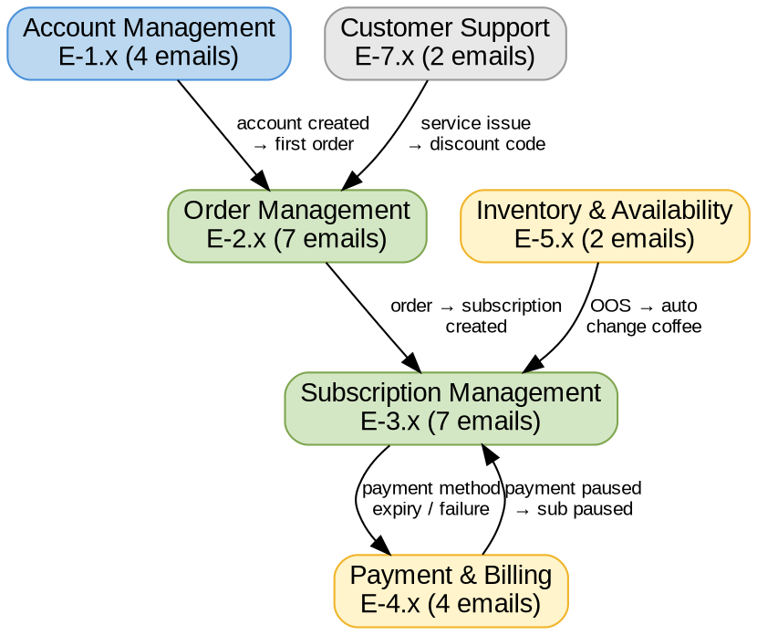

# Emails and Notifications

## Quick Reference

- 28 communications (26 live, 2 future) across 6 categories
- 11 push notifications mirror email IDs for the same business event
- All emails are transactional except E-3.1 (hybrid)

## Communications Framework

### Pattern: E-X.Y / N-X.Y

- **E-X.Y** = Email, where X = category domain, Y = sequence within domain
- **N-X.Y** = Push notification, mirrors E-X.Y when both channels represent the same event
- **Status values:** Live (production), Future Requirement (planned)

### Key Concepts

- **Transactional** = Triggered by user actions or system events (non-marketing)
- **Hybrid** = Contains both transactional and marketing content (E-3.1)
- **User Toggle** = Whether the user can opt out of receiving the notification

## Communication Flow

*Shows category relationships and the business events that trigger cross-category communications. Colors: blue = entry, green = active lifecycle, yellow = billing/inventory alerts, grey = support.*

## Category Summary

| Category | ID Range | Count | Live | Future | Push (N-X.Y) | Purpose |
|----------|----------|-------|------|--------|---------------|---------|
| **Account Management** | E-1.x | 4 | 4 | 0 | 0 | Authentication, verification, opt-in |
| **Order Management** | E-2.x | 7 | 6 | 1 | 4 | Order lifecycle from confirmation to delivery |
| **Subscription Management** | E-3.x | 7 | 6 | 1 | 2 | Subscription lifecycle, reminders, retention |
| **Payment & Billing** | E-4.x | 4 | 4 | 0 | 3 | Payment method management and failure recovery |
| **Inventory & Availability** | E-5.x | 2 | 2 | 0 | 2 | OOS warnings and auto-substitution |
| **Customer Support** | E-7.x | 2 | 2 | 0 | 0 | Service issues and discount codes |

**Note:** E-6.x (Roaster Communications B2B) is reserved for future use.

## Account Management (E-1.x)

| Email ID | Notification ID | Name | Status | Type | Email | Push | Trigger | Customer Action |
|----------|----------------|------|--------|------|-------|------|---------|-----------------|
| E-1.1 | N/A | Account Confirmation Email | Live | Transactional | Yes | No | Customer creates Auth0 account | None |
| E-1.2 | N/A | Password Reset Request | Live | Transactional | Yes | No | Customer clicks "Forgot Password" | Reset password |
| E-1.3 | N/A | Email Verification | Live | Transactional | Yes | No | New user account created | Verify email address |
| E-1.4 | N/A | Newsletter/Marketing Signup Confirmation (Double Opt-In) | Live | Transactional | Yes | No | User submits email via opt-in form | Approve newsletter/marketing signup |

## Order Management (E-2.x)

| Email ID | Notification ID | Name | Status | Type | Email | Push | Trigger | Customer Action |
|----------|----------------|------|--------|------|-------|------|---------|-----------------|
| E-2.1 | N/A | Web Checkout Order Confirmation | Live | Transactional | Yes | No | Customer completes checkout and payment | None |
| E-2.2 | N-2.2 | Subscription Recurring Order Confirmation | Live | Transactional | Yes | Yes | Recurring order successfully created | None |
| E-2.3 | N-2.3 | Subscription Recurring Order Processing Update | Live | Transactional | Yes | Yes | Roaster prints the label | None |
| E-2.4 | N-2.4 | Shipment Notification | Live | Transactional | Yes | Yes | Carrier picks up and scans label | View carrier tracking link |
| E-2.5 | N-2.5 | Delivery Confirmation | Future Requirement | Transactional | Yes | Yes | Carrier tracking status updates to 'Delivered' | None |
| E-2.6 | N/A | Order Cancellation Confirmation (User Initiated) | Live | Transactional | Yes | No | Customer requests cancellation of unshipped order | None |
| E-2.7 | N/A | Order Cancellation Notification (System/Issue) | Live | Transactional | Yes | No | System rule triggers cancellation (fraud, payment issue) | None |

## Subscription Management (E-3.x)

| Email ID | Notification ID | Name | Status | Type | Email | Push | Trigger | Customer Action |
|----------|----------------|------|--------|------|-------|------|---------|-----------------|
| E-3.1 | N/A | Subscription Welcome/Onboarding | Future Requirement | Hybrid | Yes | No | Customer creates and pays for first subscription | Login to My Beanz and manage subscription |
| E-3.2 | N-3.2 | Upcoming Subscription Order Reminder / Manage | Live | Transactional | Yes | Yes | Subscription due for processing within 5 days | Login to My Beanz |
| E-3.3 | N/A | Subscription Pause Confirmation | Live | Transactional | Yes | No | Customer sets subscription to 'Paused' | Manage subscription |
| E-3.4 | N/A | Change Coffee Confirmation | Live | Transactional | Yes | No | Customer modifies subscription details | Manage subscription |
| E-3.5 | N/A | Subscription Cancellation Confirmation | Live | Transactional | Yes | No | Customer completes cancellation process | None |
| E-3.6 | N/A | Cancellation Promotion Applied Confirmation | Live | Transactional | Yes | No | Customer accepts retention offer during cancellation | Manage subscription |
| E-3.7 | N-3.7 | Discount Ending Notification | Live | Transactional | Yes | Yes | 7 days before next recurring order | Manage subscription |

## Payment & Billing (E-4.x)

| Email ID | Notification ID | Name | Status | Type | Email | Push | Trigger | Customer Action |
|----------|----------------|------|--------|------|-------|------|---------|-----------------|
| E-4.1 | N-4.1 | Subscription Payment Method Expiry Reminder | Live | Transactional | Yes | Yes | Payment method expires within X days | Update subscription payment details |
| E-4.2 | N/A | Subscription Payment Method Update Confirmation | Live | Transactional | Yes | No | Customer updates payment method | None |
| E-4.3 | N-4.3 | Recurring Order Payment Failure Notification | Live | Transactional | Yes | Yes | Payment charge attempt fails | Update / check payment details |
| E-4.4 | N-4.4 | Subscription Paused (Payment Issue) | Live | Transactional | Yes | Yes | Payment fails three times, system pauses subscription | Update payment details |

## Inventory & Availability (E-5.x)

| Email ID | Notification ID | Name | Status | Type | Email | Push | Trigger | Customer Action |
|----------|----------------|------|--------|------|-------|------|---------|-----------------|
| E-5.1 | N-5.1 | Out of Stock Notification (Subscription) | Live | Transactional | Yes | Yes | Subscription SKU planned for OOS (sent at 2 weeks, 1 week, 48 hours) | Change coffee |
| E-5.2 | N-5.2 | OOS Subscription Item Automatically Changed Confirmation | Live | Transactional | Yes | Yes | Customer's product went OOS and system auto-changed to alternative | Change to a different product |

## Customer Support (E-7.x)

| Email ID | Notification ID | Name | Status | Type | Email | Push | Trigger | Customer Action |
|----------|----------------|------|--------|------|-------|------|---------|-----------------|
| E-7.1 | N/A | Customer Service Discount Code Email | Live | Transactional | Yes | No | CS agent manually triggers after resolving issue | Use discount code on next order |
| E-7.2 | N/A | Service Update/Delay Notification | Live | Transactional | Yes | No | Manually triggered by admin during service issues | Depends on the service issue |

## Related Files

- [[id-conventions|ID Conventions]] - E-X.Y and N-X.Y prefix conventions for communication IDs

## Open Questions

- [ ] What is the notification type taxonomy? Source lists suggestions (Email, App Push, etc.) but this seems unfinalized.
- [ ] What is the mobile app push notification mapping? Source references a separate Confluence page for push notification locations in the app.
