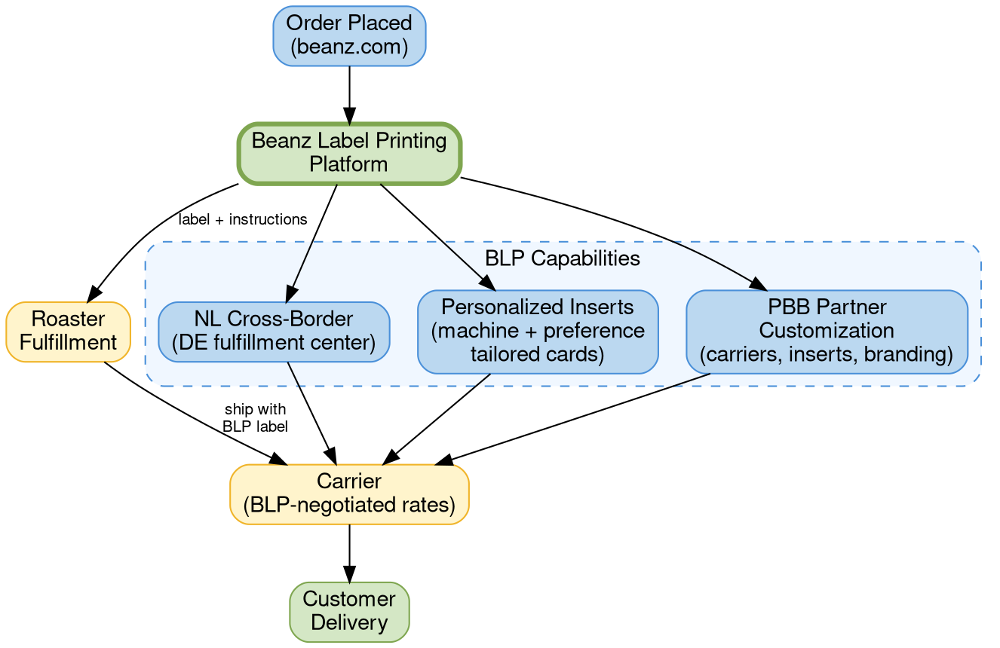

# Beanz Label Printing

## Quick Reference

- In-house fulfillment platform giving beanz.com end-to-end control over shipping infrastructure
- 40%+ of global roaster partners on platform; 100% UK, 50% US
- Enables NL cross-border shipping, personalized unboxing, and PBB partner customization

## Fulfillment Framework

### Key Concepts

- **BLP** = In-house label printing and shipping management platform
- **Cross-border fulfillment** = Shipping between countries using shared carrier infrastructure (DE-NL)
- **Personalized unboxing** = Custom insert cards tailored to customer machine and coffee preferences
- **PBB fulfillment flexibility** = Retailer-specific carrier, insert, and branding customization

## BLP Fulfillment Flow

**Legend:** Green = active platform/endpoint. Blue = process/capability. Yellow = external partner/carrier.

## Capabilities Summary

| Capability | Description | Status | Markets |
|------------|-------------|--------|---------|
| **NL Cross-Border** | Cross-border shipping between DE and NL fulfillment | Launching July 1, 2026 | DE, NL |
| **Personalized Unboxing** | Marketing insert cards for FTBP orders tailored to machine and coffee preferences | In development | Global |
| **PBB Flexibility** | Retailer partner customization of carriers, inserts, and branded marketing materials | Active | US, UK |

## Why BLP Was Built

BLP was built to solve a fundamental constraint: beanz.com needed end-to-end control over its shipping infrastructure to unlock the strategic pillars defined in the FY27 growth strategy. Without controlling label printing and carrier selection, capabilities like cross-border fulfillment, personalized customer experiences, and retail partner customization were not possible.

BLP is infrastructure that supports the "Deliver World-Class Customer Experience" pillar of the FY26 growth strategy.

## Netherlands Launch

BLP enables the Netherlands market launch on July 1, 2026, with cross-border fulfillment between Germany and the Netherlands. The platform provides the flexibility to work with the right carriers, negotiate independent rates, and control the fulfillment model. This cross-border model is only possible because beanz.com controls the shipping infrastructure used for orders in both countries.

## Personalized Unboxing

Because BLP controls what gets printed and what goes in the box, beanz.com can uplift the customer experience beyond standard shipping. Starting in CY2026, marketing insert cards are being added to [[ftbp|Fast-Track Barista Pack]] orders, tailored to the customer's specific machine and coffee preferences. Milestone celebration cards (e.g., a personalized card celebrating a customer's 10th shipment) are also part of this capability.

## Powered by Beanz Flexibility

Retail partners such as Williams-Sonoma and John Lewis have specific fulfillment requirements. BLP gives these partners ultimate fulfillment flexibility: different carriers, custom inserts, and branded marketing materials. This makes the [[beanz-hub|Powered by Beanz]] program scalable across diverse retail partners.

## Rollout Status

| Market | Roaster Coverage | Status |
|--------|-----------------|--------|
| UK | 100% of roasters | Complete |
| US | 50% of roasters | In progress |
| DE | Planned | CY2026 migration |
| AU | Planned | CY2026 migration |
| NL | Planned | Launching July 1, 2026 (cross-border via DE) |

Over 40% of roaster partners globally are on the BLP platform. Migration continues in CY2026 with Germany, Australia, and the remainder of US roasters.

## Operational Context

BLP operates within the broader fulfillment operation that delivered at scale in CY25:

| Metric | CY25 Value | YoY Change |
|--------|-----------|------------|
| Total bags shipped | 1,007,775 | +63% |
| Orders processed | 474,000 | +63% |
| SLA performance | 95.5% | -0.5% |
| Calendar days to ship | 2.56 days | +4% |

Delivery times improved in three of four markets: UK 8% faster (3.97 days), AU 10% faster (5.83 days), DE 16% faster (5.17 days). US was essentially flat (+2%, approximately one hour slower). Only 2% of cancellations cite timing or delivery issues.

## Related Files

- [[beanz-hub|Beanz Hub]] - PBB program architecture that BLP enables with fulfillment flexibility
- [[ftbp|Fast-Track Barista Pack]] - FTBP orders receive personalized unboxing insert cards via BLP
- [[cy25-performance|CY25 Performance]] - Operational metrics (1M bags, 95.5% SLA) for the fulfillment infrastructure BLP supports

## Open Questions

- [ ] **BLOCKER**: What is the planned timeline for migrating the remaining US roasters to BLP in CY2026?
- [ ] **BLOCKER**: What carrier partners has BLP negotiated with for the NL cross-border model?
