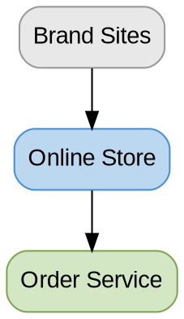
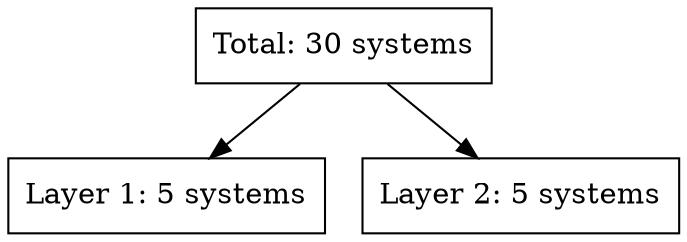
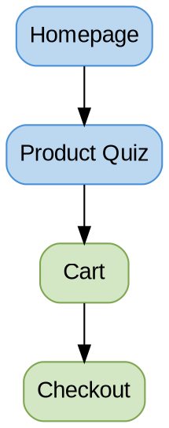
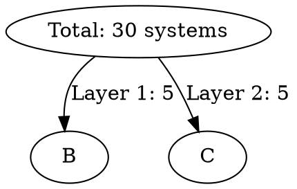

# Documentation Principles for Beanz Knowledge Base

## Table of Contents

- [Purpose of This Guide](#purpose-of-this-guide)
- [Core Philosophy](#core-philosophy)
- [Universal Document Structure](#universal-document-structure)
- [The 8 Anti-Redundancy Rules](#the-8-anti-redundancy-rules)
- [Section-by-Section Guide](#section-by-section-guide)
- [Quality Checklist](#quality-checklist)
- [Common Mistakes to Avoid](#common-mistakes-to-avoid)
- [Success Criteria](#success-criteria)
- [Examples by Content Type](#examples-by-content-type)
- [File Naming and Organization](#file-naming-and-organization)
- [Version Control](#version-control)
- [Final Reminder](#final-reminder)

## Purpose of This Guide

This guide defines standards for creating clear, concise, non-redundant documentation. Success is measured by whether other AI agents and humans can produce compliant documentation by following these principles.

**Target audience:** AI agents, new chat sessions, human contributors creating or updating KB files

**Success metric:** Documentation produced following these principles requires minimal revision

---

## Core Philosophy

> **"Every piece of content must work as hard as possible to earn the right to be on the page."**

### What This Means:

1. **Say everything ONCE, in the RIGHT place** - No repetition across sections
2. **Concepts before data** - Define terms before using them in tables
3. **Purpose over presence** - Every section/table/diagram must add unique value
4. **Visual reinforcement, not duplication** - Diagrams show relationships, not restate lists
5. **Large tables are FINE** - If they communicate efficiently with proper context

### What This Documentation Is:

- ✅ **System of Record** - Authoritative reference for how the system works
- ✅ **Decision Support** - Contextual information to understand relationships and dependencies
- ✅ **AI-Consumable** - Structured for both human and AI consumption

### What This Documentation Is NOT:

- ❌ **Tutorial** - Not step-by-step learning content
- ❌ **Speculation** - Current state only, not future possibilities
- ❌ **Marketing** - Factual descriptions, no superlatives

---

## Universal Document Structure

**ID:** UDS-01

Every document MUST follow this exact structure:

```markdown
---
[YAML front-matter - 9 required fields]
---

# Title

## Quick Reference
[2-4 lines answering "what am I looking at?"]

## [Domain] Framework
### Pattern: [ID Pattern]
[Pattern explanation]

### Key Concepts
[One-sentence definitions only]

## [Visual Diagram]
[DOT diagram showing relationships/flows]

## [Summary Table]
[All items with Purpose columns]

## [Detail Sections]
[Organized logically by topic]

## Related Files
[Wikilinks with one-line purpose]

## Open Questions
[Blockers only - answers would update this file]
```

---

## The 8 Anti-Redundancy Rules

### Rule 1: Framework = Definitions Only

**ID:** AR-01

**Purpose:** Define terms before they appear in data

**Format:** One sentence per concept. No stories, no timelines, no examples.

**Template:**
```markdown
### Key Concepts
- **Term** = Definition in 5-10 words
- **Term** = Definition in 5-10 words
```

**✅ CORRECT:**
```markdown
### Key Concepts
- **Legacy → Modern migration** = Old portal replaced by new platform (in progress)
- **Segments** = Current behavioral state (mutable)
```

**❌ INCORRECT:**
```markdown
### Key Concepts
**Platform Transformation:**
1. Past (3-4 years ago): First portal launched
2. Current: Legacy system still active
3. In Progress: New platform rewrite
4. Future: API-ready modular architecture

[This is a STORY. Stories belong in dedicated H2 sections, not Framework.]
```

---

### Rule 2: One Story Per Section

**ID:** AR-02

**Purpose:** Tell each conceptual story in ONE dedicated H2 section only

**Rule:** If a topic needs more than one sentence, give it its own H2 section. Never repeat the story elsewhere.

**Apply to:**
- Evolution timelines
- Process flows
- Relationship explanations
- Strategic narratives

**✅ CORRECT:**
```markdown
## Platform Evolution

**Timeline:**
- Phase 1: Initial vendor portal
- Phase 2: Separate integration layer added
- Phase 3: Split experience (two systems)
- Phase 4: Unified platform (in progress)

[Full story with context, told ONCE]
```

**❌ INCORRECT:**
```markdown
### Key Concepts
- Platform evolution = Old portal → New system

### Strategic Context
Timeline: Phase 1 → Phase 2 → Phase 3 → Phase 4

## Platform Evolution
[Same timeline repeated AGAIN with full context]

[Story told THREE times - violates Rule 2]
```

---

### Rule 3: No "Strategic Context" Duplicates

**ID:** AR-03

**Purpose:** Avoid creating overview sections that duplicate dedicated sections

**Test:** Does "Strategic Context" just preview what's coming later?
- If YES → Delete it (redundant)
- If NO → Keep it (provides unique framing)

**✅ KEEP (provides unique framing):**
```markdown
### Strategic Context
**User Journey Priority:**
- Entry points: Homepage, Quiz, Promotional pages
- Discovery: Product listing, Detail pages
- Purchase: Cart, Checkout

[This FRAMES how pages are organized. Not repeated elsewhere.]
```

**❌ DELETE (duplicates dedicated section):**
```markdown
### Strategic Context
**Platform Transformation:**
1. Past: First portal
2. Current: Legacy system
3. In Progress: New platform

[This is repeated verbatim in "Platform Evolution" section later]
```

---

### Rule 4: Diagrams Show Relationships, Not Lists

**ID:** AR-04

**Purpose:** Diagrams add value by showing connections, not restating text

**Test:** Does the diagram show something the text doesn't?
- Relationships between entities → ✅ KEEP
- Flow/sequence over time → ✅ KEEP
- Hierarchy/structure → ✅ KEEP
- Just restating a list → ❌ REMOVE

**✅ CORRECT (shows relationships):**

*Shows data flow and system connections*

**❌ INCORRECT (just restates list):**

*This just visualizes counts already in summary table*

---

### Rule 5: Summary ≠ Detail

**ID:** AR-05

**Purpose:** Summary tables provide overview; detail sections provide depth

**Rule:** Information appears in EITHER summary table OR detail section, not both

**✅ CORRECT (different information):**

**Summary Table:**
```markdown
| Domain | Count | Purpose |
|--------|-------|---------|
| Onboarding | 13 | New user acquisition |
```

**Detail Section:**
```markdown
## Onboarding (13 items)

| Item | Status | Priority |
|------|--------|----------|
| Welcome Flow | Live | High |
| Product Tour | Live | Medium |
```

**❌ INCORRECT (repeating information):**

**Summary Table:**
```markdown
| Domain | All Items Listed |
|--------|-----------------|
| Onboarding | Welcome Flow, Product Tour, Setup Wizard, Quick Start... (all 13) |
```

**Detail Section:**
```markdown
[Lists same 13 items again]
```

---

### Rule 6: Related Files = Links Only

**ID:** AR-06

**Purpose:** Wikilinks connect documents; don't summarize linked content

**Format:**
```markdown
## Related Files

- [[filename|Title]] - Why this file is related (one line only)
```

**✅ CORRECT:**
```markdown
- [[user-segments|Segments]] - Segment definitions for targeting
```

**❌ INCORRECT:**
```markdown
- [[user-segments|Segments]] - Contains 16 lifecycle segments with entry/exit criteria, two experience levels, and multi-cohort membership support. Segments are mutable behavioral states.

[This repeats the content - just link to it instead]
```

---

### Rule 7: Open Questions = Blockers Only

**ID:** AR-07

**Purpose:** Document unknowns that BLOCK understanding or decisions

**Test:** If we got the answer, would we update THIS file?
- If YES → Keep question (it's blocking)
- If NO → Remove question (it's nice-to-know)

**✅ KEEP (blockers):**
```markdown
- [ ] What is the relationship between "Order Service" and "Subscription Service"?
```
*Answer would clarify system architecture diagram in THIS file*

**❌ REMOVE (nice-to-know):**
```markdown
- [ ] What are open rates and click rates for each notification?
```
*This is analytics data for a separate performance doc, not system documentation*

---

### Rule 8: Enhancement Opportunities = Separate File

**ID:** AR-08

**Purpose:** System of Record documents CURRENT state, not future possibilities

**Rule:** Move all speculative content to `enhancement-backlog.md`

**In each file, replace Enhancement Opportunities section with:**
```markdown
## Enhancement Backlog

See [[enhancement-backlog|Enhancement Backlog]] for potential improvements to this domain.
```

**Rationale:**
- System of Record = what EXISTS now
- Enhancement Opportunities = what MIGHT exist (different purpose)
- Separating them keeps documentation focused

---

## Section-by-Section Guide

### Quick Reference (Required)

**ID:** QR-01

**Outcome:** Reader grasps "what this is" in ≤10 seconds

**Default Format:** 2-4 bullet points covering:
- Count/scope (what's included)
- Key status or metric
- Primary purpose or usage
- Strategic context (if relevant)

**Measurable Criteria:**
- ≤50 words total
- ≤10 seconds to comprehend
- Self-contained (readable without context)

**Exceptions (use paragraph when):**
- Single cohesive idea expressible in ≤2 sentences
- Relationships require continuous text (because/when/so that/which enables)
- Only one substantive point to communicate

**Decision Rule:**
```
If (independent points ≥ 2) → bullets (2-4 items)
Else if (relationship in one breath) → paragraph (1-2 sentences)
Else → 1 sentence
Always: ≤50 words, ≤10s scannable
```

**Examples:**

✅ **CORRECT (bullets - multiple facts):**
```markdown
## Quick Reference

- 12 notification types across 4 categories
- Triggered by user actions and system events
- Templates managed in central notification service
```
(17 words, ~4s scan)

✅ **CORRECT (paragraph - single idea):**
```markdown
## Quick Reference

A Python module that ingests Parquet files into Polars with automatic schema inference.
```
(14 words, ~3s read)

✅ **CORRECT (paragraph - shows relationship):**
```markdown
## Quick Reference

Payment retry logic that prevents churn by automatically recovering failed transactions before subscription cancellation.
```
(15 words, shows cause-effect)

❌ **INCORRECT (too long, not scannable):**
```markdown
## Quick Reference

The platform uses a dual customer tracking framework: 16 lifecycle segments that change as behavior evolves, and 13 fixed cohorts across 4 categories that track acquisition context. Segments drive personalization; cohorts enable analytics. Available across all 4 markets with a 5th launching next year.
```
(49 words, ~15s - fails criteria)

**Test (must pass all):**
- [ ] Format matches default or uses valid exception
- [ ] ≤50 words total
- [ ] Self-contained (no dangling references)
- [ ] Readable in ≤10 seconds
- [ ] Audience/scope clear

---

### Framework Section (Required)

**Purpose:** Define the organizing principle and key concepts BEFORE showing data

**Structure:**
```markdown
## [Domain] Framework

### Pattern: [ID Pattern]
- Explanation of ID structure
- Ranges or categories
- Status values if applicable

### Key Concepts
- **Term** = Definition (5-10 words)
- **Term** = Definition (5-10 words)
- **Term** = Definition (5-10 words)
```

**ID:** FR-01

**Rules:**
- Define ALL terms that appear in tables/diagrams
- One sentence per concept (no stories)
- No "Strategic Context" subsection if it duplicates later sections (Rule 3)

**Example:**
```markdown
## Notifications Framework

### Pattern: MSG-X.Y
- **MSG-01.x through MSG-06.x** = 6 notification categories
- **Status values:** Live (production), Planned (future)

### Key Concepts
- **Transactional notifications** = Triggered by order/account/security events
- **Promotional notifications** = Marketing and engagement messages
- **Segment targeting** = Which user groups receive which notifications
```

---

### Visual Diagram (Required)

**Purpose:** Show relationships, flows, or hierarchies that text can't efficiently convey

**When to include:**
- System architecture (layers, data flow)
- User journeys (entry → discovery → purchase)
- Process flows (notification sequences, payment recovery)
- State transitions (lifecycle stages)
- Hierarchies (category taxonomy)

**Diagram Type Selection:**

| Use Case | Diagram Type | Example |
|----------|--------------|---------|
| Status transitions | State Diagram | Lifecycle stages |
| Sequential processes | Flowchart | User flows, notification sequences |
| Entity relationships | ER Diagram | Category ↔ Template mapping |
| Hierarchies | Mindmap | Feature taxonomy |
| Timelines | Gantt | Roadmaps, cadences |
| System architecture | Graph TD | Layers, data flow |

**Rules:**
- Use same icons/IDs as tables (visual consistency)
- Show RELATIONSHIPS, not just lists (Rule 4)
- Keep diagrams focused (5-15 nodes ideal)
- Use consistent color schemes (see `graphviz-quick-guide.md`)

**Example:**


---

### Summary Table (Required)

**Purpose:** Show all key items with essential attributes on one screen

**Rules:**
- Include "Purpose" or "Usage" column (Rule 5)
- Icons in first column (visual anchors)
- 4-6 columns ideal (more if necessary)
- No sparse tables - every cell adds value
- Large tables are FINE if they communicate efficiently

**Template:**
```markdown
| Icon/ID | Name | [Attribute] | [Attribute] | Purpose |
|---------|------|-------------|-------------|---------|
| Item 1 | Value | Value | Value | Why this exists |
| Item 2 | Value | Value | Value | Why this exists |
```

**Example:**
```markdown
| Category | ID Range | Count | Live | Planned | Purpose |
|----------|----------|-------|------|---------|---------|
| **Account** | MSG-01.x | 4 | 4 | 0 | Auth, security |
| **Order** | MSG-02.x | 7 | 6 | 1 | Order tracking |
```

---

### Detail Sections (Required)

**Purpose:** Provide depth on each category/domain/component

**Organization:** Logical grouping by category, domain, or user journey (not alphabetical)

**Rules:**
- Each H2 section covers ONE topic fully (Rule 2)
- Include context (Key Systems, Key Insights, Notes)
- Use tables for structured data
- Use prose for narratives and explanations
- Don't repeat information from summary table (Rule 5)
- **Structural consistency:** If subsections use labels, ALL content must be labeled (no unlabeled text)

**Structural Consistency Rule:**

**ID:** SC-01

If your section uses labeled subsections (Attributes:, Behaviour:, Key Systems:, etc.), then ALL content in that section must have labels. Unlabeled text creates ambiguity.

**❌ INCORRECT:**
```markdown
## Category Name

Some unlabeled descriptive text

### Sub-item

**Attributes:**
- Labeled content
```

**✅ CORRECT:**
```markdown
## Category Name

**Description:** Descriptive text

### Sub-item

**Attributes:**
- Labeled content
```

**Common labels for section-level content:**
- **Entry Criteria:** What qualifies for this category
- **Description:** What this category represents
- **Overview:** High-level summary
- **Definition:** Precise meaning
- **Purpose:** Why this category exists

**Decision Rule:**
```
If (subsections use labels: Attributes:, Behavior:, Purpose:, etc.)
  → ALL content at section level MUST be labeled
Else
  → Labels optional
```

**Template:**
```markdown
## [Category] — [Name] (count)

**Purpose:** [One sentence]

**Primary [Users/Groups]:** [Who uses this]

| Item | [Attribute] | [Attribute] | [Attribute] |
|------|-------------|-------------|-------------|
| Item 1 | Value | Value | Value |
| Item 2 | Value | Value | Value |

**Key Systems:** [Technologies/platforms used]

**Key Insights:**
- Important pattern or finding
- Critical relationship or dependency
```

---

### Related Files (Required)

**Purpose:** Link to related documentation with context

**Format:**
```markdown
## Related Files

- [[filename|Title]] - One-line explanation of relationship
- [[filename|Title]] - One-line explanation of relationship
- [[filename|Title]] - One-line explanation of relationship
```

**Rules:**
- Evidence-based related files (may be empty if standalone)
- One line per link (Rule 6)
- Explain WHY files are related, not WHAT they contain
- Use shortened display text in wikilinks

**Example:**
```markdown
## Related Files

- [[user-segments|Segments]] - Segment definitions for notification targeting
- [[user-flows|User Flows]] - Notification triggers in user journeys
- [[feature-list|Features]] - Features triggering notifications
```

---

### Open Questions (Required)

**Purpose:** Document blocking unknowns where answers would update THIS file

**Rules:**
- Include ONLY questions where answers would change documentation (Rule 7)
- Checkbox format for tracking
- Group by category if helpful
- Keep list short (3-5 blockers typical)

**Example:**
```markdown
## Open Questions

- [ ] What is the relationship between the "Order Service" and the "Subscription Service"?
- [ ] Are product images managed in the CMS or a separate asset service?
- [ ] What is the data pipeline between the analytics warehouse and the reporting tool?
```

---

## Quality Checklist

Before finalizing any KB file, verify:

### Structure
- [ ] YAML front-matter complete (9 fields)
- [ ] Quick Reference (2-4 lines)
- [ ] Framework section with Pattern + Key Concepts
- [ ] Visual diagram (DOT)
- [ ] Summary table with Purpose columns
- [ ] Detail sections organized logically
- [ ] Related Files (evidence-based wikilinks, may be empty)
- [ ] Open Questions (blockers only)

### Anti-Redundancy (The 8 Rules)
- [ ] **Rule 1:** Framework = definitions only (one sentence per concept)
- [ ] **Rule 2:** Each story told ONCE (no topic in multiple H2 sections)
- [ ] **Rule 3:** No "Strategic Context" duplicating later sections
- [ ] **Rule 4:** Diagrams show relationships, not restate lists
- [ ] **Rule 5:** Different info in summary tables vs detail sections
- [ ] **Rule 6:** Related Files = links + one-line purpose only
- [ ] **Rule 7:** Open Questions = blockers only
- [ ] **Rule 8:** Enhancement Opportunities moved to separate backlog file

### Content Quality
- [ ] Every line adds unique value
- [ ] No redundancy within file
- [ ] No redundancy with linked files (use wikilinks instead)
- [ ] Tables include Purpose/Usage columns
- [ ] Diagrams use same icons/IDs as tables
- [ ] All cross-references converted to wikilinks
- [ ] Status/priority clearly indicated

---

## Common Mistakes to Avoid

### ❌ Mistake 1: Repeating Stories in Multiple Sections

**Problem:**
```markdown
### Key Concepts
- Payment failure = 3 retry attempts before pause

## Payment Notifications
[Describes 3 retry attempts]

## Churn Prevention
[Mentions 3 retry attempts again]
```

**Solution:** Tell story ONCE in Payment Notifications section. Reference it elsewhere with wikilink.

---

### ❌ Mistake 2: "Strategic Context" That Duplicates

**Problem:**
```markdown
### Strategic Context
Timeline: Phase 1 → Phase 2 → Phase 3

## Evolution Section
[Same timeline repeated with full details]
```

**Solution:** Delete Strategic Context subsection. Keep full story in Evolution section only.

---

### ❌ Mistake 3: Diagrams That Just Visualize Lists

**Problem:**

*This just shows counts already in summary table*

**Solution:** Show relationships/data flow instead, or remove diagram.

---

### ❌ Mistake 4: Summary Table Repeating Detail

**Problem:**

**Summary:**
```markdown
| Domain | All Items |
|--------|-----------|
| Onboarding | Welcome, Tour, Setup, Quick Start, Guide, Tips... (all 13) |
```

**Detail:**
```markdown
## Onboarding
[Lists same 13 items again]
```

**Solution:** Summary shows COUNT and PURPOSE. Detail shows individual items.

---

### ❌ Mistake 5: Related Files That Summarize Content

**Problem:**
```markdown
- [[user-segments|Segments]] - Contains 16 segments across 8 lifecycle stages with two experience variants. Segments are mutable, cohorts are fixed...
```

**Solution:**
```markdown
- [[user-segments|Segments]] - Segment definitions for targeting
```

---

## Success Criteria

Documentation following these principles should:

1. **Be scannable** - Quick Reference + Summary Table = <1 minute to understand
2. **Be complete** - All necessary context for decisions included
3. **Be non-redundant** - Every piece of information appears exactly once
4. **Be AI-friendly** - Consistent structure, semantic markers, explicit relationships
5. **Be maintainable** - Changes update ONE section only

**Measurement:** A reader (human or AI) can:
- Understand what's in the file in 10 seconds (Quick Reference)
- Find specific information in <30 seconds (Summary Table)
- Understand relationships and context in <3 minutes (Diagrams + Detail)
- Make informed decisions without needing other files

---

## Examples by Content Type

### Catalog/Inventory (Features, Pages)
- Large tables with many rows = GOOD
- Purpose columns essential
- Group by domain/category
- Summary table shows counts + purpose
- Detail tables show individual items

### Process Flows (Emails, Workflows)
- Flowchart or timeline diagrams critical
- Show temporal sequence
- Highlight critical transitions
- Include trigger conditions

### Technical Architecture (Systems, Integrations)
- Architecture diagram essential
- Show layers and data flow
- Highlight evolution/migration paths
- Include technology stack

### Reference Data (Segments, Cohorts)
- State diagram for transitions
- Summary table with all items
- Individual detail pages if needed
- Clear hierarchy and relationships

---

## File Naming and Organization

### File Naming
- Format: `topic-name.md`
- Topic name: lowercase-hyphenated
- Descriptive and clear
- No prefixes or numbering

### Folder Structure
```
docs/
├── strategy/
├── users/
├── features/
├── communications/
├── architecture/
└── working/
    └── enhancement-backlog.md
```

---

## Version Control

### When Documentation Changes
1. Update the ONE section where information lives (not multiple)
2. Verify wikilinks still resolve
3. Update "Related Files" if relationships change
4. Run validation scripts

### What NOT to Update
- Don't update related files that link TO this file
- Don't update Enhancement Opportunities (in separate backlog)
- Don't update Open Questions once answered (remove question)

---

## Final Reminder

> **Every piece of content must work as hard as possible to earn the right to be on the page.**

If you can't explain why a sentence/table/diagram is necessary and unique, remove it.

**Test:** Can this information be found elsewhere?
- If YES → Use wikilink (don't duplicate)
- If NO → Keep it (but make it purposeful)

---

## Questions About These Principles?

If these principles don't cover your use case:
1. Refer to `CLAUDE.md` for project-specific guidance
2. Check existing KB files for reference implementations
3. Consult with the project team for clarification

**Remember:** These principles prioritize clarity and efficiency over completeness. When in doubt, say less and say it better.
