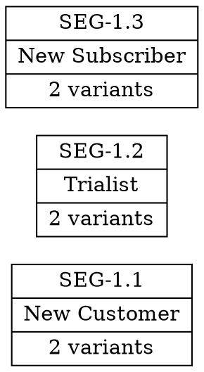
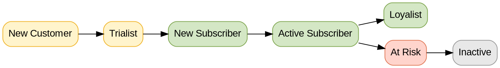

# Common Mistakes Gallery

## Table of Contents

- [H1 Heading Errors](#1-h1-heading-errors)
- [Wikilink Format Errors](#2-wikilink-format-errors)
- [YAML Aliases Errors](#3-yaml-aliases-errors)
- [YAML Related Field Errors](#4-yaml-related-field-errors)
- [Description Field Errors](#5-description-field-errors)
- [Type Field Errors](#6-type-field-errors)
- [Status Field Errors](#7-status-field-errors)
- [Related Files Section Errors](#8-related-files-section-errors)
- [Open Questions Errors](#9-open-questions-errors)
- [Framework Section Errors](#10-framework-section-errors)
- [Quick Reference Errors](#11-quick-reference-errors)
- [Diagram Errors](#12-diagram-errors)
- [Meeting Report Naming Errors](#13-meeting-report-naming-errors)
- [Meeting Report Structure Errors](#14-meeting-report-structure-errors)
- [Adding New Patterns](#adding-new-patterns)

## Purpose

This reference documents frequently encountered errors when creating KB files, with correct/incorrect examples for quick reference.

---

## 1. H1 Heading Errors

### ❌ WRONG: Including ID prefix

```markdown
# DOC-01.1 — Strategy and Vision
```

**Problem**: DOC-XX.Y format removed from beanz-knowledge-base structure (still used in requirements-discovery project)

### ❌ WRONG: Missing space after #

```markdown
#Strategy and Vision
```

**Problem**: Markdown requires space after # for valid heading syntax

### ✅ CORRECT

```markdown
# Strategy and Vision
```

**Format**: `# Title` (plain title matching YAML title field)

---

## 2. Wikilink Format Errors

### ❌ WRONG: Includes folder path

```markdown
See [[users/user-segments|B2C Users]] for details.
```

**Problem**: Folder paths break when files move; Obsidian resolves by filename only

### ❌ WRONG: Extra space (typo)

```markdown
See [[user-segments a|B2C Users]] for details.
```

**Problem**: Typo "a" makes wikilink target invalid, won't resolve

### ❌ WRONG: Missing display text

```markdown
See [[user-segments]] for details.
```

**Problem**: Less readable, shows full filename instead of friendly name

### ✅ CORRECT

```markdown
See [[user-segments|B2C Users]] for details.
```

**Format**: `[[filename|Display Text]]` - filename only, no paths, with display text

---

## 3. YAML Aliases Errors

### ❌ WRONG: Including DOC-XX.Y ID prefix

```yaml
aliases: [DOC-03.1, B2C-Users, Segments, Cohorts]
```

**Problem**: DOC-XX.Y IDs removed from new beanz-knowledge-base structure

### ❌ WRONG: Only 1 item (need 2-4)

```yaml
aliases: [B2C-Users]
```

**Problem**: Only 1 alias — not enough for search discoverability (need 2-4)

### ❌ WRONG: Too many items (>4)

```yaml
aliases: [B2C-Users, Segments, Cohorts, Customers, Users, People, Subscribers]
```

**Problem**: Maintenance burden, dilutes focus, harder to ensure uniqueness

### ✅ CORRECT

```yaml
aliases: [B2C-Users, Segments, Cohorts]
```

**Format**: 2-4 natural search terms recommended (no ID prefixes)

---

## 4. YAML Related Field Errors

### ❌ WRONG: Missing quotes around wikilinks

```yaml
related:
  - [[b2b-roasters|B2B Roasters]]
  - [[exit-survey|Exit Survey]]
```

**Problem**: Invalid YAML syntax - wikilinks with brackets must be quoted

### ❌ WRONG: Empty related field when source has connections

```yaml
related:
```

**Problem**: Source mentions other domains (communications, analytics) but no related links added

### ❌ WRONG: Links without evidence

```yaml
related:
  - "[[users/_index|Users Index]]"
  - "[[strategy/_index|Strategy Index]]"
  - "[[architecture/_index|Architecture]]"
  - "[[features/_index|Features]]"
  - "[[analytics/_index|Analytics]]"
```

**Problem**: No source evidence for these links — folder-structure linking

### ✅ CORRECT

```yaml
related:
  - "[[b2b-roasters|B2B Roasters]]"
  - "[[exit-survey|Exit Survey]]"
  - "[[current-features|Current Features]]"
```

**Format**: Double quotes around each wikilink, evidence-based related links (may be empty if standalone)

---

## 5. Description Field Errors

### ❌ WRONG: Multiple sentences

```yaml
description: This file documents B2C user segments and cohorts. It includes 16 lifecycle segments. Cohorts are fixed groupings.
```

**Problem**: Too verbose, not scannable, defeats purpose of quick description

### ❌ WRONG: Missing period

```yaml
description: Customer lifecycle segments and fixed cohort groupings for analytics
```

**Problem**: Inconsistent punctuation across files

### ❌ WRONG: Too long (>200 characters)

```yaml
description: Comprehensive documentation of all customer lifecycle segments including behavioral states and fixed cohort groupings used for analytics tracking and performance measurement across multiple dimensions.
```

**Problem**: Not scannable, too much detail for description field

### ✅ CORRECT

```yaml
description: Customer lifecycle segments (mutable) and fixed cohort groupings for analytics tracking.
```

**Format**: One sentence ending with period, ≤200 characters, clear and concise

---

## 6. Type Field Errors

### ❌ WRONG: Invalid type value

```yaml
type: documentation
```

**Problem**: Not one of the allowed values (strategy, market, user, feature, architecture, reference)

### ❌ WRONG: Multiple types

```yaml
type: [strategy, reference]
```

**Problem**: Type field must be single value, not array

### ✅ CORRECT

```yaml
type: strategy
```

**Valid values**: strategy | market | user | feature | architecture | reference | analytics | finance | legal | marketing | operations | platform | support

---

## 7. Status Field Errors

### ❌ WRONG: Invalid status value

```yaml
status: completed
```

**Problem**: Should be "complete" not "completed"

### ❌ WRONG: Missing status

```yaml
title: Strategy and Vision
description: Overview of beanz.com strategy.
type: strategy
```

**Problem**: Status is required field (must be draft, in-progress, complete, or superseded)

### ✅ CORRECT

```yaml
status: draft
```

**Valid values**: draft | in-progress | complete | superseded

---

## 8. Related Files Section Errors

### ❌ WRONG: Summarizing linked content

```markdown
## Related Files

- [[user-segments|B2C Users]] - This file documents all 16 customer segments organized into 8 lifecycle stages with 2 experience levels. It includes definitions, entry/exit criteria, and key transitions between segments.
```

**Problem**: Violates AR-06 (Related Files = Links Only), duplicates content from target file

### ❌ WRONG: Generic descriptions

```markdown
## Related Files

- [[user-segments|User Segments]] - Related to user segments
- [[exit-survey|Exit Survey]] - Related document
- [[features|Features]] - See also
```

**Problem**: Descriptions don't explain WHY files are related or HOW to use them

### ✅ CORRECT

```markdown
## Related Files

- [[user-segments|User Segments]] - Segment definitions for feature targeting and personalization
- [[exit-survey|Exit Survey]] - Churn analysis context for at-risk segment behavior
- [[features|Features]] - Feature-to-segment mapping for prioritization
```

**Format**: One line per link explaining relationship/purpose, not summarizing content

---

## 9. Open Questions Errors

### ❌ WRONG: Nice-to-know analytics questions

```markdown
## Open Questions

- [ ] What is the average CLV for at-risk customers?
- [ ] How many users clicked the CTA in the welcome email?
- [ ] What is conversion rate from trial to subscriber in the DE market?
```

**Problem**: Violates AR-07 (Questions = Blockers Only) - these are analytics queries, not blockers

### ❌ WRONG: Questions for different files

```markdown
## Open Questions

- [ ] What partners are available in the NL market? (Belongs in partner inventory file)
- [ ] What is the trial program discount structure? (Belongs in trial program file)
```

**Problem**: Questions don't belong in THIS file - answers would update different files

### ✅ CORRECT

```markdown
## Open Questions

- [ ] **BLOCKER**: What is the definition boundary between "At Risk" and "Inactive"? Answer needed to update entry/exit criteria in this file.
- [ ] **BLOCKER**: Does the trial segment include users who abandoned signup, or only those who completed signup but never converted? Answer affects segment definition.
```

**Format**: Only questions where answers would update THIS file, prefixed with **BLOCKER** for clarity

---

## 10. Framework Section Errors

### ❌ WRONG: Stories and examples in Framework

```markdown
### Key Concepts

- **Platform Strategy** = The company launched a white-label subscription platform in Q2 2024 for retail partners. Initial pilot with 3 partners showed 40% adoption rate. Full rollout planned for 2025 targeting 20+ partners across multiple markets.
```

**Problem**: Violates AR-01 (Framework = Definitions Only) - contains timeline, metrics, examples

### ❌ WRONG: Multi-sentence definitions

```markdown
### Key Concepts

- **Legacy → Modern migration** = The legacy portal was built in 2021 on an older platform. We're now rebuilding it using a modern stack. This will provide better performance and modern UX.
```

**Problem**: Framework definitions must be one sentence (5-10 words), not explanatory paragraphs

### ✅ CORRECT

```markdown
### Key Concepts

- **Platform Strategy** = White-label subscription service for retail partners
- **Legacy → Modern migration** = Old portal replaced by new platform (in progress)
- **Partner Program** = Retail partnership integration layer
```

**Format**: One sentence per concept, 5-10 words, definitions only (no stories, timelines, or examples)

---

## 11. Quick Reference Errors

### ❌ WRONG: Too long (>50 words)

```markdown
## Quick Reference

This document provides a comprehensive overview of the customer segmentation framework including all lifecycle segments organized into multiple stages with experience levels, plus fixed cohorts across several categories used for analytics tracking and performance measurement.
```

**Problem**: Violates QR-01 (≤50 words, ≤10s scannable) - too many words, not scannable

### ❌ WRONG: Wrong format for content

```markdown
## Quick Reference

- Segments: 16 total
- Cohorts: 13 total
- Experience levels: 2
```

**Problem**: Violates QR-01 format justification - bullets used for single composite idea (should be paragraph)

### ✅ CORRECT

```markdown
## Quick Reference

- 9 cohorts: 7 lifecycle stages + 2 experience levels
- Each cohort defined by attributes, behaviour, needs, and focus
- Lifecycle tracks subscription journey; experience tracks coffee knowledge
```

**Format**: ≤50 words, ≤10s scannable, paragraph for single idea (or bullets for ≥2 independent facts)

---

## 12. Diagram Errors

### ❌ WRONG: Diagram restates table data

````markdown
## Customer Segments Summary

| ID | Stage | Count |
|----|-------|-------|
| SEG-1.1 | New Customer | 2 variants |
| SEG-1.2 | Trialist | 2 variants |
| SEG-1.3 | New Subscriber | 2 variants |

## Visual Overview


````

**Problem**: Violates AR-04 (Diagrams Show Relationships) - just restates table data as records

### ❌ WRONG: Using the wrong diagram tool for the type

````markdown

````

**Problem**: Architecture diagrams with layers, clusters, and rank constraints need DOT (Graphviz), not Mermaid. Use the type-based boundary: **DOT** for architecture, state machines (>15 states), ERDs (>5 tables), agent workflows, complex flowcharts. **Mermaid** for sequence diagrams, timelines, Gantt charts, journey maps, simple flowcharts, state machines (≤15 states), ERDs (≤5 tables).

### ✅ CORRECT (DOT for architecture)

````markdown
## Customer Lifecycle Flow


````

**Format**: DOT diagram shows relationships, flows, transitions — not just counts or lists. Uses Beanz color palette.

---

## 13. Meeting Report Naming Errors

### ❌ WRONG: Naming meeting after projects not mentioned in transcript

**Scenario:** Meeting discusses NL launch sprint planning. Another meeting in the same folder is named `project-feral-standup-2026-02-11.md`. Agent names the new meeting `2026-02-06-project-feral-sprint-planning.md`.

**Problem:** Project Feral is never mentioned in the transcript. Naming is based on coincidence (same folder) not evidence.

### ✅ CORRECT: Evidence-based naming

Check the transcript:
- Participants say "Mocha team sprint planning for NL launch"
- No mention of "Project Feral"
- → Name it `2026-02-06-mocha-nl-sprint-planning.md`

**Rule:** Only attribute a meeting to a project/initiative if that project name is **explicitly stated in the transcript**. Infer names from what participants actually say (team name, topic, meeting type), not from other files in the same folder.

---

## 14. Meeting Report Structure Errors

### ❌ WRONG: Meeting report using UDS structure

```markdown
---
type: meeting
---

# Meeting Title

## Quick Reference
Brief summary...

## Meeting Framework
Definitions of meeting concepts...

## Diagram
```dot
...
```

## Summary Table
...
```

**Problem**: Meeting reports (` type: meeting`) should use meeting-report-template structure, NOT UDS-01. Meetings have their own specialized format.

### ✅ CORRECT

```markdown
---
type: meeting
temporal-type: static
data-period: "2026-02"
---

# Meeting Title

## Meeting Metadata
| Field | Value |
...

## Executive Summary
TL;DR, Overview, Key Takeaways

## Action Items
Table with owner, deadline, priority, confidence

## Decisions
Per-decision tables

## Argument Maps
Claim + supports/attacks

## Sentiment Analysis
Overall, per-speaker, aspect-based

## Social Dynamics
Role, influence, politeness, participation

## Statistics
Summary counts

## Related Files
Wikilinks to KB docs discussed
```

**Format**: Meeting reports use meeting-specific template (NOT UDS), exempt from Quick Reference/Framework/DOT diagram requirements. See `templates/meeting-report-template.md`.

---

## Adding New Patterns

When `kb-review` surfaces a **Candidate Rule** and the user approves it, add the new pattern here following this protocol:

1. **Assign next number** — continue the sequence (e.g., if last is #12, new is #13)
2. **Add ToC entry** — add link to the Table of Contents at the top
3. **Write section** with this structure:
   - `## N. {Pattern Name}`
   - `### ❌ WRONG: {brief description}` with code block example
   - `**Problem**: {one-line explanation}`
   - `### ✅ CORRECT` with code block example
   - `**Format**: {one-line summary of correct approach}`
4. **Add separator** (`---`) between sections
5. **Verify** — ensure the new pattern doesn't duplicate an existing one

**Example candidate from kb-review:**
> Candidate Rule: "Related Files verbosity" — 4 files have Related Files entries >100 chars, summarizing linked content instead of stating purpose.

This maps to existing pattern #8 (Related Files Section Errors). If it were genuinely new, it would become #13.

---

## For More Information

**8 Anti-Redundancy Rules**: See `DOCUMENTATION-PRINCIPLES.md` for complete guidance with detailed examples

**AI Self-Validation Checklist**: See `validation-workflows.md` for complete validation process

**YAML Standards**: See `obsidian-standards.md` for YAML field requirements
