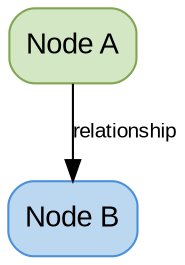
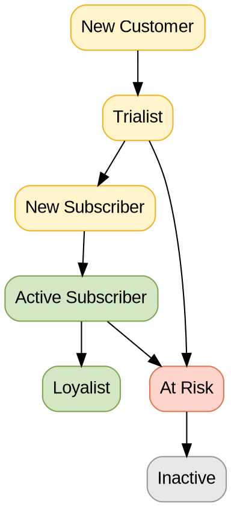
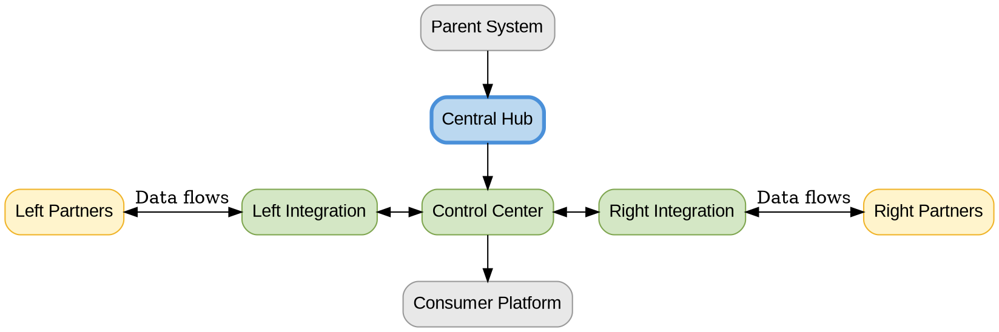
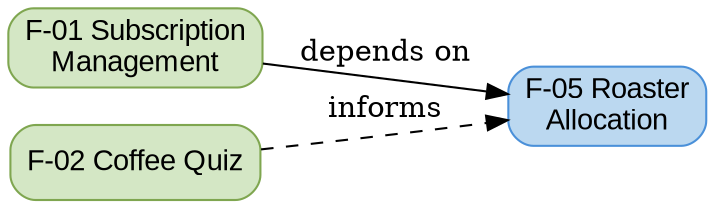

# Graphviz/DOT Diagrams for Beanz KB

## Table of Contents

- [Purpose](#purpose)
- [Quick Start](#quick-start)
- [Basic Syntax](#basic-syntax)
- [Beanz Color Palette](#beanz-color-palette)
- [Common KB Patterns](#common-kb-patterns)
- [Layout Control](#layout-control)
- [Anti-Patterns](#anti-patterns)
- [Checklist](#checklist)

## Purpose

Quick reference for creating Graphviz/DOT diagrams in beanz KB files. DOT is the standard diagram format for this KB — it's declarative (describe structure, engine handles layout), which makes it ideal for AI-generated architecture and relationship diagrams.

**Obsidian rendering:** Requires the [Obsidian Graphviz plugin](https://github.com/QAMichaelPeng/obsidian-graphviz). Use ` ```dot ` code blocks.

---

## Quick Start

### Basic Template

````markdown

````

### Common Diagram Types for KB Files

| Use Case | DOT Pattern | Key Feature |
|----------|-------------|-------------|
| Customer lifecycle flows | `digraph` with ranked nodes | Edge labels for transitions |
| System architecture | `digraph` with subgraphs + `rank=same` | Symmetric layouts |
| Feature dependencies | `digraph` with edge styles | Solid vs dotted edges |
| Process flows | `digraph` with shapes | Diamond for decisions |
| Hierarchies | `digraph` with clusters | Grouped subgraphs |

---

## Basic Syntax

### Nodes

```dot
// Simple node
A [label="My Node"];

// Styled node
A [label="My Node", fillcolor="#D4E7C5", color="#7FA650", style="rounded,filled"];

// Multi-line label
A [label="Title\nSubtitle\nDetail"];

// Node shapes
A [shape=box];       // Rectangle (default for KB)
B [shape=diamond];   // Decision point
C [shape=ellipse];   // Start/end
D [shape=plaintext]; // Text only
```

### Edges

```dot
A -> B;                          // Simple directed edge
A -> B [label="description"];    // Labeled edge
A -> B [dir=both];               // Bidirectional
A -> B [style=dashed];           // Dashed line
A -> B [style=dotted];           // Dotted line (risk/churn paths)
```

### Subgraphs (Grouping)

```dot
subgraph cluster_name {
    label="Group Label";
    style="rounded";
    color="#4A90D9";
    A; B; C;
}
```

### Rank Constraints (Horizontal Alignment)

```dot
{rank=same; A; B; C;}  // Force nodes to same horizontal level
```

---

## Beanz Color Palette (ColorBrewer Set3-12)

[ColorBrewer Set3-12](https://colorbrewer2.org/#type=qualitative&scheme=Set3&n=12) — academically validated, colorblind-safe. DOT supports native indexing via `colorscheme=set312`.

### Node Colors (12 indexed + 3 custom)

| Slot | Semantic | DOT Fill | Hex | Border |
|------|----------|----------|-----|--------|
| 1 | Customer 360 / Teal | `fillcolor=1` | `#8DD3C7` | `#4A9E92` |
| 2 | Decisions / Warnings | `fillcolor=2` | `#FFFFB3` | `#D4C640` |
| 3 | AI / Audit | `fillcolor=3` | `#BEBADA` | `#7D78A8` |
| 4 | Errors / Risk | `fillcolor=4` | `#FB8072` | `#D44535` |
| 5 | Process / Core | `fillcolor=5` | `#80B1D3` | `#4A7FA0` |
| 6 | Pipeline / ETL | `fillcolor=6` | `#FDB462` | `#D88A2A` |
| 7 | Cross-platform | `fillcolor=7` | `#B3DE69` | `#7AAA30` |
| 8 | LLM Enrichment | `fillcolor=8` | `#FCCDE5` | `#D48AAF` |
| 9 | External / Entry | `fillcolor=9` | `#D9D9D9` | `#999999` |
| 10 | Reserve (Premium) | `fillcolor=10` | `#BC80BD` | `#8A4F8A` |
| 11 | Success / Active | `fillcolor=11` | `#CCEBC5` | `#7FA650` |
| 12 | Bright Attention | `fillcolor=12` | `#FFED6F` | `#D4B830` |
| C1 | FAIL-FAST | `"#FFCCCC"` | `#FFCCCC` | `#C0392B` |
| C2 | Critical Failure | `"#E04545"` | `#E04545` | `#C0392B` |
| C3 | Orchestrator | `"#D4701E"` | `#D4701E` | `#B35A1A` |

C2/C3 require `fontcolor=white`. All others use black text (default).

### Cluster Backgrounds (Set3-derived, 92-95% lightness)

| Purpose | Hex | Source |
|---------|-----|--------|
| Skills / Workflows | `#D9EEF5` | Set3-5 |
| References / Success | `#E8F5E3` | Set3-11 |
| Validation | `#FEF0D8` | Set3-6 |
| Errors / Gates | `#FDD9D5` | Set3-4 |
| Audit / AI | `#E5E4F0` | Set3-3 |
| External / Config | `#ECECEC` | Set3-9 |
| Warnings | `#FFFDE0` | Set3-2 |
| Cross-repo | `#D1EDE7` | Set3-1 |

### DOT Color Syntax

```dot
// Set colorscheme in node defaults (REQUIRED for indexed fills)
node [style="rounded,filled", colorscheme=set312, fillcolor=5, color="#4A7FA0"];

// Override per node
A [fillcolor=11, color="#7FA650"];   // Success green
B [fillcolor=4, color="#D44535"];    // Error salmon

// Custom colors use quoted hex (not indexed)
C [fillcolor="#E04545", color="#C0392B", fontcolor=white];

// Cluster backgrounds always use hex
subgraph cluster_name {
    fillcolor="#D9EEF5";
}
```

---

## Common KB Patterns

### 1. Lifecycle Flow (Top-Down)



### 2. Symmetric Architecture (Left-Center-Right)



### 3. Feature Dependency Graph



---

## Layout Control

### Force Horizontal Alignment

```dot
// Place nodes on the same rank (horizontal level)
{rank=same; A; B; C;}
```

### Control Edge Weight (Layout Priority)

```dot
// Higher weight = shorter, more vertical edge (layout engine prioritizes it)
A -> B [weight=10];  // Strong pull — keeps A directly above B
C -> D [weight=1];   // Weak pull — flexible positioning
```

### Invisible Edges (Layout Helpers)

```dot
// Force ordering without visible connection
A -> B [style=invis];
```

### Subgraph Clusters (Visual Grouping)

```dot
subgraph cluster_platform {
    label="Platform Layer";
    style="rounded,dashed";
    color="#4A90D9";
    bgcolor="#F0F7FF";
    ServiceA; ServiceB; ServiceC;
}
```

---

## Anti-Patterns

**Avoid these in KB diagrams:**

- **Too many nodes (>20):** Split into multiple diagrams or create a simplified overview
- **Missing legend:** Always explain colors and edge styles in markdown below the diagram
- **Diagram restates table data:** Diagrams show relationships/flows the tables don't (AR-04)
- **Invented content in labels:** Node labels must reflect source content (Source Fidelity)
- **No color coding:** Use Beanz palette consistently — don't leave all nodes default gray
- **Horizontal layout for deep hierarchies:** Use `rankdir=TD` for lifecycle/hierarchy flows

---

## Checklist

Before adding a DOT diagram to a KB file:

- [ ] Diagram illustrates relationships/flows the tables don't (AR-04)
- [ ] Beanz color palette applied consistently
- [ ] Legend included below diagram (colors + edge styles explained)
- [ ] Node labels reflect source content (no invented terms)
- [ ] `rankdir` appropriate for content (TD for hierarchies, LR for processes)
- [ ] Not too many nodes (≤20 per diagram)
- [ ] Uses ` ```dot ` code block (not ` ```mermaid `)

---

**See also:**
- `creating-graphviz-diagrams` skill — Full pattern library (45 patterns), engine selection, advanced techniques, renderer compatibility
- `creating-mermaid-diagrams` skill — For Mermaid diagrams (sequences, timelines, Gantt, journeys, simple flows)
- `references/DOCUMENTATION-PRINCIPLES.md` — 8 Anti-Redundancy Rules
- `references/obsidian-standards.md` — YAML, wikilinks, file structure
