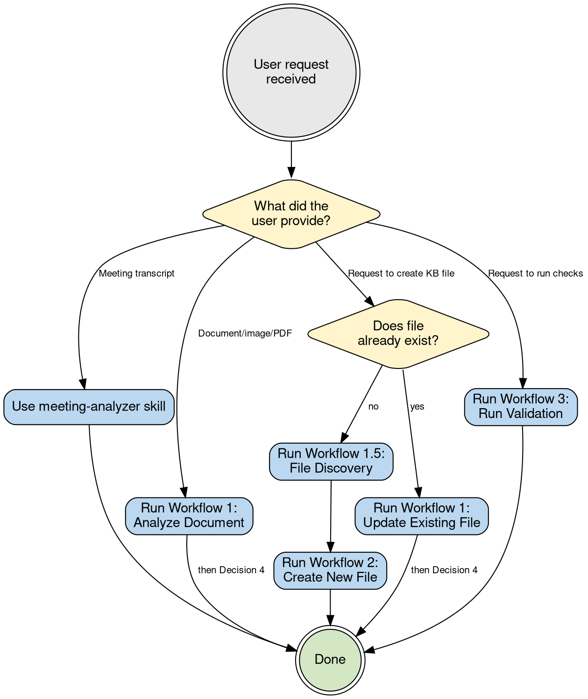
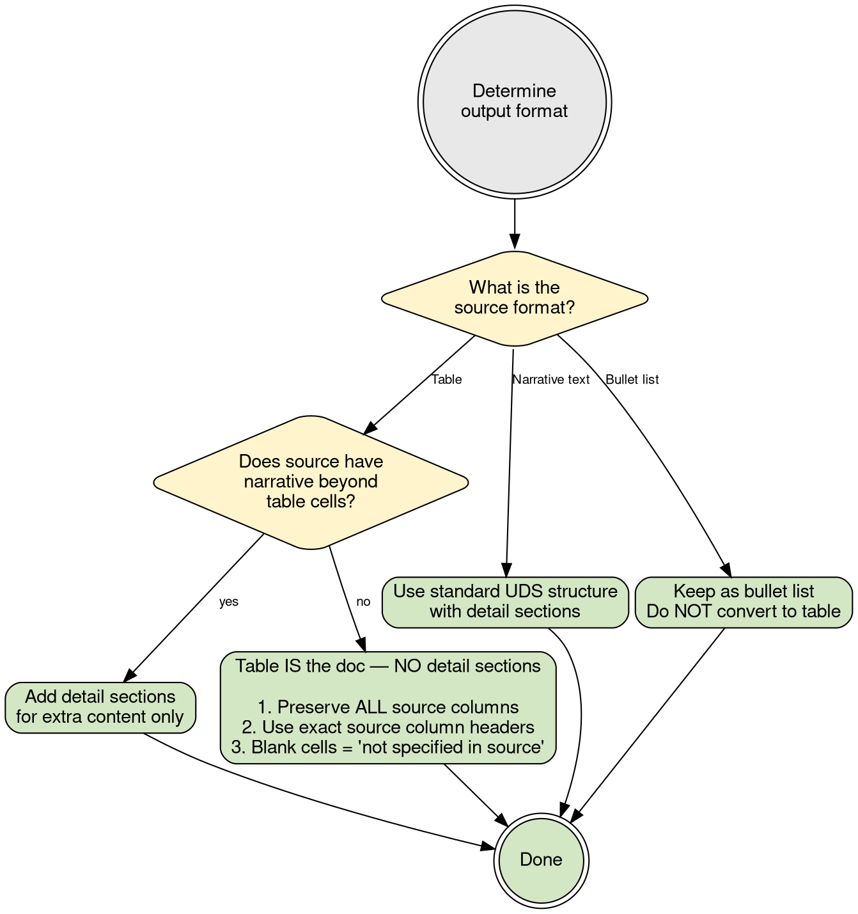
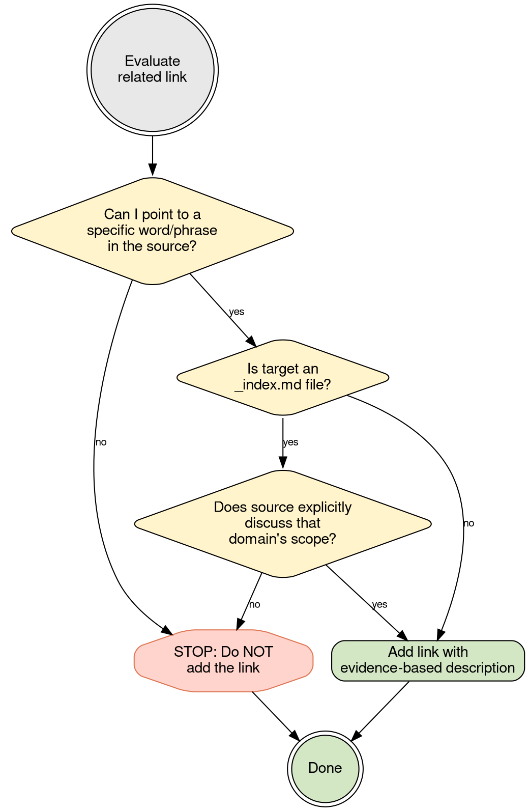
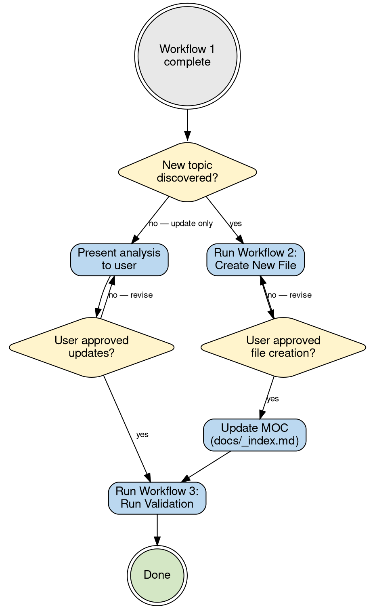
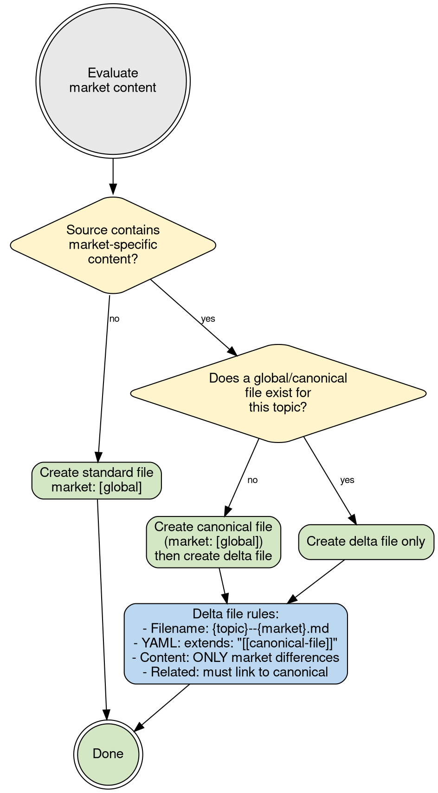
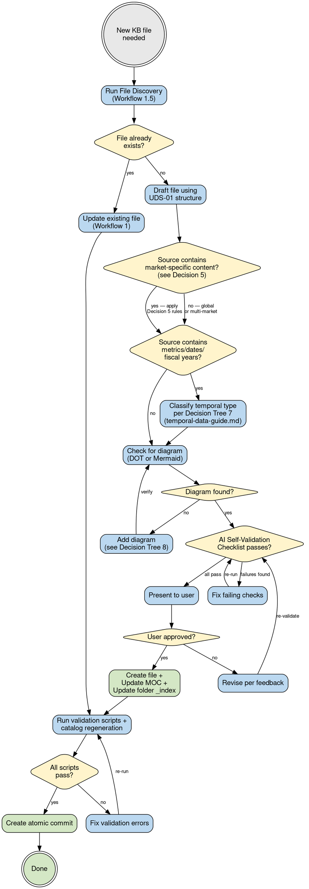
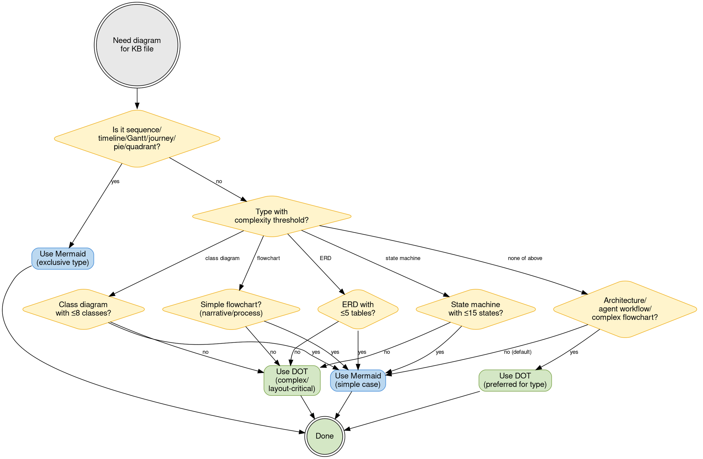
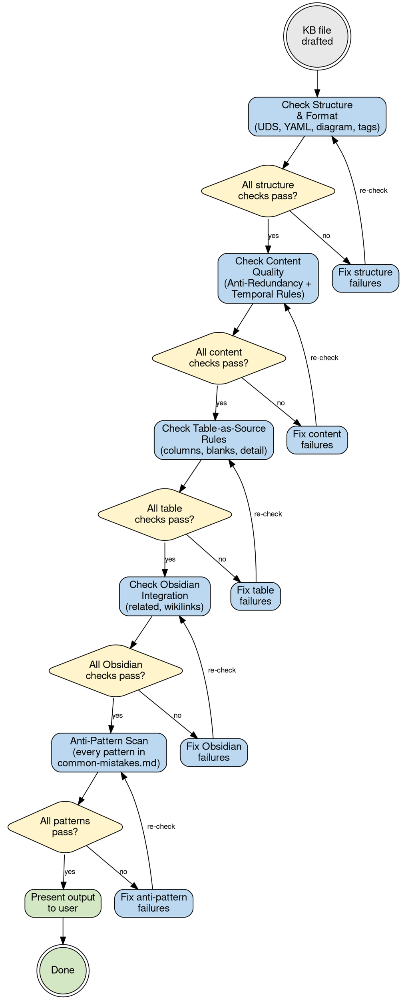
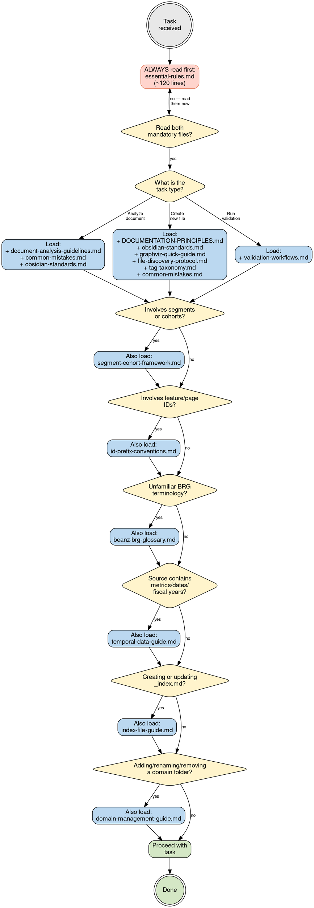

# Beanz Knowledge Base Framework

## Table of Contents

- [When to Use This Skill](#when-to-use-this-skill) - Triggers and scope
- [Quick Reference Hub](#-quick-reference-hub) - Common tasks and lookups
- [Critical Requirements](#-critical-reference-files-are-not-optional) - MUST READ references
- [Quick Start Workflows](#quick-start-workflows) - 3 workflows
- [AI Self-Validation Checklist](#ai-self-validation-checklist) - Run before presenting output
- [YAML Template](#yaml-template-9-required-fields) - 9 required fields
- [Reference Files Guide](#reference-files-guide) - When to load which reference

---

## When to Use This Skill

**Document Analysis** (Most Common):
- User shares PDF, spreadsheet, Confluence page, technical diagram
- Need to extract findings and propose KB file updates
- Requires structured analysis format with Obsidian standards

**KB File Management**:
- Creating new markdown files in `docs/` folders
- Updating existing KB files with new findings
- Enforcing quality standards (8 Anti-Redundancy Rules, Universal Document Structure)

**Quality Gates**:
- Running validation scripts (YAML, wikilinks, aliases)
- Applying AI Self-Validation Checklist before presenting output
- Converting plain text references to wikilinks

---

## Quick Reference Hub

### Most Common Tasks
1. **Analyzing input documents** → [Workflow 1](#workflow-1-analyzing-input-documents)
2. **Creating new KB files** → [Workflow 2](#workflow-2-creating-new-kb-files)
3. **Running validation** → [Workflow 3](#workflow-3-running-validation)
4. **Creating/updating _index.md** → See `references/index-file-guide.md`
5. **Meeting reports** → Use `meeting-analyzer` skill (NOT kb-author)

### Essential Cheat Sheets
- **YAML Template** → [9 Required Fields](#yaml-template-9-required-fields)
- **Wikilink Format** → `[[filename|Display Text]]` (no folder paths, except _index.md)
- **8 Anti-Redundancy Rules** → See `references/DOCUMENTATION-PRINCIPLES.md`
- **Common Errors** → See `references/common-mistakes.md`
- **Validation Commands** → See `references/validation-workflows.md`

### Quick Lookups
- **Segments & Cohorts** → See `references/segment-cohort-framework.md`
- **ID Conventions** → F-X.Y, P-X.Y, SEG-X.Y.Z, COH-X.Y, E-X.Y, N-X.Y

---

## CRITICAL: Reference Files Are NOT Optional

**BLOCKING REQUIREMENT:** Before ANY workflow, read `references/essential-rules.md` (~120 lines). Then load workflow-specific references:

| Workflow | Additional Required References | Approx. Lines |
|----------|-------------------------------|---------------|
| **W1: Analyze** | + `document-analysis-guidelines.md` | ~760 total |
| **W2: Create** | + `DOCUMENTATION-PRINCIPLES.md` + `obsidian-standards.md` + `graphviz-quick-guide.md` | ~1,809 total |
| **W3: Validate** | + `validation-workflows.md` | ~628 total |

**Why:** essential-rules.md provides rule summaries for all workflows. Full reference files add examples and detailed guidance only when needed. W1 analysis saves ~51% context vs loading everything; W3 validation saves ~60%.

### Quality Gate

**BEFORE any workflow, confirm:**
- [ ] I have read essential-rules.md IN FULL
- [ ] I have read the workflow-specific references listed above
- [ ] I can explain AR-05 "Summary ≠ Detail" from the rules
- [ ] I can explain QR-01 "Quick Reference" format criteria

---

## Workflows

The DOT diagrams below are the authoritative workflows. Follow the edges for your situation. Reference details (commands, templates, rules) that don't fit in node labels are in the [Node Reference](#node-reference) sections after each diagram.

**Decision 1** routes requests → **Decision 6** drives file creation → **Decision 4** chains post-analysis steps. Decisions 2, 3, 5, 8 are consulted at specific nodes within those flows.


### Decision 1: Which Workflow?

Routes requests to the right workflow. After analysis completes, see Decision 4 for next steps.

#### Node Reference (Decision 1)

- **`w1` / `w1u` (Analyze)**: Read `references/essential-rules.md` + `references/document-analysis-guidelines.md` first (BLOCKING). Include Obsidian standards in every proposed update (aliases, related, wikilinks). Run AI Self-Validation Checklist before presenting.
- **`discover` (File Discovery)**: See `references/file-discovery-protocol.md`. CLI shortcut: `obsidian vault=beanz-knowledge-base search query="topic" limit=10`
- **`w3` (Validation)**: See [validation commands](#validation-commands-validate-node) below.
- **Meeting transcript**: Use `meeting-analyzer` skill (NOT kb-author).



### Decision 2: Detail Sections Needed?



### Decision 3: Should I Add This Related Link?



### Decision 4: What Comes Next? (Workflow Chaining)

**Note:** D4 is the high-level chaining view. If D4 routes you to "Create New File" or "Run Validation", follow **Decision 6** for the detailed step-by-step flow (D6 includes approval, MOC updates, and validation loops that D4 abbreviates).



### Decision 5: Market-Specific Content?



### Decision 6: KB File Creation Process Cycle



#### Node Reference (Decision 6)

- **`draft` (UDS-01 structure)**: `YAML → H1 → Quick Ref (≤50 words) → Framework → Diagram (REQUIRED) → Summary Table → Detail Sections → Related Files → Open Questions`
- **`check_diagram`**: Every KB file must have at least one diagram (DOT or Mermaid) — see Decision 8. Must show something tables don't (AR-04).
- **`create_file`**: Update MOC (`docs/_index.md`) + folder `_index.md`. For new domains, follow `references/domain-management-guide.md`.
- **`cli_quick`**: `obsidian vault=beanz-knowledge-base unresolved total` + `obsidian vault=beanz-knowledge-base backlinks file="new-file-name"`
- **Commit message format**: New file: `"Add {domain}: {title}"`, Update: `"Update {domain}: {title} — {summary}"`. Always include `Co-Authored-By: Claude <noreply@anthropic.com>`.

**This KB does NOT use DOC-XX.Y format** — filenames are `b2c-users.md` not `DOC-03.1-b2c-users.md`, H1 is `# B2C Users` not `# DOC-03.1 — B2C Users`.

#### Validation commands (`validate` node)

```bash
# Optional CLI quick-check (requires Obsidian running)
obsidian vault=beanz-knowledge-base unresolved total

# Required: runs all 8 scripts (1-4 error, 5-8 warning)
python scripts/validate-all.py

# Required: regenerate catalog
python scripts/generate-catalog.py
```

See `references/validation-workflows.md` for detailed examples.

### Decision 8: Diagram Format Selection (DOT vs Mermaid)

Use this tree during Workflow 2 (Creation) when adding diagrams to KB files, and during file updates when reviewing existing diagrams. Check Mermaid-exclusive types first, then apply complexity thresholds for shared types, finally check DOT-preferred categories.



---

## AI Self-Validation Checklist

**Run this checklist BEFORE presenting ANY KB file output to user.** Fix all failures before presenting.



### Structure & Format

- [ ] **UDS-01**: Section order: YAML → H1 → Quick Ref → Framework → Diagram (REQUIRED) → Summary → Details → Related Files → Open Questions
- [ ] **Diagram**: File includes at least one diagram (DOT or Mermaid) showing relationships, flows, or hierarchy (not restating lists/tables — AR-04). Use DOT for architecture/state machines/ERDs/agent workflows; Mermaid for sequences/timelines/Gantt/journeys/simple flows.
- [ ] **MOC Updated**: New file added to `docs/_index.md` under appropriate status section
- [ ] **Folder _index updated**: New file added to folder `_index.md` Documents table
- [ ] **YAML**: All 9 fields present (title, description, type, status, owner, market, tags, aliases, related)
- [ ] **Aliases**: 2-4 items recommended, natural names only (NO DOC-XX.Y)
- [ ] **Related**: Files with content relationships to source topic (may be empty if no clear connections)
- [ ] **Description**: One sentence, ends with period, ≤200 characters
- [ ] **Type**: One of: strategy, market, user, feature, architecture, reference, analytics, finance, legal, marketing, meeting, operations, platform, support
- [ ] **Meeting Exemption**: Files with `type: meeting` follow meeting-report-template (NOT UDS-01). Exempt from Quick Reference, Framework, diagram, and Anti-Redundancy Rules.
- [ ] **H1**: Plain title, matches YAML title, no DOC-XX.Y prefix
- [ ] **Tags**: Flat tags from approved taxonomy (`references/tag-taxonomy.md`), ≤6 per file, no colon prefixes
- [ ] **Wikilinks**: Format `[[filename|Display Text]]`, no folder paths (except _index.md), all targets exist
- [ ] **Market Detection**: If source discusses specific markets, followed [Decision Tree 5](#decision-5-market-specific-content) (canonical vs delta)
- [ ] **Delta File**: If delta, filename uses `--{market}` suffix, has `extends` field, contains ONLY market-specific content

### Content Quality (8 Anti-Redundancy Rules)

- [ ] **Source Fidelity**: Every fact in the file exists in the source document — no synthesized definitions, no filled-in blanks, no speculation presented as fact
- [ ] **Label Fidelity**: Use exact source column headers/labels as section labels. Don't rename for clarity (e.g., don't rename "Attributes" to "Entry Criteria"). Flag potential renames as Open Questions instead.
- [ ] **QR-01**: Quick Reference ≤50 words, self-contained, ≤10s to comprehend
- [ ] **FR-01**: Framework = one-sentence definitions only, no stories/timelines
- [ ] **AR-01–08**: Each story told once; no duplicated content across sections; diagrams show relationships not lists; summary ≠ detail content; related files = links + one-line purpose only; open questions = blockers only
- [ ] **SC-01**: If subsections use labels, ALL content must be labeled
- [ ] **Temporal Classification**: If doc contains numbers/metrics/KPIs/dates, `temporal-type` is set. See `references/temporal-data-guide.md`
- [ ] **Data Period**: If temporal-type is static or dynamic, `data-period` is set
- [ ] **Period Labels**: Time-bound sections have period in heading (e.g., "Revenue (FY25)")
- [ ] **Alias Scoping**: If period-specific file, aliases include the period (e.g., "FY25 Results" not "Annual Results")

### Table-as-Source Rules

- [ ] **Column Preservation**: Summary tables must include ALL source columns. Compress by reducing row detail, not by dropping columns.
- [ ] **Detail Section Necessity**: If source is a table with no additional narrative, the table IS the complete documentation. Don't create detail sections that merely reformat table cells into labeled paragraphs (AR-05 violation). Detail sections should only exist if they add information beyond what's in the table.
- [ ] **Blank Cells**: Preserve blank cells as "*(not specified in source)*" — don't fill in plausible content.

### Obsidian Integration

- [ ] **Related files inference**: Examine source content for domains/topics mentioned (communications, features, analytics, systems, etc.) → check catalog for relevant files → link based on content overlap (not folder structure)
- [ ] **Related field - _index exclusion**: Never link to domain `_index.md` files unless source content explicitly discusses that domain's scope. Don't link to parent folders just because of file location.
- [ ] **Related field - evidence required**: For each related link, identify the specific source content (word/phrase/concept) that indicates the relationship. If no source evidence exists, don't add the link.
- [ ] Related files format: wikilinks with double quotes `"[[filename|Display]]"`, one-line description of WHY related
- [ ] All file references throughout content converted to wikilinks

### Anti-Pattern Scan

Iterate every numbered pattern in `references/common-mistakes.md` and record PASS/FAIL with one-line evidence:

- [ ] For EACH pattern in common-mistakes.md: checked output against WRONG examples → recorded PASS or FAIL with evidence
- [ ] **Priority patterns** (extra scrutiny): Source Fidelity (Content Quality checklist), Label Fidelity (Content Quality checklist), Column Preservation (Table-as-Source checklist), Quick Reference word count (common-mistakes #11), Diagram presence (common-mistakes #12)
- [ ] All FAIL items fixed before proceeding
- [ ] Scan summary reported (e.g., "Anti-Pattern Scan: 12/12 PASS")

**See**: `references/common-mistakes.md` for detailed error patterns with examples (count all numbered sections)

**Decision Rule: If ANY check fails → FIX IT before presenting output**

---

## Common Scenarios

### Scenario: Source is a Table

**Source:** Customer cohort table with columns: Cohort, Attributes, Behaviour, Needs, Focus

**Correct Approach:**
- Create summary table with ALL 5 source columns
- Use exact source column headers (Attributes, not "Entry Criteria")
- NO detail sections (table is complete as-is, no additional narrative to add)
- Note blank cells: "*(not specified in source)*"
- Diagram shows relationships/flow between items (not restating the table)

**Wrong Approach:**
- Drop "Behaviour" column from summary
- Rename "Attributes" to "Entry Criteria"
- Create detail sections that restate table cells as labeled paragraphs
- Fill in blank cells with plausible content
- Add "Definition:" labels that don't exist in source

### Scenario: Related Field Links

**Correct:** Link to `[[communications/_index|Communications]]` because source "Focus" column explicitly describes communication strategies (welcome emails, brew guides, win-back offers).

**Wrong:** Link to `[[_index|Users Index]]` because the file lives in `docs/users/`. That's folder-structure linking, not content-based.

**Test:** For each related link, can you point to the specific word/phrase in the source that evidences the relationship? If not, don't add the link.

### Scenario: Market-Specific Source Document

**Source:** AU payment gateway configuration with Adyen-specific settings

**Correct Approach:**
- Check if `payments.md` (canonical) exists
- If yes: create `payments--au.md` (delta) with `extends: "[[payments]]"`
- Delta contains ONLY AU-specific content (Adyen config, AUD, AU regulations)
- Shared payment logic stays in canonical file

**Wrong Approach:**
- Create standalone `payments-au.md` duplicating shared payment logic
- Add AU content as a section in the canonical `payments.md`

---

## YAML Template (9 Required Fields)

```yaml
---
title: Plain Title                    # NO DOC-XX.Y prefix
description: One sentence ending with period.  # ≤200 characters
type: strategy                        # strategy | market | user | feature | architecture | reference | analytics | finance | legal | marketing | meeting | operations | platform | support
status: draft                         # draft | in-progress | complete | superseded
owner: Team Name                      # Finance | Platform | Product | Marketing | Operations | Legal
market: [global]                      # global | au | de | uk | us | nl
tags: [strategy, b2b]                # Flat tags from approved taxonomy (see tag-taxonomy.md)
aliases: [Short-Name, Alternative, Acronym]  # 2-4 items recommended (NO doc_id)
related:                              # Infer from source content (may be empty if no clear connections)
  - "[[filename|Display]]"            # Link based on content overlap, not folder structure
# OPTIONAL — only for market delta files:
# extends: "[[canonical-file]]"
# TEMPORAL METADATA (add for docs with time-bound content):
# temporal-type: atemporal | static | dynamic
# data-period: FY25
# review-cycle: annual | quarterly | monthly | as-needed
# SUPERSESSION (add when a newer version exists):
# superseded-by: "[[newer-file]]"
# supersedes: "[[older-file]]"
---
```

---

## Reference Files Guide

**When to Load Each Reference:**



### Always Read First (BLOCKING REQUIREMENT)
- **essential-rules.md** - Condensed rules quick reference (~120 lines, all workflows)

### Workflow-Specific (load after essential-rules.md)
- **W1 Analyze:** + document-analysis-guidelines.md
- **W2 Create:** + DOCUMENTATION-PRINCIPLES.md, obsidian-standards.md, graphviz-quick-guide.md
- **W3 Validate:** + validation-workflows.md

### Load When Needed
- **validation-workflows.md** - Running validation scripts, troubleshooting errors
- **common-mistakes.md** - Quick reference for format errors (scan all numbered patterns)
- **segment-cohort-framework.md** - Customer segmentation details (SEG-X.Y.Z, COH-X.Y)
- **obsidian-standards.md** - YAML field requirements, wikilink syntax, linking patterns
- **id-prefix-conventions.md** - F-X.Y, P-X.Y, E-X.Y, N-X.Y specifications
- **beanz-brg-glossary.md** - BRG, BaaS, BCC, PBB, FTBP terminology
- **file-discovery-protocol.md** - 4-step protocol for checking existing files before creating new ones
- **tag-taxonomy.md** - Approved tag vocabulary (85 tags: domain, entity, topic, structural)
- **graphviz-quick-guide.md** - Graphviz/DOT diagram syntax for KB files (Beanz color palette, common patterns)
- **temporal-data-guide.md** - Temporal classification (atemporal/static/dynamic), data periods, supersession, mixed-file rules
- **index-file-guide.md** - _index.md template, creation/update workflow for folder navigation files
- **domain-management-guide.md** - Full checklist for adding, renaming, or removing a domain folder
- **essential-rules.md** - Condensed quick reference for all workflows (~120 lines, loaded first always)

**Progressive Disclosure:** Skill.md = overview + workflows + pointers. Reference files = complete details, examples, tables.
