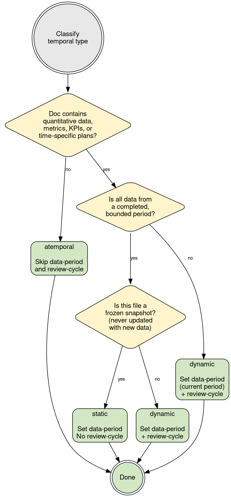

# Temporal Data Guide

## Table of Contents

- [Decision Tree 7: Temporal Classification](#decision-tree-7-temporal-classification)
- [Temporal Type Definitions](#temporal-type-definitions)
- [data-period Format Examples](#data-period-format-examples)
- [review-cycle Definitions](#review-cycle-definitions)
- [Supersession Pattern](#supersession-pattern)
- [Mixed-File Rules](#mixed-file-rules)
- [Temporal Transitions](#temporal-transitions)
- [Period-Scoped Alias Rules](#period-scoped-alias-rules)
- [Common Scenarios](#common-scenarios)

---

## Decision Tree 7: Temporal Classification



---

## Temporal Type Definitions

| Type | Meaning | Examples | Freshness Concern |
|------|---------|----------|-------------------|
| atemporal | Definitions, conventions, frameworks. No inherent expiry. | Glossary, ID conventions, tag taxonomy | Very low |
| static | Historical snapshot, frozen at period end. Will never be updated. | FY25 results, launch retrospective | Must not be cited as "current" |
| dynamic | Active data that may change. Needs periodic review. | Strategy, subscription metrics, roaster tiers | High — may drift |

---

## data-period Format Examples

Free text. Use the most natural label for the period:
- `FY25` — fiscal year
- `Q3 FY26` — quarter
- `FY25-FY26` — spanning two fiscal years
- `June 2024 - Sept 2025` — explicit date range (e.g., survey collection window)
- Leave empty for atemporal docs

---

## review-cycle Definitions

| Cycle | Days | When to Use |
|-------|------|-------------|
| annual | 365 | Strategy docs, FY-level data, structural changes |
| quarterly | 90 | Operational metrics, roaster performance, cohort tracking |
| monthly | 30 | Active dashboards, live KPIs (rare in this KB) |
| as-needed | — | No automated check; review when related systems change |

---

## Supersession Pattern

When a new period file replaces an old one:

1. In the OLD file, add:
   ```yaml
   status: superseded
   superseded-by: "[[fy26-results]]"
   ```

2. In the NEW file, add:
   ```yaml
   supersedes: "[[fy25-results]]"
   ```

**Applies to:**
- Annual results (fy25-results → fy26-results)
- Versioned programs (ftbp-v1 → ftbp-v2)
- Strategy documents (fy26-strategy → fy27-strategy)

**Rule:** File stays in its domain folder. Wikilinks don't break. Agents and Dataview can filter out superseded docs.

---

## Mixed-File Rules

Most migrated files will be mixed — evergreen framework with time-bound data points. This is the dominant pattern (~50% of content files from the old KB).

**Classification:** Classify by the file's dominant temporal nature, then label exceptions at section level.

**Section-Level Period Labels:**

Time-bound sections MUST include period in heading:
```markdown
## US Top 5 Roasters (FY25)          ← Period in heading
## US Platinum Field Update (Sep-Nov 2025)  ← Period in heading
## Platinum Roaster Commitments       ← No period = evergreen
```

**Concrete Examples from Migration:**

| File | Classification | Evergreen Sections | Time-Bound Sections |
|------|---------------|-------------------|-------------------|
| Market docs (DOC-02.1) | dynamic | Market structure, payment methods, regulatory | Active user counts, launch dates |
| Feature inventory (DOC-06.1) | dynamic | Feature definitions, ID mappings | Live/backlog/future counts, source date |
| Marketing programs (DOC-10.1) | dynamic | Program framework, cohort definitions | Launch dates, conversion rates, performance tables |
| Business model (DOC-02.3) | dynamic | Revenue model structure, stream definitions | Current volume ("~1M bags/year"), MRR figures |
| Cohort mapping (DOC-03.4) | dynamic | Segment definitions, transition logic | User counts, market-specific metrics |

---

## Temporal Transitions

When a planned event occurs (NL launches, program phase completes, FY ends):

1. Update `temporal-type: dynamic → static` if the file is now a historical record
2. Set `data-period` to the actual date range
3. If a successor file exists, add `superseded-by` and change `status: superseded`

**Example:** DOC-02.2 NL Launch Requirements
- Before July 2026: `temporal-type: dynamic`, `data-period: FY26`, `review-cycle: quarterly`
- After July 2026: `temporal-type: static`, `data-period: FY26` (launch is now historical)
- If FY27 market expansion doc is created: add `superseded-by: "[[fy27-expansion]]"`

---

## Period-Scoped Alias Rules

**Period files:** Aliases MUST include the period.

| Correct | Wrong |
|---------|-------|
| FY25 Results | Annual Results |
| FY25 Annual Results | Full Year Results |
| FTBP v2 Program | Fast Track Program |

**Test:** Would this alias collide if next year's version existed? If yes, add the period.

---

## Common Scenarios

### Scenario: Time-Bound Source Document

Source contains financial results, metrics, or KPI tables from a specific period.

**Do:**
- Set `temporal-type: static` if data from a completed period that won't be updated
- Set `temporal-type: dynamic` if the file will be updated when new data arrives
- Set `data-period` to the relevant period
- Include period in section headings with specific numbers
- Scope aliases to include the period
- Add `snapshot` tag for pure period files

**Don't:**
- Use an evergreen-sounding title without temporal fields
- Mix numbers from different periods without labeling each
- Create a "living document" title for snapshot data

### Scenario: Mixed Evergreen + Time-Bound

Source combines durable framework with time-specific data points.

**Do:**
- Classify as `dynamic` (the dominant behavior)
- Set `review-cycle` based on how often data changes
- Label time-bound sections with period in heading
- Leave evergreen sections without period labels
- Set `data-period` to the broadest period covered

**Don't:**
- Create separate files for framework vs data (at this KB scale, one file is simpler)
- Leave time-bound sections unlabeled
- Classify as `atemporal` just because the framework part is evergreen
