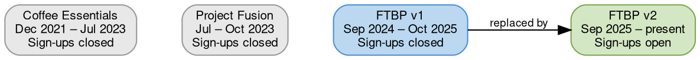

# Acquisition Programs

## Quick Reference

Beanz has run four acquisition programs since 2022. FTBP v2 is the current active program. Fusion and Coffee Essentials are discontinued but retain active subscribers. FTBP v1 is superseded by v2 but retains active subscribers on the cashback model.

## Program Timeline

## All Programs

All four programs have subscribers still active today. Only FTBP v2 is accepting new sign-ups.

| Program | Sign-up Period | New Sign-ups | Customers | Partner | Markets | Mechanic |
|---------|---------------|--------------|-----------|---------|---------|----------|
| Coffee Essentials | Dec 2021 – Jul 2023 | Closed | ~5,700 | None (DTC) | AU, UK, US | Appliance bundle + 12-bag subscription commitment at 20% off |
| Project Fusion | Jul – Oct 2023 | Closed | ~32,800 | OPIA | AU, UK, US | Cashback via promo agency, 2 free GWP bags, promo code for subscription |
| FTBP v1 | Sep 2024 – Oct 2025 | Closed (replaced by v2) | ~125,600 | None (BRG) | AU, DE, UK, US | 2/4/6 free bags → cashback via Hyperwallet |
| FTBP v2 | Sep 2025 – present † | **Open** | ~74,000 † | None (BRG) | AU, DE, UK, US | 2 free bags → upfront discount (25%/20%) |

---

## Coffee Essentials (Dec 2021 – Jul 2023)

**What it was:** DTC bundle program — customer buys a Breville appliance at a discount bundled with a 12-bag coffee subscription commitment at 20% off.

**How it worked:**
1. Customer purchases appliance + coffee bundle on beanz.com
2. Locked into subscription until 12 bags delivered
3. After 12 bags: can cancel, or keep 20% discount for 12 months total

**Detection:** `is_part_of_bundle = 1` in salesforce_orders

---

## Project Fusion (Jul 2023 – present)

**What it was:** Pre-FTBP cashback promotion managed by external promo agency OPIA. Sign-ups ran in two waves (Aug and Oct 2023) but converted subscribers remain active with ongoing cashback orders.

**How it worked:**
1. Customer registers on OPIA's promotional site
2. Receives 2 free coffee bags (GWP orders via CCC channel)
3. Receives promo code to subscribe on beanz.com
4. Subscription linked to OPIA for milestone-based cashback payouts

**Segments:**

| Segment               | Description                                       |
| --------------------- | ------------------------------------------------- |
| Fusion Converted      | Subscribed on beanz.com using cashback promo code |
| Fusion Free Bags Only | Took free bags but never subscribed               |

**Markets:** AU, UK, US (no DE)

**Detection (salesforce_orders):**
- GWP free bags: `source = 'GWP' AND exact_offer_code LIKE 'FusionFree2bag%'`
- Cashback sub orders: `exact_offer_code = 'Cashback Promotion Aug 2023'` or `'Cashback Promotion Oct 2023'`
- OPIA support: `exact_offer_code LIKE 'Opia Cashback Support Discount%'`

---

## FTBP v1 — Cashback Model (Sep 2024)

**What it was:** First generation of the Fast-Track Barista Pack. Breville/Sage machine buyers received free coffee bags and then cashback on subsequent purchases.

**How it worked:**
1. Customer registers their Breville/Sage machine (purchased from any channel — retail, online, or DTC)
2. Receives 2, 4, or 6 free coffee bags (campaign-dependent)
3. After free bags: cashback reimbursed via Hyperwallet on subsequent orders

FTBP v1 was an **always-on** program — every machine registration triggered the offer.

**Key characteristic:** 4/6-bag campaigns created subscriptions WITHOUT requiring a payment method upfront (PAYMENT_REQUIRED status). After free bags exhausted, customer was prompted to add payment.

**Discount model:** Cashback (post-purchase reimbursement via Hyperwallet)

**Markets:** AU, DE, UK, US

**Transition to v2:** Staggered by market Sep–Oct 2025 (US first, AU last). v1 customers must complete their cashback milestones before accessing the v2 discount.

**Detection:** `external_promotion_id` → `ftbp_campaign_lookup.program_version = 'FTBP v1'`

---

## FTBP v2 — Discount Model (Sep 2025 – present)

**What it is:** Current active acquisition program. Redesigned FTBP with upfront payment and immediate discount instead of post-purchase cashback.

**How it works:**
1. Customer registers their Breville/Sage/Baratza machine (purchased from any channel — retail, online, or DTC)
2. Chooses one of two sign-up paths:
   - **Subscription + Free Bags**: Starts subscription immediately with 2 free bags
   - **Free Bags Only**: Takes 2 free bags, no subscription commitment
3. Ongoing discount applied to all beanz.com orders via per-customer promo code

FTBP v2 is an **always-on** program — every machine registration triggers the offer. Seasonal campaigns (Christmas, Mothers Day, Fathers Day) layer additional free bags on top for active FTBP subscribers.

**Discount rates:**
- AU/US/UK: 25% off
- DE: 20% off
- Baratza customers: 25% off from start (no free bags)

**Savings caps:** The discount applies until a total savings cap is reached or the term expires, whichever comes first.

| Market | Savings Cap | Term |
|--------|------------|------|
| AU | $750 AUD | 3 years |
| US | $700 USD | 4 years |
| UK | £650 GBP | 4 years |
| DE | €750 EUR | 4 years |

**Two end-of-benefit triggers:** (1) Cap exhausted — heavy user consumed all savings, experiences price increase on next order. (2) Term expired — time ran out, typically lower-frequency buyers. Each requires different retention intervention.

**Multi-machine stacking:** A customer purchasing a second eligible appliance can stack benefits, extending the total term.

**Key change from v1:** Payment required UPFRONT at registration. Discount applied immediately (not reimbursed after).

**Segments:**

| Segment | Description |
|---------|-------------|
| Sub+FreeBags | Chose subscription at registration, receives 2 free bags then ongoing discount |
| FBO Converted | Chose free bags only at registration, later returned to beanz.com and started a subscription using their discount code |
| FBO Not Converted | Chose free bags only, never subscribed |

**Markets:** AU, DE, UK, US

**Detection:**
- Registration orders: `external_promotion_id` → `ftbp_campaign_lookup.program_version = 'FTBP v2'`
- Beanz.com orders: `offer_code LIKE '%-FT-DISCOFF-%'` (per-customer discount code, pattern: `{MARKET}-FT-DISCOFF-{random}`)

---

## Promotional Campaigns (Beanz Coffee)

Beyond the four acquisition programs, Beanz runs promotional campaigns on beanz.com that offer free bags or discounts on coffee subscription orders. These are managed in Voucherify and tracked via `exact_offer_code` in salesforce_orders.

*Customer counts as of Feb 2026. Campaigns marked † are still active — counts will increase.*

### Seasonal Free Bag Campaigns

Major retail-channel promotions offering free bags with machine registration or as seasonal gifts.

| Campaign                       | Period    | Offer                                  | Customers |
| ------------------------------ | --------- | -------------------------------------- | --------- |
| Machine Registration GWP       | 2020–2021 | 1 bag free                             | ~7,700    |
| 1x Free Beans Single Line Item | 2021–2022 | 1 bag free                             | ~4,900    |
| Coffee Day Promotion           | 2022      | 12–24 bags free                        | ~3,900 †  |
| Christmas National GWP         | 2022      | 6 bags free                            | ~3,400    |
| Impress Holiday Promotion      | Dec 2022  | 12 bags free                           | ~330      |
| Barista Express Impress Launch | 2022      | 9 bags free                            | ~110      |
| Summer Promotion               | 2022      | 6–12 bags free                         | ~290      |
| Free Beans GWP Feb 2023        | Feb 2023  | 12–24 bags free                        | ~1,900    |
| Spring Bonus Coffee Promotion  | Mar 2023  | 6 bags free                            | ~1,100    |
| Fathers Day Promotion          | 2022      | 12–24 bags free                        | ~800 †    |
| Fathers Day Promotion          | 2023      | 12–24 bags free, or 50% off 12–24 bags | ~2,900 †  |
| Mothers Day Promotion          | 2023      | 50% off 12–24 bags                     | ~1,200 †  |
| Fathers Day Promotion          | 2024      | 50% off 4–12 bags                      | ~280 †    |
| Mothers Day Promotion          | 2024      | 50% off 4–16 bags                      | ~410      |
| Bonus Coffee Experience        | Feb 2023  | 50% off 24 bags                        | ~380 †    |

### FTBP Seasonal Bonuses

AU-specific seasonal promotions layered on top of existing FTBP subscriptions. Offer bonus free bags (100 points off = free) to active FTBP subscribers.

| Campaign | Period | Offer | Customers |
|----------|--------|-------|-----------|
| AU Beanz Xmas FTBP Nov 2024 | Oct 2024 | 4 or 6 bags free | ~5,500 |
| AU Beanz Mothers Day FTBP Mar 2025 | Apr 2025 | 4 or 6 bags free | ~3,800 |
| AU Beanz Fathers Day FTBP Jul 2025 | Aug 2025 | 4 or 6 bags free | ~3,100 |

### Newsletter & Signup Discounts

Ongoing discount offers to drive email list growth and first-purchase conversion.

| Campaign | Market | Discount | Customers |
|----------|--------|----------|-----------|
| 10% off Newsletter sign-up | UK | 10% off first order | ~2,600 † |
| Introductory offer | Global | 15–25% off first purchase | ~30 |
| $15 / £9 off first subscription | US / UK | Fixed amount off | ~90 |
| 1 free bag with first subscription | Global | 1 bag free | ~70 |

### Duration Discounts

Time-limited percentage discounts on subscription orders, typically used for acquisition and re-engagement.

| Campaign | Discount | Duration | Period | Customers |
|----------|----------|----------|--------|-----------|
| Beanz 25% Off | 25% | 2–6 months | 2022 | ~870 |
| Beanz 100% Off | 100% | 3–6 months | 2022 | ~60 |
| BETTERBREW | 25% | 3 months | Nov 2022 – Aug 2023 | ~190 |
| Breville EDM Promotion | 25% | 3 months | Mar 2023 | ~100 |
| 25% Off XSItems | 25% | 4 months | Dec 2022 – Sep 2023 | ~40 |

### Partner & Retail Campaigns

Promotions tied to specific retail partners or events.

| Campaign | Partner/Event | Offer | Customers |
|----------|--------------|-------|-----------|
| Williams Sonoma Skills Series 2024 | Williams Sonoma | 1 bag free | ~140 |
| Bloomingdales Promotion 2023 | Bloomingdales | 12 bags free | ~30 |
| John Lewis Promotion 2022 | John Lewis | 8 bags free | ~10 |
| Gold Cup 2023 | SCA Gold Cup | 2 bags free | ~60 |
| Vileda Beanz by Sage 2024 | Vileda / Sage | 3 bags free | ~6 |
| Qantas Discount | Qantas | 100% off 12 bags | ~4 |

### Internal & Influencer

Staff, ambassador, and influencer programs — not customer-facing acquisition.

| Campaign Pattern           | Audience             | Offer                               | Customers |
| -------------------------- | -------------------- | ----------------------------------- | --------- |
| Breville Employee Discount | Staff                | 25% off 52 bags or 4 bags free      | ~280 †    |
| Staff Purchase Specials    | Staff                | Various                             | ~1,700 †  |
| Brand Ambassador           | Ambassadors          | 30% off 6 months or 100% off 4 bags | ~30       |
| Influencer Discount        | Influencers          | 100% off 2–10 bags                  | ~40 †     |
| Stellar Demonstrators      | Retail demos         | 5 bags free                         | ~150 †    |
| Sage Studio                | Sage Studio visitors | 20 bags free                        | ~10 †     |
| GTM PR Discount            | Press/media          | 4–12 bags free or 100% off          | ~130 †    |
| Coffee Kev VIP             | VIP/influencer       | 20% off                             | ~790      |
| QA Program                 | Internal testing     | 100% off 12–52 bags                 | ~15 †     |

---

## Retention Programs (Not Acquisition)

These target existing subscribers showing churn signals, not new customer acquisition.

| Program                | Detection                              | Description                                                                                                                                  |
| ---------------------- | -------------------------------------- | -------------------------------------------------------------------------------------------------------------------------------------------- |
| Cancellation Promotion | `offer_code LIKE 'Can_Disc_01%'`       | Retention discount offered during cancellation flow. 4 market variants: `Can_Disc_01`, `Can_Disc_01-AU`, `Can_Disc_01-UK`, `Can_Disc_01-DE`. |
| Customer Care Discount | Various `Customer Care Discount` codes | 15–20% off for 2–3 months, applied by support agents to resolve complaints                                                                   |

---

## Note on Appliance Promotions

Salesforce orders also contain Voucherify campaign codes for Breville/Sage appliance discounts (showroom sales, staff pricing, seasonal appliance promotions). These appear as `order_brand = 'Breville'` or `'Sage'` with high average order values ($500+). Many use placeholder "Copy" names from Voucherify campaign duplication. These are appliance pricing campaigns, not Beanz coffee promotions, and are excluded from this document.

---

## Related Files

- [[ftbp|Fast-Track Barista Pack]] — FTBP performance analysis and revenue impact
- [[lifecycle-comms|Lifecycle Communications]] — Email lifecycle that compounds acquisition with retention

## Open Questions

- [ ] Were there other promotional campaigns between Coffee Essentials and Fusion?
- [ ] FTBP v1 bag-count variants: which markets got 2 vs 4 vs 6 free bags?
- [ ] Are the "Copy"-named Voucherify campaigns being cleaned up, or do they need mapping to real campaign names?
