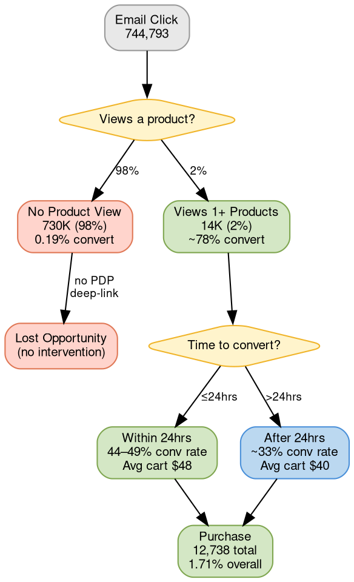

# Email Conversion Performance Analysis

## Quick Reference

- 12,738 conversions from 744,793 email clicks (1.71% overall)
- Critical gap: 98% of clickers never view a product; once viewed, conversion jumps to ~78%
- [[ftbp|FTBP v2]] customers are the most email-responsive cohort (4.18%)
- Educational tone + "Shop Fresh Coffee" CTA + PDP deep-link = highest-converting pattern

## Email Conversion Framework

### Key Concepts

- **Beanz Conversion** = Paid purchase within 7 days of email click (Mixpanel `PAYMENT/PLACE_ORDER_SUCCESS`)
- **Product View Cliff** = The gap between 0 and 1 products viewed (0.19% vs ~78% conversion rate)
- **Educational Tone** = Highest-converting email tone category (9.25–9.95% conversion rate)
- **Deep-Link** = Email CTA that lands on a specific PDP rather than the homepage
- **Win-Back Gap** = Only 1 cancellation email exists; zero dedicated reactivation or lapsed-customer emails

## Conversion Pipeline

**Legend:** Green = high conversion path. Red = drop-off/lost opportunity. Yellow diamonds = decision points. Blue = secondary path. The critical intervention point is between "Email Click" and "Product View" — deep-linking to PDPs closes the 98% drop-off gap.

---

## Executive Summary

12,738 email-driven conversions from 744,793 tracked clicks (1.71% overall conversion rate). The highest-converting email pattern is: **educational tone, "Shop Fresh Coffee" CTA, deep-linked to a PDP, sent to [[ftbp|FTBP v2]] customers, converting within 1 session on mobile in under 24 hours.**

Three critical gaps identified:
1. **No win-back emails** despite the single cancellation email converting at 10.5%
2. **730K email clickers (98%) never view a product** — massive abandoned-browse opportunity
3. **Welcome Series 2-4 underperform** — conversion drops from 13.7% (WS1) to 3.6% (WS2)

---

## 1. Performance by Email Category

| Category | Clicks | Conversions | Conv Rate | Avg Cart | Days to Convert |
|----------|--------|-------------|-----------|----------|-----------------|
| **Welcome Series** | 8,740 | 707 | **8.09%** | $45.43 | 1.5 |
| **Fusion Journey** | 48,153 | 2,504 | **5.20%** | $34.20 | 1.8 |
| **Subscription Lifecycle** | 6,432 | 232 | **3.61%** | $38.17 | 1.5 |
| **Subscription Mgmt** | 5,530 | 155 | **2.80%** | $36.56 | 1.5 |
| **Account Welcome** | 16,555 | 439 | **2.65%** | $36.34 | 1.8 |
| **Product Registration** | 12,783 | 321 | 2.51% | $37.39 | 1.7 |
| Order Transactional | 156,045 | 3,068 | 1.97% | $43.56 | 1.8 |
| Onboarding Education | 17,052 | 291 | 1.71% | $37.28 | 2.7 |
| Marketing Promo (BIEDM) | 239,196 | 3,050 | 1.28% | $48.36 | 2.1 |
| Other | 72,087 | 873 | 1.21% | $38.86 | 2.0 |
| Order Tracking | 95,835 | 661 | 0.69% | $37.83 | 2.9 |
| Subscription Reminder | 66,374 | 437 | 0.66% | $37.88 | 2.3 |

**Key insight:** Welcome Series converts at 8% — 6x the rate of marketing promos, with the fastest time-to-convert (1.5 days). [[lifecycle-comms|Subscription lifecycle]] emails (cancellation, edit) punch above their weight at 3.6%.

---

## 2. Top Individual Emails by Conversion Rate (50+ clicks)

| Email | Clicks | Conv Rate | Conversions | Avg Cart | Days to Convert |
|-------|--------|-----------|-------------|----------|-----------------|
| AU Black Friday | 351 | **31.3%** | 110 | $69.92 | 1.5 |
| UK Early Black Friday | 333 | **30.3%** | 101 | $33.85 | 1.4 |
| AU Early Black Friday | 430 | **28.8%** | 124 | $77.37 | 1.8 |
| WelcomeSeries1 | 3,013 | **13.7%** | 413 | $43.46 | 1.1 |
| ProjectFusion_FastTrackEmail | 2,460 | **14.0%** | 345 | $28.42 | 1.8 |
| ProjectFusion_ClaimApproved | 2,581 | **13.4%** | 346 | $31.81 | 1.6 |
| SubscriptionCancellation | 1,236 | **10.5%** | 130 | $39.18 | 1.4 |
| Beanz_OrderConfirmation | 5,332 | **7.1%** | 376 | $47.30 | 0.9 |
| ProjectFusion_Reminder2 | 5,299 | **7.6%** | 400 | $38.52 | 1.6 |
| Sage_ProductRegistration | 2,475 | **6.2%** | 154 | $28.75 | 1.9 |
| ProjectFusion_Reminder | 6,790 | **5.9%** | 403 | $37.76 | 2.0 |
| Beanz_OrderPartialProcessing | 8,046 | **5.5%** | 441 | $42.60 | 1.6 |

**Highest absolute volume:** `Beanz_OrderShipment` (94,701 clicks, 1,550 conversions at 1.64%) — the most-clicked email by far.

---

## 3. Performance by Acquisition Program

| Program | Clicks | Conversions | Conv Rate | Avg Cart |
|---------|--------|-------------|-----------|----------|
| **[[ftbp|FTBP v2]]** | 112,485 | 4,701 | **4.18%** | $34.79 |
| Organic/NULL | 150,279 | 2,385 | 1.59% | $46.18 |
| FTBP v1 | 321,683 | 4,904 | 1.52% | $46.48 |
| [[acquisition-programs|Fusion]] | 149,120 | 709 | 0.48% | $45.90 |
| [[acquisition-programs|Coffee Essentials]] | 11,215 | 39 | 0.35% | $36.65 |

**FTBP v2 converts at 2.7x the rate of v1** through email clicks. They are the most email-responsive cohort. Fusion customers are the least responsive (0.48%).

### Top Emails for FTBP v2 Customers Specifically

| Email | Clicks | Conv Rate | Conversions |
|-------|--------|-----------|-------------|
| WelcomeSeries1 | 684 | **24.85%** | 170 |
| WelcomeSeries5 | 186 | **23.12%** | 43 |
| Beanz_OrderConfirmation | 677 | **20.53%** | 139 |
| ProjectFusion_Reminder_1.0 | 3,145 | **20.29%** | 638 |
| ProjectFusion_FastTrackEmail | 2,445 | **14.07%** | 344 |
| SubscriptionCancellation | 399 | **12.78%** | 51 |
| Beanz_RateMyCoffee | 412 | **11.17%** | 46 |
| Beanz_OrderPartialProcessing | 2,234 | **9.80%** | 219 |

---

## 4. Template Tone and Messaging Theme

| Tone + Theme | Clicks | Conv Rate | Conversions |
|-------------|--------|-----------|-------------|
| Educational + Subscription Lifecycle | 1,407 | **9.95%** | 140 |
| Educational + Onboarding | 6,876 | **9.25%** | 636 |
| Enthusiastic + Seasonal | 1,177 | **8.24%** | 97 |
| Educational + Educational | 255 | **7.06%** | 18 |
| Enthusiastic + Product Launch | 7,116 | **6.98%** | 497 |
| Educational + Roaster Spotlight | 1,660 | **3.86%** | 64 |
| Enthusiastic + Onboarding | 1,669 | **3.59%** | 60 |
| Educational + Product Launch | 5,265 | **3.57%** | 188 |
| Empathetic + Onboarding | 12,770 | 2.43% | 310 |
| Enthusiastic + Promotion | 2,303 | 1.04% | 24 |
| Educational + Order Lifecycle | 13,074 | 0.98% | 128 |
| Apologetic + Price Notification | 3,348 | 0.30% | 10 |
| Empathetic + Subscription Lifecycle | 1,367 | 0.22% | 3 |

**Educational tone dominates conversion.** Not promotional, not urgent — educational. The apologetic and empathetic tones underperform significantly.

---

## 5. CTA Text Performance

| CTA Text | Clicks | Conv Rate | Conversions |
|----------|--------|-----------|-------------|
| **Shop Fresh Coffee** | 403 | **8.44%** | 34 |
| **Shop Now** | 8,748 | **6.26%** | 548 |
| Find Your Perfect Coffee | 454 | **4.63%** | 21 |
| Learn More | 947 | **4.22%** | 40 |
| Order It Now | 1,275 | **3.29%** | 42 |
| beanz.com | 1,683 | 2.61% | 44 |
| Follow Now | 435 | 9.43% | 41 |
| Manage My Subscription | 3,231 | 0.28% | 9 |

**Specific CTAs outperform generic ones.** "Shop Fresh Coffee" (8.44%) > "Shop Now" (6.26%) > "Learn More" (4.22%). "Manage My Subscription" has high clicks but near-zero conversion — utility traffic, not purchase intent.

---

## 6. Conversion Timing Window

| Time from Click to Web | Clicks | Conversions | Conv Rate | Avg Cart |
|----------------------|--------|-------------|-----------|----------|
| **0-1 hour** | 453 | 223 | **49.2%** | $48.08 |
| **1-4 hours** | 777 | 342 | **44.0%** | $49.58 |
| 4-12 hours | 7,036 | 3,014 | 42.8% | $39.09 |
| 12-24 hours | 11,678 | 5,260 | 45.0% | $41.13 |
| 1-3 days | 7,471 | 2,395 | 32.1% | $44.97 |
| 3-7 days | 4,560 | 1,504 | 33.0% | $39.42 |

Customers who engage within 4 hours convert at 44-49%. After day 1, it drops to ~33% (a 12pp cliff). **If someone clicks but doesn't convert within 24 hours, a reminder email at day 1-2 could recapture the drop-off.**

Early converters (0-4 hrs) also have higher cart values ($48-50) — they come with intent.

---

## 7. Welcome Series Funnel

| Email | Clicks | Conversions | Conv Rate | Avg Cart |
|-------|--------|-------------|-----------|----------|
| **WelcomeSeries1** | 3,013 | 413 | **13.7%** | $43.46 |
| WelcomeSeries2 | 1,669 | 60 | **3.6%** | $44.91 |
| WelcomeSeries3 | 1,670 | 96 | **5.8%** | $48.67 |
| WelcomeSeries4 | 1,155 | 50 | **4.3%** | $50.03 |
| **WelcomeSeries5** | 1,022 | 77 | **7.5%** | $48.35 |
| WelcomeSeries1_DE | 109 | 10 | 9.2% | $46.47 |

**Massive drop from WS1 (13.7%) to WS2 (3.6%).** Then WS5 recovers to 7.5%. The middle emails (2-4) are losing people. Later converters spend more ($48-50 vs $43) — patient buyers are higher value.

**Action:** WS2 and WS4 need redesign. Study WS1's structure and WS5's recovery mechanic.

---

## 8. Market-Level Performance

### WelcomeSeries1 by Market

| Market | Clicks | Conv Rate | Avg Cart |
|--------|--------|-----------|----------|
| **AU** | 549 | **25.9%** | $52.70 |
| **US** | 1,196 | **18.1%** | $42.35 |
| **UK** | 316 | **17.4%** | $23.93 |

### SubscriptionCancellation by Market

| Market | Clicks | Conv Rate | Avg Cart |
|--------|--------|-----------|----------|
| **EU** | 62 | **16.1%** | $28.96 |
| **UK** | 316 | **11.7%** | $23.95 |
| **US** | 506 | **10.1%** | $45.11 |
| **AU** | 351 | **9.1%** | $49.38 |

### Beanz_OrderShipment by Market

| Market | Clicks | Conv Rate | Avg Cart |
|--------|--------|-----------|----------|
| **EU** | 6,123 | **2.7%** | $41.70 |
| **UK** | 28,692 | **2.1%** | $28.51 |
| **AU** | 19,067 | **1.4%** | $62.43 |
| **US** | 40,224 | **1.3%** | $48.12 |

### ProjectFusion_Reminder_1.0 by Market

| Market | Clicks | Conv Rate | Avg Cart |
|--------|--------|-----------|----------|
| **UK** | 1,269 | **25.5%** | $24.23 |
| **AU** | 452 | **18.1%** | $52.43 |
| **US** | 712 | **17.7%** | $40.46 |
| **EU** | 751 | **15.2%** | $34.87 |

AU customers are 1.4x more responsive to welcome emails (25.9% vs 18.1% US). For cancellation win-back, EU and UK outperform. See [[market-overview|Market Overview]] for market configuration context. **Different markets need different email strategies.**

---

## 9. Device Behavior

| Journey | Converters | % of Total | Avg Cart |
|---------|-----------|------------|----------|
| **Mobile to Mobile** | 7,797 | **61.2%** | $40.25 |
| Desktop to Desktop | 4,254 | 33.4% | $44.05 |
| Mobile to Desktop (cross-device) | 372 | 2.9% | $37.28 |
| Tablet to Tablet | 173 | 1.4% | **$49.15** |
| Desktop to Mobile | 119 | 0.9% | $41.45 |

**61% of email-driven purchases happen entirely on mobile.** Desktop converters spend $4 more. Tablet users spend the most ($49). Cross-device journeys are only 3% — most people convert on the same device they click on. **Emails must be mobile-first.**

---

## 10. Product Browsing — The Decision Threshold

| Products Browsed | Clickers | Conv Rate | Avg Cart | Avg Roasters |
|-----------------|----------|-----------|----------|--------------|
| **0 products** | 730,343 | **0.19%** | - | 0 |
| **1 product** | 11,831 | **78.0%** | $41.36 | 2.2 |
| **2-3 products** | 2,477 | **80.7%** | $41.48 | 3.6 |
| **4-6 products** | 136 | **74.3%** | **$57.83** | 7.1 |

**The cliff is between 0 and 1 product viewed.** Once someone views even 1 product, conversion is ~78%. The 730K clickers who viewed 0 products are the massive lost opportunity — they clicked the email, landed on the site, but never made it to a PDP.

**Emails should deep-link to specific PDPs, not the homepage.**

The 4-6 product browsers spend $57.83 — explorers buy more. Emails that encourage browsing multiple options (roaster spotlights, "3 coffees for your palate") could lift cart value.

---

## 11. Quiz and Filter Usage

| Behavior | Converters | Avg Cart | Avg Products | Avg Roasters |
|----------|-----------|----------|-------------|-------------|
| No quiz, no filters | 9,046 | **$43.07** | 1.1 | 2.5 |
| Used quiz | 3,692 | $37.55 | 1.1 | 3.0 |

29% of converters use the coffee quiz. They spend $5.52 less, suggesting quiz users are newer/less confident buyers who need guidance (aligning with [[customer-segments|experience level]] .1 and .2). But the quiz is clearly driving conversion — it's a decision-making tool. **Emails targeting undecided customers should CTA to the quiz ("Find Your Perfect Coffee" — already 4.63% conversion rate).**

---

## 12. Session Depth

| Sessions | Converters | % of Total | Avg Cart | Avg Events | Days to Convert |
|----------|-----------|------------|----------|-----------|-----------------|
| **1 session** | 6,218 | **49%** | **$42.99** | 98.6 | 1.5 |
| 2 sessions | 3,183 | 25% | $40.41 | 127.3 | 2.1 |
| 3 sessions | 1,498 | 12% | $39.72 | 156.0 | 2.5 |
| 4+ sessions | 1,839 | 14% | $39.27 | 240+ | 2.7+ |

**Half of all converters buy in their first session** with the highest cart value ($43). More sessions = lower cart value + longer time. **The email's job is to get the right product in front of the customer in one click** — reduce the need for multiple return visits.

---

## 13. Error Encounters

| Status | Total | Conversions | Conv Rate | Avg Cart |
|--------|-------|-------------|-----------|----------|
| Had Errors | 869 | 282 | **32.5%** | $40.21 |
| No Errors | 743,924 | 12,456 | 1.67% | $41.55 |

The "had errors" group converts at 32.5%. This is because errors are tracked at the Mixpanel level — these are customers deep enough in the funnel to hit cart/payment errors. They're **highly motivated buyers who encountered friction but pushed through**. Error encounters indicate purchase intent. Still worth fixing the errors, but the conversion rate reflects commitment, not causation.

---

## 14. Top Converting Landing Pages

| Landing Page | Conversions |
|-------------|-------------|
| beanz.com/en-us (homepage) | 1,858 |
| beanz.com/en-gb (homepage) | 1,794 |
| beanz.com/en-au (homepage) | 762 |
| beanz.com/de-de (homepage) | 484 |
| FTBP Fast Track landing page (AU/US/UK/DE) | 284-191 per variant |
| Black Friday promo pages | 115-204 per variant |
| /coffee (category page) | 130 per market |
| **/baristas-choice** (quiz-filtered page) | **123** |
| /auth (account management) | 140-149 per market |

The homepage works by volume, but [[ftbp|FTBP]] and promo pages convert the committed. The `/baristas-choice` filtered page (123 conversions) is a hidden gem — it's a guided product selector.

---

## 15. Churn Correlation — Emails That Precede Cancellation

Top 30-day churn rates after receiving an email (500+ recipients):

| Email | Program | Recipients | 30d Churn |
|-------|---------|-----------|-----------|
| OrderInProcess | FTBP v1 | 636 | **10.5%** |
| NewsletterWelcome | [[acquisition-programs|Coffee Essentials]] | 603 | **10.5%** |
| ChangeCoffeeConfirmation | Coffee Essentials | 560 | **10.4%** |
| OrderConfirmation | Coffee Essentials | 21,190 | 7.8% |
| OrderShipment | Coffee Essentials | 13,038 | 7.3% |
| OrderProcessing | Coffee Essentials | 4,598 | 7.2% |
| UpcomingSubscription | Coffee Essentials | 1,548 | 7.2% |

These aren't causing churn — they coincide with churn windows. Coffee Essentials customers have the highest churn rates across all emails (7-10% at 30 days) because CE customers are post-commitment (12-bag obligation met). **CE customers need a dedicated retention series after bag 12.**

---

## 16. Win-Back Gap Analysis

Only **1 cancellation-related email** exists in the entire [[emails-and-notifications|email inventory]]:

| Email | Clicks | Conv Rate | Conversions | Avg Cart |
|-------|--------|-----------|-------------|----------|
| SubscriptionCancellation | 1,236 | **10.5%** | 130 | $39.18 |

**Zero** win-back, reactivation, "miss you", or lapsed-customer emails exist. This is the single largest gap in the email program. A 10.5% conversion rate on the lone cancellation email proves these customers are recoverable.

---

## FTBP v2 Journey (Day 0) — What v2 Customers See on Registration Day

| Email (Day 0) | Reach | Open Rate | Click Rate |
|---------------|-------|-----------|------------|
| ProjectFusion_ClaimReceived | 745 | 87.7% | 5.2% |
| ProjectFusion_ClaimApproved | 599 | 79.8% | 11.6% |
| OrderConfirmation | 488 | 91.5% | 6.2% |
| ProjectFusion_FastTrackEmail | 304 | 81.0% | **13.6%** |
| UserAccountWelcome | 294 | 84.1% | **12.0%** |
| Beanz_OrderShipment | 92 | 88.2% | **37.7%** |
| WelcomeSeries1 | 141 | 74.8% | 9.5% |

`Beanz_OrderShipment` has a 37.7% click rate on Day 0 — the transactional moment creates peak engagement. `ProjectFusion_FastTrackEmail` (13.6% click rate) and `UserAccountWelcome` (12.0%) are the key conversion-driving touchpoints.

---

## The Data-Driven Email Formula

Based on all analysis, the highest-converting email pattern is:

| Dimension | Optimal | Evidence |
|-----------|---------|----------|
| **Tone** | Educational | 9.25-9.95% conv rate vs 0.22-1.04% for other tones |
| **CTA** | "Shop Fresh Coffee" | 8.44% conv rate (highest of all CTAs) |
| **Landing** | Specific PDP or /baristas-choice | 78% conv rate once 1 product is viewed |
| **Timing** | Within 24 hours of trigger | 44-49% conv rate in first 4 hours, drops to 33% after day 1 |
| **Audience** | [[ftbp|FTBP v2]] customers | 4.18% base rate, 24.85% on welcome series |
| **Theme** | Onboarding or subscription lifecycle | 9.25% and 9.95% respectively |
| **Device** | Mobile-optimized | 61% of conversions are mobile-only |
| **Sessions** | One-and-done | 49% convert in first session with highest cart value |

---

## Recommendations — Prioritized by Data

### Tier 1: Highest Impact

#### 1. Abandoned Browse Recovery Email
**Data:** 730K email clickers (98%) viewed 0 products. Even converting 1% of these = 7,300 new purchases.
**Trigger:** Email click detected but no PDP view within 4 hours.
**Template:** Educational tone, deep-link to specific PDPs based on subscription history or quiz. "Shop Fresh Coffee" CTA.

#### 2. FTBP v2 Day 7/14 Conversion Nudge
**Data:** [[ftbp|FTBP v2]] converts at 4.18% overall but WS1 alone hits 24.85% for v2. 84.5% of v2 churn happens within 30 days. Intervention window is days 1-14.
**Template:** Educational tone, "Shop Fresh Coffee" CTA, deep-link to `/baristas-choice` (quiz-filtered page).

#### 3. Win-Back Series (3-email)
**Data:** Only 1 cancellation email exists (10.5% conversion). Zero win-back/reactivation emails.
**Template:** Day 1 (educational — "here's what you're missing") / Day 7 (social proof — "customers who returned say...") / Day 30 (incentive — time-limited offer). EU customers convert at 16.1% on the existing cancellation email — start there.

### Tier 2: Optimize Existing

#### 4. Fix Welcome Series 2-4
**Data:** WS1 converts at 13.7%, WS2 drops to 3.6%. WS5 recovers to 7.5%.
**Action:** Study WS1 and WS5 structure. Replace WS2 with quiz-focused email ("Find Your Perfect Coffee" CTA converts at 4.63%). Consider A/B testing educational vs enthusiastic tone for WS3-4.

#### 5. Market-Specific Welcome Series
**Data:** AU converts at 25.9% on WS1 (vs 17-18% US/UK). AU avg cart $52.70 vs UK $23.93.
**Action:** Create AU-specific welcome content leveraging what's working. UK needs different treatment (lowest cart value). DE welcome series has separate templates but 0% conversion on WS2-5.

#### 6. Mobile-First Template Overhaul
**Data:** 61% of conversions are mobile-only. 49% convert in a single session.
**Action:** Ensure all emails render perfectly on mobile with thumb-friendly CTAs, quick-load PDPs, and single-tap purchase paths.

### Tier 3: Strategic New Programs

#### 7. Post-Delivery Repurchase Trigger
**Data:** `Beanz_OrderShipment` drives 1,550 conversions at 1.64% but has the highest click volume (94K). 37.7% click rate on Day 0 for [[ftbp|FTBP v2]].
**Action:** Add a "Your next bag" recommendation 5-7 days after shipment (when the bag is running low). Deep-link to recommended product, not homepage.

#### 8. Coffee Essentials Post-Bag-12 Retention Series
**Data:** [[acquisition-programs|Coffee Essentials]] customers show 7-10% churn within 30 days of any email — the highest of any program. Their 12-bag commitment is ending.
**Action:** Dedicated "You've earned it — here's what's next" series after bag 12 delivery. Educational tone about continued savings / new roasters / subscription flexibility.

#### 9. Roaster Spotlight / Educational Series
**Data:** Educational + roaster spotlight converts at 3.86% (64 conversions from only 1,660 clicks). This content type is under-invested.
**Action:** Regular monthly roaster features with "Shop Fresh Coffee" CTA. Target non-subscribers and on-demand buyers. Deep-link to the specific roaster's PDP, not the category page.

#### 10. Browse Encouragement Emails
**Data:** Customers who browse 4-6 products spend $57.83 (vs $41 for 1-product viewers). Explorers buy more.
**Action:** Emails that encourage browsing ("3 coffees for your palate", "This week's roaster picks") could lift cart value by driving multi-product exploration.

---

## Methodology Notes

- **Data sources:** `email_web_attribution` (744,793 clicks, 12,738 conversions), `email_campaign_performance`, `email_template_content`, `customer_master`
- **Conversion window:** 7 days from email click to Mixpanel `PAYMENT/PLACE_ORDER_SUCCESS` event
- **Template linkage:** 12.9% of clicks (95,941 rows) have template metadata. 100% have `email_name`. Template analysis is directional, not comprehensive.
- **Churn correlation:** Measures subscription cancellations within 7/14/30 days of email receipt. Correlation, not causation.
- **Cart value:** Extracted from Mixpanel transaction data, not Salesforce order amounts. May differ slightly from line-item-level revenue.
- **"Had errors":** Refers to Mixpanel error events during the web session (cart errors, payment failures, page errors), not email delivery errors.

---

## Related Files

- [[ftbp|Fast-Track Barista Pack]] — FTBP v2 is the highest-converting acquisition program in email
- [[lifecycle-comms|Lifecycle Communications]] — Email strategy that this analysis quantifies
- [[customer-segments|Customer Segments]] — Segment and cohort definitions for the programs analyzed
- [[acquisition-programs|Acquisition Programs]] — Full mechanics for FTBP, Fusion, Coffee Essentials programs
- [[emails-and-notifications|Emails and Notifications]] — Email template inventory referenced throughout

## Open Questions

- [ ] **Template metadata coverage is 12.9%** — can full template data (tone, theme, CTA) be backfilled for the remaining 87% of clicks? Answer would strengthen tone/CTA analysis from directional to definitive.
- [ ] **Cart value source discrepancy** — Mixpanel transaction data vs Salesforce order amounts may differ. Need to quantify the delta to validate cart value comparisons across segments.
