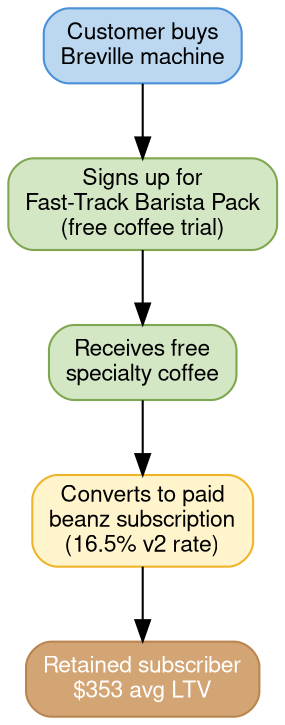

# Fast-Track Barista Pack

## Quick Reference

- Primary acquisition engine for beanz.com: buy a Breville machine, get free coffee, convert to paid subscriber
- 193K sign-ups in 2 years across all markets
- FTBP now accounts for 41% of total revenue (up from 3% in CY24)
- FTBP v2 increased paid conversion from 11.4% to 16.5% (+5.1 pts)
- $353 average subscriber LTV

## How FTBP Works

Customers who purchase a Breville espresso machine receive a free coffee trial through beanz.com. The trial introduces them to specialty roasters and the subscription model. After the free period, customers convert to paid subscriptions.

## FTBP v2 vs v1 Comparison

FTBP v2 launched in October 2025 and significantly improved paid conversion. First 12 weeks comparison (Oct–Dec 2025 vs same period last year):

| Metric | FT v1 | FT v2 | Change |
|--------|-------|-------|--------|
| Sign-ups | 50,000 | 46,000 | -7% |
| Paid conversion of total signups | 11.4% | 16.5% | +5.1 pts |
| Paid conversion of total machines sell-out | 1.1% | 2.4% | +1.3 pts |
| Paid customers | 3,947 | 7,621 | +93% |
| Paid volumes (KG) | 4,223 | 8,886 | +110% |
| Revenue (AUD) | $320,500 | $537,300 | +68% |

v2 achieved nearly double the paid customers (+93%) with 7% fewer sign-ups, demonstrating that conversion quality improved substantially over volume.

## Revenue Impact

FTBP transformed the beanz.com revenue mix in CY25:

| Revenue Stream | CY24 Share | CY25 Share |
|----------------|-----------|-----------|
| **FTBP Paid** | **3%** | **41%** |
| Beanz Subscription | 36% | 33% |
| Fusion | 45% | 19% |
| Other | 16% | 7% |

## Revenue by Machine Type (FTBP v1+v2)

Oracle Series owners over-index in revenue share at 21% while accounting for only 5% of total machine sell-out volumes.

| Category | Drip | Bambino | Barista | Oracle | Other |
|----------|------|---------|---------|--------|-------|
| Machine sell-out % | 4% | 20% | 70% | 5% | 1% |
| Paid customer % | 2% | 12% | 68% | 16% | 3% |
| Revenue % | 2% | 11% | 64% | 21% | 3% |

This insight drives prioritization: Oracle owners contribute disproportionate revenue per customer, making them a high-value segment for targeted conversion efforts.

## Active Subscription Mix

At end of CY2025, FTBP (v1 + v2 combined) accounts for 48% of all active subscriptions:

| Subscription Type | Share of Active Subs |
|-------------------|---------------------|
| Beanz Subscriptions | 38% |
| FTBP v1 | 32% |
| FTBP v2 | 17% |
| Fusion | 14% |

## Growth Engine

Fast-Track is beanz.com's primary acquisition engine:

- **193,000 sign-ups** in 2 years across all markets
- **13% attachment** to paid beanz conversions
- **$353** average subscriber LTV
- Compounds with [[lifecycle-comms|lifecycle communications]] for retention

## FY27 FTBP Priorities

FY27 focus is converting more machine owners at lower cost:

| Lever | Description |
|-------|-------------|
| **Optimize redemption journey** | Make the free-to-paid journey frictionless |
| **Leverage 1kg affordability** | Use [[affordability-economics\|1kg/2lb pricing]] to improve value perception |
| **POS optimization** | Improve point-of-sale conversion materials and retail displays |

## Related Files

- [[cy25-performance|CY25 Performance]] — FTBP drove the CY25 revenue mix transformation (3% → 41%)
- [[platinum-roaster-program|Platinum Roaster Program]] — Platinum partners execute "Reverse Fast Track Sales" (machines + beans bundles)
- [[affordability-economics|Affordability Economics]] — 1kg/2lb pricing lever for improving FTBP conversion
- [[lifecycle-comms|Lifecycle Communications]] — Lifecycle emails compound FTBP's acquisition engine with retention
- [[fy27-brand-summit|FY27 Brand Summit]] — FTBP conversion is one of five FY27 profitability priorities

## Open Questions

- [ ] What are the FTBP v2 changes compared to v1 that drove the conversion improvement?
- [ ] What is the target paid conversion rate for FY27?
- [ ] What is the FTBP churn rate vs organic beanz subscriptions?
