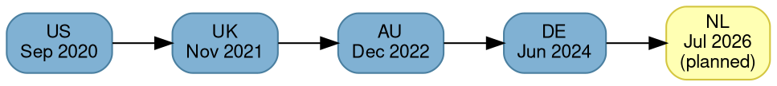

# Market Overview

## Quick Reference

- 5 markets across 4 currencies
- NL (July 2026) is the first cross-border market, fulfilled via DE and vice-versa

## Markets Framework

### Key Concepts

- **Breville markets** = AU, US (Breville brand)
- **Sage markets** = UK, DE, NL (Sage Appliances brand)
- **EUR markets** = DE, NL (shared currency, cross-border fulfillment)

## Market Launch Timeline

## Market Configuration

| Market | First Order | Currency | Tax Model       | Language |
| ------ | ----------- | -------- | --------------- | -------- |
| **US** | 2020-09-07  | USD      | State sales tax | English  |
| **UK** | 2021-11-18  | GBP      | VAT             | English  |
| **AU** | 2022-12-02  | AUD      | GST             | English  |
| **DE** | 2024-06-26  | EUR      | VAT             | German   |
| **NL** | Jul 2026    | EUR      | VAT             | Dutch    |

