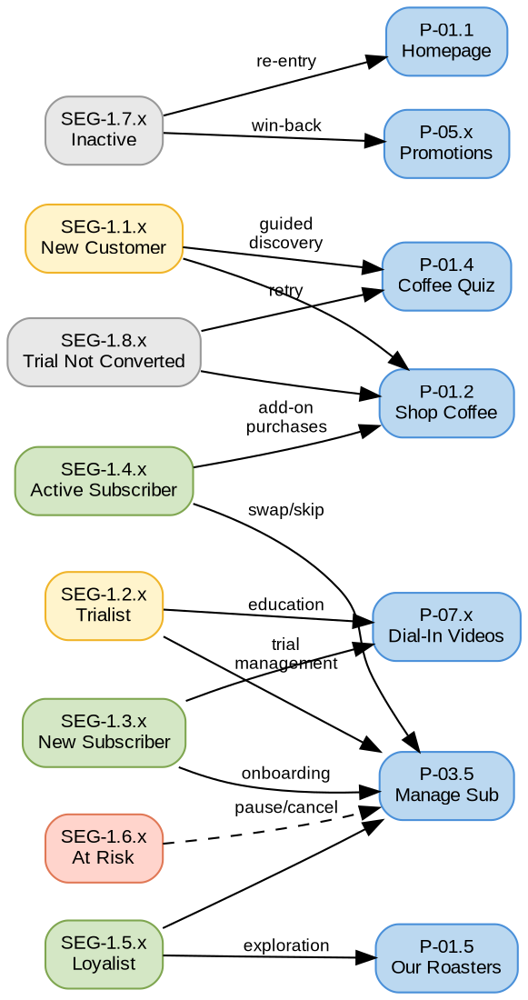

# Segment Page Journeys

## Quick Reference

- 8 lifecycle segments (SEG-1.1.x through SEG-1.8.x) mapped to page usage
- Quiz (P-01.4) critical for Novice segments; Manage Subscription (P-03.5) critical for active segments
- FTBP v1 cohorts use Cashback Rewards; FTBP v2 cohorts use Coffee Savings

## Segment Journey Framework

### Key Concepts

- **Lifecycle segments** = Mutable behavioral states (New Customer → Loyalist → Inactive)
- **Experience levels** = Novice (.1) vs Experienced (.2) within each stage
- **Cohort-specific pages** = COH-2.1 (FTBP v1) → P-03.7 Cashback; COH-2.2 (FTBP v2) → P-03.6 Coffee Savings

## Segment-to-Page Affinity



**Legend:** Yellow = early lifecycle · Green = established · Red = at risk · Gray = inactive/churned · Blue = pages. Dashed edges = risk paths.

## Segment Journey Summary

| Segment | Primary Pages | Entry Points | Critical Pages |
|---------|---------------|--------------|----------------|
| **SEG-1.1.1** New Customer (Novice) | Quiz, PLP, Roaster Detail | Homepage, Promotions, Quiz | P-01.4 Quiz, P-02.2 Checkout |
| **SEG-1.1.2** New Customer (Experienced) | PLP, PDP, Roaster Detail | Homepage, PLP, Promotions | P-01.2 PLP, P-01.3 PDP |
| **SEG-1.2.x** Trialist | Manage Sub, Coffee Savings/Cashback | Email, My Account | P-03.5 Manage Sub |
| **SEG-1.3.x / 1.4.x** Active Subscriber | Manage Sub, PLP, Orders | Email, My Account | P-03.5 Manage Sub |
| **SEG-1.5.x** Loyalist | Roasters, Manage Sub, Large Bags CLP | Email, Roasters, My Account | P-01.5 Roasters |
| **SEG-1.6.x** At Risk | Manage Sub, Support | Email (win-back), My Account | P-03.5 Manage Sub |
| **SEG-1.7.x** Inactive | Homepage, PLP, Promotions | Email (win-back), Remarketing | P-01.1 Homepage |
| **SEG-1.8.x** Trial Not Converted | Quiz, PLP, Support | Email, Remarketing | P-01.4 Quiz |

## Critical Journey Decision Points

```dot
digraph journey_decisions {
    rankdir=TD;
    fontname="Arial";
    node [shape=box, style="rounded,filled", fontname="Arial", fontsize=10];
    edge [fontname="Arial", fontsize=9];

    HOME [label="P-01.1\nHomepage", fillcolor="#BBD8F0", color="#4A90D9"];

    fork_discovery [label="Experience\nlevel?", shape=diamond, fillcolor="#FFF4CC", color="#F0B429"];
    QUIZ [label="P-01.4\nCoffee Quiz", fillcolor="#BBD8F0", color="#4A90D9"];
    PLP [label="P-01.2\nShop Coffee", fillcolor="#BBD8F0", color="#4A90D9"];

    BC [label="P-01.7\nBarista's Choice", fillcolor="#BBD8F0", color="#4A90D9"];
    PDP [label="P-01.3\nProduct Detail", fillcolor="#BBD8F0", color="#4A90D9"];

    CART [label="P-02.1\nCart", fillcolor="#D4E7C5", color="#7FA650"];
    CHK [label="P-02.2\nCheckout", fillcolor="#D4E7C5", color="#7FA650"];
    CONFIRM [label="P-02.3\nOrder Confirm", fillcolor="#D4E7C5", color="#7FA650"];

    fork_trial [label="Trial\nconversion?", shape=diamond, fillcolor="#FFF4CC", color="#F0B429"];
    NEW_SUB [label="SEG-1.3.x\nNew Subscriber", fillcolor="#D4E7C5", color="#7FA650"];
    TNC [label="SEG-1.8.x\nTrial Not Converted", fillcolor="#E8E8E8", color="#999999"];

    MANAGE [label="P-03.5\nManage Sub", fillcolor="#D4E7C5", color="#7FA650"];
    fork_churn [label="Churn\nrisk?", shape=diamond, fillcolor="#FFF4CC", color="#F0B429"];

    RETENTION [label="Retention\nOffer", fillcolor="#FFD4CC", color="#E07856"];
    retain_decision [label="Accept\noffer?", shape=diamond, fillcolor="#FFF4CC", color="#F0B429"];

    ACTIVE [label="SEG-1.4.x\nActive Subscriber", fillcolor="#D4E7C5", color="#7FA650"];
    INACTIVE [label="SEG-1.7.x\nInactive", fillcolor="#E8E8E8", color="#999999"];

    WINBACK [label="Win-back\nEmail", fillcolor="#FFF4CC", color="#F0B429", shape=ellipse];

    HOME -> fork_discovery;
    fork_discovery -> QUIZ [label="Novice\n(SEG-1.1.1)"];
    fork_discovery -> PLP [label="Experienced\n(SEG-1.1.2)"];

    QUIZ -> BC;
    QUIZ -> PDP;
    PLP -> PDP;
    BC -> CART;
    PDP -> CART;

    CART -> CHK;
    CHK -> CONFIRM;
    CONFIRM -> fork_trial [label="for trialists"];

    fork_trial -> NEW_SUB [label="converted"];
    fork_trial -> TNC [label="not converted"];

    NEW_SUB -> MANAGE [label="ongoing mgmt"];
    MANAGE -> fork_churn;

    fork_churn -> ACTIVE [label="healthy"];
    fork_churn -> RETENTION [label="at risk\n(SEG-1.6.x)"];

    RETENTION -> retain_decision;
    retain_decision -> ACTIVE [label="yes"];
    retain_decision -> INACTIVE [label="no"];

    INACTIVE -> WINBACK;
    WINBACK -> HOME [label="re-entry"];
    TNC -> WINBACK [label="late conversion\nattempt"];
}
```



**Legend:** Blue = pages · Green = success states · Yellow = decision points · Red = intervention · Gray = churned · Ellipse = external trigger. Diagram shows 3 critical forks: discovery method (Novice vs Experienced), trial conversion gate, and churn intervention.

## SEG-1.1.1 — New Customer (Novice)

**Characteristics:** New to specialty coffee, high uncertainty, needs guidance. Browsing, quiz attempts, cart abandon common.

**Primary path:**

```
Homepage → Coffee Quiz → Barista's Choice / PDP → Cart → Checkout → Order Confirmation
```

**Key pages:** P-01.4 Quiz (high importance — guided discovery), P-01.6 Roaster Detail (story-driven education), P-06.x Support (help needed frequently), P-07.x Dial-In Videos (post-purchase education).

**Friction points:** P-01.2 PLP (analysis paralysis), P-02.2 Checkout (abandonment risk).

## SEG-1.1.2 — New Customer (Experienced)

**Characteristics:** Coffee-savvy, efficient browsing, minimal education needed, quick decisions.

**Primary path:**

```
Homepage → Shop Coffee PLP (with filters) → PDP → Cart → Checkout → Order Confirmation
```

**Key pages:** P-01.2 PLP with advanced filters (high importance), P-01.3 PDP (spec details), P-01.7 Barista's Choice (trust in curation).

**Friction points:** P-01.4 Quiz (often skipped, seen as unnecessary).

## SEG-1.2.x — Trialist (Active)

**Characteristics:** Received 2 free bags (FTBP), within trial period, evaluating platform.

**Primary path:**

```
Email Notification → Dashboard → Subscriptions → Manage Subscription → [Change Coffee / View Savings]
```

**Conversion path (trial → paid):**

```
Discount Ending Email → Manage Subscription → Continue with Discount → New Subscriber
```

**Cohort-specific pages:**

- COH-2.1 (FTBP v1): P-03.7 Cashback Rewards
- COH-2.2 (FTBP v2): P-03.6 Coffee Savings

## SEG-1.3.x / SEG-1.4.x — Active Subscriber

**Characteristics:** SEG-1.3.x: first 2 deliveries (learning). SEG-1.4.x: 3+ deliveries (routine established).

**Subscription management path:**

```
Email Reminder → Dashboard → Subscriptions → Manage Subscription → [Swap / Skip / Change Frequency]
```

**Add-on purchase path:**

```
Email Campaign → PLP / Large Bags CLP → PDP → Cart → Checkout
```

**Experience level differences:**

- Novice (.1): Higher Dial-In Video usage, support visits, simpler subscription changes
- Experienced (.2): Advanced subscription features, multi-SKU swaps, add-on purchases

## SEG-1.5.x — Loyalist

**Characteristics:** 6+ months subscribed, uses all platform features, exploration and experimentation.

**Exploration path:**

```
Email: New Roaster Alert → Our Roasters → Roaster Detail → PDP → Cart → Checkout
```

**Key pages:** P-01.5 Our Roasters (exploration), P-01.6 Roaster Detail (deep-dives), P-01.8 Large Bags CLP (bulk purchases).

## SEG-1.6.x — At Risk

**Characteristics:** Subscription paused or disrupted, payment issues, churn risk identified.

**Re-engagement path:**

```
Win-back Email → Dashboard → Subscriptions → Manage Subscription → Reactivate with Offer
```

**Churn path:**

```
Dashboard → Manage Subscription → Cancel → Retention Offer → Confirm Cancellation → Inactive
```

**Critical intervention points:** Retention offer screens within cancellation flow, payment method update (P-03.2), win-back email → P-03.5 reactivation.

## SEG-1.7.x — Inactive

**Characteristics:** No order for 3+ months, churned customer, win-back target.

**Win-back path:**

```
Win-back Email → Homepage → PLP → PDP → Cart → Checkout → New Subscription
```

**Key pages:** P-01.1 Homepage (re-entry), P-01.5 Our Roasters (new roasters since last visit), P-05.x Promotions (special offers).

## SEG-1.8.x — Trial Not Converted

**Characteristics:** Took 2 free bags but never made paid purchase. FTBP non-converters.

**Late conversion path:**

```
Discount Extension Email → PLP → PDP → Cart → Checkout (discount applied) → New Subscription
```

**Key pages:** P-01.4 Quiz (if not used during trial), P-01.2 PLP (simplified recommendations), P-06.x Support (barrier removal).

## Cross-Segment Page Usage

| Page | High-Usage Segments | Reason |
|------|---------------------|--------|
| **P-01.4 Quiz** | SEG-1.1.1 (Novice) >> SEG-1.1.2 (Experienced) | Novices need guided discovery |
| **P-01.7 Barista's Choice** | SEG-1.1.2, SEG-1.4.2, SEG-1.5.2 (Experienced) | Experienced users trust curation |
| **P-03.5 Manage Subscription** | SEG-1.3.x, SEG-1.4.x, SEG-1.5.x, SEG-1.6.x | Active/At-Risk subscription management |
| **P-03.6 Coffee Savings** | COH-2.2 (FTBP v2) | Discount program monitoring |
| **P-03.7 Cashback Rewards** | COH-2.1 (FTBP v1) | Cashback program monitoring |
| **P-07.x Dial-In Videos** | SEG-1.2.x, SEG-1.3.1, SEG-1.4.1 (Novice) | Education and engagement |
| **P-01.8 Large Bags CLP** | SEG-1.5.x (Loyalists) | High consumption, bulk purchases |

**Low-traffic pages by segment:**

- P-04.x eGift Cards: seasonal, gift occasions (COH-4.4 recipients)
- P-08.x Legal: rarely visited except onboarding
- P-09.1 Site Map: SEG-1.1.1 (overwhelmed Novice users)

## Related Files

- [[page-inventory|Page Inventory]] - Page catalog with IDs, types, and URL patterns referenced throughout
- [[user-flows|User Flows]] - Navigation paths that segments follow
- [[emails-and-notifications|Emails and Notifications]] - Email triggers that create segment-specific entry points

## Open Questions

- [ ] Are there personalization rules that change page content by segment?
- [ ] What is the conversion rate for Quiz-driven vs Browse-driven paths for Novice users?
