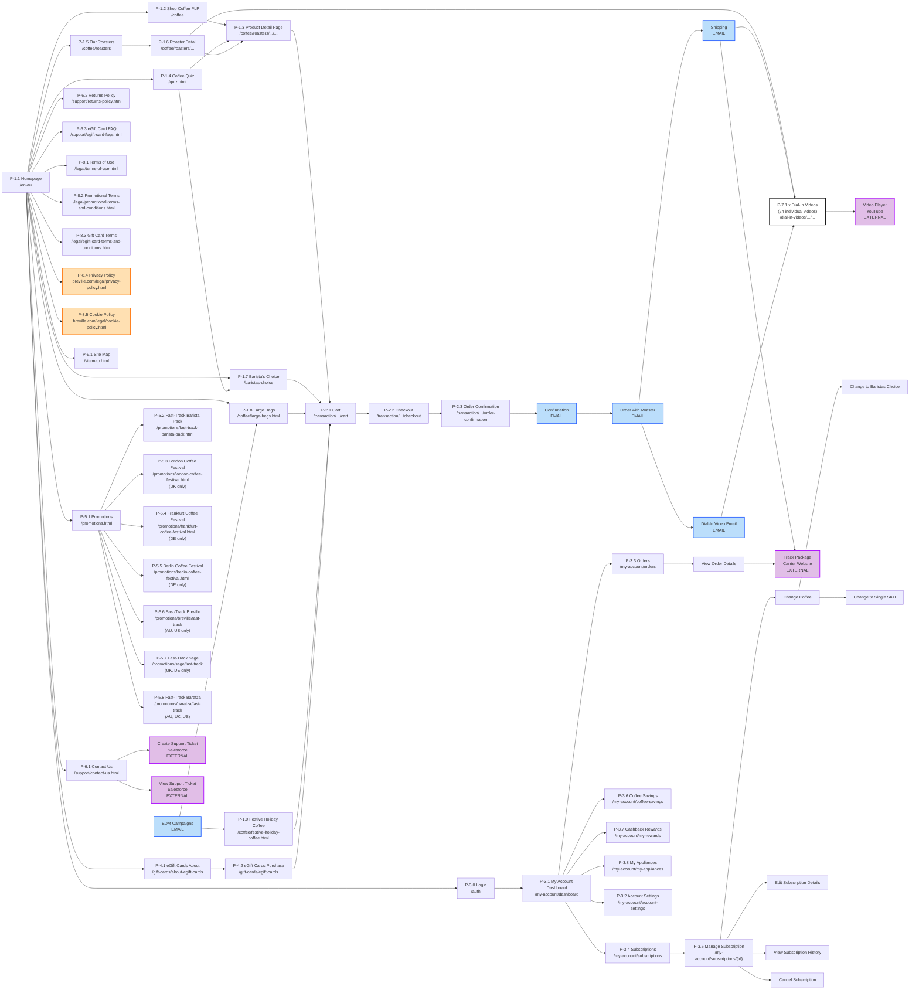

# User Flows

> **Baseline snapshot as of 1 November 2025.** Represents the pre-redesign state of beanz.com user journeys.

The complete page topology: how users navigate between beanz.com pages through discovery, purchase, account management, and support paths.

## Complete User Flow

| Color | Meaning |
|-------|---------|
| Default (gray) | beanz.com pages |
| Blue | Email touchpoints |
| Purple | External systems (YouTube, Salesforce, carriers) |
| Orange | External redirects (Breville.com) |

## Entry Points

| Type | Pages |
|------|-------|
| **Direct** | Homepage (P-1.1), Coffee Quiz (P-1.4), Login (P-3.0), Barista's Choice (P-1.7) |
| **Campaign** | Promotions (P-5.x), FTBP, Coffee Festivals, Fast-Track appliance pages |
| **Email** | EDM → Large Bags / Festive CLPs; Shipping → Dial-In / Tracking; Dial-In Email → Videos |

## Related Files

- [[page-inventory|Page Inventory]] — complete page catalog with IDs, URLs, types, and market availability
- [[emails-and-notifications|Emails and Notifications]] — email triggers that create entry points into the flow

## Open Questions

- [ ] What is the "Support" link from Dashboard — does it go to Contact Us (P-6.1) or a separate page?
- [ ] Do promotion sub-pages (P-5.2–P-5.8) link to Cart directly, or route through PDP first?
- [ ] Are there personalization rules that change page content by segment?
- [ ] Are there planned pages for NL market launch (July 2026)?
