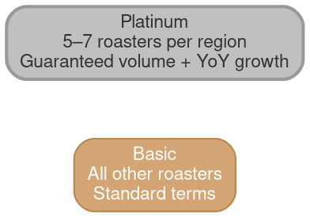

# Platinum Roaster Program

## Quick Reference

- Two-tier roaster model: Platinum (5–7 per region) and Basic (all others)
- 18 roasters formally signed as of FY26H1
- $2M paid to platinum partners collectively in FY26H1
- $1M in incremental machine sales revenue generated by platinum roasters in FY26H1
- Launched October 1, 2025

## Roaster Strategy Framework

Beanz.com harnesses its roaster network to create an unfair advantage for BRG through four value channels:

| Value Channel | Description |
|---------------|-------------|
| **Enhanced performance on beanz** | Guaranteed volume drives roaster investment in beanz.com presence |
| **Specialty sales channel** | Roasters sell Breville machines and grinders as bundles with beans |
| **Content generation engine** | Roasters create TikToks, Reels, blog content, and reviews at scale |
| **Events and in-store activation** | Coffee events, demonstrations at cafes and roastery doors |

## Tier Structure

| Tier | Count | Selection | Terms |
|------|-------|-----------|-------|
| **Platinum** | 5–7 per region | Strategic partners | Guaranteed volume, preferential pricing, early machine access, enhanced visibility, PBB priority |
| **Basic** | All others | Open | Standard beanz.com terms |

## The Carrot: What Platinum Partners Receive

| Incentive | Detail |
|-----------|--------|
| **Guaranteed Volume & YoY Growth** | Predictable coffee volume commitments |
| **Preferential Wholesale Prices** | Better pricing than Basic tier |
| **Early Access to New Coffee Machines** | Preview and prepare for new Breville product launches |
| **Enhanced Visibility** | Priority placement on beanz.com and Fast-Track collateral |
| **Priority for PBB** | First access to Powered by Beanz retail partnerships |

In FY26H1, beanz paid its 18 platinum partners $2M collectively.

## Platinum Partner Commitments

| Commitment | Details |
|------------|---------|
| **Reverse Fast Track Sales** | Sell Breville espresso machines and grinders as a bundle with beans and training, online and in-store |
| **Product Launch Participation** | Active participation in beanz 2.0 launch; generate timely reviews and social posts aligned with campaign calendars and media embargo |
| **Content Creation** | Monthly TikToks & Reels on machine dial-in tips, latte art & technique content, roaster lifestyle content, long-form storytelling for emails and blogs |
| **Operational Excellence** | 95%+ SLA compliance, maintain a 50%+ margin profile |
| **Demonstrations and Events** | Support coffee events, regular demonstration events at cafes and roastery doors |

## How It Works

- 18 roasters have formally signed an agreement
- Agree together on a quarterly business and delivery plan
- Quarterly review to assess performance and set new KPIs
- All requests go through the regional beanz managers

## Platinum Partner Revenue (Oct–Dec 2025)

### US Platinum Roasters

| Roaster | Revenue (AUD) | Volume (KG) |
|---------|--------------|-------------|
| Methodical | $163,740 | 3,727 |
| Equator | $161,120 | 3,685 |
| Olympia | $152,870 | 3,465 |
| Madcap | $139,305 | 2,638 |
| Onyx | $134,760 | 2,490 |
| DOMA | $69,690 | 1,640 |

### AU Platinum Roasters

| Roaster | Revenue (AUD) | Volume (KG) |
|---------|--------------|-------------|
| ST ALi | $102,000 | 2,850 |
| Veneziano | $74,000 | 2,130 |
| Mecca | $66,000 | 1,685 |
| Proud Mary | $48,000 | 1,255 |
| Pablo & Rusty's | $41,000 | 1,165 |

### US Activation Snapshot

| Roaster | Activation |
|---------|-----------|
| Madcap | Play Ground Event |
| DOMA | Home Brew Classes (SOLD OUT) |
| Olympia | 33 grinders + 1 Luxe Brewer sold |

### AU Activations

Platinum partners in AU are executing through three channels:

- **Web optimization**: Clear bundles on roaster websites (e.g., ST ALi Breville landing page), dedicated landing pages (Proud Mary espresso bundles)
- **Blended activations**: Online and in-person events (e.g., Mecca Espresso Sessions)
- **Communications & promotion**: Promotional EDMs (Veneziano), promotional social posts (Pablo & Rusty's), paid advertising

## Incremental Machine Sales

Platinum roasters generated **$1M in incremental machine sales revenue in FY26H1**. This demonstrates the flywheel: guaranteed coffee volume → roaster investment in Breville machines → incremental hardware revenue for BRG.

### All 18 Platinum Roasters

**AU**: Small Batch, Redemption Roasters, Origin, Workshop Coffee, Onyx, Olympia, Equator, Proud Mary, ST ALi, Kickback, Square Mile, Volcano, DOMA, Methodical, Madcap, Pablo & Rusty's, Mecca, Veneziano.

## Related Files

- [[fy27-brand-summit|FY27 Brand Summit]] — Platinum program is the centerpiece of the "Maximize the Roaster Channel" pillar
- [[cy25-performance|CY25 Performance]] — CY25 metrics that enabled the volume guarantee model
- [[ftbp|Fast-Track Barista Pack]] — Platinum partners execute "Reverse Fast Track Sales" (machines + beans + training bundles)
- [[beanz-hub|Beanz Hub]] — B2B platform architecture supporting roaster operations

## Open Questions

- [ ] What are the UK and DE platinum roasters? (Only US and AU were presented)
- [ ] What is the FY27 plan for expanding beyond 18 roasters (mentioned as "more roasters and more tiers")?
- [ ] What is the specific margin profile achieved across platinum partners vs the 50%+ target?
