# Ideas Backlog

## Quick Reference

- 42 active product ideas across 8 themes from Jira Product Discovery (BNZID)
- 12 in development, 10 prioritised, 1 in discovery, 19 backlog
- Key blockers: #057 RCC Replatforming, #056 BLP AU Migration
- Last updated: Mar 13, 2026

## Backlog Framework

### Key Concepts

- **Theme** = Strategic grouping of related ideas (growth, retention, operations, profitability)
- **Effort** = Implementation size: S (small), M (medium), L (large), XL (extra-large)
- **Impact** = Expected business value: Low, Medium, High, XL
- **Status** = Lifecycle stage: Backlog → Prioritised → In Development → Done
- **BNZID** = Jira Product Discovery project tracking all product ideas

## Dependency Graph

```dot
digraph dependencies {
    rankdir=TD;
    fontname="Helvetica,Arial,sans-serif";
    node [fontname="Helvetica,Arial,sans-serif", shape=box, style="rounded,filled", fontsize=11];
    edge [fontname="Helvetica,Arial,sans-serif", fontsize=9];

    N057 [label="#057\nRCC Replatforming", fillcolor="#FB8072", color="#D44535"];
    N056 [label="#056\nBLP AU Migration", fillcolor="#FB8072", color="#D44535"];
    N040 [label="#040\nDynamic Shipper", fillcolor="#FB8072", color="#D44535"];
    N059 [label="#059\nPBB Shipping Fee", fillcolor="#FB8072", color="#D44535"];
    N053 [label="#053\nLoyalty Moments", fillcolor="#FB8072", color="#D44535"];
    N026 [label="#026\nGifting", fillcolor="#FB8072", color="#D44535"];
    N022 [label="#022\nRecommendations", fillcolor="#FB8072", color="#D44535"];
    N061 [label="#061\nAEO/GEO", fillcolor="#FFFFB3", color="#D4C640"];

    N008 [label="#008\nSKU Mgmt", fillcolor="#80B1D3", color="#4A7FA0"];
    N017 [label="#017\nBCC One Stop", fillcolor="#80B1D3", color="#4A7FA0"];
    N051 [label="#051\nRoaster Dashboard", fillcolor="#80B1D3", color="#4A7FA0"];
    N005 [label="#005\nAeropress AU", fillcolor="#80B1D3", color="#4A7FA0"];
    N047 [label="#047\nKeepcup AU", fillcolor="#80B1D3", color="#4A7FA0"];
    N066 [label="#066\nExpress Shipping", fillcolor="#80B1D3", color="#4A7FA0"];
    N048 [label="#048\nWholesale", fillcolor="#80B1D3", color="#4A7FA0"];
    N060 [label="#060\nReferral", fillcolor="#80B1D3", color="#4A7FA0"];
    N035 [label="#035\nPersonalised Quiz", fillcolor="#80B1D3", color="#4A7FA0"];
    N015 [label="#015\nCoffee Discovery", fillcolor="#80B1D3", color="#4A7FA0"];

    N057 -> N008;
    N057 -> N017;
    N057 -> N051;
    N056 -> N005;
    N056 -> N047;
    N040 -> N066;
    N059 -> N048;
    N053 -> N060;
    N026 -> N060;
    N022 -> N035;
    N061 -> N015 [style=dashed, label="supports"];
}
```

**Legend:** Salmon = blocker ideas · Blue = blocked ideas · Yellow = in discovery · Solid arrows = hard dependency · Dashed = supports

## All Active Ideas

| # | Idea | Effort | Impact | Status | Notes |
|---|------|--------|--------|--------|-------|
| 001 | Shopify Finished Goods Sales | L | High | In Dev | Trial in progress; scale planned H1 FY27 |
| 002 | PBB for Mazzer | S | Low | Backlog | Pending commercial agreement |
| 004 | PBB for Best Buy | M/S | Low | Backlog | Pending commercial; unlikely 2026 |
| 005 | PBB for Aeropress (UK/AU) | S | Low | Backlog | UK: tentative H1 FY27 · AU: dep. #056 |
| 006 | PBB for Keepcup (UK) | M | Medium | Prioritised | May 26 launch (commence April) |
| 008 | SKU Onboarding, Updating & Offboarding | M | Low | Backlog | Dep. #057 |
| 009 | Beanz Personalised Playlist | L | Medium | Backlog | |
| 011 | Expand Offers Beyond Free Bags & Cashback | L | High | Backlog | |
| 014 | Subscription Flexibility | M | High | Prioritised | MVP July 26, iterations H1 FY27 |
| 015 | Improve Coffee Discovery | L | High | In Dev | MVP July 26, iterations H1 FY27 |
| 017 | BCC as a Roaster One Stop Shop | L | High | Backlog | Dep. #057 |
| 018 | Personalised Email Communications | M | High | In Dev | MVP July 26, iterations FY27 |
| 019 | Custom Subscription & Playlists | M | Low | Prioritised | H1 FY27 |
| 022 | Personalised Coffee Recommendations | M | High | In Dev | MVP July 26, iterations FY27 |
| 025 | Cross-Border Shipping (Schengen) | — | — | In Dev | July 26 launch |
| 026 | Beanz Gifting & Giftcard Experience | S | Low | Backlog | |
| 028 | Proactive Engagement of At Risk Customers | L | High | In Dev | MVP July 26, iterations FY27 |
| 035 | Personalised Coffee Quiz | S | Medium | In Dev | MVP July 26, iterations FY27 |
| 037 | Netherlands Rollout | — | — | In Dev | July 26 launch |
| 040 | Dynamic Shipper Selector | L | High | Prioritised | H1 FY27 |
| 043 | Automate Operations & Exception Handling | M | High | Backlog | |
| 045 | Cross-Regional Shipping (Multi Currency) | XL | XL | Backlog | |
| 047 | PBB for Keepcup (AU) | M | Medium | Prioritised | H1 FY27; dep. #056 |
| 048 | Wholesale Ordering | L | Low | Prioritised | MVP H1 FY27, iterations H2 FY27 |
| 049 | Fulfilment Failure Attribution Model | L | Low | Backlog | |
| 050 | Enabling Change Coffee for Discounted Customers | M | Low | Backlog | |
| 051 | Roaster Performance Dashboard (BCC) | S | High | Prioritised | H2 FY27; dep. #057 |
| 052 | Turn a Disrupted Experience to a Delightful One | M | Medium | Backlog | |
| 053 | Loyalty Moments | L | High | Backlog | |
| 054 | Non-Coffee Subscriptions | L | TBC | Backlog | |
| 055 | Product Bundles | M | TBC | Backlog | |
| 056 | BLP Migration for AU Roasters | L | Low | Prioritised | H1 FY27; blocker for #005 AU, #047 |
| 057 | RCC Replatforming (3 Phases) | XL | Low | In Dev | P1: April · P2: July · P3: Prioritised H1 FY27 |
| 058 | Accessories Marketplace | L | XL | Prioritised | MVP FY27 |
| 059 | PBB Shipping Fee Pass Through | S | Medium | In Dev | Dep. for #048 |
| 060 | Referral / Advocacy Program | M | TBC | Backlog | Dep. #053 + #026 |
| 061 | AEO/GEO Optimisation | TBC | TBC | In Discovery | H1 FY27 consideration |
| 062 | ShipStation Termination & Replacement | XL | Low | In Dev | Jan 27 termination target |
| 063 | [[project-feral\|Project Feral]] (Experimentation Platform) | L | XL | In Dev | Foundations now; at scale H1 FY27 |
| 064 | Self-Serve Partner Payment Management | TBC | TBC | Backlog | |
| 065 | Custom Shopify App for Beanz & Breville | TBC | TBC | Backlog | |
| 066 | Express Shipping Option | M | TBC | Backlog | Dep. #040 |

### Status Summary

| Status | Count | Ideas |
|--------|-------|-------|
| **In Development** | 12 | #001 (trial), #015, #018, #022, #025, #028, #035, #037, #057 (P1+P2), #059, #062, #063 |
| **In Discovery** | 1 | #061 |
| **Prioritised** | 10 | #006, #014, #019, #040, #047, #048, #051, #056, #057 (P3), #058 |
| **Backlog** | 19 | #002, #004, #005, #008, #009, #011, #017, #026, #043, #045, #049, #050, #052, #053, #054, #055, #060, #064, #065, #066 |

## Idea Detail by Theme

### Global & Channel Expansion — PBB

#### #001: Shopify Finished Goods Sales

**BNZID-26** · Theme: Profitability / Machine + Global & Channel Expansion / PBB

Enable roaster/partner Shopify stores to sell BRG finished goods (grinders, espresso machines) with automated drop-ship fulfillment to end customers. Includes Shopify integration to ingest/update SKUs, place drop ship orders, take payment upfront (credit card), invoice and track.

- **Areas:** Fulfillment, Partner Integration, Checkout · **Segments:** Roaster Partner, Small Retailer, Brand Partner
- **Phasing:** P1 Trial (Coffee Bros, Fjord, Aeropress, St Ali, Kiss the Hippo) → P2 Scale (5-20+) → P3 Iterate
- **Dependencies:** D365 integration, multibrand order splitting/fulfillment logic, partner ops enablement, #064 (self-serve payment for scale phase)
- **Open Questions:** Single vs. dual invoice; end-customer email comms ownership; SKU entitlement rules
- **Reference:** [Confluence PRD](https://breville.atlassian.net/wiki/spaces/BEANZ/pages/5677678730)

#### #002: PBB for Mazzer

**BNZID-42** · Theme: Global & Channel Expansion / PBB

Enable Mazzer to sell Beanz coffee through their DTC using existing PBB services (US).

- **Areas:** Partner Integration, Subscription, Checkout · **Segments:** Brand Partner, Coffee Enthusiast

#### #004: PBB for Best Buy

**BNZID-40** · Theme: Global & Channel Expansion / PBB

Enable Best Buy to sell Beanz coffee through their DTC using existing PBB services (EDI) — US market.

- **Areas:** Partner Integration, Checkout · **Segments:** Retailer
- **Dependencies:** EDI team
- **Notes:** Unlikely to happen in 2026

#### #005: PBB for Aeropress (UK/AU)

**BNZID-39** · Theme: Global & Channel Expansion / PBB

Enable Aeropress to sell Beanz coffee in UK & AU using Shopify.

- **Areas:** Partner Integration, Subscription, Checkout · **Segments:** Brand Partner, Coffee Enthusiast
- **Dependencies:** AU: [[beanz-label-printing|BLP]] AU roaster migration (#056); UK: None

#### #006: PBB for Keepcup (UK)

**BNZID-38** · Theme: Global & Channel Expansion / PBB

Enable Keepcup UK to sell Beanz coffee subscriptions and one-off purchases through their e-commerce platform via PBB embedded commerce integration.

- **Areas:** Partner Integration, Subscription, Checkout · **Segments:** Brand Partner, Coffee Enthusiast
- **Dependencies:** Keepcup e-commerce platform capabilities, coffee curation strategy, brand/marketing collaboration, customer ownership preferences

#### #047: PBB for Keepcup (AU)

*Jira TBC* · Theme: Global & Channel Expansion / PBB

*(Detail not available in source — summary data only.)*

- **Dependencies:** #056 ([[beanz-label-printing|BLP]] AU Migration)

### Global & Channel Expansion — Beanz.com

#### #025: Cross-Border Shipping (Schengen)

**BNZID-24** · Theme: Global & Channel Expansion / Beanz.com

Enable cross-border shipping within single currency, Schengen region.

- **Areas:** Fulfillment, Discovery · **Segments:** Coffee Enthusiast
- **Target:** July 2026 (DE/NL corridor first phase)
- **Next Phase:** Adding Benelux to existing DE/NL setup (FY27)
- **Dependencies:** PostNL integration, NL go-live (#037)

#### #037: Netherlands Rollout

**BNZID-28** · Theme: Global & Channel Expansion / Beanz.com

Go live Netherlands website, domestic shipping and cross-border shipping to DE.

- **Areas:** Content, Fulfillment, Partner Integration · **Segments:** Coffee Enthusiast (NL)
- **Target:** July 2026
- **Dependencies:** PostNL integration, [[beanz-hub|BCC]] replatform (#057), UX redesign on beanz.com, translations, new roaster partnerships

#### #045: Cross-Regional Shipping (Multi Currency)

**BNZID-44** · Theme: Global & Channel Expansion / Beanz.com

Enable customers in other regions to purchase coffee where currency differs and customs/duties are required (e.g., USA/Canada or UK/EMEA).

- **Areas:** Fulfillment, Discovery · **Segments:** Coffee Enthusiast
- **Dependencies:** International shipping, customs/duties handling, multi-currency payment processing, cost modeling

### Customer Acquisition

#### #015: Improve Coffee Discovery

**BNZID-12** · Theme: Customer Acquisition / Onboarding & Conversion

Make it easy for customers to search, discover and get recommendations for coffee — via web, app, agentic tools and search tools.

- **Areas:** Discovery, Content, Coffee App · **Segments:** Coffee Enthusiast
- **Dependencies:** Requires AEO/GEO guidance (#061)

#### #022: Personalised Coffee Recommendations

**BNZID-5** · Theme: Customer Acquisition / Onboarding & Conversion + Customer Retention

AI/ML-driven coffee recommendations based on customer preferences and behavior — driving quiz results, cross-sell/upsell positions, personalised homepage & landing pages, email marketing & change coffee suggestions.

- **Areas:** Discovery, Analytics, Coffee App · **Segments:** Coffee Enthusiast
- **Dependencies:** CVM, data analytics team

#### #035: Personalised Coffee Quiz

**BNZID-30** · Theme: Customer Acquisition / Onboarding & Conversion

Cater questions and recommendations to [[customer-segments|customer segments]] & cohorts.

- **Areas:** Discovery, Content · **Segments:** Coffee Enthusiast
- **Dependencies:** #022 (recommendations engine drives quiz results)

#### #026: Beanz Gifting & Giftcard Experience

**BNZID-23** · Theme: Customer Acquisition / Organic + Profitability / Coffee

Enable customers to purchase and send coffee subscriptions or one-off orders as gifts.

- **Areas:** Checkout, Subscription · **Segments:** Coffee Enthusiast
- **Dependencies:** Voucherify, cart & checkout

#### #060: Referral / Advocacy Program

*Jira TBC* · Theme: Customer Acquisition / Organic

Enable customers to refer friends and earn rewards, creating a viral acquisition loop. Integrates with loyalty moments (#053) and gifting (#026).

- **Areas:** Content, Checkout · **Segments:** Coffee Enthusiast

#### #061: AEO/GEO Optimisation

*Jira TBC* · Theme: Customer Acquisition / Organic

Optimise Beanz content and product data for AI search engines (ChatGPT, Perplexity, Google AI Overviews, Gemini) to ensure Beanz is discoverable and recommended when customers use AI tools to find specialty coffee. Supports #015.

- **Areas:** Content, Discovery · **Segments:** Coffee Enthusiast

### Customer Retention

#### #014: Subscription Flexibility

**BNZID-13** · Theme: Customer Retention / Churn

Add functions such as quick order, pause, change; switch from large bag to small bag subscriptions; switch from Barista's Choice to single SKU and vice versa; reorder a SKU in Barista's Choice.

- **Areas:** Subscription · **Segments:** Coffee Enthusiast

#### #019: Custom Subscription & Playlists

**BNZID-8** · Theme: Customer Retention / Churn

Enable full playlist subscription to enable flexibility around subscription composition and cadence.

- **Areas:** Subscription · **Segments:** Coffee Enthusiast

#### #009: Beanz Personalised Playlist

**BNZID-35** · Theme: Customer Retention

Personalised coffee playlists with mechanics including: like/tried reprioritising coffee preferences, recommend coffees to add to playlist, swap and change playlist, mixed bag size per delivery.

- **Areas:** Subscription, Discovery · **Segments:** Coffee Enthusiast

#### #028: Proactive Engagement of At Risk Customers

**BNZID-21** · Theme: Customer Retention / Churn

Use email comms and MyBeanz to trigger personalised comms and incentives to prevent churn. Targets the [[customer-segments|At Risk]] customer segment.

- **Areas:** Subscription, Content, Analytics · **Segments:** Coffee Enthusiast

#### #018: Personalised Email Communications

**BNZID-9** · Theme: Customer Retention / Email

Use insights, segment analysis & triggers to customise email content.

- **Areas:** Content, Analytics · **Segments:** Coffee Enthusiast

#### #050: Enabling Change Coffee for Discounted Customers

*Jira TBC* · Theme: Customer Retention

Allow discounted customers to change coffee within certain business rules & restrictions.

- **Areas:** Subscription · **Segments:** Coffee Enthusiast

#### #052: Turn a Disrupted Experience to a Delightful One

*Jira TBC* · Theme: Customer Retention

Capture the significance of a disrupted experience (e.g., order not delivered, incorrect order, delayed order) and scale a response to remediate using incentives or gifting — reducing churn risk.

- **Areas:** Subscription, Content · **Segments:** Coffee Enthusiast

#### #053: Loyalty Moments

*Jira TBC* · Theme: Customer Retention

Recognise and celebrate customer milestones — such as 10th bag, 1-year anniversary, subscription streak, trying all roasters in a region — and trigger personalised moments via comms, gifts, or incentives.

- **Areas:** Content, Analytics, Subscription · **Segments:** Coffee Enthusiast

### Operational Excellence

#### #017: BCC as a Roaster One Stop Shop

**BNZID-10** · Theme: Roaster/Vendor Relationships + Operational Excellence

Enable roasters to self-serve: cancel an order, upload & update assets in vault, review performance, Beanz order dashboard, invoice & payment reconciliation.

- **Areas:** Roaster Tools, Partner Integration · **Segments:** Roaster Partner

#### #043: Automate Operations & Exception Handling

**BNZID-46** · Theme: Operational Excellence

Operational process and system improvements to reduce manual work and increase scalability.

- **Areas:** Roaster Tools, Analytics, Fulfillment

#### #008: SKU Onboarding, Updating & Offboarding

**BNZID-36** · Theme: Operational Excellence

Make SKU management self-serve for roasters with guardrails to reduce admin overhead. Enable product offboarding for deprecated SKUs.

- **Areas:** Roaster Tools · **Segments:** Roaster Partner

#### #049: Fulfilment Failure Attribution Model

*Jira TBC* · Theme: Operational Excellence + Profitability

Charge shipping and SKU costs to the relevant party at fault — roaster for incorrect fulfilment, shipper for delivery failures, Beanz for other reasons.

- **Areas:** Fulfillment, Analytics · **Segments:** Roaster Partner

#### #051: Roaster Performance Dashboard (BCC)

*Jira TBC* · Theme: Roaster/Vendor Relationships + Operational Excellence

Enable forecasting and performance data within [[beanz-hub|BCC]] so roasters have access to real-time information about their operations and sales.

- **Areas:** Roaster Tools, Analytics · **Segments:** Roaster Partner

#### #062: ShipStation Termination & Replacement

*Jira TBC* · Theme: Operational Excellence

Migrate remaining ShipStation dependencies (address validation) to alternative solution and terminate Auctane contract ahead of January 2027 auto-renewal (30-day written notice required by December 2026).

- **Areas:** Fulfillment · **Segments:** Roaster Partner

#### #064: Self-Serve Partner Payment Management

*Jira TBC* · Theme: Operational Excellence + Global & Channel Expansion / PBB

Enable roasters and small B2B partners to manage their own credit card and payment details through a self-service portal. Required for #001 Phase 2 (scale from 5 to 20+ partners).

- **Areas:** Partner Integration, Checkout · **Segments:** Roaster Partner, Retailer

### Profitability

#### #040: Dynamic Shipper Selector

**BNZID-49** · Theme: Operational Excellence + Profitability

Ability to determine best shipper for an order based on cost and service promise. Enabling customers to select express delivery for additional cost.

- **Areas:** Fulfillment · **Segments:** Coffee Enthusiast
- **Enablers:** Hyperlocal capability, [[beanz-label-printing|BLP]]

#### #048: Wholesale Ordering

*Jira TBC* · Theme: Profitability + Operational Excellence

Enable roasters to fulfil bulk orders for PBB partners and business customers. Enable orders requiring more than a single label/box to be fulfilled and shipped using multiple shipping labels with relevant shipping fees passed to the retailer or business customer.

- **Areas:** Fulfillment, Partner Integration · **Segments:** Roaster Partner, Retailer
- **Dependencies:** #059 (PBB Shipping Fee Pass Through)

#### #054: Non-Coffee Subscriptions

*Jira TBC* · Theme: Profitability / Beyond Coffee + Customer Retention

Enable specialist subscriptions to complement coffee — matcha, chai, syrups, decaf collections.

- **Areas:** Subscription, Discovery · **Segments:** Coffee Enthusiast

#### #055: Product Bundles

*Jira TBC* · Theme: Profitability / Coffee + Customer Acquisition

Enable bundle offerings for recipes (e.g., dirty chai bundle), roaster bundles, merch/coffee bundles.

- **Areas:** Checkout, Discovery · **Segments:** Coffee Enthusiast

#### #059: PBB Shipping Fee Pass Through

*Jira TBC* · Theme: Profitability + Operational Excellence

Enable Beanz to pass through actual shipping fees to partners on PBB to ensure Beanz and roasters remain cost neutral on these transactions.

- **Areas:** Fulfillment, Partner Integration · **Segments:** Roaster Partner, Retailer

### Profitability — Marketplace & Shipping

#### #058: Accessories Marketplace

*Jira TBC* · Theme: Profitability / Beyond Coffee

Enable beanz.com to sell accessories, pantry staples, merchandise and non-coffee products using 3rd party suppliers.

- **Areas:** Checkout, Discovery, Partner Integration · **Segments:** Coffee Enthusiast

#### #066: Express Shipping Option

*Jira TBC* · Theme: Customer Retention + Profitability

Enable customers to select express shipping option for faster delivery, real-time estimation for a differentiated shipping fee.

- **Areas:** Fulfillment · **Segments:** Coffee Enthusiast

### Platform & Infrastructure

#### #056: BLP Migration for AU Roasters

*Jira TBC* · Theme: Operational Excellence

Move all AU roasters to [[beanz-label-printing|BLP]] using Beanz AU Post account.

- **Areas:** Fulfillment · **Segments:** Roaster Partner
- **Notes:** Blocker for #005 AU, #047

#### #057: RCC Replatforming (3 Phases)

*Jira TBC* · Theme: Operational Excellence

Replatform the existing RCC to React for roasters and admin to decommission the existing Salesforce portal.

- **Areas:** Roaster Tools, Partner Integration · **Segments:** Roaster Partner
- **Phasing:** P1 existing RCC roaster functionality (April 26) → P2 extend for cross-border selling (July 26) → P3 existing RCC admin functionality (H1 FY27)
- **Notes:** Blocker for #008, #017, #051

#### #065: Custom Shopify App for Beanz & Breville

*Jira TBC* · Theme: Global & Channel Expansion / PBB + Profitability

Enable self-serve partner onboarding to Shopify & ongoing communications with partners through a custom app — enabling Beanz, PBB & FG sales.

- **Areas:** Partner Integration, Roaster Tools · **Segments:** Roaster Partner, Retailer, Brand Partner

### Cross-Theme

#### #011: Expand Offers Beyond Free Bags & Cashback

**BNZID-33** · Theme: Customer Acquisition + Customer Retention

Diversify offer mechanisms (% discounts, bundles, tiered incentives); run parallel campaigns; offer customer choice between offers; use for both acquisition and retention.

- **Areas:** Checkout, Content · **Segments:** Coffee Enthusiast
- **Constraint:** Must respect margin requirements

#### #063: Project Feral (Experimentation Platform)

*Jira TBC* · Theme: Cross-Theme (Customer Acquisition + Customer Retention + Operational Excellence)

Three-pillar experimentation program — data-led insights, front-end A/B testing enablement on beanz.com, personalised email journeys. See [[project-feral|Project Feral]] for full project documentation.

- **Areas:** Analytics, Content · **Segments:** Coffee Enthusiast
- **Gating Prerequisites:** CMS migration, beanz.com redesign on agentic platform, [[customer-segments|customer segments]] live in BlueConic, analytics platform production-ready, Salesforce readiness for personalised email

## Completed

#### #007: Enable Roasters to Sell Appliances via Their Website

**BNZID-37** · Status: Done

## Deleted Ideas

| # | Original Title | Reason |
|---|---------------|--------|
| 003 | Enable Auto Order Cancellation | Captured in another idea |
| 010 | Mixed Bag Size (1kg/2lbs) | Already done |
| 012 | Enable Multi-Brand Basket | Already being delivered |
| 013 | Bring Roaster Partner Features to Forefront | Deleted |
| 016 | Enhance Checkout Journey | Deleted |
| 020 | Beanz App Launch v1.0 | Deleted |
| 021 | Beanz App — Appliance Pairing & Connected Journeys | Deleted |
| 023 | Subscription Pause | Covered in #014 |
| 024 | Hybrid Subscriptions | Covered in redesign |
| 027 | Regional Catalogues (FG) | Not relevant |
| 029 | Hybrid Discovery | Absorbed into #015 |
| 030 | Account Management | Deleted |
| 031 | Enable PBB Partners to Sell Finished Goods | Merged into #001 |
| 032 | Integrate In-Market Partners (EMEA) | Will come as new partners identified |
| 033 | Roaster Profitability | Covered in other initiative |
| 034 | Optimise Core Digital Channels | Deleted |
| 036 | Commercial Growth (Brand/Retail Partners) | Deleted |
| 038 | Elevate Subscription Experience | Covered in redesign |
| 039 | Margin Optimisation via Commercial Levers | Not specific enough |
| 041 | Marketing/Traffic Efficiency | Deleted |
| 042 | Retail Partnerships (PBB Expansion) | Deleted with #036 |
| 044 | Coffee App MVP 2.0 | Deleted |
| 046 | PBB for Williams Sonoma AU | Not relevant |

## Impact Summary

| Impact | Ideas |
|--------|-------|
| **XL** | #045, #058, #063 |
| **High** | #001, #011, #014, #015, #017, #018, #022, #028, #040, #043, #051, #053 |
| **Medium** | #006, #009, #035, #047, #052, #059 |
| **Low** | #002, #004, #005, #008, #019, #026, #048, #049, #050, #056, #057, #062 |
| **TBC** | #054, #055, #060, #061, #064, #065, #066 |

## Timeline View

### In Development (target July 2026)

| Idea | Target |
|------|--------|
| #001 (trial) | In progress |
| #015 Improve Coffee Discovery | MVP July 26 |
| #018 Personalised Email | MVP July 26 |
| #022 Personalised Recommendations | MVP July 26 |
| #025 Cross-Border Shipping (Schengen) | July 26 launch |
| #028 Proactive At Risk Engagement | MVP July 26 |
| #035 Personalised Coffee Quiz | MVP July 26 |
| #037 Netherlands Rollout | July 26 launch |
| #057 RCC Replatforming | P1: April 26, P2: July 26 |
| #059 PBB Shipping Fee Pass Through | In progress |
| #062 ShipStation Termination | Jan 27 target |
| #063 [[project-feral\|Project Feral]] | Foundations now |

### In Discovery

| Idea | Target |
|------|--------|
| #061 AEO/GEO Optimisation | H1 FY27 consideration |

### Prioritised — FY26 H2

| Idea | Target |
|------|--------|
| #006 PBB for Keepcup (UK) | May 26 launch |
| #014 Subscription Flexibility | MVP July 26 |

### Prioritised — H1 FY27

| Idea | Target |
|------|--------|
| #001 (scale phase) | H1 FY27 |
| #019 Custom Subscription & Playlists | H1 FY27 |
| #040 Dynamic Shipper Selector | H1 FY27 |
| #047 PBB for Keepcup (AU) | H1 FY27 (dep. #056) |
| #048 Wholesale Ordering | MVP H1 FY27 |
| #056 BLP AU Migration | H1 FY27 |
| #057 RCC Replatforming P3 | H1 FY27 |
| #058 Accessories Marketplace | MVP FY27 |

### Prioritised — H2 FY27

| Idea | Target |
|------|--------|
| #051 Roaster Performance Dashboard | H2 FY27 (dep. #057) |

### Backlog (19 ideas)

#002, #004, #005, #008, #009, #011, #017, #026, #043, #045, #049, #050, #052, #053, #054, #055, #060, #064, #065, #066

## Related Files

- [[project-feral|Project Feral]] — #063 is the Project Feral experimentation platform
- [[beanz-label-printing|Beanz Label Printing]] — #056 BLP AU Migration depends on existing BLP infrastructure
- [[beanz-hub|Beanz Hub]] — #017, #051, #057 involve BCC/RCC replatforming and roaster tools
- [[customer-segments|Customer Segments]] — #028 targets At Risk segment for proactive churn prevention
- [[market-overview|Market Overview]] — #037 NL rollout and #025 cross-border shipping expand market footprint
- [[ftbp|Fast-Track Barista Pack]] — Multiple acquisition ideas build on FTBP channel

## Open Questions

- [ ] Effort and impact TBC for 7 ideas (#054, #055, #060, #061, #064, #065, #066) — pending sizing
- [ ] #047 PBB for Keepcup (AU) has no detailed description in source — needs enrichment from Jira
