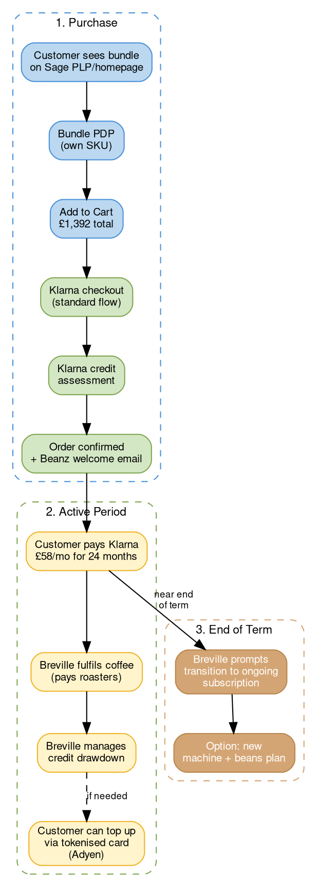

# Operation Freedom

## Quick Reference

- UK-only pilot: Barista Express + 2 years of coffee for £58/mo, £0 upfront, financed via Klarna
- STAMP-approved 2026-03-12, must launch before 2026-06-30 (FY26) — no agreed launch date yet
- Complements [[ftbp|FTBP]] — explicitly not replacing it
- Discount delivery mechanism undecided: promo code preferred over GiveX gift card for MVP

## Bundle Framework

### Key Concepts

- **Coffee Credit** = STAMP-approved term for however the beans value is delivered to the customer (mechanism TBD — see Discount Delivery section)
- **Merchant of Record (MOR)** = Klarna acts as the regulated party for financing, removing Breville's need for an FCA license
- **Walk-away value** = The customer-facing framing: "50% off your machine". In reality, the discount is the standard 25% off beans (same as [[ftbp|FTBP]]), but because the customer prepays all beans upfront, the full discount (~£315) is applied immediately and displayed as a machine discount
- **Bundle SKU** = Dedicated product listing separate from the standard Barista Express PDP
- **Soft bundle** = Existing commercetools pattern where two SKUs (machine + discount component) are sold together with proportional pricing logic

## Customer Journey

## Offer Structure

| Element | Detail |
|---------|--------|
| **Machine** | Barista Express Impress (£629.95 RRP, displayed as £315 "50% off") |
| **Coffee** | 2 years of beans from 20+ UK roasters (£1,077 value) |
| **Monthly payment** | £58/mo for 24 months at 0% APR via Klarna |
| **Upfront cost** | £0 (first £58 payment due at checkout) |
| **Total bundle** | £1,392 |
| **Customer saving** | ~£278 vs buying machine + beans separately at retail |
| **Actual discount source** | 25% off beans — same margin mechanism as [[ftbp\|FTBP]], but displayed as a machine discount |
| **Coffee delivery** | TBD — see Discount Delivery Mechanism section below |
| **Promo code stacking** | Blocked — cannot combine with other promo codes (scope of exclusion TBD) |
| **FTBP double-dip** | Must be prevented — customer cannot receive both Operation Freedom and FTBP discounts |

### Funding Flow

Klarna reimburses Breville for the full bundle value (machine + beans) upfront, net of Klarna fees. Klarna then manages customer instalment collection. If the customer defaults, Klarna absorbs the risk — Breville has already been paid.

### Financing Economics (from Project Foozy Aug 2024)

| Partner | Fee | Adyen Compatible | Flex Subscriptions |
|---------|-----|------------------|--------------------|
| Klarna | 6.10% | Yes (existing PSP) | No — solved via upfront Coffee Credit |
| PayPal | 4.49% | No (requires Braintree) | Complicated reconciliation |

Klarna chosen despite higher fee because it works with existing Adyen integration and avoids PSP migration.

### Commercial Margins (Ziv Shalev)

The £315 machine discount is funded by ~£260 in beans margin over 2 years plus ~£55 from machine margin. The beans are priced at £1,077 vs ~£1,040 at standard retail — a ~3.5% premium, not inflated to subsidise the machine discount.

## Discount Delivery Mechanism

The original concept delivered the beans value via a GiveX gift card. The [[2026-03-12-operation-freedom-working-session-bundling-kickoff|2026-03-12 working session]] identified significant risks with this approach. Three options are under evaluation:

| Option                   | How It Works                                                              | Pros                                                                                             | Cons                                                                                                                                                                                         | Status                              |
| ------------------------ | ------------------------------------------------------------------------- | ------------------------------------------------------------------------------------------------ | -------------------------------------------------------------------------------------------------------------------------------------------------------------------------------------------- | ----------------------------------- |
| **GiveX gift card**      | Preloaded digital gift card issued post-checkout, redeemable on beanz.com | Already integrated with cart/checkout; cross-brand within region                                 | Funds irrecoverable once paid to GiveX; "total loss" if customer returns or cancels Klarna; fraud risk; ~£10K locked for MVP preloads; high-value card must be hidden from other storefronts | Original concept — risks identified |
| **Promo code with cap**  | Discount code with a spending cap (e.g., £1,077), issued post-checkout    | Simple; avoids GiveX financial risk; can be managed manually for 1-month MVP; no preload capital | Needs new logic for capped codes; must prevent stacking with FTBP and other promos                                                                                                           | **Preferred for MVP**               |
| **Credit/points system** | Beanz account credit or loyalty points                                    | Could become foundation for future loyalty scheme                                                | More build required; not viable for MVP                                                                                                                                                      | Future consideration                |

**Key risks with GiveX (original approach):**
- Money paid to GiveX is irrecoverable if the customer doesn't redeem the balance
- If customer cancels Klarna instalments after purchase, Breville loses both the transaction and the gift card value
- Customer could use the gift card to buy a Breville machine instead of coffee
- Gift cards work cross-brand (Sage/Breville/Beanz within a region) — the high-value bundle card would need to be restricted from appearing on other storefronts

**Existing soft bundle SKU logic will not work as-is.** The current proportional discount calculation used for soft bundles does not support Operation Freedom's pricing model (50% off machine display + separate fixed coffee credit price). New logic would be required regardless of which discount delivery option is chosen.

**Decision pending.** Justin Le Good is compiling an options document with pros/cons for each approach.

## Regulatory & Onboarding Status

| Workstream | Owner | Status (as of 2026-03-12) |
|------------|-------|--------------------------|
| Klarna MOR onboarding | Slade Devereux (Klarna) | IAR submitted, awaiting review |
| Klarna KYC documentation | Ali Inayat + Ian Fahy | UK entity confirmed (BRG Appliances Limited, Co. 8223512) |
| Adyen pricing validation | Matthew Campbell (Adyen) | Confirmed — same commercials as 2024 |
| Adyen MOR enablement | Matthew Campbell (Adyen) | In progress (new structure for Adyen) |
| FCA licensing | N/A | Not required — Klarna MOR structure removes this blocker |
| Klarna integration structure | Pam Liang + Manju | Under investigation — this is a different Klarna setup (zero-interest, different merchant fee) and may require a separate agreement or Adyen pipeline |

## Scope & Constraints

**In scope (pilot):**
- UK market only (Sage brand)
- Barista Express Impress only
- Digital Coffee Credit only (no physical card)
- sageappliances.com only

**Out of scope (future, if pilot succeeds):**
- Other markets (AU, US, DE)
- Other machine models
- Physical card (potentially merged with Magic Tap card)
- Cleaning products and accessories in bundle

**FTBP relationship:** Operation Freedom is explicitly an *additional* program alongside FTBP, not a replacement. A customer buying through this bundle would not also use FTBP — the £315 machine discount replaces the FTBP discount mechanism.

## Development Requirements

| Area | Squad | Scope |
|------|-------|-------|
| PLP + PDP | Phoenix / Oracles | Bundle listing page, dedicated bundle PDP (own SKU) |
| Payments | Cart & Checkout | Klarna integration, payment flow, Coffee Credit delivery (mechanism TBD) |
| Emails | CVM Team | Beanz welcome email, lifecycle communications |

**Original estimate:** 3 sprints / 6 weeks (provided Dec 2025). This estimate predates the discovery that soft bundle SKU logic and Klarna integration are more complex than initially assumed. Estimate needs revision once discount delivery mechanism is decided.

**Key technical decisions:**
- Bundle implemented as its own SKU — separate PDP rather than modifying existing Barista Express PDP
- Existing soft bundle pricing logic will not work as-is (proportional discount calc doesn't support this model)
- Klarna integration for this bundle may differ from today's setup (zero-interest, different merchant fee structure)

## Team

| Role | Person |
|------|--------|
| Project Lead | Andrew Sirotnik (Chief Solutions Officer) |
| Program Manager | Nell Welch (Customer Experience Lead) |
| Product Owner / Engineering | Justin Le Good |
| Design Director | Kevin Bauer |
| Finance Partner Lead | Ali Inayat |
| President SAGE EMEA | David Gubbin |
| EMEA Sales Lead | Mark Adams |
| Digital Sales Lead | Matt Holland |
| Local Finance (UK) | Ian Fahy |
| Marketing | Raymon So |

## STAMP Approval (2026-03-12)

STAMP (senior leadership) approved Operation Freedom with full alignment. Key decisions:

- Must launch this FY (before 2026-06-30)
- Digital card only for pilot (physical card is a future consideration)
- If pilot succeeds, expand to cleaning products and accessories
- Copy and branding feedback provided to design team (Kevin Bauer owns)

**Note:** Andrew Sirotnik proposed May 15 as a target during STAMP. The [[2026-03-12-operation-freedom-working-session-bundling-kickoff|platform working session]] the same day determined this is not feasible given unresolved questions around payment mechanics, SKU setup, and discount delivery. No agreed launch date exists as of 2026-03-12.

## Key Resources

- **Figma:** Operation Freedom design comps (Kevin Bauer)
- **Slack:** #ft-operation-free-dom (C09SYGGGDRS)
- **SharePoint:** Project Foozy Documents (central file store)
- **Miro:** Visual collaboration board

## Lineage

Operation Freedom evolved from **Project Foozy** (Aug 2024), which was itself a "relaxed attempt" to achieve the original **Project Fusion** vision. The core idea — subsidise machines with coffee margin, lock customers in via financing — has been consistent since Fusion, but the execution evolved from cashback (Fusion/FTBP) to upfront credit (Foozy/Freedom).

| Era | Name | Mechanic | Status |
|-----|------|----------|--------|
| 2021–2023 | [[acquisition-programs\|Coffee Essentials]] | DTC bundle: machine + 12-bag sub commitment at 20% off | Closed |
| Jul–Oct 2023 | [[acquisition-programs\|Project Fusion]] | Cashback via OPIA, GWP bags | Closed |
| Sep 2024–present | [[ftbp\|FTBP v1/v2]] | Machine registration → free bags → discount | v2 active |
| Aug 2024 | Project Foozy | Financing exploration (Klarna/PayPal feasibility) | Evolved into Freedom |
| Nov 2025–present | **Operation Freedom** | Zero-upfront bundle via Klarna financing | In progress |

## Related Files

- [[ftbp|Fast-Track Barista Pack]] — Freedom complements FTBP; uses the same 25% beans discount but delivers it upfront; must prevent double-dip
- [[acquisition-programs|Acquisition Programs]] — Freedom is the next evolution in the acquisition program lineage
- [[affordability-economics|Affordability Economics]] — Bundle pricing builds on 1kg affordability strategy
- [[platinum-roaster-program|Platinum Roaster Program]] — Platinum "Reverse Fast Track Sales" is the decentralised version of machine+beans bundles
- [[operation-freedom-requirements|Operation Freedom: Requirements]] — Product requirements for bundling, discount delivery, payments, and FTBP safeguards
- [[2026-03-12-operation-freedom-working-session-bundling-kickoff|Bundling Kickoff Meeting]] — Platform working session that surfaced GiveX risks, soft bundle limitations, and Klarna integration complexity

## Open Questions

- [ ] Which discount delivery mechanism will be used for MVP? (Justin compiling options doc — gift card vs promo code vs credit)
- [ ] What is the Klarna integration structure for this bundle? (Different from today's setup — zero-interest, different merchant fee, may need separate Adyen pipeline; Pam + Manju investigating)
- [ ] Can existing soft bundle SKU logic be adapted, or is new pricing logic required? (Manju investigating)
- [ ] What happens to the Coffee Credit if a customer returns the machine or cancels Klarna instalments?
- [ ] Should the bundle SKU be excluded from all promo codes (staff, affiliation, GTM) or specific ones only? (Justin checking with Andrew)
- [ ] What are the success metrics for the pilot?
- [ ] What is the realistic launch date given unresolved technical questions?
