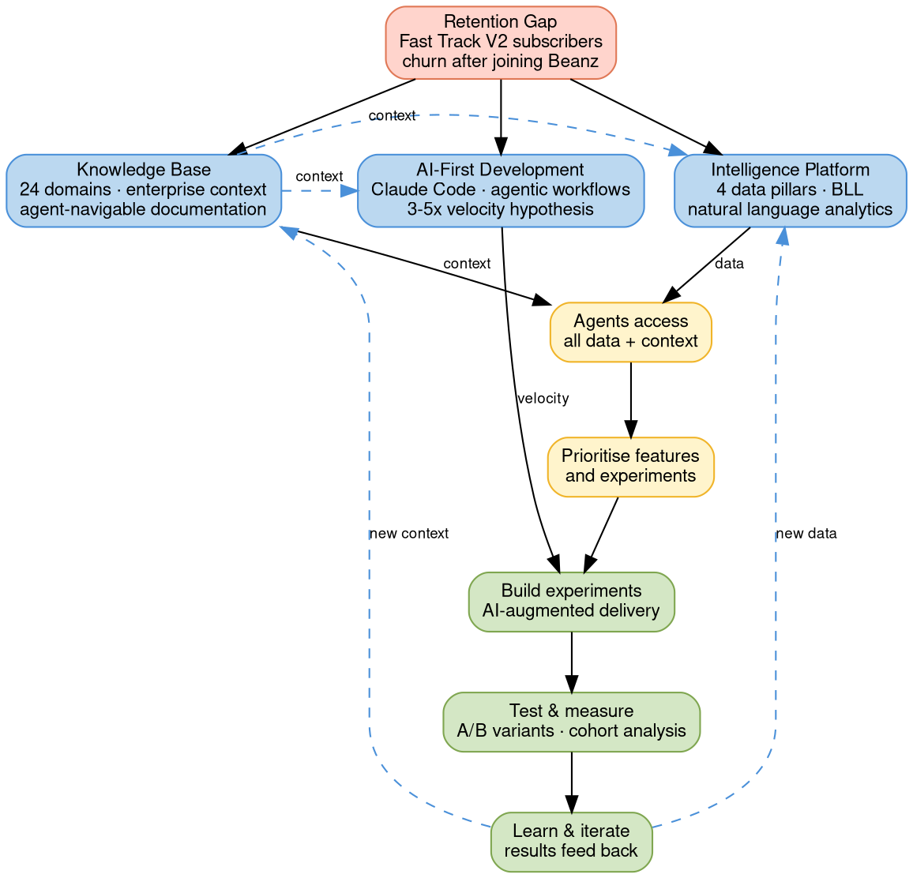

# Project Feral

## Quick Reference

- 26-week initiative: AI-augmented development to accelerate Beanz customer retention
- Three enabling systems: Knowledge Base, Intelligence Platform, AI-first development
- Retention experiments are the first test-learn-iterate cycle using all three systems

## Project Framework

### Key Concepts

- **FERAL** = Fast Experimentation, Rapid AI Learning
- **Three Enabling Systems** = Knowledge Base (context) + Intelligence Platform (data) + AI-First Dev (velocity)
- **Four Data Pillars** = Behavioral Insights, Customer Segmentation, Knowledge Base, Business Data (Intelligence Platform's internal structure)
- **Build-Test-Learn** = Rapid iteration cycle where experiment results feed back into KB and data
- **Fast Track V2** = Customers acquired through Breville machine promotions (primary retention target)
- **Business Language Layer** = Translation engine mapping business terms to data fields

## Project Architecture

*Colors: Red = problem, Blue = enabling systems, Yellow = agent layer, Green = experiment cycle. Dashed edges = feedback loops.*

## Workstream Overview

| System                    | Workstream                                        | Status      | Lead        |
| ------------------------- | ------------------------------------------------- | ----------- | ----------- |
| **Knowledge Base**        | Enterprise context documentation (24 domains)     | Active      | Product     |
| **Knowledge Base**        | KB platform and validation pipeline               | Complete    | Platform    |
| **Intelligence Platform** | Four data pillars and Business Language Layer     | Draft       | Platform    |
| **Intelligence Platform** | Data integration and unified analytics layer      | In progress | Data Team   |
| **AI-First Dev**          | Claude Code rollout and agentic workflows         | Active      | AI Dev Lead |
| **AI-First Dev**          | AI development playbook and code review standards | Planned     | AI Dev Lead |
| **Retention**             | Foundation prerequisites (email, churn, data)     | Planned     | Data Team   |
| **Retention**             | Cancellation flow variants (3 designs)            | Planned     | Product     |
| **Retention**             | Coffee collections (5 concepts)                   | Planned     | Product     |
| **Retention**             | Onboarding questionnaires (3 versions)            | Planned     | Product     |
| **Retention**             | Email engagement strategy by cohort               | Planned     | CRM         |

## Vision

The [[kb-platform-architecture|Knowledge Base]] provides enterprise-level context across all 24 domains. The [[intelligence-platform|Intelligence Platform]] provides data insights through its four data pillars. Together, AI agents have access to both context and data — enabling them to help prioritise features, assist developers in quickly delivering experiments, and feed results back into the system. The goal is a connected loop where every experiment makes the platform smarter.

## The Challenge

Fast Track V2 customers join through Breville machine promotions but struggle with retention once in the Beanz ecosystem.

| Gap | Description |
|-----|-------------|
| **Database** | Fast Track customers not integrated into Beanz database |
| **Communication** | Cannot effectively email or engage this cohort |
| **Retention** | Common cancellation reasons: too much coffee, price, lack of engagement |

**Hypothesis:** AI-augmented development can deliver 3-5x faster experimentation, enabling rapid iteration on retention interventions.

## Enabling Systems

### Knowledge Base

This repository — an AI-first documentation platform with 24 domain areas, validation pipelines, and quality gates. Agents navigate via static _index.md files and wikilinks, with the kb-author skill enforcing documentation standards. See [[kb-platform-architecture|KB Platform Architecture]] for full architectural detail.

### Intelligence Platform

Cross-functional analytics platform translating natural language business questions into answers across four data pillars: Behavioral Insights, Customer Segmentation, Knowledge Base, and Business Data. The Business Language Layer bridges KB glossary terms to analytics data dictionary fields. See [[intelligence-platform|Intelligence Platform]] for pillars, data flow architecture, and delivery roadmap.

### AI-First Development

The Beanz codebase is being refactored for AI-first development. The full team has access to Claude Code with agentic workflows. Key deliverables:

| Deliverable | Description |
|------------|-------------|
| AI Development Playbook | Tools, prompts, and workflows documentation |
| Code Review Checklist | Specific to AI-generated code validation |
| Velocity Baseline | Measurement for comparison tracking |

## Retention Experiments

Four parallel experiment workstreams targeting [[ftbp|Fast Track V2]] retention. Foundation work (Weeks 1-5) must complete before experiments begin (Weeks 5-12).

### Foundation (Weeks 1-5)

| Workstream | Goal | Timeline |
|-----------|------|----------|
| Email Database Integration | Enable emailing Fast Track V2 customers — 100% visible in Beanz database | Wk 1-2 |
| Churn Analysis Framework | Agreed churn metrics, cohort definitions, baseline retention curves | Wk 1-2 |
| Data Integration | Unified analytics layer connecting Mixpanel, PowerBI, Salesforce, Blueconic, Commerce Tools, D365 | Wk 1-3 |
| Technical Enablement | Roadmap capacity, component library audit, Marketing Cloud capabilities | Wk 3-5 |

### 3.1 Cancellation Flow: Three Variants

| | Variant A | Variant B | Variant C |
|---|-----------|-----------|-----------|
| **Strategy** | Reason-Based Intervention | Friction Reduction | Value Reinforcement |
| **Approach** | Detect reason, offer personalised solution | One-click options before cancel | Show cumulative benefits before confirmation |
| **"Too much coffee"** | Reduce frequency | Pause 1 month | Cumulative savings |
| **"Price"** | Discount offer | Skip next delivery | Upcoming exclusive coffees |
| **"Quality"** | Premium sample | Reduce quantity by 50% | Loyalty benefits earned |

**Timeline:** Research Wk 5-6, Design Wk 7-8

### 3.2 Coffee Collections: Five Concepts

| Collection | Price | Positioning |
|-----------|-------|-------------|
| Bold Collection | $16/bag | Dark roasts, accessible entry point, consistent flavour |
| Adventurous Collection | $22/bag | Premium single origins, limited exclusives, rotating roster |
| Espresso Lovers | $18/bag | Optimised for home espresso machines, blend focus |
| Origin Series | $20/bag | Single country focus (Ethiopia, Colombia), educational journey |
| Decaf Devotee | $17/bag | Premium decaf options, variety without caffeine |

### 3.3 Onboarding Questionnaires: Three Versions

| | Version A: Quick Profile | Version B: Machine-Centric | Version C: Journey-Based |
|---|--------------------------|---------------------------|-------------------------|
| **Questions** | 3-4 | 5-6 | 6-8 |
| **Focus** | Taste preference, consumption volume, grind type | Equipment type, brewing method, skill level | Coffee experience, goals, willingness to explore |
| **Logic** | Fast recommendation, minimal friction | Tailored to setup, technical confidence | Personalised path, higher engagement |

**Success Metrics:** Completion rate, conversion to subscription, 30/60/90-day retention by version, satisfaction with recommendations.

### 3.4 Email Engagement Strategy by Cohort

| Cohort | Key Touchpoints | Personalisation Focus |
|--------|----------------|----------------------|
| Fast Track V2 | Welcome, first bag, 30-day check-in, renewal | Machine type, Breville integration, equipment tips |
| Organic Sign-up | Welcome, questionnaire result, taste review, explore | Taste profile, journey progression, collection fit |
| Gift Recipients | Gift received, getting started, convert prompt | Gifter preferences, educational content, easy setup |
| At-Risk (All) | Engagement drop alert, win-back, pause option | Historical preferences, last order, special offers |

## Working Group Operations

### Working Groups

| Working Group | Members | Mandate |
|--------------|---------|---------|
| Data Integration | Data Analyst (Lead), Dev, CRM | Connect data sources, build dashboards |
| Email Enablement | CRM Specialist (Lead), Data, Dev | Integrate customers, build segmentation |
| Dev Standards | AI Dev Lead (Lead), Frontend, QA | Component rules, AI coding standards |

### Communication

| Channel | Purpose |
|---------|---------|
| #project-feral | Main project channel |
| #feral-experiments | Test results & hypotheses |
| #feral-data | Analytics & dashboards |
| #feral-dev | Technical discussions |

### Cadence

| Meeting | Frequency |
|---------|-----------|
| Daily Standup | Daily, 15 min |
| Sprint Planning | Weekly |
| Data Review | Weekly |
| Stakeholder Update | Bi-weekly |
| Phase Review | Monthly |

## Master Timeline

| Phase | Weeks | Key Milestones |
|-------|-------|---------------|
| **Foundation** | 1-3 | Wk 2: Email database integrated · Wk 3: Churn metrics agreed |
| **Technical Enablement** | 3-5 | Wk 5: Data layer operational |
| **Experiment Development** | 5-12 | Wk 8: Designs approved · Wk 10: First deployed · Wk 12: Results analysed |
| **Scale** | 13-18 | Wk 18: Successful experiments scaled |
| **Optimise** | 19-26 | Wk 26: Handover to BAU |

## Related Files

- [[intelligence-platform|Intelligence Platform]] — Four data pillars and Business Language Layer powering experiment insights
- [[kb-platform-architecture|KB Platform Architecture]] — Documentation platform providing enterprise context to agents
- [[ftbp|Fast-Track Barista Pack]] — Fast Track V2 acquisition program whose subscribers are the primary retention target
- [[emails-and-notifications|Emails & Notifications]] — Existing notification framework that email engagement strategy builds on
- [[cy25-performance|CY25 Performance]] — Historical performance data baseline for churn analysis framework

## Open Questions

- [ ] Which team members are confirmed and available for Project Feral assignments?
- [ ] What is the agreed-upon primary churn metric (active cancellation vs. subscription lapse vs. payment failure)?
- [ ] How many concurrent experiments can the current sprint capacity support?
- [ ] What Marketing Cloud personalisation and A/B testing capabilities exist today?
