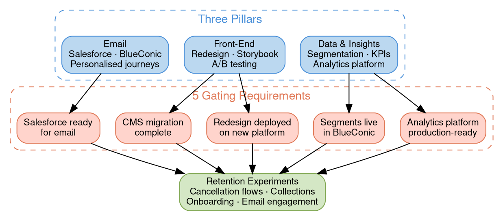

# Project Feral Status — March 2026

## Quick Reference

- Week ~4 of 26: foundation work active, CMS migration is critical path, five gating requirements block experimentation
- Three pillars: Data & Insights, Front-End, Email
- Key dates: Storybook prototype April 6, CMS migration May 13, redesign assets May 29, E2E UAT June 29, NL go-live July 29

## Pillar Framework

- **Data & Insights** = Segmentation, KPIs & analytics platform to measure outcomes
- **Front-End** = beanz.com redesign on agentic platform enabling A/B testing
- **Email** = Triggered personalised journeys via Salesforce & BlueConic

## Project Status Architecture

*Colors: Blue = pillars, Red = gating requirements (all in progress), Green = experiments (blocked). All five gates must clear before experiments begin.*

## What's Done

**Platform & Dev Environment**

- Agentic tooling provisioned (Claude Code as primary dev tool)
- Repo configured for agentic development with agent guardrails
- Storybook instance set up with 53 migrated components (~80% code coverage)
- Hybrid component library finalized (CLT primitives + ShadCN/Tailwind for Beanz)
- KB repo migrated to Breville Digital GitHub org with security guardrails
- Dev environment unblocked (QA configs, AEM synced)
- Discovery Service made agent-tech ready
- Branching strategy finalized, walked through with dev team, published to Confluence
- Beanz V2 changes pushed to production

**CMS & Content**

- CMS migration planned & sequenced with page-level inventory
- Contentful pages rendering with component library (hybrid approach)
- Roaster data flow decision: RCC → Contentful directly (skip PIM)

**Data & Analytics**

- Customer master data tables completed in Databricks
- Churn analysis table created
- Hotjar selected as analytics tool ($36K)
- AEO/GEO analysis completed (identified foundation-level gaps)
- Survey tool comparison completed
- Voucherify report finished

**Prototyping & Onboarding**

- Prototyping setup and Storybook team onboarding completed (Josh, March 4)

**Strategic Decisions**

- CMS migration reprioritized as #1 (AEM decommissioned May)
- Parallel tracks confirmed: CMS migration + redesign prototype
- AB testing hybrid model: Contentful (content) + BlueConic (segmentation)
- Storybook prototype deadline set: April 6

## What's In Progress

| Workstream | Pillar | Owner | Target |
|---|---|---|---|
| CMS migration (AEM → Contentful) | Front-End | Easwar | May 13 |
| beanz.com redesign UX finalisation | Front-End | Sophie / Justin / Ziv | TBD |
| Storybook prototype for redesign | Front-End | Justin | April 6 |
| Customer segmentation definition | Data & Email | Justin / Jenn | TBD |
| Retention metrics & success baselining | Data | Jenn / Ziv | TBD |
| Email template enablement | Email | Anil / Abhi | TBD |

## Gating Requirements to Start Experimentation

All five must be complete before live experiments begin:

1. CMS migration complete — *In Progress*
2. beanz.com redesign deployed on new platform — *In Progress*
3. Customer segments live in BlueConic — *In Progress*
4. Analytics platform production-ready — *In Progress*
5. Salesforce ready for personalised email — *In Progress*

## Scope Evolution

The original 26-week plan assumed foundation work (Weeks 1-5) followed by experiment development (Weeks 5-12). Two things have shifted:

- **CMS migration became the critical path.** AEM is being decommissioned and the CMS migration must be complete by May 13. This has been reprioritised as the #1 workstream.
- **Retention experiments haven't started yet.** The four experiment workstreams (cancellation flow variants, coffee collections, onboarding questionnaires, email engagement by cohort) are blocked by the five gating requirements above. Foundation work is taking longer than the original 5-week estimate.

The enabling systems (KB, Intelligence Platform, AI-First Dev) are progressing well. The constraint is getting the front-end platform and data foundations ready so experiments can actually run.

## Top Risks

| Risk | Mitigation |
|---|---|
| CMS migration must complete by May 13 — critical path to redesign | Reprioritised as #1; page inventory and sequencing complete |
| CMS team making ad-hoc Contentful changes | Need regular cadence with CMS team (flagged but not yet resolved) |
| No confirmed milestone dates across parallel tracks | Sophie tasked with mapping milestones; most target dates still TBD |
| Experimentation framework foundations unclear | Santosh to provide timeframes for analytics foundations |
| AEO/GEO requires foundation-level changes across multiple repos | Coordinating with Miles' team; scope still being defined |

## Key Dates

| Milestone | Date | Notes |
|---|---|---|
| NL PROD fulfillment testing starts | March 30 | No customer-facing website |
| E2E Storybook prototype done | April 6 | |
| CMS migration done | May 13 | |
| Redesign assets & copy done | May 29 | |
| E2E UAT starts | June 29 | |
| NL go-live | July 29 | |

*Not all milestones are Project Feral-specific — some are broader NL launch dates.*

## Related Files

- [[project-feral|Project Feral]] — Parent project with full scope, experiment designs, and timeline
- [[customer-segments|Customer Segments]] — Segmentation strategy being finalized as a gating requirement
- [[cy25-performance|CY25 Performance]] — Historical performance baseline for retention metrics

## Open Questions

- [ ] When will target dates be confirmed for the five gating requirements?
- [ ] What is the timeline for experimentation framework foundations (Santosh)?
