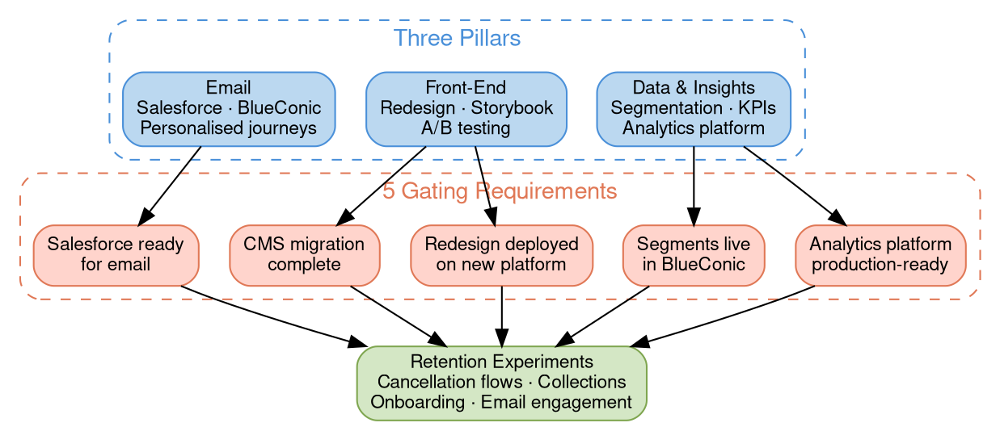

# Project Feral Status — Week 5

## Quick Reference

- Week ~5 of 26: foundation work continues, AEM migration deadline extended to May 29, segmentation unblocked, five gating requirements remain open
- Three pillars: Data & Insights, Front-End, Email
- Key dates: Storybook prototype April 6, AEM migration May 29 (extended from May 13), redesign assets May 29, E2E UAT June 29, NL go-live July 29
- Standup cadence reduced from daily to twice weekly (Tuesday and Thursday)

## Progress Since Last Update (March 5)

### Completed This Week

**Front-End & CMS**

- AEM decommissioned from roster detail page (header/footer remaining) — Nagesh
- Contentful integration ready — pages can be created, consumed, and rendered — Easwar
- Contentful workflow changes pushed to all release branches
- Feature flags pushed through with agent skill for feature flag control — Josh
- Homepage migration in progress using existing content types and infrastructure
- PDP concepts approved by Ziv; fast-track landing page created in Storybook
- PRs raised for carousel and support card components
- Storybook MCP integration working for component validation

**Data & Analytics**

- PBI desktop and PBI MCP set up; DAX definitions extracted from existing Beans dashboards
- New enrichment flows and tables for email and Mixpanel reporting created
- Comprehensive dashboards built on dataset: email integration, conversion analysis, Mixpanel attribution, Fast Track V2 analysis, churn analysis
- ChatGPT integration with exit survey data and customer support inquiries producing enriched analysis
- Dataset tool setup in progress; data dump from Databricks underway

**Personalization & AEO/GEO**

- Personalization architecture finalized: three-layer solution using segmentation + CDP (hub) + Ninetail (UI)
- AEO/GEO analysis completed — ratings critically low at 1-2 out of 10
- AEO/GEO recommendations compiled; review meeting scheduled with squad leads
- Hotjar integration completed for Breville and FTVP; plan to enable freemium for Beans production

**Segmentation**

- Segmentation strategy unblocked — Jennifer shared new strategy with the team
- Workshop scheduled with Ziv, Sophie, and Jennifer to formalize approach
- Session conducted with Jennifer on new segments; final Ziv approval expected

### Key Decisions Made

| Decision | Rationale | Date |
|----------|-----------|------|
| Standup cadence reduced to Tuesday/Thursday | Overlap with other ceremonies; agentic foundations mature | Mar 12 |
| Personalization: CDP + Ninetail three-layer approach | CDP as centralized hub, Ninetail for UI-layer content personalization | Mar 12 |
| CT subscription integration postponed to post-August | Timeline constraints; current model sufficient for NL launch | Mar 12 |
| AEM contract grace period extended to May 29 | Adobe proposed extension; $160K penalty if migration incomplete | Mar 6 |
| First production deployment targets email campaigns | Can proceed in parallel without requiring Mocha support | Mar 10 |

## Project Status Architecture

*Colors: Blue = pillars, Red = gating requirements (all in progress), Green = experiments (blocked). All five gates must clear before experiments begin.*

## What's In Progress

| Workstream | Pillar | Owner | Target | Status Change |
|---|---|---|---|---|
| CMS migration (AEM → Contentful) | Front-End | Easwar | May 29 | Deadline extended from May 13 |
| beanz.com redesign UX finalisation | Front-End | Sophie / Justin / Ziv | TBD | Target dates being defined |
| Storybook prototype for redesign | Front-End | Justin | April 6 | On track — PDP + landing page created |
| Customer segmentation definition | Data & Email | Justin / Jenn / Ziv | Approval imminent | Unblocked — workshop scheduled |
| Retention metrics & success baselining | Data | Jenn / Ziv | TBD | |
| Email template enablement | Email | Anil / Abhi | End of sprint | API wrapper in development |
| Personalization solution | Data | Santhosh / Rishab / Pam | TBD | Architecture finalized (CDP + Ninetail) |
| AEO/GEO remediation | Front-End | Santhosh | TBD | New — ratings 1-2/10, review scheduled |
| Dataset hosting & data dictionary | Data | Prasanna / Justin | TBD | New — hosting solution TBD |
| Hotjar integration (Beans production) | Data | Easwar / Justin | TBD | New — freemium tier, no premium budget |

## Gating Requirements to Start Experimentation

All five must be complete before live experiments begin:

1. CMS migration complete — *In Progress* (deadline extended to May 29; AEM roster detail decommissioned)
2. beanz.com redesign deployed on new platform — *In Progress* (PDP concepts approved; Storybook prototype progressing)
3. Customer segments live in BlueConic — *In Progress* (strategy unblocked; final approval pending from Ziv)
4. Analytics platform production-ready — *In Progress* (dashboards built on dataset; PBI MCP operational)
5. Salesforce ready for personalised email — *In Progress* (Marketing Cloud API expected in days; template API wrapper due end of sprint)

## Scope Evolution

Since last update:

- **AEM deadline shifted from May 13 to May 29.** Adobe granted a grace period. If migration is not complete by May 29, a six-month full-rate contract costing ~$160K will be required. The extra two weeks provide buffer but the financial consequence of missing the deadline is now explicit.
- **Segmentation is unblocked.** Jennifer shared a new strategy and a workshop with Ziv, Sophie, and Jennifer will formalize the approach. This was previously a key blocker.
- **Email is the first production deployment target.** Email campaigns can proceed in parallel without Mocha support, making it the fastest path to live experimentation.
- **AB testing on the website remains blocked** until the BRG-wide solution is ready (June/July). However, email A/B testing can begin earlier with semi-automated processes.
- **CT subscription integration postponed to post-August.** The team will continue with the current subscription model for the NL launch.

## Top Risks

| Risk | Severity | Mitigation |
|---|---|---|
| AEM migration must complete by May 29 — $160K contract penalty | **Critical** | Grace period secured; AEM decommissioning underway (roster detail done) |
| AEO/GEO ratings critically low (1-2/10) | **High** | Recommendations compiled; cross-squad review meeting scheduled |
| Vercel licensing blocking Justin's PR deployment workflow | **High** | Josh investigating alternatives; Daniel reviewing access request |
| AB testing blocked until BRG-wide solution (June/July) | **High** | Email A/B testing can begin earlier; website testing deferred to post-redesign |
| Dataset hosting solution unclear (Databricks vs AWS) | Medium | Follow-up discussion scheduled between Prasanna, Santhosh, and Raam |
| Hotjar premium features have no budget this FY | Medium | Freemium tier sufficient for initial proof of concept |
| OpenClaw AI agent proposal raises security concerns | Medium | Requires Stuart's security team approval and guardrails |
| Contentful agentic scope not finalized | Medium | Rishab and Josh to determine agent vs. manual update boundaries |

## Key Dates

| Milestone | Date | Notes |
|---|---|---|
| NL PROD fulfillment testing starts | March 30 | No customer-facing website |
| E2E Storybook prototype done | April 6 | On track |
| AEM migration done | **May 29** | Extended from May 13; $160K penalty if missed |
| Redesign assets & copy done | May 29 | |
| AB testing solution ready (BRG-wide) | June/July | Blocks website experimentation |
| E2E UAT starts | June 29 | |
| NL go-live | July 29 | |
| CT subscription integration | Post-August | Postponed; current model continues |

## Meeting Cadence Change

Effective March 12, the Project Feral standup is reduced from daily to twice weekly (Tuesday and Thursday). This reflects the maturity of technical foundations and overlap with other ceremonies. Consideration is being given to merging this standup with the Mocha Standup.

## Related Files

- [[project-feral|Project Feral]] — Parent project with full scope, experiment designs, and timeline
- [[2026-03-05-project-feral-status|Project Feral Status — March 2026]] — Previous status update (Week 4)
- [[customer-segments|Customer Segments]] — Segmentation strategy being finalized as a gating requirement

## Open Questions

- [ ] What is the dataset hosting solution — Databricks platform or AWS?
- [ ] What Contentful operations can agents perform vs. requiring manual approval?
- [ ] When will the BRG-wide AB testing solution be confirmed (June or July)?
- [ ] Will email segments be Salesforce segments or BlueConic segments?
- [ ] What are the AEO/GEO remediation priorities for Beans-specific vs. common component issues?
