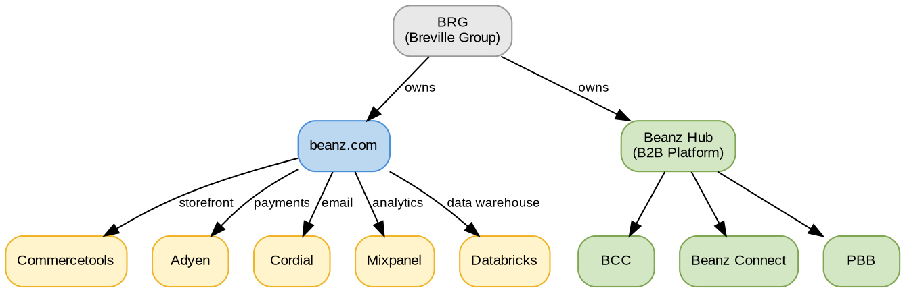

# Glossary

## Quick Reference

- Central terminology reference for all beanz.com documentation
- Covers business acronyms, platform systems, partner programs, and integrations

## Glossary Framework

### Key Concepts

- **Term categories** = Groupings by domain: business, platform, integrations, markets, customer
- **Acronyms** = Short-form identifiers used across documentation and systems
- **System names** = Third-party platforms and internal tools referenced in KB files

## Term Relationships

**Legend:** Grey = parent company, Blue = consumer platform, Green = B2B hub streams, Yellow = third-party integrations. Edges show ownership and integration roles.

## Business & Strategy

| Term | Meaning |
|------|---------|
| **BRG** | Breville Group — parent company owning beanz.com |
| **BaaS** | Beanz as a Service — platform strategy to offer beanz capabilities as services to partners |
| **FTBP** | Fast-Track Barista Pack — machine-attached promotional program converting Breville buyers into paid subscribers | Free trial offering with machine purchase. 193K sign-ups in 2 years, 41% of CY25 revenue. FTBP v2 (launched Oct 2025) achieves 16.5% paid conversion vs v1's 11.4%. Primary acquisition engine for beanz.com |
| **GTM** | Go-to-Market — launch and growth strategy for markets and features |
| **MRR** | Monthly Recurring Revenue — key subscription metric |
| **LTV** | Lifetime Value — total revenue expected from a customer over their lifetime |
| **AOV** | Average Order Value — average revenue per order |
| **MOT** | Minimum Order Target — weekly guaranteed minimum order volume committed to each roaster partner, in kilograms |
| **Pre-allocation** | Advance order assignment — batch process that assigns orders for the upcoming week |
| **Two-Phase Allocation** | Load balancing algorithm — Phase 1 prioritizes roasters below MOT; Phase 2 optimizes surplus distribution |
| **Platinum Roaster** | Top-tier roaster partner receiving guaranteed volume and preferential terms | 5–7 roasters per region selected as strategic partners. Receive guaranteed volume commitments, preferential wholesale pricing, early access to new machines, enhanced beanz.com visibility, and PBB priority. In return, commit to Reverse Fast Track sales, content creation, operational excellence (95%+ SLA, 50%+ margin), and event support. Launched October 2025, 18 signed as of FY26H1 |
| **Basic Roaster** | Standard-tier roaster partner | All roasters not in Platinum tier. Standard beanz.com partnership terms without volume guarantees |
| **Reverse Fast Track Sales** | Platinum roaster commitment to sell Breville machines bundled with coffee | Roasters sell Breville espresso machines and grinders as a bundle with beans and training, both online and in-store. Drives incremental machine sales for BRG |
| **Quarterly Business Plan** | Collaborative planning between beanz and Platinum roasters | Agreement on quarterly delivery targets, content commitments, event activations, and KPIs. Reviewed quarterly to assess performance. All requests go through regional beanz managers |
| **ARR** | Annual Recurring Revenue | Total annual value of active subscriptions. Key metric: CY25 ARR was $13.5M AUD (+61% YoY) |
| **Beanz 2.0** | Redesigned beanz.com platform optimized for retention and global rollout | Purpose-built to convert, retain, and scale globally. Features include enhanced Perfect Match quiz, revamped Barista's Choice, personalized welcome notes, and dynamic location-aware shopping. Launched FY26 |

## Platform & Systems

| Term | Meaning |
|------|---------|
| **BCC** | Beanz Control Center — self-service B2B portal for roasters, PBB partners, and Beanz managers (replacing RCC) |
| **RCC** | Roaster Control Centre — legacy Salesforce portal being replaced by BCC |
| **BLP** | Beanz Label Printing — automated label production service for fulfillment partners |
| **PBB** | Powered by Beanz — retail partner and manufacturer integration program |
| **Beanz Connect** | Roaster fulfillment integration layer (Shopify, WooCommerce, ShipStation) |
| **Beanz Hub** | Umbrella term for the unified B2B platform (BCC + Beanz Connect + PBB) |

## Integrations & Third-Party Systems

| Term | Meaning |
|------|---------|
| **Adyen** | Payment gateway processing transactions across all markets |
| **Commercetools** | Headless commerce platform powering beanz.com storefront |
| **Cordial** | Email and messaging platform for customer communications |
| **Mixpanel** | Product analytics platform for user behavior tracking |
| **Salesforce** | CRM — used for RCC (legacy) and customer support |
| **Databricks** | Cloud data lakehouse for analytics and reporting |
| **ShipStation** | Shipping management platform used in Beanz Connect |

## Markets

| Term | Meaning |
|------|---------|
| **AU** | Australia — active market |
| **DE** | Germany — active market |
| **UK** | United Kingdom — active market |
| **US** | United States — active market |
| **NL** | Netherlands — launching July 2026 |

## Product & Machine Series

| Term | Meaning |
|------|---------|
| **Oracle Series** | Breville's premium espresso machine line | High-end machines. Oracle owners over-index in revenue: 21% of FTBP revenue despite only 5% of machine sell-out volume. High-value customer segment |
| **Barista Series** | Breville's mid-range espresso machine line | Core product line. Barista machines account for 70% of machine sell-out, 68% of FTBP customers, 64% of FTBP revenue |
| **Bambino Series** | Breville's entry-level espresso machine line | Entry machines. Bambino accounts for 20% of machine sell-out, 12% of FTBP customers, 11% of FTBP revenue |
| **Drip** | Drip coffee makers | Non-espresso machines. Small share: 4% sell-out, 2% customers, 2% revenue |

## Page Types

| Term | Meaning |
|------|---------|
| **PLP** | Product Listing Page — Shop Coffee page showing all available products with filters |
| **PDP** | Product Detail Page — Individual coffee product page with details, reviews, and add-to-cart |
| **CLP** | Category Listing Page — PLP-type experience for specific product categories (Large Bags, Festive Coffee) |
| **RDP** | Roaster Detail Page — Individual roaster profile page with story, coffees, and Dial-In videos |

## Customer Terminology

| Term | Meaning |
|------|---------|
| **Segment** | Customer grouping by shared characteristics (SEG-X.Y.Z IDs) |
| **Cohort** | Customer grouping by lifecycle stage or coffee experience (COH-X.Y IDs) |
| **Lifecycle cohort** | Subscription journey stage (New Customer → Trialist → Active → Loyalist → At Risk → Inactive) |
| **Coffee experience cohort** | Coffee knowledge level (Novice, Experienced) — orthogonal to lifecycle |
| **Beanz Conversion** | FTBP conversion metric — customer paid for at least one order (not just free trial bags) |

## Related Files

- [[id-conventions|ID Conventions]] — Hierarchical ID system for features, pages, segments, and cohorts

## Glossary Governance

**Sync direction (one-way):**
- This file (`docs/reference/glossary.md`) is the **source of truth** for business terms
- `.claude/skills/kb-author/references/beanz-brg-glossary.md` is the **superset** — contains everything here plus technical/operational terms for AI context
- New business terms go into this glossary first, then the skill reference
- Technical-only terms (team names, GITBL codes, EDI messages) go into the skill reference only

**Sync checks:**
- `python scripts/check-glossary-sync.py` — verifies every KB term exists in the skill reference and definitions don't contradict
- `python scripts/generate-business-context.py --check <path>` — verifies the analytics BUSINESS_CONTEXT.md matches what would be generated from these glossaries

## Open Questions

- [ ] Are there additional internal system names (beyond BCC, BLP, PBB) that should be documented?
