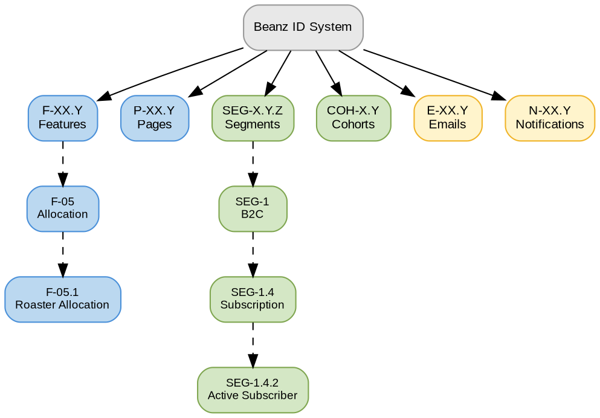

# ID Conventions

## Quick Reference

- Hierarchical IDs provide traceability across features, pages, segments, and communications
- Format: `PREFIX-major.minor` (or `.minor.sub` for segments)

## ID Framework

### Key Concepts

- **Hierarchical ID** = Dot-separated prefix system encoding entity type, domain, and item
- **Prefix** = Letter code identifying entity type (F, P, SEG, COH, E, N)
- **Stability** = Once assigned, an ID is never reassigned to a different entity

## ID Hierarchy

**Legend:** Blue = product entities (features, pages), Green = customer entities (segments, cohorts), Yellow = communication entities (emails, notifications). Dashed edges show drill-down examples.

## ID Prefixes

| Prefix | Entity | Format | Example |
|--------|--------|--------|---------|
| **F** | Feature | F-XX.Y | F-05.1 Roaster Allocation |
| **P** | Page/Screen | P-XX.Y | P-02.2 Checkout |
| **SEG** | Customer Segment | SEG-X.Y.Z | SEG-1.4.2 Active Subscriber |
| **COH** | Customer Cohort | COH-X.Y | COH-1.5 NL Launch Cohort |
| **E** | Email | E-XX.Y | E-03.1 Order Confirmation |
| **N** | Notification | N-XX.Y | N-01.1 Delivery Update |

## Structure Rules

### Features (F-XX.Y)

- **Major** (XX): Feature domain (01–14)
- **Minor** (Y): Specific capability within the domain
- Example: F-05 = Allocation domain, F-05.1 = Roaster Allocation

### Pages (P-XX.Y)

- **Major** (XX): Page group (01–11)
- **Minor** (Y): Specific page or screen variant
- Example: P-02 = Checkout group, P-02.2 = Checkout page

### Segments (SEG-X.Y.Z)

- **X**: Top-level segment class (1 = B2C, 2 = B2B)
- **Y**: Segment category within the class
- **Z**: Specific segment within the category
- Example: SEG-1.4.2 = B2C → Subscription status → Active Subscriber

### Cohorts (COH-X.Y)

- **X**: Cohort dimension (1 = Lifecycle, 2 = Coffee experience)
- **Y**: Specific cohort within the dimension
- Example: COH-1.5 = Lifecycle → NL Launch Cohort

### Emails (E-XX.Y)

- **Major** (XX): Email category (01 = Transactional, 02 = Marketing, 03 = Lifecycle)
- **Minor** (Y): Specific template
- Example: E-03.1 = Lifecycle → Order Confirmation

### Notifications (N-XX.Y)

- **Major** (XX): Notification category
- **Minor** (Y): Specific notification type
- Example: N-01.1 = Delivery → Delivery Update

## Usage Guidelines

1. **Always use IDs** when referencing features, pages, segments, cohorts, or communications in documentation
2. **IDs are stable** — once assigned, an ID should not be reassigned to a different entity
3. **Use in wikilinks** — include the ID in the display text for precision (e.g. F-01 Quiz Flow)
4. **Cross-reference** — link the ID back to its source document for traceability

## Related Files

- [[glossary|Glossary]] — Term definitions and acronyms
- [[page-inventory|Page Inventory]] — Page inventory (P-01 to P-11)
- [[emails-and-notifications|Emails and Notifications]] — Email and notification IDs (E-X.Y, N-X.Y)

## Open Questions

- [ ] Are there additional ID prefixes needed beyond F, P, SEG, COH, E, N?
