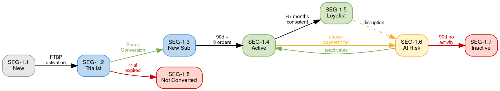

# Segment & Cohort Quick Reference

Quick lookup for the product strategist. Distilled from `references/segment-cohort-framework.md` and `references/id-prefix-conventions.md` in the kb-author skill.

---

## Segments (SEG-X.Y.Z) — Where Customers Are Now

Segments are **mutable** — customers move between them as behavior changes.

### Lifecycle Stages

| Stage | ID | Name | Entry Trigger | Exit Trigger | FY27 Priority |
|-------|-----|------|--------------|-------------|---------------|
| 1 | SEG-1.1.x | New Customer | First visit | Places first order | — |
| 2 | SEG-1.2.x | Trialist | FTBP activated (2 free bags) | Trial ends | P2: FTBP Conversion |
| 3 | SEG-1.3.x | New Subscriber | First paid order | 90 days + 3 deliveries | P1: Retention |
| 4 | SEG-1.4.x | Active Subscriber | 3+ deliveries, routine established | Pause/disruption | P1: Retention |
| 5 | SEG-1.5.x | Loyalist | 6+ months, high engagement | Rare churn | P1: Retention (protect) |
| 6 | SEG-1.6.x | At Risk | Paused, payment issues, churn signals | Reactivates or churns | P1: Retention (intervene) |
| 7 | SEG-1.7.x | Inactive | 3+ months no order | Win-back or lost | P1: Retention (win-back) |
| 8 | SEG-1.8.x | Trial Not Converted | FTBP ended, never paid | Re-engages or lost | P2: FTBP Conversion |

### Experience Levels

| Suffix | Level | Characteristics | Feature Implications |
|--------|-------|----------------|---------------------|
| .1 | Novice | New to specialty coffee, needs education | Quiz, brew guides, guided discovery |
| .2 | Experienced | Coffee-savvy, knows preferences | Efficiency, personalization, variety |

### Critical Transitions

**Key metrics per transition:**

| Transition | Business Name | Measurement | CY25 Context |
|-----------|--------------|-------------|-------------|
| SEG-1.2 → SEG-1.3 | **Beanz Conversion** | Trial → first paid order | v2: 16.5%, v1: 11.4% |
| SEG-1.4 → SEG-1.6 | **Churn Signal** | Active → At Risk | 15,297 cancellations (+75% YoY) |
| SEG-1.6 → SEG-1.7 | **Churn Event** | At Risk → Inactive | — |
| SEG-1.2 → SEG-1.8 | **Failed Acquisition** | Trial → Not Converted | — |

---

## Cohorts (COH-X.Y) — How Customers Joined

Cohorts are **immutable** — once assigned, they never change.

### Market Entry Cohorts (COH-1.x)

| ID | Market | Launch | Key Characteristic |
|----|--------|--------|--------------------|
| COH-1.1 | AU | ~2021 | Most mature, highest loyalist share |
| COH-1.2 | UK | — | Best delivery times (3.97 days) |
| COH-1.3 | US | — | Largest market opportunity |
| COH-1.4 | DE | — | Delivery challenges (+16% YoY) |
| COH-1.5 | NL | July 2026 | Cross-border from DE, pre-launch |

### Program Cohorts (COH-2.x)

| ID | Program | Key Metric |
|----|---------|-----------|
| COH-2.1 | FTBP v1 (Cashback) | 11.4% paid conversion |
| COH-2.2 | FTBP v2 (Discount) | 16.5% paid conversion (+5.1 pts) |

### Appliance Cohorts (COH-3.x)

| ID | Appliance | Revenue Significance |
|----|-----------|---------------------|
| COH-3.1 | Breville | Core (64% FTBP revenue from Barista Series) |
| COH-3.2 | Sage | UK/EU equivalent |
| COH-3.3 | Baratza | Grinder owners |
| COH-3.4 | Lelit | Premium segment |
| COH-3.5 | Multi-Appliance | Highest engagement expected |

**High-value insight:** Oracle Series owners (subset of COH-3.1) = 1% of sell-outs but 21% of FTBP revenue. Target for premium experiences.

### Channel Cohorts (COH-4.x)

| ID | Channel | Analysis Use |
|----|---------|-------------|
| COH-4.1 | Direct Website | Baseline acquisition cost |
| COH-4.2 | BRG Brand Referral | Cross-brand attachment rate |
| COH-4.3 | PBB Partner | Partner-driven acquisition |
| COH-4.4 | Gift Recipient | Social acquisition |

---

## Cross-Referencing Segments × Cohorts

Customers exist in **one segment** (current state) but **multiple cohorts** (fixed attributes).

### Example Analysis Patterns

**Retention by acquisition program:**
- `COH-2.2 × SEG-1.4.x` — "How many FTBP v2 customers became Active Subscribers?"
- Compare with `COH-2.1 × SEG-1.4.x` to measure v2 improvement

**Market maturity:**
- `COH-1.1 × SEG-1.5.x` — "What % of AU customers are Loyalists?" (expect highest)
- `COH-1.4 × SEG-1.5.x` — "What % of DE customers are Loyalists?" (expect lower, newer market)

**Premium customer behavior:**
- `COH-3.1 (Oracle subset) × SEG-1.4.2` — "Experienced Active Subscribers with Oracle machines"
- These are the highest-LTV customers

**Channel effectiveness:**
- `COH-4.3 × SEG-1.2 → SEG-1.3 rate` — "Do PBB-acquired customers convert better than Direct?"

---

## Feature Targeting Patterns

When recommending which segments a feature should target:

| Feature Type | Primary Segment | Secondary | Rationale |
|-------------|----------------|-----------|-----------|
| Discovery (Quiz, Browse) | SEG-1.1.1 (New, Novice) | SEG-1.2.1 (Trialist, Novice) | Education-focused |
| Subscription management | SEG-1.4.x (Active) | SEG-1.5.x (Loyalist) | Power users |
| Retention interventions | SEG-1.6.x (At Risk) | SEG-1.4.x (Active, prevent risk) | Churn prevention |
| Win-back campaigns | SEG-1.7.x (Inactive) | SEG-1.8.x (Not Converted) | Re-engagement |
| Premium experiences | SEG-1.5.2 (Loyalist, Experienced) | SEG-1.4.2 (Active, Experienced) | High-value users |
| Onboarding | SEG-1.2.x (Trialists) | SEG-1.3.x (New Subscribers) | First impressions |
