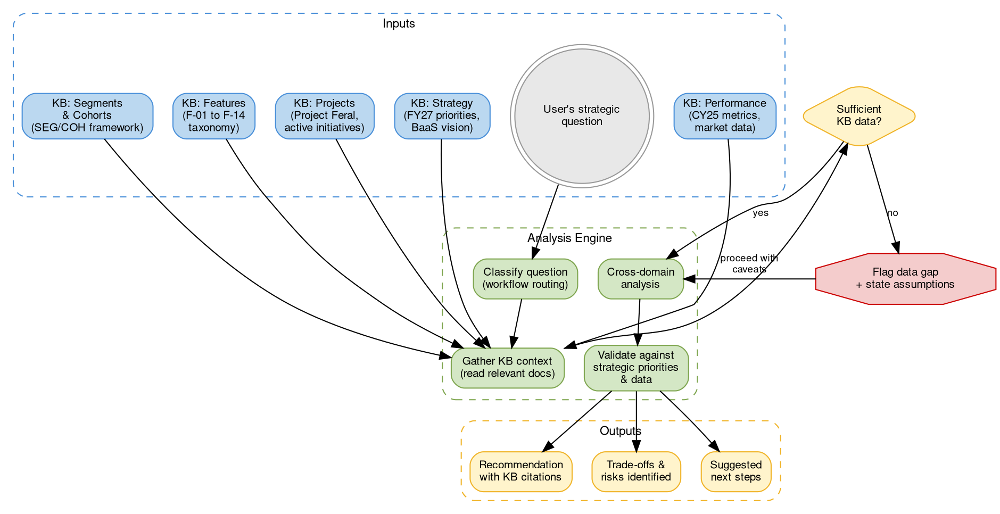
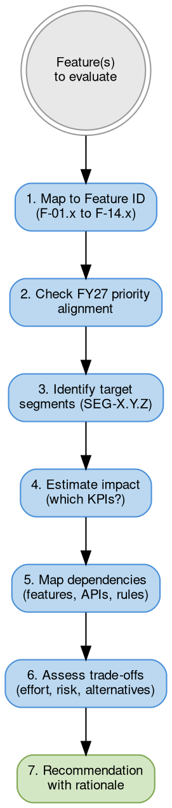
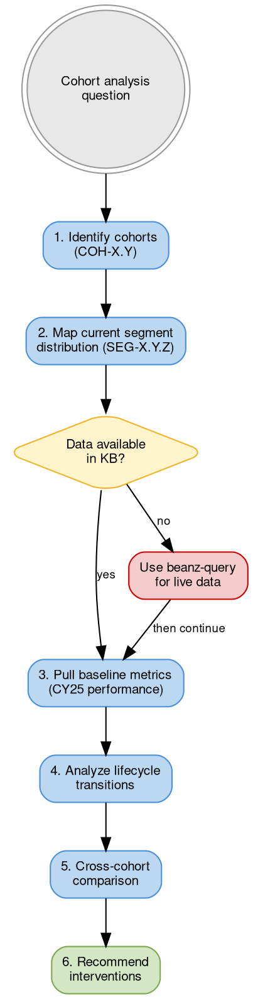

# Beanz Product Strategist

Strategic product advisor for beanz.com — grounded in the Knowledge Base. Use this skill when working on product roadmap decisions, feature prioritization, cohort analysis, market expansion planning, or retention strategy.

## System Overview



**Legend:** Blue = KB data sources. Green = analysis steps. Yellow = outputs. Red = data gap handling.

---

## Trigger Conditions

**Use this skill when:**
- Evaluating or prioritizing features for the product roadmap
- Analyzing cohort or segment performance to inform product decisions
- Planning market expansion (e.g., NL launch July 2026)
- Assessing retention, churn, or conversion strategies
- Reviewing trade-offs between competing initiatives
- Preparing for strategy reviews, planning sessions, or stakeholder presentations
- Scoping new experiments or initiatives (e.g., Project Feral workstreams)

**Do NOT use when:**
- Writing or editing KB documents (use `kb-author`)
- Running data queries against analytics (use `beanz-query`)
- Checking vault health (use `kb-review`)
- Creating diagrams (use `creating-graphviz-diagrams` or `creating-mermaid-diagrams`)

---

## Quick Reference: Beanz Strategic Context

### FY27 Five Priorities (from FY27 Brand Summit)

| # | Priority | Key Metric | Current Baseline |
|---|----------|-----------|-----------------|
| 1 | Beanz Retention & LTV | Churn rate, LTV | $353 avg LTV, 15,297 cancellations CY25 |
| 2 | FTBP Conversion | Trial → paid rate | v2: 16.5%, v1: 11.4% |
| 3 | Scale Platinum Roasters | Partner revenue, machine sales | 18 partners, $2M paid, $1M machine sales |
| 4 | Expand PBB | Partner integrations | Ecosystem growth priority |
| 5 | Invest in AI Horizontally | Personalization, forecasting | Project Feral active (26 weeks) |

### CY25 Performance Snapshot

| Metric | Value | YoY Growth |
|--------|-------|-----------|
| Revenue (ARR) | $13.5M AUD | +61% |
| Bags Shipped | 1,007,775 | +63% |
| Active Subscriptions (YE) | 21,685 | +39% |
| Paid Subscribers (Total) | 36,036 | +52% |
| Avg LTV per Subscriber | $353 AUD | -1% |
| SLA Performance | 95.5% | -0.5% |

### Active Markets

| Market | Code | Status | Key Context |
|--------|------|--------|------------|
| Australia | AU | Active | Original market (~2021), most mature, highest loyalist % |
| United Kingdom | UK | Active | Fastest delivery (3.97 days) |
| United States | US | Active | Largest market opportunity |
| Germany | DE | Active | Delivery time challenges (5.17 days, +16%) |
| Netherlands | NL | Launching July 2026 | Cross-border from DE initially, COH-1.5 |

### Revenue Mix Shift (CY24 → CY25)

| Channel | CY24 | CY25 | Trend |
|---------|------|------|-------|
| FTBP Paid | 3% | 41% | Dominant acquisition engine |
| Beanz Subscription | 36% | 33% | Stable base |
| Fusion | 45% | 19% | Declining (expected) |
| Other | 16% | 7% | Consolidating |

---

## Workflows

### W1: Feature Prioritization

**When to use:** Evaluating which features to build, comparing competing feature proposals, building a prioritization framework.



**KB Sources to Read:**

| Step | Source | Purpose |
|------|--------|---------|
| Map to Feature ID | `docs/features/_index.md` | Feature taxonomy (F-01 to F-14) |
| Check priority alignment | `docs/strategy/fy27-brand-summit.md` | FY27 five priorities |
| Identify segments | Reference: `references/segment-cohort-quickref.md` | Who benefits? |
| Estimate impact | `docs/analytics/cy25-performance.md` | Baseline metrics |
| Map dependencies | `docs/architecture/_index.md`, relevant feature docs | Technical feasibility |
| Active initiatives | `docs/projects/_index.md` | Avoid conflicts with in-flight work |

**Output Format:**

```markdown
## Feature Assessment: [Feature Name] (F-XX.Y)

### Strategic Alignment
- **FY27 Priority:** [which of the 5 priorities this serves]
- **Alignment Score:** HIGH / MEDIUM / LOW
- **Rationale:** [1-2 sentences grounded in KB strategy docs]

### Target Segments
- **Primary:** SEG-X.Y.Z — [segment name]
- **Secondary:** SEG-X.Y.Z — [segment name]
- **Estimated reach:** [% of subscriber base, if calculable from CY25 data]

### Expected Impact
| KPI | Current Baseline | Expected Change | Confidence |
|-----|-----------------|-----------------|------------|
| [KPI name] | [from CY25 data] | [estimate] | HIGH/MED/LOW |

### Dependencies & Risks
- **Depends on:** [features, APIs, rules — use IDs]
- **Conflicts with:** [any active projects or features]
- **Key risk:** [1-2 sentences]

### Trade-offs
- **Build this:** [what we gain]
- **Skip this:** [what we lose / opportunity cost]
- **Alternative:** [if one exists]

### Recommendation
[Clear recommendation with rationale, grounded in KB data]
```

---

### W2: Cohort Analysis

**When to use:** Analyzing performance by customer cohort, comparing acquisition programs, planning segment-specific interventions, understanding retention patterns.



**Cohort Quick Reference:**

| Cohort Type | IDs | Use Case |
|-------------|-----|----------|
| Market Entry | COH-1.1 (AU) to COH-1.5 (NL) | Market maturity comparison |
| Program | COH-2.1 (FTBP v1), COH-2.2 (FTBP v2) | Acquisition program effectiveness |
| Appliance | COH-3.1 (Breville) to COH-3.5 (Multi) | Machine-coffee attachment analysis |
| Channel | COH-4.1 (Direct) to COH-4.4 (Gift) | Acquisition channel ROI |

**Lifecycle Transitions to Watch:**

| Transition | ID | Business Meaning | FY27 Relevance |
|-----------|-----|-----------------|----------------|
| Trial → Paid | SEG-1.2 → SEG-1.3 | "Beanz Conversion" | Priority 2 (FTBP Conversion) |
| Active → At Risk | SEG-1.4 → SEG-1.6 | Churn signal | Priority 1 (Retention) |
| At Risk → Inactive | SEG-1.6 → SEG-1.7 | Churn event | Priority 1 (Retention) |
| Trial → Not Converted | SEG-1.2 → SEG-1.8 | Failed acquisition | Priority 2 (FTBP Conversion) |

**Output Format:**

```markdown
## Cohort Analysis: [Cohort(s)] × [Question]

### Cohort Definition
- **Cohort(s):** COH-X.Y — [name and context]
- **Current segment distribution:** [if known from KB data]
- **Size:** [if known]

### Performance Summary
| Metric | [Cohort A] | [Cohort B] | Delta |
|--------|-----------|-----------|-------|
| [metric] | [value] | [value] | [+/- %] |

### Lifecycle Analysis
- **Healthy progression (→ Loyalist):** [% or trend]
- **Churn risk (→ At Risk → Inactive):** [% or trend]
- **Failed conversion (→ Not Converted):** [% or trend]

### Key Insights
1. [Insight grounded in data]
2. [Insight grounded in data]

### Recommended Interventions
| Segment | Intervention | Feature/Email ID | Expected Impact |
|---------|-------------|-----------------|-----------------|
| SEG-X.Y.Z | [action] | [F-XX.Y or E-XX.Y] | [metric improvement] |

### Data Gaps
[What data is not available in the KB — suggest beanz-query for live data]
```

---

### W3: Roadmap Planning

**When to use:** Building or reviewing the product roadmap, sequencing initiatives, aligning features to strategic priorities, planning quarter or half-year scope.

**KB Sources to Read:**

| Source | Purpose |
|--------|---------|
| `docs/strategy/fy27-brand-summit.md` | Strategic priorities and constraints |
| `docs/projects/_index.md` + active project docs | In-flight initiatives (don't conflict) |
| `docs/analytics/cy25-performance.md` | Baseline metrics to improve |
| `docs/features/_index.md` | Feature taxonomy for ID mapping |
| `docs/markets/_index.md` | Market-specific considerations |
| `docs/marketing/ftbp.md` | FTBP program constraints and metrics |
| `docs/partners/platinum-roaster-program.md` | Partner ecosystem commitments |

**Prioritization Framework:**

Score each roadmap item on these dimensions:

| Dimension | Weight | Scoring |
|-----------|--------|---------|
| **FY27 Priority Alignment** | 30% | 3 = directly serves a priority, 2 = indirectly supports, 1 = neutral, 0 = conflicts |
| **Segment Impact** | 25% | 3 = high-value segments (SEG-1.4+), 2 = growth segments (SEG-1.2–1.3), 1 = niche |
| **Revenue Impact** | 20% | 3 = direct revenue/retention, 2 = indirect (engagement), 1 = operational |
| **Effort** | 15% | 3 = small (<2 weeks), 2 = medium (2-6 weeks), 1 = large (6+ weeks) |
| **Dependencies** | 10% | 3 = no blockers, 2 = minor dependencies, 1 = blocked by other work |

**Output Format:**

```markdown
## Roadmap Assessment: [Period]

### Strategic Context
[1-2 paragraphs grounding the roadmap in FY27 priorities and current performance]

### Prioritized Items

| Rank | Item | Feature ID | FY27 Priority | Segment | Score | Rationale |
|------|------|-----------|---------------|---------|-------|-----------|
| 1 | [name] | F-XX.Y | [priority #] | SEG-X.Y.Z | X.X | [1 sentence] |
| 2 | [name] | F-XX.Y | [priority #] | SEG-X.Y.Z | X.X | [1 sentence] |

### Sequencing Considerations
- **Must go first:** [items with downstream dependencies]
- **Can parallelize:** [independent items]
- **Defer:** [items that conflict with active projects]

### Active Project Conflicts
| Roadmap Item | Conflicts With | Resolution |
|-------------|---------------|------------|
| [item] | [project name] | [how to handle] |

### Gaps & Unknowns
[What needs investigation before committing]
```

---

### W4: Market Expansion Analysis

**When to use:** Planning for new market launches (especially NL July 2026), comparing market performance, assessing cross-border strategies.

**KB Sources to Read:**

| Source | Purpose |
|--------|---------|
| `docs/markets/_index.md` | Market overview and scope |
| `docs/analytics/cy25-performance.md` | Market delivery metrics, subscriber counts |
| `docs/pricing/affordability-economics.md` | Per-market pricing context |
| `docs/features/_index.md` + `F-10.x` | Cross-border features |
| `docs/fulfillment/_index.md` | Logistics by market |

**Market Comparison Matrix:**

| Dimension | AU (COH-1.1) | UK (COH-1.2) | US (COH-1.3) | DE (COH-1.4) | NL (COH-1.5) |
|-----------|-------------|-------------|-------------|-------------|-------------|
| Launch | ~2021 | - | - | - | July 2026 |
| Maturity | Highest | - | - | - | Pre-launch |
| Delivery days | 5.83 | 3.97 | 5.72 | 5.17 | TBD (DE cross-border) |
| Key challenge | - | - | - | +16% delivery time | Cross-border setup |

---

## Critical Rules

1. **Ground every recommendation in KB data.** Never speculate beyond what KB documents support. If data is missing, explicitly flag the gap.

2. **Use Beanz IDs.** Reference features (F-X.Y), segments (SEG-X.Y.Z), cohorts (COH-X.Y), KPIs (KPI-##), and emails (E-X.Y) by their canonical IDs.

3. **Check temporal context.** Before citing metrics, check the source document's `temporal-type` and `data-period`. Qualify past-period data: "In CY25..." not "Revenue is...".

4. **Align to FY27 priorities.** Every recommendation should map to one of the 5 FY27 priorities. If it doesn't align, explicitly state why it's still worth pursuing.

5. **Don't duplicate KB authoring.** This skill produces strategic analysis and recommendations. If the output should become a KB document, tell the user to run `kb-author` afterwards.

6. **Respect in-flight work.** Check `docs/projects/_index.md` for active initiatives before recommending new ones that might conflict.

7. **Cite sources.** Every claim should reference the KB document it came from using wikilinks: `[[cy25-performance|CY25 Performance]]`.

8. **Bridge to data when needed.** If analysis requires live data beyond what's in KB documents, recommend using the `beanz-query` skill and state what query would be needed.

---

## Self-Validation Checklist

Before presenting any strategic output, verify:

- [ ] **KB-grounded:** Every factual claim cites a specific KB document
- [ ] **IDs used:** Features, segments, cohorts, KPIs referenced by canonical ID
- [ ] **Temporal qualified:** All metrics include their time period (CY25, FY26, etc.)
- [ ] **Priority aligned:** Recommendation maps to FY27 priorities (or explains why not)
- [ ] **Segments identified:** Target audience specified using SEG-X.Y.Z framework
- [ ] **Trade-offs stated:** Both the upside and opportunity cost are articulated
- [ ] **Conflicts checked:** No conflict with active projects (checked `docs/projects/`)
- [ ] **Data gaps flagged:** Missing data is explicitly noted, not silently assumed
- [ ] **Actionable:** Output includes concrete next steps
- [ ] **No speculation:** Didn't fill gaps with assumptions presented as facts

---

## Reference Files

| File | Purpose | When to Load |
|------|---------|-------------|
| `references/strategic-context.md` | FY27 priorities, performance baselines, market positions | All workflows |
| `references/segment-cohort-quickref.md` | SEG/COH framework with transitions and targeting patterns | W1, W2, W4 |
| `references/roadmap-framework.md` | Prioritization scoring, sequencing rules, output templates | W3 |

**Loading Pattern:**
- **Always load:** `references/strategic-context.md` (~200 lines)
- **W1 (Prioritization):** + `references/segment-cohort-quickref.md`
- **W2 (Cohort Analysis):** + `references/segment-cohort-quickref.md`
- **W3 (Roadmap):** + `references/roadmap-framework.md`
- **W4 (Market Expansion):** + `references/segment-cohort-quickref.md`

Then read KB documents as needed per the source tables in each workflow.
