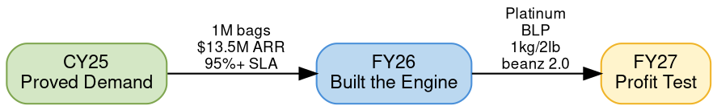
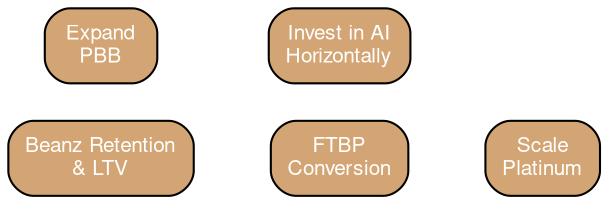

# FY27 Brand and Budgeting Summit

## Quick Reference

- Presented at the BRG Brand and Budgeting Summit, February 2026
- Narrative arc: CY25 proved demand → FY26 built the engine → FY27 is the profit test
- Theme: "From proven demand to profitable scale in FY27"

## Strategic Arc

## CY25: Proved the Model

CY25 validated market demand at scale. See [[cy25-performance|CY25 Performance]] for full metrics.

| Metric | CY25 Value | YoY |
|--------|-----------|-----|
| Total bags shipped | 1,007,775 | +63% |
| ARR | $13.5M AUD | +61% |
| Paid subscribers | 36,036 | +52% |
| Active subscriptions (year end) | 21,685 | +39% |
| FTBP share of revenue | 41% | — |
| SLA performance | 95.5% | -0.5% |

## FY26: Built the Engine

FY26 established four strategic pillars to build the infrastructure for profitable scale.

### FY26 Four Pillars

| Pillar | Focus | Key Initiatives |
|--------|-------|-----------------|
| **Deliver World-Class Customer Experience** | Convert and retain more customers across brands, geographies, and channels | Beanz 2.0 platform redesign, [[affordability-economics\|1kg/2lb bags]], NL/DE launch, [[lifecycle-comms\|lifecycle comms]], LLM search optimization |
| **Drive Operational Excellence** | Shift to larger bag sizes, enable hyper-local shipping, sharpen procurement, optimize freight cost per order | [[beanz-label-printing\|BLP]] in-house fulfillment, carrier negotiation |
| **Maximize the Roaster Channel** | Achieve predictable coffee volume and grow incremental machine sales | [[platinum-roaster-program\|Platinum Roaster Program]], guaranteed volume, roaster advocacy |
| **Invest in AI Horizontally** | Accelerate personalization, demand-forecasting, and product development | AI across personalization, forecasting, and product development |

### FY26 Achievements

- **Platinum program**: 18 roasters signed, $2M paid in FY26H1, $1M incremental machine sales revenue
- **Beanz Label Printing**: Operational in UK (100%) and US (50%), enabling NL cross-border launch
- **1kg/2lb bags**: 20% of total volume in H1, Fast Track cohort over-indexing at 23%
- **PBB growth**: 96% volume growth CY25 vs CY24, 14% of US volume
- **NL/DE launch**: Planned July 1, 2026 — beanz and Fast Track accessible to 80% of BRG machine buyers

## FY27: The Path to Profit

FY27 focuses on monetizing the engine built in FY26 through five priorities.

### FY27 Five Priorities

| Priority | Goal | Key Levers |
|----------|------|------------|
| **Beanz Retention & LTV** | Retention is the fastest path to contribution margin | Lifecycle comms (onboarding, engagement, win-back, cross-sell), cross-sell/upsell (accessories, larger bags, seasonal SKUs), UX optimization (My Beanz, Barista's Choice, questionnaire, landing pages) |
| **FTBP Conversion** | Convert more machine owners at lower cost | Optimize redemption journey, leverage 1kg affordability, POS optimization |
| **Scale Platinum** | More volume, content, machine sales, leverage across funnel | Content engine at scale, grow incremental machine sales (online and in-store), NPD launch support, more roasters and more tiers |
| **Expand PBB** | Bring more manufacturers and retailers into BRG ecosystem | More manufacturers and tier-1 retailers, in-store activation, test case in grocery (Woolworths) |
| **Invest in AI Horizontally** | Accelerate personalization, demand-forecasting, product development | AI across the business |

## Beanz Team

| Name | Role |
|------|------|
| Ziv Shalev | General Manager - Beanz |
| Hugh McDonnell | Beanz Manager - APAC |
| Travis Beckett | Beanz Global Ops Lead |
| Sarah Dooley | Beanz Manager - North America |
| Michael Bell | Beanz Manager - EMEA |
| Camille Degors | Beanz Co-Ordinator Germany |
| Raymon So | Beanz Global Marketing Manager |
| Justin Le Good | Product Manager |
| Jae Han | Product Owner |
| Sophie Thevenin | Senior Product Manager |
| Daniel Granahan | Director of Software Development |
| Jennifer Quach | Senior Global Pricing and Commercial Analyst |

## Related Files

- [[cy25-performance|CY25 Performance]] — Full CY25 metrics proving market demand
- [[platinum-roaster-program|Platinum Roaster Program]] — FY26's signature roaster channel initiative
- [[ftbp|Fast-Track Barista Pack]] — Primary acquisition engine (v1 vs v2 conversion)
- [[affordability-economics|Affordability Economics]] — 1kg/2lb pricing strategy
- [[lifecycle-comms|Lifecycle Communications]] — Lifecycle emails as profit lever
- [[beanz-label-printing|Beanz Label Printing]] — In-house fulfillment enabling NL launch and PBB

## Open Questions

- [ ] What are the specific FY27 revenue and profitability targets?
- [ ] What is the AI investment budget and prioritized use cases for FY27?
