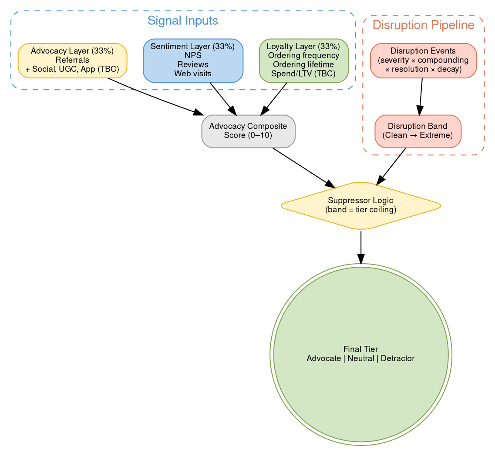
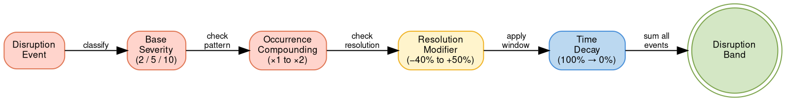

# Customer Advocacy & Disruption

## Quick Reference

Composite scoring framework classifying customers as Advocate, Neutral, or Detractor using three signal layers (Loyalty, Sentiment, Advocacy). A disruption score acts as a tier ceiling — disrupted customers cannot be classified as Advocates regardless of composite score. Scores recalculate event-driven.

## Advocacy Framework

### Key Concepts

- **Advocacy Composite Score** = Weighted signal aggregate (0–10) across three layers
- **Disruption Score** = Severity-based event score with compounding, decay, and resolution modifiers
- **Suppressor Logic** = Disruption band acts as tier ceiling on advocacy classification
- **Tier** = Final customer classification (Advocate / Neutral / Detractor)
- **Signal Layer** = Grouped inputs to the composite score (Loyalty, Sentiment, Advocacy)
- **Disruption Band** = Severity bracket (Clean / Low / Moderate / High / Extreme)

## Scoring Architecture

**Color legend:** Green = loyalty inputs, Blue = sentiment inputs, Yellow = advocacy inputs / decisions, Salmon = disruption pipeline, Gray = composite aggregation.

---

## Advocacy Composite Score

### Signal Registry

| Signal | Layer | Status | Weight Input |
|---|---|---|---|
| Ordering frequency | Loyalty | Active | Yes |
| Ordering lifetime | Loyalty | Active | Yes |
| NPS | Sentiment | Active | Yes |
| Reviews | Sentiment | Active | Yes |
| Web visits | Sentiment | Active | Yes |
| Referrals | Advocacy | Active | Yes |
| Disruption score | Suppressor | Active | Suppressor only — not composite input |
| Unpaid brand advocacy | Advocacy | TBD | Placeholder |
| Social interactions | Advocacy | TBD | Placeholder |
| App engagement | Advocacy | Not launched | Reserved |

### Layer Weighting

| Layer | Weight | Active Signals | Placeholder Signals |
|---|---|---|---|
| Loyalty | 33% | Ordering frequency, Ordering lifetime | Spend/LTV (TBC) |
| Sentiment | 33% | NPS, Reviews, Web visits | — |
| Advocacy | 33% | Referrals | Unpaid advocacy, Social, App |

Placeholder signals redistribute weight within their layer when activated. Layer weighting stays equal until deliberately rebalanced.

**Spend/LTV integration:** Spend/LTV Tier (see [[customer-segments|Customer Segments]]) will feed into the Loyalty layer as an additional signal. Tier structure and normalization TBC by Analytics.

### Tier Classification

| Tier | Composite Score | Disruption Ceiling |
|---|---|---|
| **Advocate** | 7–10 | Clean or Low only |
| **Neutral** | 4–6.9 | Clean to Moderate |
| **Detractor** | 0–3.9 | Any band |

### Lifecycle Coverage

Advocacy scoring applies to **all known customers from SEG-0.2 (Registrant) upward**. No minimum lifecycle stage is required — even pre-purchase customers can show sentiment signals (NPS responses, web visits). Signal availability naturally expands as customers progress through lifecycle stages:

| Lifecycle Stage | Typical Available Signals |
|---|---|
| SEG-0.2 (Registrant) | Web visits |
| SEG-1.1 (Trialist) | Web visits, NPS (if surveyed) |
| SEG-1.2+ (New and above) | All signals potentially available |

### Thin Data Handling

Customers with insufficient signal data **default to Neutral** until enough signals accumulate to produce a meaningful composite score. Signal normalization method (percentile-based vs threshold-based) is TBC by Analytics.

---

## Disruption Score

The disruption score quantifies the cumulative negative impact of service failures on a customer. It operates independently of the advocacy composite — disruption is applied as a **ceiling**, not a composite input.

### Disruption Scoring Pipeline

### Severity Scoring

| Tier | Events | Base Score |
|---|---|---|
| **High** | Order never delivered, significant delay, incorrect product, incorrect charges, price increase >20% (relative to current), discontinued subscribed product, discount expiry (surprise) | 10 |
| **Medium** | Order delayed, price increase ~10% (relative to current), payment method unsupported by platform, email change unsupported by platform, discount expiry (expected) | 5 |
| **Low** | Credit card expiry, subscription cadence mismatch (preference signal) | 2 |

Price increases are assumed one-time per annual pricing calendar. Cadence mismatch should trigger a preference review workflow in CRM, not just a disruption flag.

### Occurrence Compounding

| Pattern | Multiplier | Resulting Severity |
|---|---|---|
| 2+ disruptions in a single event | ×2 | Extreme |
| 2+ disruptions within 2 sequential orders | ×2 | Extreme |
| 2+ disruptions within 4 non-sequential orders | ×1.5 | High |
| Single isolated disruption | ×1 | Base severity only |

### Resolution Modifiers

| Condition | Score Impact |
|---|---|
| First contact resolution (FCR) | −40% base score |
| Resolved <24hrs (non-FCR) | −25% base score |
| Resolved 24–72hrs | −10% base score |
| Resolved >72hrs | No reduction |
| Unresolved | +50% base score |

FCR and time-to-resolve must be captured as discrete fields in the disruption event log.

### Time Decay

| Window | Score Weight |
|---|---|
| <6 months | 100% |
| 6–12 months | 75% |
| 12–24 months | 50% |
| >24 months | Excluded |

### Surprise & Delight Offset

> **Placeholder:** Reserved for positive brand moments (proactive recoveries, unexpected rewards, personalised gestures) that offset disruption score. Logic and weighting TBD by Product.

### Disruption Bands

| Band | Score Range |
|---|---|
| **Clean** | 0 |
| **Low** | 1–5 |
| **Moderate** | 6–15 |
| **High** | 16–30 |
| **Extreme** | 30+ |

---

## Suppressor Logic

The disruption score acts as a **tier ceiling**, not a composite input. A customer's advocacy composite score is calculated independently, then disruption is applied as an override:

| Disruption Band | Tier Ceiling | Logic |
|---|---|---|
| Clean / Low | None | Composite score applies as-is |
| Moderate | Neutral (max) | Cannot be classified Advocate regardless of composite |
| High | Detractor (max) | Forced to Detractor tier |
| Extreme | Detractor + intervention flag | Advocacy score paused — CRM action required |

**Example:** A customer with a composite score of 8.5 (Advocate range) and a disruption band of Moderate is classified as **Neutral** — the ceiling prevents Advocate classification until the disruption score decays below Moderate.

---

## Segments Integration

This framework introduces two new dimensions to the [[customer-segments|Customer Segments]] Behavior category and one to the Profile category.

### New Dimensions

| Dimension | Category | Type | Values |
|---|---|---|---|
| Advocacy Tier | Behavior | Mutable, composite | Advocate / Neutral / Detractor |
| Disruption Band | Behavior | Mutable, event-driven | Clean / Low / Moderate / High / Extreme |
| Spend/LTV Tier | Profile | Mutable | TBC by Analytics |

### Subsumed Behavioral Signals

The following behavioral signals from [[customer-segments|Customer Segments]] are now tracked via the Disruption Score rather than as standalone signals:

| Former Signal | Disruption Mapping |
|---|---|
| Payment Failed | Severity: Medium (payment method unsupported) or Low (credit card expiry) |
| Machine Return | Severity: High (near-certain churn event) |

All remaining behavioral signals (Pseudo-Pausing, Discount Exhausting, Discount Exhausted, Frequency Declining, Email Disengaged, Multi-Mode Active) continue as independent overlay flags.

---

## Advocacy Activation

When a customer is classified as **Advocate**, the platform activates engagement levers to amplify their value:

| Activation | Description | Trigger |
|---|---|---|
| Referral program | Enroll in or surface referral program | Advocate tier assigned |
| Review & UGC | Prompt for product reviews, ratings, and user-generated content | Advocate tier + recent order |
| Early access | Priority access to new roasters, limited releases, or beta features | Advocate tier + Engaged (SEG-1.3+) |

**Suppression rule:** Customers classified as Detractor or in a Moderate+ disruption band do **not** receive advocacy activation messages. Advocacy asks are suppressed until the customer's tier and disruption band qualify.

---

## Related Files

- [[customer-segments|Customer Segments & Cohorts]] — Defines the segment dimensions this framework overlays
- [[acquisition-programs|Acquisition Programs]] — Program cohorts affect disruption context (discount expiry events)
- [[lifecycle-comms|Lifecycle Communications]] — Comms strategy affected by disruption suppression and advocacy activation

## Open Questions

### From Brainstorming

- [ ] **Comms strategy for disrupted customers:** Should disrupted customers receive suppressed comms, hypercare flows, softer variant comms, or a tiered response by disruption band? (TBC)
- [ ] **Scoring normalization method:** Should individual signals normalize via percentile-based ranking, explicit thresholds, or a hybrid? (TBC — Analytics to define)
- [ ] **Spend/LTV tier structure:** What tiers and thresholds for the Spend/LTV dimension? (TBC — Analytics to define from actual spend distributions)
- [ ] **Behavioral signal priority update:** With Payment Failed and Machine Return subsumed into disruption, validate the updated signal priority ordering in [[customer-segments|Customer Segments]].

### From Framework v1.0

- [ ] Confirm FCR + time-to-resolve fields exist in disruption event log (Owner: Data / CRM)
- [ ] Validate disruption band score thresholds against real disruption distributions (Owner: Analytics)
- [ ] Define surprise & delight offset events and weighting (Owner: Product)
- [ ] Define social signal data pipeline for Advocacy layer (Owner: Data)
- [ ] Define unpaid advocacy capture method (Owner: Marketing)
- [ ] Activate app engagement signal post-launch (Owner: Product)
