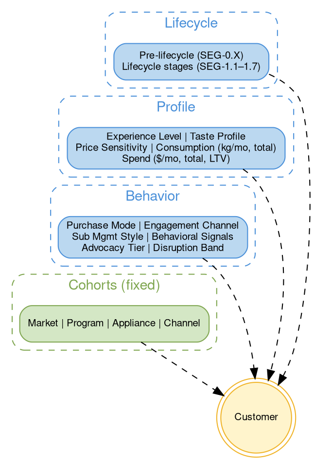
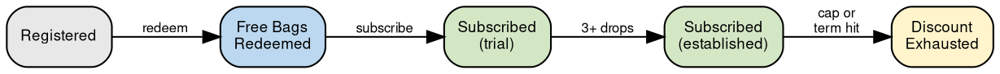
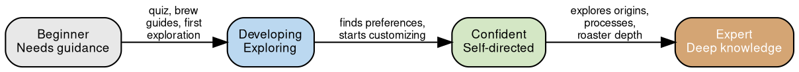

# Customer Segments & Cohorts

## Quick Reference

Customers are classified by **segments** (mutable, recency-based lifecycle stages), **behavioral signals** (real-time overlay flags), **advocacy tier** (composite score with disruption ceiling), and **cohorts** (fixed groupings set at acquisition). A customer belongs to exactly one lifecycle segment, zero or more active signals, one advocacy tier, and one or more cohorts per category simultaneously. Experience level, program stage, and purchase mode are independent dimensions.

> **Key success metric:** If the proportion of customers in the **Engaged** segment keeps growing relative to total customers, Beanz is winning. This is the single most important health indicator for the business.

## Framework Overview



| Category      | Dimensions                | Type               | Modes                                                                                               |
| ------------- | ------------------------- | ------------------ | --------------------------------------------------------------------------------------------------- |
| **Lifecycle** | Pre-Lifecycle (SEG-0.X)   | Mutually exclusive | Prospect, Registrant                                                                                |
|               | Lifecycle Stage (SEG-1.X) | Mutually exclusive | 7 stages (Trialist → Churned + Reactivated)                                                         |
| **Profile**   | Experience Level          | Independent        | Beginner, Developing, Confident, Expert                                                             |
|               | Taste Profile             | Additive           | 6 profiles (Single Origin Explorer, Blend Loyalist, Dark/Light Pref, Variety Seeker, Roaster-Loyal) |
|               | Price Sensitivity         | Mutable            | Full-Price, Discount-Dependent, Deal-Responsive, Upgrade-Oriented                                   |
|               | Consumption               | Continuous         | kg/month (run rate), total kg (cumulative)                                                           |
|               | Spend                     | Continuous         | $/month (run rate), total spend (cumulative), LTV (projected)                                        |
| **Behavior**  | Purchase Mode             | Additive           | BC, Single SKU, On Demand, Large Bag                                                                |
|               | Engagement Channel        | Mutable            | Email-Responsive, Self-Directed, Social-Influenced, Multi-Channel                                   |
|               | Subscription Mgmt Style   | Mutable            | Set and Forget, Active Manager, Experimenter, Pauser                                                |
|               | Behavioral Signals        | Overlay (additive) | 6 signals (Pseudo-Pausing through Multi-Mode Active)                                                |
|               | Advocacy Tier             | Mutable, composite | Advocate / Neutral / Detractor — see [[customer-advocacy\|Advocacy & Disruption]]                    |
|               | Disruption Band           | Mutable, event     | Clean / Low / Moderate / High / Extreme — see [[customer-advocacy\|Advocacy & Disruption]]           |
| **Cohorts**   | COH-1 Market              | Fixed              | AU, UK, US, DE, NL                                                                                  |
|               | COH-2 Program             | Fixed, additive    | FTBP v1/v2, Fusion, CE, Promo                                                                       |
|               | COH-3 Appliance           | Fixed, additive    | Breville, Sage, Baratza, Lelit, Multi                                                               |
|               | COH-4 Channel             | Fixed              | Direct, BRG Referral, PBB Partner, Gift                                                             |

---

## Segments (Mutable)

Segments change as customer behavior evolves. They drive feature targeting, email personalization, and retention intervention.

### Lifecycle Stages (SEG-1.X)

Every customer is in exactly one lifecycle stage at any point in time. The lifecycle model uses **days since last order** as the primary metric, with pre-lifecycle stages for customers who haven't yet entered the purchase funnel. SEG-1 is the B2C customer namespace (SEG-2 is reserved for B2B — see [[id-conventions|ID Conventions]]).

#### Pre-Lifecycle (before "Days Since Last Order" applies)

| # | Code | Segment | Rule |
|---|------|---------|------|
| 0a | SEG-0.1 | Prospect | Anonymous visitor, no identity (cookie/device in BlueConic/Mixpanel) |
| 0b | SEG-0.2 | Registrant | Known identity (account creation or BRG machine registration), no trial or purchase |

**Identity resolution:** The transition from SEG-0.1 to SEG-0.2 is the **identity resolution event** — the anonymous BlueConic/Mixpanel profile merges with a customer_master record. Pre-registration browsing behavior (quiz results, products viewed, pages visited) transfers to the identified customer, enabling journey analysis from first touch.

#### Lifecycle Segments (recency-based)

| # | Code | Segment | Days Since Last Order | Avg Spend | Avg Consumption | Rule |
|---|------|---------|----------------------|-----------|-----------------|------|
| 1 | SEG-1.1 | Trialist | n/a | TBC | TBC | No paid orders |
| 2 | SEG-1.2 | New | 0–30d (1st) | TBC | TBC | ≤30 days from first paid order |
| 3 | SEG-1.3 | Engaged | 0–60d (rpt) | TBC | TBC | ≤60 days since last order (repeat customer) |
| 4 | SEG-1.4 | At Risk | 61–182d | TBC | TBC | 61–182 days since last order |
| 5 | SEG-1.5 | Lapsed | 183–270d | TBC | TBC | 183–270 days since last order |
| 6 | SEG-1.6 | Churned | 271d+ | TBC | TBC | More than 270 days since last order |
| 7 | SEG-1.7 | Reactivated | 0–60d (rtn) | TBC | TBC | Paid order after ≥91 day gap (transient state) |

**Avg Spend** and **Avg Consumption** are per-segment metrics to be populated by Analytics. Spend = average revenue per customer per period; Consumption = average bags/deliveries per customer per period.

**Order definition for lifecycle recency:** The transition into the lifecycle (Trialist → New) requires a **paid order**. Once in the lifecycle (SEG-1.2+), recency is based on **any order received** — paid, discounted, accommodation, or gift-with-purchase. This ensures customers actively receiving coffee from Beanz are not incorrectly flagged as disengaging.

Lifecycle stages SEG-1.2 through SEG-1.6 apply to **both subscription and on-demand customers**. The purchase model (subscription vs on-demand) is captured by the Purchase Mode segment dimension, not by the lifecycle stage.

**Reactivated (SEG-1.7)** is a transient state — it captures the moment a customer returns after a significant gap (≥91 days). Once they continue purchasing, they transition to Engaged (SEG-1.3). It sits outside the main sequential path (1→2→3→...→6) because it is a recovery re-entry point, not a progression stage.

#### Lifecycle Progression

```dot
digraph lifecycle {
    rankdir=LR;
    fontname="Helvetica,Arial,sans-serif";
    node [shape=box, style="rounded,filled", fontname="Helvetica,Arial,sans-serif", fontsize=9];
    edge [fontname="Helvetica,Arial,sans-serif", fontsize=8];

    // Pre-lifecycle
    s0a [label="SEG-0.1\nProspect\n(anonymous)", fillcolor="#E8E8E8"];
    s0b [label="SEG-0.2\nRegistrant\n(known)", fillcolor="#E8E8E8"];

    // Lifecycle — main path
    s1 [label="SEG-1.1\nTrialist", fillcolor="#BBD8F0"];
    s2 [label="SEG-1.2\nNew\n(0–30d, 1st)", fillcolor="#D4E7C5"];
    s3 [label="SEG-1.3\nEngaged\n(0–60d, rpt)", fillcolor="#D4E7C5"];
    s4 [label="SEG-1.4\nAt Risk\n(61–182d)", fillcolor="#FFF4CC"];
    s5 [label="SEG-1.5\nLapsed\n(183–270d)", fillcolor="#FFD4CC"];
    s6 [label="SEG-1.6\nChurned\n(271d+)", fillcolor="#FFD4CC"];

    // Recovery state
    s7 [label="SEG-1.7\nReactivated\n(transient)", fillcolor="#BBD8F0", style="rounded,filled,dashed"];

    // Pre-lifecycle to lifecycle
    s0a -> s0b [label="registers"];
    s0a -> s2 [label="direct\npurchase"];
    s0b -> s1 [label="claims\ntrial"];
    s0b -> s2 [label="buys\n(no trial)"];

    // Forward progression
    s1 -> s2 [label="first paid\norder"];
    s2 -> s3 [label="repeat order\nwithin 60d"];

    // Disengagement (time decay)
    s2 -> s3 [label="30d window\nexpires", style=dashed, color="#E07856"];
    s3 -> s4 [color="#E07856"];
    s4 -> s5 [color="#E07856"];
    s5 -> s6 [color="#E07856"];

    // Recovery (direct — gap < 91d)
    s4 -> s3 [label="order\n(<91d gap)", style=dashed, color="#7FA650"];

    // Reactivation (gap ≥ 91d)
    s4 -> s7 [label="order\n(≥91d gap)", style=dashed, color="#7FA650"];
    s5 -> s7 [label="order\n(≥91d gap)", style=dashed, color="#7FA650"];
    s6 -> s7 [label="order\n(≥91d gap)", style=dashed, color="#7FA650"];
    s7 -> s3 [label="continues\npurchasing", color="#7FA650"];
}
```



**Key transitions:**

| Transition | Business Term | Significance |
|-----------|--------------|--------------|
| SEG-0.1 → SEG-0.2 | **Registration** | Identity resolution. Anonymous visitor becomes known. |
| SEG-0.1 → SEG-1.2 | **Organic purchase** | Direct buyer, no registration or trial. |
| SEG-0.2 → SEG-1.1 | **Trial claim** | Registrant claims free bags or enters trial. |
| SEG-1.1 → SEG-1.2 | **Beanz Conversion** | Trialist makes first paid order. #1 success metric. |
| SEG-1.2 → SEG-1.3 | **Establishment** | New customer makes repeat order, or 30-day New window expires with last order still ≤60d. |
| SEG-1.3 → SEG-1.4 | **At Risk** | Engaged customer passes 60-day recency threshold. |
| SEG-1.4 → SEG-1.5 | **Lapsed** | At-risk customer passes 182-day threshold. |
| SEG-1.5 → SEG-1.6 | **Churn** | Lapsed customer passes 270-day threshold. |
| SEG-1.4/1.5/1.6 → SEG-1.7 | **Reactivation** | Customer returns after ≥91-day gap. Transient state before re-entering Engaged. |

### Behavioral Signals (overlay)

Real-time flags that overlay any lifecycle stage to inform intervention type. Unlike lifecycle stages (which are mutually exclusive), a customer can have **zero or multiple active signals simultaneously**. Signals are independent of lifecycle stage — an Inactive customer with Frequency Declining needs a different response than an Inactive customer with Discount Exhausting.

| Signal | Detection | Applies To | Intervention |
|--------|-----------|------------|-------------|
| Pseudo-Pausing | Next order date pushed >14d beyond normal frequency | SEG-1.3+ with active subscription | Acknowledge break, offer real pause feature |
| Discount Exhausting | FTBP savings cap ≥80% consumed OR term ≤60d remaining | SEG-1.3+ in FTBP program | Pre-emptive value messaging at full price |
| Discount Exhausted | FTBP savings cap hit or term expired | SEG-1.3+ in FTBP program | Retention at full price — ultimate product-market fit test |
| Frequency Declining | Order cadence lengthening vs personal baseline | SEG-1.3–1.4 | Product variety suggestions, engagement content |
| Email Disengaged | No email open in 60d+ | Any stage with email identity | Channel re-engagement (push, SMS, direct mail) |
| Multi-Mode Active | 2+ purchase modes active simultaneously | SEG-1.3+ | High-value customer — protect, don't over-message |

**Disruption subsumption:** Payment Failed and Machine Return are now tracked via the [[customer-advocacy|Disruption Score]] rather than as standalone behavioral signals. Payment failures map to Medium/Low disruption severity; machine returns map to High severity. See [[customer-advocacy|Customer Advocacy & Disruption]] for full scoring mechanics.

**Signal priority:** When multiple signals fire simultaneously, prioritize by business impact: Discount Exhausted > Discount Exhausting > Pseudo-Pausing > Frequency Declining > Email Disengaged. Multi-Mode Active is a protective flag (reduce comms), not an intervention trigger.

**Signal types:**
- **Predictive:** Discount Exhausting, Frequency Declining — early warning before lifecycle stage deteriorates
- **Behavioral:** Pseudo-Pausing, Email Disengaged — pattern detection over time
- **Positive:** Multi-Mode Active — signals high engagement, not risk

Reactive signals (payment failures, machine returns) are now captured by the [[customer-advocacy|Disruption Score]] with severity-based scoring, resolution modifiers, and time decay.

### Experience Level

Coffee knowledge level, tracked as an independent dimension alongside lifecycle stage. Experience level reflects **coffee knowledge**, not platform tenure — a professional barista buying a Lelit may start at Expert from day one.

Coffee education is a key retention lever. As customers progress from Beginner to Expert, they become more invested in specialty coffee and harder to churn. The platform should actively support this progression through features, content, and gamification.

| Level | Characteristics | Platform Response |
|-------|----------------|------------------|
| Beginner | New to specialty coffee. Doesn't know roast levels, origins, or brew methods. | Education-first: quiz, brew guides, curated selections, "start here" content |
| Developing | Learning preferences. Exploring products, starting to understand what they like. | Guided discovery: flavour profile explanations, "because you liked X", roaster stories |
| Confident | Knows what they like. Uses filters, swaps coffee, adjusts frequency independently. | Efficiency + variety: advanced filters, new roaster alerts, seasonal highlights |
| Expert | Deep specialty knowledge. Explores single origins, processing methods, roaster profiles. | Depth + exclusivity: first access to limited releases, origin deep-dives, roaster collaborations |

**How it's determined (priority waterfall):**

| Priority | Source                        | Confidence | Example                                                                        |
| -------- | ----------------------------- | ---------- | ------------------------------------------------------------------------------ |
| 1        | Self-declared (quiz question) | High       | Customer answers "I know what I like" in the coffee quiz                       |
| 2        | Inferred from behavior        | Medium     | Skips quiz, searches by roaster/origin, selects whole bean, chooses Single SKU |
| 3        | Default                       | Low        | No signals available — default to Beginner                                     |

**Key inbound signals (available at entry):** Appliance tier (Oracle/Lelit = likely experienced), grind choice (whole bean = has a grinder), product selection (single origin vs "popular"), quiz skip behavior, BC vs Single SKU choice.

**Platform signals (accumulate over time):** Tenure, subscription modifications, product variety explored, content engagement, feature usage (filters, swaps).

**Living score:** Experience level is not a one-time label. Self-declaration sets the initial level, but behavior can override it in both directions — a self-declared beginner who starts using advanced features should get the experienced treatment, and vice versa.

**Current analytics proxy:** Score of 2+ out of 3 signals: (1) subscribed 180+ days, (2) 2+ subscriptions, (3) 6+ total deliveries. This captures platform tenure only and will be replaced by the full waterfall as instrumentation improves.

SEG-0.1 (Prospect) defaults to Beginner (no signals yet). SEG-0.2 (Registrant) may be set at registration based on appliance tier and quiz results.

### Purchase Mode (additive)

How the customer buys coffee. A customer can use multiple modes simultaneously (e.g., a Barista's Choice subscription for themselves + on-demand purchases as gifts). Applies to customers in SEG-1.2 (New) and above.

| Mode | Description | Retention Implication |
|------|-------------|---------------------|
| Subscription: Barista's Choice | Has 1+ active BC subscription | Can't churn from product dissatisfaction (Beanz picks), but can churn from lack of control |
| Subscription: Single SKU | Has 1+ active Single SKU subscription | Can churn from product fatigue or dissatisfaction with a specific coffee |
| On Demand | Has made a non-subscription purchase in last 90 days | No recurring commitment — retention driven by product satisfaction and purchase habit |
| Large Bag | Has ordered 1kg/2lb bags (subscription or on-demand) | Higher revenue per delivery. Strong engagement signal — self-selected customers are significantly more likely to choose large bags. |

Modes are additive — a customer can be Subscription: BC + Large Bag + On Demand simultaneously. Multi-mode customers are typically the most engaged.

### Engagement Channel

How the customer typically arrives at a purchase. Derived from purchase_attribution_facts, recalculated periodically based on recent purchase history. Applies to customers in SEG-1.2 (New) and above.

| Mode | Rule | Implication |
|------|------|-------------|
| Email-Responsive | >50% of recent purchases via email click | Retention depends on email — protect deliverability, optimize send frequency |
| Self-Directed | >70% direct or organic search | Low email dependency — don't over-message, focus on site experience |
| Social-Influenced | Any recent purchase via paid/organic social | Candidate for social retargeting, UGC programs |
| Multi-Channel | No dominant channel (no channel >60%) | Diversified touchpoints — most resilient, least risky |

The key behavioral distinction: **Self-Directed** customers buy on their own schedule and don't need prompting (over-emailing risks annoyance). **Email-Responsive** customers buy when nudged by a campaign — if you stop emailing them, they stop buying. **Social-Influenced** customers are driven by external content and discovery. This directly shapes communication frequency and channel strategy per customer.

**Note on thin data:** Paid social currently represents ~0.4% of purchases. This may reflect a measurement gap (UTM tagging coverage is 17.5%) or a channel investment gap. The framework should surface this, not hide it — low attribution to a channel is a finding, not a reason to exclude it.

### Taste Profile

What coffees the customer actually likes. Derived from SKU-level order history crossed with product metadata (roast level, origin, flavor notes, roaster). Applies to customers in SEG-1.2 (New) and above with 2+ orders.

| Profile | Rule | Implication |
|---------|------|-------------|
| Single Origin Explorer | >50% of orders are single origin SKUs | Alert on new single origins, origin deep-dives, roaster stories |
| Blend Loyalist | >50% of orders are blends | Stability-oriented — highlight consistency, seasonal blend rotations |
| Dark Roast Preference | >60% of orders are dark/medium-dark roast | Don't recommend light/filter roasts unprompted; match to compatible roasters |
| Light/Filter Preference | >60% of orders are light/medium-light roast | Specialty-leaning — origin stories, processing methods, tasting notes matter |
| Variety Seeker | No roast/origin dominance across recent orders | Thrives on rotation and discovery — ideal BC candidate, new roaster alerts |
| Roaster-Loyal | >50% of orders from same roaster | Relationship with roaster, not just product — roaster collabs, behind-the-scenes content |

Profiles are additive — a customer can be both Single Origin Explorer and Light/Filter Preference. This is arguably the most important retention dimension for a coffee subscription: if you know what someone loves, you can proactively surface it before they go looking elsewhere.

**Data source:** salesforce_orders SKU history joined with sku_metadata (roast, origin, flavor notes, roaster).

### Price Sensitivity

How the customer responds to pricing and discounts. Derived from order-level discount data. Applies to customers in SEG-1.2 (New) and above.

| Mode | Rule | Implication |
|------|------|-------------|
| Full-Price Buyer | >70% of purchases at full price, no promo codes | Low churn risk at discount expiry — values product over discount |
| Discount-Dependent | >50% of purchases use a discount or promo code | High churn risk when FTBP discount expires — needs value justification messaging |
| Deal-Responsive | Purchases spike during promotions but also buys at full price | Promotions accelerate purchases but aren't required — occasional offers maintain engagement |
| Upgrade-Oriented | Has moved from standard to large bags, or from BC to Single SKU | Spending more over time — upsell receptive, high LTV trajectory |

This dimension directly predicts the #1 v2 business risk: **who churns when the FTBP discount expires?** A Discount-Dependent customer hitting Discount Exhausted (behavioral signal) is the highest-priority intervention case. A Full-Price Buyer hitting the same signal needs no intervention.

**Data source:** order_amount, item_discount, total_line_item_discount, offer_code from salesforce_orders. Full-price ratio = orders without discount / total orders.

### Consumption (kg/month)

Total coffee weight, calculated from SKU-level order history. Normalizes across bag sizes (250g, 500g, 1kg) and purchase modes (subscription, on-demand, large bag). Applies to customers in SEG-1.2 (New) and above with 1+ orders.

| Metric | Calculation | Question It Answers |
|--------|------------|---------------------|
| **kg/month** (run rate) | Total kg shipped / months active | How much are they consuming now? |
| **Total kg** (cumulative) | Sum of all order weights | How much have they consumed in total? |

Both are raw continuous values — no tiers. They enable:
- **Segment-level benchmarking:** averages per lifecycle stage (reported in the lifecycle table)
- **Individual trending:** detecting consumption increases or declines over time
- **Cross-dimensional analysis:** consumption × purchase mode, consumption × spend (effective price per kg)

**Data source:** salesforce_orders SKU quantities joined with sku_metadata (bag weight).

### Spend

Three complementary spend metrics per customer, each answering a different question. Applies to customers in SEG-1.2 (New) and above with 1+ orders. Also feeds into the Advocacy Composite Score's Loyalty layer (see [[customer-advocacy|Customer Advocacy & Disruption]]).

| Metric | Calculation | Question It Answers |
|--------|------------|---------------------|
| **$/month** (run rate) | Total revenue / months active | How much are they spending now? |
| **Total spend** (cumulative) | Sum of all order revenue | How much have they spent in total? |
| **LTV** (projected) | Predicted lifetime revenue | How much will they be worth? |

All three are raw continuous values — no tiers. They enable:
- **Segment-level benchmarking:** averages per lifecycle stage (reported in the lifecycle table)
- **Individual trending:** detecting spend trajectory over time
- **Cross-dimensional analysis:** spend × consumption (effective price per kg), spend × price sensitivity

**Data source:** salesforce_orders — order_amount, item_discount, total_line_item_discount. LTV requires a predictive model from the analytics pipeline.

### Subscription Management Style

How actively the customer manages their subscription. Derived from subscription_audit modification history. Applies to customers with an active subscription in SEG-1.2 and above.

| Style | Rule | Implication |
|-------|------|-------------|
| Set and Forget | <2 modifications in last 90 days | Values convenience — minimal intervention needed. BUT: a sudden modification is a churn signal (something changed) |
| Active Manager | 3+ modifications in last 90 days (swaps, date changes, frequency adjustments) | Engaged and hands-on — ensure management UX is frictionless. BUT: stopping modifications is a disengagement signal |
| Experimenter | Frequent SKU swaps, tries new products regularly | Discovery-driven — surface new arrivals, seasonal coffees, roaster spotlights |
| Pauser | Has used skip/pause/date-push 2+ times in last 90 days | Commitment-uncertain — may be pseudo-pausing (see behavioral signal). Needs flexibility features |

The key insight: **a change in management style is more important than the style itself.** A Set-and-Forget customer who suddenly starts modifying is telling you something changed. An Active Manager who goes quiet may be disengaging. Monitor for style transitions, not just current state.

**Data source:** subscription_audit — modification frequency, modification types (SKU swap, date change, quantity change, frequency change, skip, pause).

### Advocacy Tier

Composite classification of customer advocacy potential. Calculated from three equally-weighted signal layers (Loyalty, Sentiment, Advocacy) producing a 0–10 composite score, then constrained by the Disruption Band ceiling. Applies to all known customers from SEG-0.2 (Registrant) upward; customers with insufficient data default to Neutral.

| Tier | Composite Score | Description |
|------|----------------|-------------|
| Advocate | 7–10 | High-value promoters — eligible for referral program, UGC, early access |
| Neutral | 4–6.9 | Default tier, or ceiling-constrained by Moderate disruption |
| Detractor | 0–3.9 | Low engagement or ceiling-constrained by High/Extreme disruption |

Recalculation is event-driven. See [[customer-advocacy|Customer Advocacy & Disruption]] for full scoring mechanics, signal registry, and suppressor logic.

### Disruption Band

Cumulative severity of service failures experienced by the customer. Calculated from disruption events (severity × compounding × resolution modifiers) with time decay. Acts as a **ceiling on Advocacy Tier** — a customer in a Moderate+ disruption band cannot be classified as Advocate regardless of composite score.

| Band | Score Range | Advocacy Ceiling |
|------|-----------|-----------------|
| Clean | 0 | None |
| Low | 1–5 | None |
| Moderate | 6–15 | Neutral (max) |
| High | 16–30 | Detractor |
| Extreme | 30+ | Detractor + CRM intervention |

Recalculation is event-driven. See [[customer-advocacy|Customer Advocacy & Disruption]] for severity scoring, occurrence compounding, resolution modifiers, and time decay rules.

---

## Cohorts (Fixed, Additive)

Cohorts are set at acquisition. COH-2 (Program) and COH-3 (Appliance) are **additive** — a customer can accumulate multiple values over time (e.g., a Fusion customer later entering FTBP v2 belongs to both COH-2.3 and COH-2.2). COH-1 (Market) and COH-4 (Channel) are set once.

### COH-1: Market

Where the customer is based. Set at registration.

| Cohort | Market | Notes |
|--------|--------|-------|
| COH-1.1 | AU | Original market |
| COH-1.2 | UK | |
| COH-1.3 | US | |
| COH-1.4 | DE | |
| COH-1.5 | NL | Launching Jul 2026 |

### COH-2: Acquisition Program (additive)

Which program(s) brought the customer into the beanz.com ecosystem. A customer can belong to multiple programs (e.g., Fusion + FTBP v2 if they registered a new machine after their Fusion participation).

| Cohort | Program | Sign-up Period |
|--------|---------|---------------|
| COH-2.1 | FTBP v1 | Sep 2024 – Oct 2025 |
| COH-2.2 | FTBP v2 | Sep 2025 – present |
| COH-2.3 | Project Fusion | Jul – Oct 2023 |
| COH-2.4 | Coffee Essentials | Dec 2021 – Jul 2023 |
| COH-2.5 | Promotional Campaign | Ongoing (various) |

**COH-2.5** is a catch-all for customers acquired via a promotional campaign that isn't one of the four major programs (e.g., seasonal free bag offers, newsletter signup discounts, partner codes). The specific campaign is tracked via `exact_offer_code` in salesforce_orders — see [[acquisition-programs|Acquisition Programs]] for the full campaign inventory.

Customers with no program or promotional participation are **Organic** — this is the absence of a COH-2 value, not a cohort itself.

See [[acquisition-programs|Acquisition Programs]] for full program mechanics.

**Note on analytics:** The analytics pipeline assigns a single `primary_acquisition_program` using a priority waterfall (Fusion → FTBP → fallback) for simplified reporting. The framework acknowledges multi-program membership as the business truth.

#### Conversion Funnels

Each program has its own conversion funnel. A customer in multiple programs has a funnel position per program.

**FTBP v2:**



| Position | Description | Conversion Lever |
|----------|-------------|-----------------|
| Registered | Machine registered, not yet redeemed free bags | Redemption journey UX, email reminders |
| Free Bags Redeemed | Received 2 free bags, no subscription | Value proposition, discount messaging, coffee education |
| Subscribed (trial) | Active subscription, within first 2 deliveries | Onboarding experience, product quality |
| Subscribed (established) | 3+ deliveries, using discount | Maintain engagement, prepare for cap/term end |
| Discount Exhausted | Hit savings cap or term expired | Retain at full price — the ultimate test of product-market fit |

**Fusion:**

| Position | Description |
|----------|-------------|
| Free Bags Only | Received GWP 2 free bags, no subscription |
| Converted | Subscribed via cashback promo code |

**Coffee Essentials:**

| Position | Description |
|----------|-------------|
| Commitment Period | Within 12-bag lock-in |
| Post-Commitment | Completed 12 bags, now voluntary subscriber |

**Promotional (COH-2.5):**

Applies to customers who entered via a promotional code that created a subscription with free or discounted bags. These subscriptions capture payment method upfront and auto-transition to paid unless the customer cancels.

| Position | Description |
|----------|-------------|
| Promo Active | Receiving free or discounted bags under the promotional offer |
| Transitioned to Paid | Promo ended, now paying full price (or cancelled) |

Promotional campaigns that result in one-time on-demand purchases (no subscription created) do not have a conversion funnel — those customers enter directly at SEG-1.2 (New) with Purchase Mode: On Demand.

### COH-3: Appliance (additive)

Which BRG appliance(s) the customer owns. Individual brand cohorts are immutable per appliance, but a customer accumulates additional cohorts when purchasing more machines.

| Cohort | Appliance | Notes |
|--------|-----------|-------|
| COH-3.1 | Breville | Primary in AU, US |
| COH-3.2 | Sage | Primary in UK, DE |
| COH-3.3 | Baratza | Grinder-only brand |
| COH-3.4 | Lelit | Smaller brand |
| COH-3.5 | Multi-Appliance | Assigned when 2+ appliances registered |

### COH-4: Channel

How the customer discovered beanz.com. Set at first interaction.

| Cohort | Channel | Description |
|--------|---------|-------------|
| COH-4.1 | Direct | Found beanz.com independently |
| COH-4.2 | BRG Referral | Came via Breville/Sage/Baratza machine registration |
| COH-4.3 | PBB Partner | Came via Powered by Beanz retail partner |
| COH-4.4 | Gift | Received eGift card or referral |

---

## Multi-Dimensional Analysis

Every customer sits at the intersection of all dimensions. The power of the framework is in cross-cutting analysis.

### Composition Example

A customer who started with Coffee Essentials, later entered FTBP v2, upgraded to large bags, and also buys gifts on-demand:
- **Lifecycle:** SEG-1.3 (Engaged)
- **Experience Level:** Expert
- **Behavioral Signals:** Discount Exhausting
- **Engagement Channel:** Self-Directed
- **Taste Profile:** Single Origin Explorer + Light/Filter Preference
- **Price Sensitivity:** Full-Price Buyer
- **Subscription Management:** Active Manager
- **COH-2 Funnel Position:** FTBP v2: Subscribed (established) — using v2 discount
- **Purchase Mode:** Subscription: Barista's Choice + Large Bag + On Demand
- **COH-1:** COH-1.1 (AU)
- **COH-2:** COH-2.4 (Coffee Essentials) + COH-2.2 (FTBP v2)
- **COH-3:** COH-3.1 (Breville)
- **COH-4:** COH-4.2 (BRG Referral)

### Key Analysis Patterns

| Question | Dimensions | Why It Matters |
|----------|-----------|----------------|
| What is our v2 conversion rate by market? | COH-2.2 × funnel position × COH-1 | Identify markets where conversion messaging needs improvement |
| Do Barista's Choice customers retain better? | Purchase Mode × Lifecycle Stage | Inform default subscription type for new sign-ups |
| Are multi-mode customers (sub + on-demand) more engaged? | Purchase Mode count × Lifecycle Stage | Validate that multi-channel purchasing signals engagement |
| Which subscribers are best candidates for large bag upsell? | SEG-1.3 (Engaged) × Subscription (no Large Bag) × COH-3 | Target engaged subscribers who haven't tried large bags yet |
| Do large bag customers retain better? | Large Bag × Lifecycle Stage transition rates | Validate large bag as engagement/commitment signal |
| Which appliance owners convert best from trial? | COH-2.2 × COH-3 × funnel position | Target high-value appliance owners for conversion campaigns |
| Does experience progression reduce churn? | Experience Level × Inactive+ transition rate | Validate that coffee education is a retention lever |
| Which experience levels convert best from trial? | Experience Level × COH-2.2 × funnel position | Target education content at trialists most likely to convert |
| How does v2 retention compare to Fusion at same tenure? | COH-2.2 vs COH-2.3 × Lifecycle Stage | Benchmark current program against historical |
| Which markets have the largest untapped trialist pool? | COH-2.2 × COH-1 × funnel position | Prioritize conversion investment by market |
| How do multi-program customers behave? | COH-2 count × Lifecycle Stage | Understand whether program stacking improves retention |
| Which signals predict churn most reliably? | Behavioral Signals × Lifecycle Stage transitions | Prioritize intervention investment by signal type |
| Do discount-dependent customers churn at discount expiry? | Price Sensitivity × Discount Exhausted signal × Lifecycle transition | Validate discount-exhaustion as #1 v2 churn risk |
| Does taste profile predict retention? | Taste Profile × Lifecycle Stage transition rates | Variety Seekers may churn less (always discovering) vs Roaster-Loyal (if roaster leaves) |
| Are "set and forget" subscribers more stable? | Sub Mgmt Style × Lifecycle Stage | Validate that low-management customers have lower churn rates |

### Retention Lever: Coffee Knowledge Progression

Experience level progression (Beginner → Developing → Confident → Expert) is a retention strategy, not just a classification. Each level transition represents deeper investment in specialty coffee:



**Progression levers:** Coffee quiz, brew guides, dial-in videos, roaster stories, origin deep-dives, tasting notes education, gamification (badges, challenges, "coffees explored" milestones).

**Hypothesis:** Customers who progress to Confident+ are significantly less likely to churn because they've developed a personal relationship with specialty coffee that commodity alternatives can't replicate.

### Growth Priority: FTBP v2 Conversion Funnel

The single largest growth opportunity is converting the v2 trialist pool into paying customers. The framework enables tracking this funnel at every stage, sliced by market, appliance, and channel:

```
SEG-0.2 Registered → SEG-1.1 Trialist → SEG-1.2 New → SEG-1.3 Engaged
```

Each transition point is a conversion opportunity with different levers:
- **Registered → Trialist:** Redemption journey UX, email reminders
- **Trialist → New:** Value proposition, discount messaging, coffee education
- **New → Engaged:** Onboarding experience, product quality, subscription management ease

---

## Related Files

- [[customer-advocacy|Customer Advocacy & Disruption]] — Composite scoring framework for advocacy tier and disruption band classification
- [[acquisition-programs|Acquisition Programs]] — Full mechanics for Coffee Essentials, Fusion, FTBP v1, FTBP v2, and promotional campaigns
- [[ftbp|Fast-Track Barista Pack]] — FTBP performance analysis and revenue impact
- [[lifecycle-comms|Lifecycle Communications]] — Email targeting by lifecycle segment

## Open Questions

### Awaiting Team Guidance

- [ ] **Trialist expiry:** SEG-1.1 has no timeout — ~162K customers with no recency signal. Should trialists who don't convert within a defined period (e.g., 90d since last free delivery) move to a lapsed equivalent?
- [ ] **Per-customer recency thresholds:** The current thresholds (Engaged ≤60d, At Risk 61–182d) are fixed windows. Should thresholds adjust based on historical purchase frequency (e.g., a customer on a 6-week cycle hits At Risk after missing just one delivery)?

### Framework Design

- [ ] How should NL launch cohort (COH-1.5) be handled given it launches with v2 from day one (no legacy programs)?
- [ ] Should COH-2 funnel positions get a formal ID convention for use in journey mapping?
- [ ] Should Organic be subdivided — organic-with-machine (registered but skipped FTBP) vs organic-no-machine (found beanz.com independently)?
- [ ] Does appliance type (espresso machine vs grinder) matter more than brand for segmentation? Baratza customers have a fundamentally different relationship with beanz.

### Architecture & Integration

- [ ] **Single source of truth:** Segment logic must be computed in one system (Databricks or Salesforce) and pushed to downstream systems (PBI, BlueConic, web, app). Must not be duplicated across platforms.
- [ ] **Reactivation benchmarks:** Establish current reactivation rates per lifecycle stage before launching retention campaigns, to measure if interventions move the needle (Chris Wilson).
- [ ] **Threshold validation with data:** Validate day-range buckets against actual inter-order intervals. Are customers at day 120 already effectively churned? (Tyler Rudy). Jennifer noted >6 months = very unlikely to return — formalise this with data.
- [ ] **Trialist sub-segments:** Consider sub-segmenting trialists (e.g., FTBP with free bags vs bundle trialists vs promotional trialists) to better target conversion strategies (Sophie Thevenin).

### Enrichment & Analytics

- [ ] How do we map segments to the quiz to learn from quiz responses?
- [x] ~~How do we overlay social and other campaign data?~~ — **Resolved.** Added Engagement Channel dimension (Email-Responsive, Self-Directed, Social-Influenced, Multi-Channel) derived from purchase_attribution_facts. Acquisition attribution covered by COH-2 + COH-4.
- [ ] Should small vs large bag consumption patterns inform segment transition triggers?
- [x] ~~What coffee purchasing preferences should be added?~~ — **Resolved.** Added Taste Profile dimension (6 modes derived from SKU history × product metadata).
- [x] ~~What are the metrics of success for retention by segment?~~ — **Resolved.** Key success metric: Engaged (SEG-1.3) customers as a proportion of total customers should keep growing. Per-segment avg spend and avg consumption added as tracking dimensions.
- [ ] Should we present an E2E email journey for key lifecycle segments?
